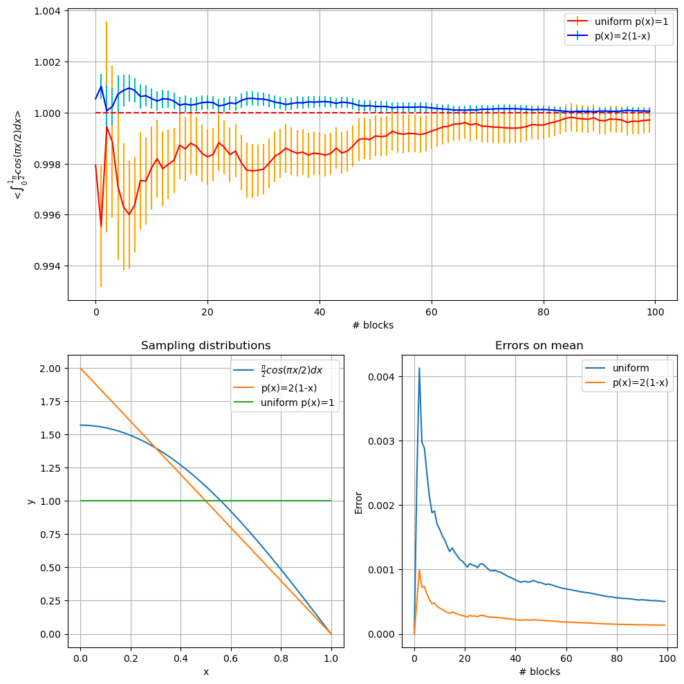
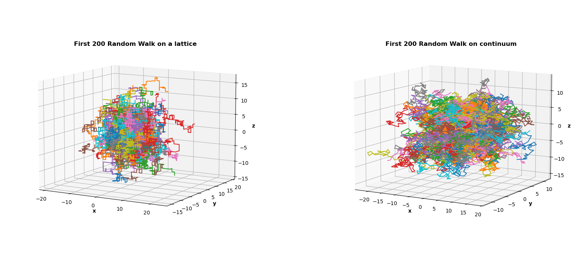
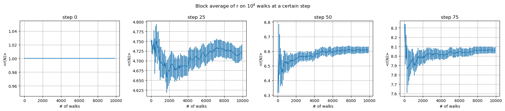
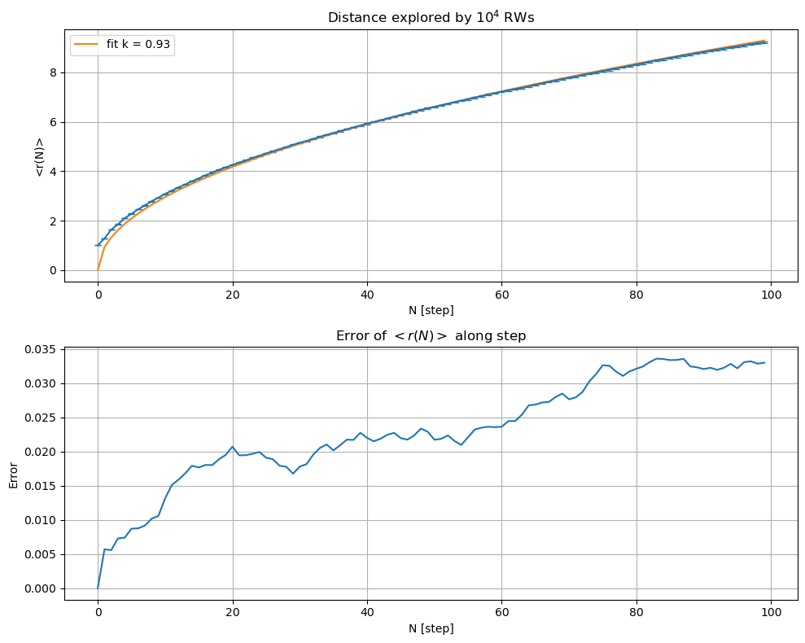
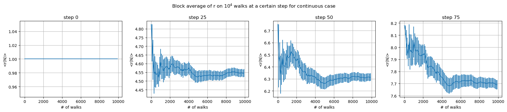
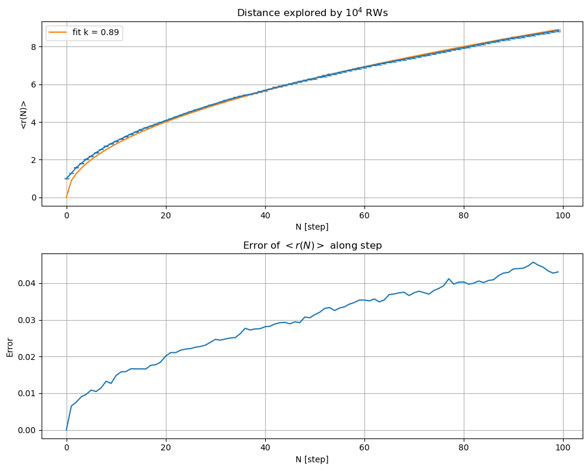
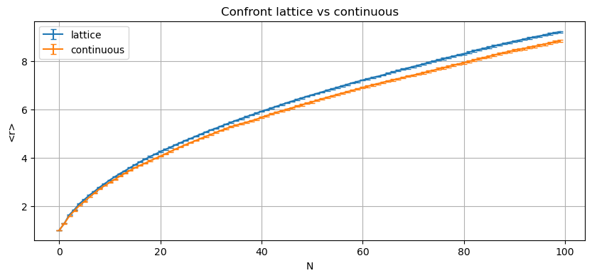

```python
import pandas as pd
import numpy as np
import matplotlib.pyplot as plt
```

## Exercise 02.1


```python
integral=pd.read_csv('data/cosinteg_M1000000.csv')
df_is=pd.read_csv('data/cosinteg_M1000000_is.csv')

```


It's clearly visible that using the first order taylor expansion in $x=1$ of the cos function the convergence is faster with a minor variance


```python
#fig, ax = plt.subplots(1, 2, width_ratios=[2, 1],figsize=(10,5))
fig = plt.figure(figsize=(10,10))
ax0 = plt.subplot(2,1,1)
ax0.errorbar(integral.index, integral.avg, color='r', ecolor='orange', yerr=integral.err, label='uniform p(x)=1')
ax0.errorbar(df_is.index, df_is.avg, yerr=df_is.err, label='p(x)=2(1-x)', color='b', ecolor='c')
ax0.hlines(1, 0, df_is.index[-1], linestyles='--', colors='r')
ax0.legend()
ax0.set_ylabel(r'<$\int_0^1 \frac{\pi}{2} cos(\pi x/2 )dx$>')
ax0.set_xlabel('# blocks')
ax0.grid(True)

ax1 = plt.subplot(2,2,3)
ax1.set_title('Sampling distributions')

x = np.linspace(0,1,100)

ax1.plot(x, 0.5*np.pi*np.cos(np.pi*x*0.5),
    label=r'$\frac{\pi}{2} cos(\pi x/2 )dx$'
    )
ax1.plot(x, 2*(1-x), label='p(x)=2(1-x)')
ax1.hlines(1, 0, 1, color='C2', label='uniform p(x)=1')
ax1.grid()
ax1.set_xlabel('x')
ax1.set_ylabel('y')
ax1.legend()

ax2 = plt.subplot(2,2,4)
ax2.set_title('Errors on mean')
ax2.plot(integral.index, integral['err'], label='uniform')
ax2.plot(df_is.index, df_is['err'], label = 'p(x)=2(1-x)')
ax2.set_xlabel('# blocks')
ax2.set_ylabel('Error')
ax2.legend()
ax2.grid()
plt.tight_layout()
plt.show()

```


    

    


# Exercise 02.2: Random Walk


## Code implementation
I implemented 2 classes [Random Walk](random_walk.h) (lattice and continuous) 

```C++
class RW_lattice
{
	public:
		//constructor
		RW_lattice(); //default constructor
		RW_lattice(double a, int* seed);
		
		//destructor
		~RW_lattice(){};
		
		//methods
		vector<double> get_pos () const{return pos;};
		int get_nstep() const {return step;};
		//reset the position and number of steps
		void reset_rw(); 
		
		//make a step in random direction and 
		// verse on the lattice
		void make_step();
		
	protected:
		double m_a;
		vector<double> pos=vector <double>(3, 0.0);
		
		Random rnd;
		int step;
		
		
		double verse_increment();
		vector<double> dir_increment(
			double p_x=1/3., 
			double p_y=1/3.,
			double p_z=1/3.
		);
};


```

The continuous version has an identical header, the difference are in the implementation inside the step functions.

Both of classes have:
```C++

void make_step()
{
	//select direction x | y | z
	vector <double> stepv = dir_increment();		
		
	// select verse Rx | Lx
	double verse=verse_increment();	// return sign *m_a
	
	// generate step of lenght a and update position and step number
	for(int i=0; i<3; ++i)
	{
		pos[i]+=stepv[i]*verse;
	}
	
	step+=1;
}
```

But for the lattice only step along the 3 axis direction are avaiable
```C++
//return copy but 3dim not heavy
vector<double> RW_lattice::dir_increment(double p_x, double p_y, double p_z)
{
	double r = rnd.Rannyu();
	if(r<p_x)
		return vector<double> {1., 0., 0.};
	else if(r<p_x+p_y)
		return vector<double> {0., 1., 0.};
	else
		return vector<double> {0., 0., 1.};
		
	
}

```

While the contiuous version make sampling on the sphere:

```C++
//return copy but 3dim not heavy
vector<double> RW_continuous::dir_increment(double p_x, double p_y, double p_z)
{
	double phi=rnd.Rannyu();
	double r = rnd.Rannyu();
	double theta=acos(1-2*r);

	return vector<double> {
		sin(theta)*cos(phi),
		sin(theta)*sin(phi),
		cos(theta)
	};
	
	
}

```


```python
import pandas as pd
import matplotlib.pyplot as plt
import numpy as np
```


```python
df=pd.read_csv('data/RW_lattice.csv')
crw=pd.read_csv('data/RW_continuous_lattice.csv')

fig=plt.figure(
    figsize=(20,10)
)
ax=fig.add_subplot(1, 2, 1, projection='3d')
ax.set_box_aspect(None, zoom=0.85)
for run in df['#rw'].unique()[:200]:
    dfr=df.loc[df['#rw']==run]
    ax.plot(dfr.x, dfr.y, dfr.z, '-', label=f'run={run}')
#plt.legend()
ax.set_xlabel('x', fontweight='bold')
ax.set_ylabel('y', fontweight='bold')
ax.set_zlabel('z', fontweight='bold')
#ax.ticks_params(fontweight='bold')
ax.view_init(elev=10)
ax.set_title('First 200 Random Walk on a lattice', fontweight='bold', y=0.9)

ax=fig.add_subplot(1,2,2, projection='3d')
ax.set_box_aspect(None, zoom=0.85)
for run in crw['#rw'].unique()[:200]:
    dfr=crw.loc[crw['#rw']==run]
    ax.plot(dfr.x, dfr.y, dfr.z, '-', label=f'run={run}')
#plt.legend()
ax.set_xlabel('x', fontweight='bold')
ax.set_ylabel('y', fontweight='bold')
ax.set_zlabel('z', fontweight='bold')
#ax.ticks_params(fontweight='bold')
ax.view_init(elev=10)
ax.set_title('First 200 Random Walk on continuum', fontweight='bold', y=0.9)
plt.show()
plt.show()

```


    

    


To compute the mean value of the explored distance of the Random Walk, $10^4$ relization of the RW were computed and distributed along 100 blocks on which it was calculated the progressive average at every step storing it as a matrix step x block


## Data Visualization
### Lattice RW


```python
dfrn_lat=pd.read_csv('data/RW_rn.csv')

fig, ax = plt.subplots(1, 4, figsize=(18, 4))
fig.suptitle('Block average of r on $10^4$ walks at a certain step')
for N in dfrn_lat.N.unique()[::25]:
    dfn=dfrn_lat.loc[dfrn_lat.N==N]
    ax[N//25].set_title(f'step {N}')
    ax[N//25].errorbar(100*dfn.block, dfn.rN, yerr=dfn.err)
    ax[N//25].set_xlabel('# of walks')
    ax[N//25].set_ylabel('<r(N)>')
    ax[N//25].grid()
plt.tight_layout()
plt.show()
```


    

    


Taking the last block of every step the underlying figure show the diffusive behavior of the Random Walks $k\sqrt{N}$


```python
from scipy.optimize import curve_fit

def diffuse(N, k:float):
    return k*np.sqrt(N)
```


```python
diff_m=dfrn_lat.loc[dfrn_lat.block==99].reset_index(drop=True) # last block values

# fit parameters
popt, pcov = curve_fit(diffuse, diff_m.N, diff_m.rN)

fig, ax = plt.subplots(2, 1, figsize=(10, 8))

ax[0].errorbar(diff_m.N, diff_m.rN, yerr=diff_m.err, capsize=3)
ax[0].plot(diff_m.N, diffuse(diff_m.N, popt[0]), label=f'fit k = {"%.2f" % popt[0]}')
ax[0].grid(True)
ax[0].set_xlabel('N [step]')
ax[0].set_ylabel('<r(N)>')
ax[0].set_title('Distance explored by $10^4$ RWs')
ax[0].legend()


ax[1].set_title('Error of $ < r(N) > $ along step')
ax[1].plot(diff_m.err)
ax[1].set_xlabel('N [step]')
ax[1].set_ylabel('Error')
ax[1].grid()

plt.tight_layout()
plt.show()
```


    

    


### Continuous RW


```python
dfrn=pd.read_csv('data/RW_continuous_rn.csv')

fig, ax = plt.subplots(1, 4, figsize=(18, 4))
fig.suptitle('Block average of r on $10^4$ walks at a certain step for continuous case')
for N in dfrn.N.unique()[::25]:
    dfn=dfrn.loc[dfrn.N==N]
    ax[N//25].set_title(f'step {N}')
    ax[N//25].errorbar(100*dfn.block, dfn.rN, yerr=dfn.err)
    ax[N//25].set_xlabel('# of walks')
    ax[N//25].set_ylabel('<r(N)>')
    ax[N//25].grid()
plt.tight_layout()
plt.show()
```


    

    


```python
df=dfrn.loc[dfrn.block==99].reset_index(drop=True)


# fit parameters
popt, pcov = curve_fit(diffuse, df.N, df.rN)

fig, ax = plt.subplots(2, 1, figsize=(10, 8))

ax[0].errorbar(df.N, df.rN, yerr=df.err, capsize=3)
ax[0].plot(diff_m.N, diffuse(diff_m.N, popt[0]), label=f'fit k = {"%.2f" % popt[0]}')
ax[0].grid(True)
ax[0].set_xlabel('N [step]')
ax[0].set_ylabel('<r(N)>')
ax[0].set_title('Distance explored by $10^4$ RWs')
ax[0].legend()


ax[1].plot(df.err)
ax[1].set_xlabel('N [step]')
ax[1].set_ylabel('Error')
ax[1].set_title('Error of $ < r(N) > $ along step')
ax[1].grid()

plt.tight_layout()
plt.show()
```


    

    


```python
plt.figure(figsize=(10, 4))
plt.title('Confront lattice vs continuous')
plt.errorbar(diff_m.N, diff_m.rN, yerr=diff_m.err,capsize=3, label='lattice')
plt.errorbar(df.N, df.rN, yerr=df.err, capsize=3, label='continuous')
plt.legend()
plt.xlabel('N')
plt.ylabel('<r>')
plt.grid()
plt.show()
```


    

    


It's visible how the lattice RW seem to explore the space faster than the continuous version 
