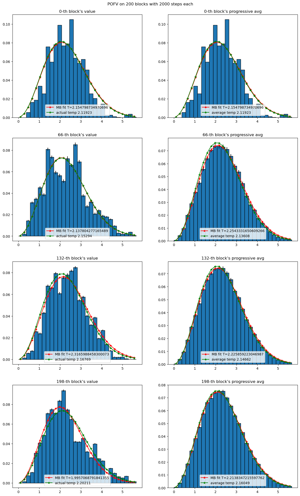
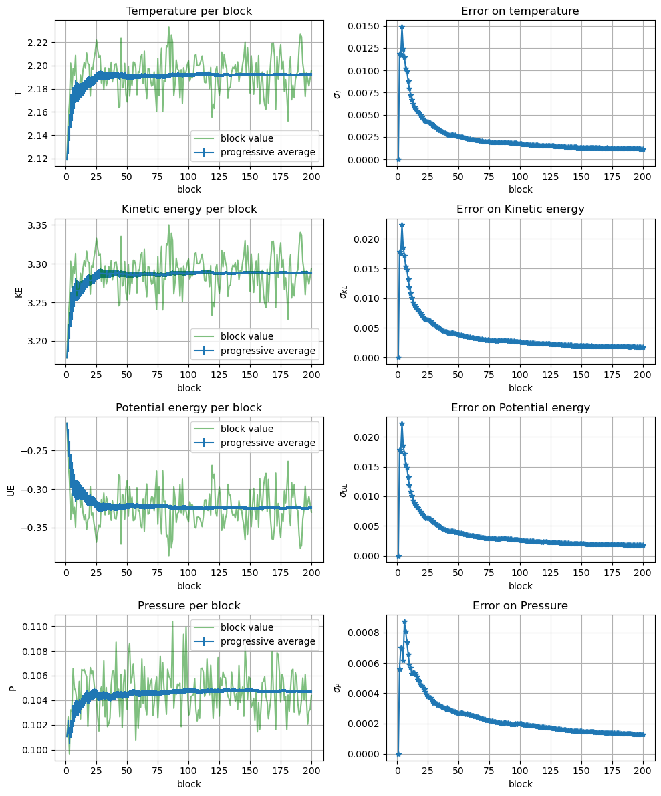
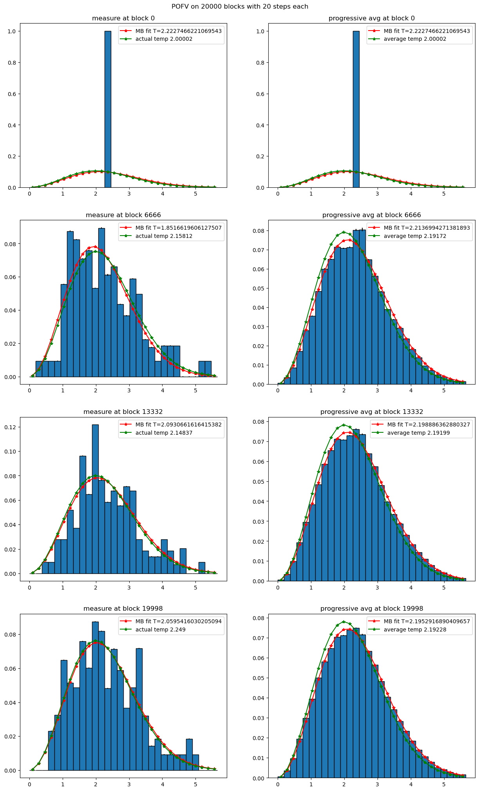
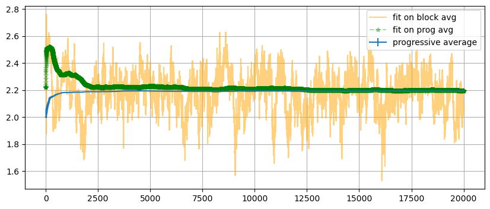
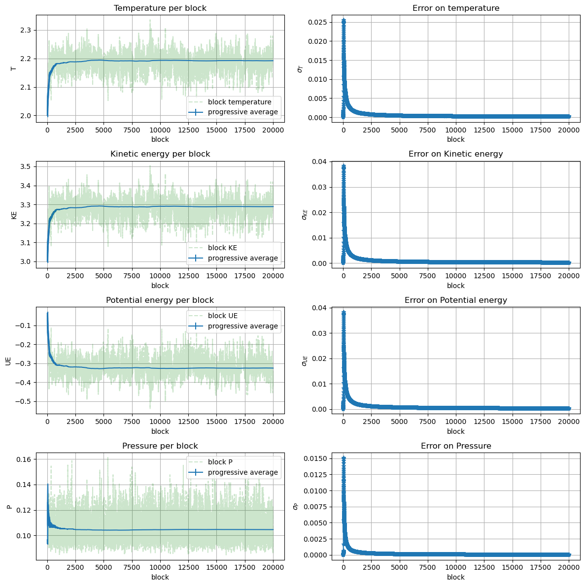
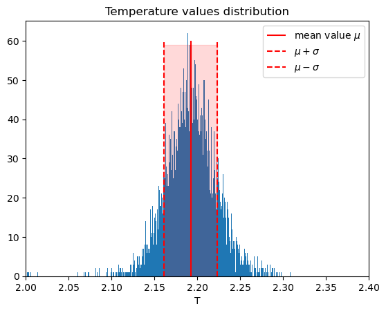
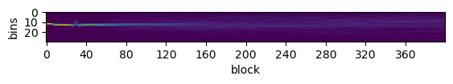
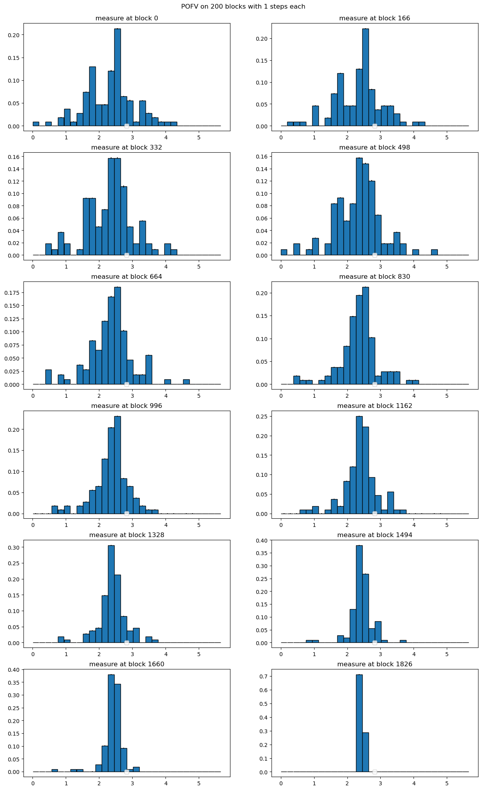
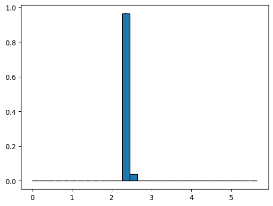
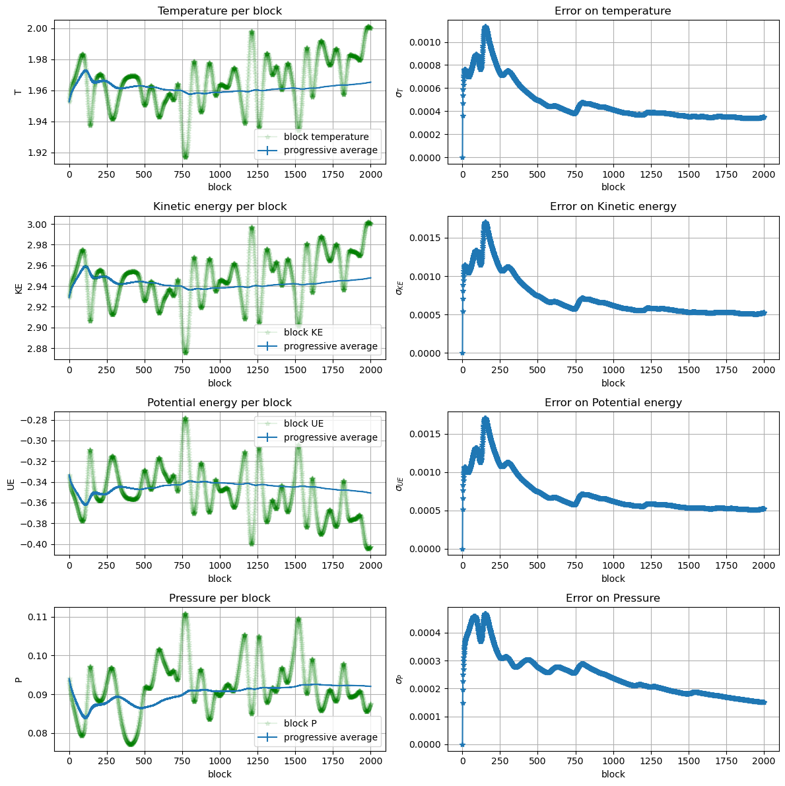

```python
import pandas as pd
import matplotlib.pyplot as plt
import numpy as np
from scipy.optimize import curve_fit
```


```python
# Maxwell-Boltzmann function for fitting histograms
def MB(v:np.array, temp:float,C:float):
    return C*(1/( (2*np.pi*temp)**(1.5)) )*4*np.pi*(v**2)*np.exp(-(v**2)/(2*temp))
```

# Exercise 04.1: Maxwell-Boltzmann distribution


The Maxwell-Boltzmann distribution using LJ reduced units (Lenght: $\sigma$; Energy: $\epsilon$; Mass: the mass, $m$, of the particles; Temperature: $\epsilon/k_B$; velocity: $\sqrt{\epsilon/m}$) becomes:
$$p(v^*,T^*) = \frac{1}{(2\pi T^*)^{3/2}} 4\pi (v^*)^2 e^{-\frac{(v^*)^2}{2 T^*}}$$

<span style="color:red">Include the calculation of the Maxwell–Boltzmann distribution, $p(v^*,T^*)$, inside your Molecular Dynamics code by using data blocking to obtain single block averages, progressive average values and progressive uncertainties for $p(v^*,T^*)$.</span>

## Implementation

### Measure of POFV

Set Maximum velocity at $4\sqrt{T^*}$ so that the histogram will consider the 99.8866% of the Maxwell-Boltzmann distribution. Then create a vector of `_n_bins` of width `_bin_size_v=4*sqrt(_temp)/_npart`. 

For every particle compute the norm of velocity and increment the corresponding bin at position `k=floor(norm(_particle(i).get_velocity())/_bin_size_v)`


```c++

vec vel_hist(_n_bins_v);
vel_hist.zeros();
    [....]
for(int i=0; i<_npart; i++)
{
  // bin k = [k*_bin_size_v, (k+1)*_bin_size_v]      
  int k=floor(norm(_particle(i).getvelocity())/_bin_size_v);
  //ignore velocities greater than the maximum
  if(k<_n_bins_v) vel_hist(k)+=1;
}

//save measure on consecutives indexes 
for (int k=0; k<_n_bins_v; ++k)
{
    _measurement(_index_pofv+k)=vel_hist(k);
}

```

### Average of POFV
```c++
coutf.open("../OUTPUT/pofv.dat", ios::app);

for(int k=0; k<_n_bins_v; ++k)
{
    average=_average(_index_pofv+k);
    sum_average = _global_av(_index_pofv+k);
    sum_ave2 = _global_av2(_index_pofv+k);

    coutf<<setw(12)<<k*_bin_size_v+_bin_size_v/2.
         <<setw(12)<<average/_npart  
         <<setw(12)<<sum_average/(blk*_npart)
         <<setw(12)<<this->error(sum_average/_npart, sum_ave2/(_npart*_npart), blk)
         <<endl;

```

#### Load data


```python
# POFV data
df_mb=pd.read_csv('OUTPUT/distrib/MB/pofv.dat', header=None, names=['#vel', 'block_avg', 'prog_av', 'err'], skiprows=1,
               sep=r"\s+")
df_mb['block']=0
df_mb['block']=df_mb.index//30

# Temperature data
T=pd.read_csv('OUTPUT/distrib/MB/temperature.dat', skiprows=1, delimiter=r'\s+',names=['block','actual_T','T_ave','error'])


```

#### Fit temperature from POFV


```python
mb_fit={'T_block':[], 'T_ave':[], 'C_block':[], 'C_ave':[]}

for k in df_mb.block.unique():
    # block avg
    temp_ba, c_ba = curve_fit(MB, df_mb.loc[df_mb.block==k]['#vel'], df_mb.loc[df_mb.block==k]['block_avg'] )[0] 
    mb_fit['T_block'].append(temp_ba)
    mb_fit['C_block'].append(c_ba)
    # progressive avg
    temp_pa, c_pa = curve_fit(MB, df_mb.loc[df_mb.block==k]['#vel'], df_mb.loc[df_mb.block==k]['prog_av'] )[0] 
    mb_fit['T_ave'].append(temp_pa)
    mb_fit['C_ave'].append(c_pa)


mb_fit=pd.DataFrame(mb_fit)
```

#### Plot distribution at different blocks


```python
fig, ax=plt.subplots(nrows=4, ncols=2)
fig.set_figwidth(15)
fig.set_figheight(25)

fig.suptitle('POFV on 200 blocks with 2000 steps each', y=0.9)

step=df_mb.block.max()//3
for k in range(4):
    #select k block pofv data 
    dfb=df_mb.loc[df_mb['block']==step*k].reset_index(drop=True)

    ax[k,  0].set_title(f'{step*k}-th block\'s value')
    
    # actual data
    ax[k,  0].bar(
        dfb['#vel'], dfb['block_avg'], 
        yerr=dfb['err'], 
        width=dfb['#vel'].max()/30, edgecolor='black')
    
    # fit 
    ax[k, 0].plot(
        dfb['#vel'], MB(dfb['#vel'], mb_fit['T_block'][step*k] ,mb_fit['C_block'][step*k])
        , marker='*', c='r', label=f'MB fit T={mb_fit['T_block'][step*k]}')
    
    ax[k, 0].plot(
        dfb['#vel'], MB(dfb['#vel'], T.actual_T[k], mb_fit['C_block'][step*k])
        , marker='*', c='g', label=f'actual temp {T.actual_T[k]}')
    
    ax[k, 0].legend(loc='lower center')

    # prog avg
    ax[k,  1].set_title(f'{step*k}-th block\'s progressive avg')
    # actual data
    ax[k,  1].bar(
        dfb['#vel'], dfb['prog_av'], 
        yerr=dfb['err'], 
        width=dfb['#vel'].max()/30, edgecolor='black')
    # fit 
    ax[k, 1].plot(
        dfb['#vel'], MB(dfb['#vel'], mb_fit['T_ave'][step*k],mb_fit['C_ave'][step*k])
        , marker='*', c='r', label=f'MB fit T={mb_fit['T_ave'][step*k]}')
    ax[k, 1].plot(
        dfb['#vel'], MB(dfb['#vel'], T.T_ave[k], mb_fit['C_ave'][step*k])
        , marker='*', c='g', label=f'average temp {T.T_ave[k]}')
    
    ax[k, 1].legend(loc='lower center')
plt.show()
```


    

    


```python
plt.figure(figsize=(10, 4))
plt.title('Temperature')
plt.plot(mb_fit['T_block'],'--o',color='orange', alpha=0.7,  label='fit on block avg')
plt.plot(mb_fit['T_ave'],'--*', color='g', label='fit on prog avg')
plt.errorbar(T.block, T['T_ave'], yerr=T.error,  label='progressive average')
plt.xlabel('blocks')
plt.ylabel(r'$T^*$')
plt.grid()
plt.legend()
plt.show()
```


    

    


### Properties 


```python
K=pd.read_csv('OUTPUT/distrib/MB/kinetic_energy.dat', delimiter=r"\s+")
```


```python
U=pd.read_csv('OUTPUT/distrib/MB/potential_energy.dat', delimiter=r"\s+")
```


```python
P=pd.read_csv('OUTPUT/distrib/MB/pressure.dat', delimiter=r"\s+")
```


```python
fig, ax = plt.subplots(4,2,  figsize=(10, 12))

ax[0, 0].set_title('Temperature per block')
# block averages
ax[0, 0].plot(T.block, T.actual_T, '-',color='g', alpha=0.5,  label='block value')
# progressive averages
ax[0, 0].errorbar(T.block, T['T_ave'], yerr=T.error,  label='progressive average')
ax[0, 0].set_ylabel('T')

ax[0,1].set_title('Error on temperature')
ax[0,1].plot(T.block, T.error, '-*')
ax[0,1].set_ylabel(r'$\sigma_T$')


ax[1,0].set_title('Kinetic energy per block')
# progressive averages
ax[1,0].errorbar(K['#BLOCK:'], K['KE_AVE:'], yerr=K['ERROR:'], label='progressive average')
# block averages
ax[1,0].plot(K['#BLOCK:'], K['ACTUAL_KE:'], '-',color='g', alpha=0.5,  label='block value')
ax[1,0].set_ylabel('KE')


ax[1,1].set_title('Error on Kinetic energy')
ax[1,1].plot(K['#BLOCK:'], K['ERROR:'], '-*')
ax[1,1].set_ylabel(r'$\sigma_{KE}$')


ax[2,0].set_title('Potential energy per block')
ax[2,0].plot(U['#BLOCK:'], U['ACTUAL_PE:'], ls='-', color='g', alpha=0.5,  label='block value')
ax[2,0].errorbar(U['#BLOCK:'], U['PE_AVE:'], yerr=U['ERROR:'], label='progressive average')
ax[2,0].set_ylabel('UE')

ax[2,1].set_title('Error on Potential energy')
ax[2,1].plot(U['#BLOCK:'], U['ERROR:'], '-*')
ax[2,1].set_ylabel(r'$\sigma_{UE}$')


ax[3,0].set_title('Pressure per block')
ax[3,0].plot(P['#BLOCK:'], P['ACTUAL_P:'], ls='-', color='g', alpha=0.5,  label='block value')
ax[3,0].errorbar(P['#BLOCK:'], P['P_AVE:'], yerr=P['ERROR:'], label='progressive average')
ax[3,0].set_ylabel('P')

ax[3,1].set_title('Error on Pressure')
ax[3,1].plot(P['#BLOCK:'], P['ERROR:'], '-*')
ax[3,1].set_ylabel(r'$\sigma_{P}$')

for k in range(4):
    for j in range(2):
        ax[k,j].grid()
        ax[k, j].set_xlabel('block')
    ax[k, 0].legend()

fig.tight_layout()

plt.show()
```


    

    


### Histograms Heatmap 


```python
histos=pd.DataFrame(columns=['vel']+[f'block_{k}' for k in range(df_mb['block'].max())])
histos['vel']=df_mb.loc[df_mb['block']==0]['#vel'].values
for k in range(df_mb['block'].max()):
    histos[f'block_{k}']=df_mb.loc[df_mb.block==k]['block_avg'].values 
    

```


```python
fig,ax = plt.subplots(figsize=(10,10))

ax.imshow(histos[[f'block_{k}' for k in range(len(histos.columns)-1)]])
plt.xlabel('block')
plt.ylabel('bins')
plt.savefig('images/MB_hist.png')
plt.show()
```


    

    


## Esercizio 04.2

mettere i criteri per cui avevo messo blocchi strapiccoli (far vedere l'evoluzione dalla delta
)


```python
import pandas as pd
import matplotlib.pyplot as plt
import numpy as np
from scipy.optimize import curve_fit
```


```python
df=pd.read_csv('OUTPUT/distrib/delta/pofv.dat', header=None, names=['#vel', 'block_avg', 'prog_avg', 'err'], skiprows=1, sep="\s+")

df['block']=0
df['block']=df.index//30
   
```

    <>:1: SyntaxWarning: invalid escape sequence '\s'
    <>:1: SyntaxWarning: invalid escape sequence '\s'
    /tmp/ipykernel_8004/677895036.py:1: SyntaxWarning: invalid escape sequence '\s'
      df=pd.read_csv('OUTPUT/distrib/delta/pofv.dat', header=None, names=['#vel', 'block_avg', 'prog_avg', 'err'], skiprows=1, sep="\s+")


```python
T_d=pd.read_csv(
    'OUTPUT/distrib/delta/temperature.dat', delimiter=r"\s+")
T_d
```


<div>
<style scoped>
    .dataframe tbody tr th:only-of-type {
        vertical-align: middle;
    }

    .dataframe tbody tr th {
        vertical-align: top;
    }

    .dataframe thead th {
        text-align: right;
    }
</style>
<table border="1" class="dataframe">
  <thead>
    <tr style="text-align: right;">
      <th></th>
      <th>#BLOCK:</th>
      <th>ACTUAL_T:</th>
      <th>T_AVE:</th>
      <th>ERROR:</th>
    </tr>
  </thead>
  <tbody>
    <tr>
      <th>0</th>
      <td>1</td>
      <td>2.00002</td>
      <td>2.00002</td>
      <td>0.000000</td>
    </tr>
    <tr>
      <th>1</th>
      <td>2</td>
      <td>2.00012</td>
      <td>2.00007</td>
      <td>0.000036</td>
    </tr>
    <tr>
      <th>2</th>
      <td>3</td>
      <td>2.00032</td>
      <td>2.00015</td>
      <td>0.000074</td>
    </tr>
    <tr>
      <th>3</th>
      <td>4</td>
      <td>2.00064</td>
      <td>2.00027</td>
      <td>0.000119</td>
    </tr>
    <tr>
      <th>4</th>
      <td>5</td>
      <td>2.00108</td>
      <td>2.00044</td>
      <td>0.000173</td>
    </tr>
    <tr>
      <th>...</th>
      <td>...</td>
      <td>...</td>
      <td>...</td>
      <td>...</td>
    </tr>
    <tr>
      <th>19995</th>
      <td>19996</td>
      <td>2.23006</td>
      <td>2.19227</td>
      <td>0.000220</td>
    </tr>
    <tr>
      <th>19996</th>
      <td>19997</td>
      <td>2.23220</td>
      <td>2.19228</td>
      <td>0.000220</td>
    </tr>
    <tr>
      <th>19997</th>
      <td>19998</td>
      <td>2.23856</td>
      <td>2.19228</td>
      <td>0.000220</td>
    </tr>
    <tr>
      <th>19998</th>
      <td>19999</td>
      <td>2.24900</td>
      <td>2.19228</td>
      <td>0.000220</td>
    </tr>
    <tr>
      <th>19999</th>
      <td>20000</td>
      <td>2.25877</td>
      <td>2.19228</td>
      <td>0.000220</td>
    </tr>
  </tbody>
</table>
<p>20000 rows × 4 columns</p>
</div>


```python
# block averages
fit_temp_ba = []
fit_C_ba    = []

# prog avg
fit_temp_pa = []
fit_C_pa    = []


for k in df.block.unique():
    temp_ba, c_ba = curve_fit(MB, df.loc[df.block==k]['#vel'], df.loc[df.block==k]['block_avg'] )[0] 
    fit_temp_ba.append(temp_ba)
    fit_C_ba.append(c_ba)

    temp_pa, c_pa = curve_fit(MB, df.loc[df.block==k]['#vel'], df.loc[df.block==k]['prog_avg'] )[0] 
    fit_temp_pa.append(temp_pa)
    fit_C_pa.append(c_pa)

```


```python
delta_fit={'T_block':[], 'T_ave':[], 'C_block':[], 'C_ave':[]}

for k in df.block.unique():
    # block avg
    temp_ba, c_ba = curve_fit(MB, df.loc[df.block==k]['#vel'], df.loc[df.block==k]['block_avg'] )[0] 
    delta_fit['T_block'].append(temp_ba)
    delta_fit['C_block'].append(c_ba)
    # progressive avg
    temp_pa, c_pa = curve_fit(MB, df.loc[df.block==k]['#vel'], df.loc[df.block==k]['prog_avg'] )[0] 
    delta_fit['T_ave'].append(temp_pa)
    delta_fit['C_ave'].append(c_pa)


delta_fit=pd.DataFrame(delta_fit)
```


```python
fig, ax=plt.subplots(nrows=4, ncols=2)
fig.set_figwidth(15)
fig.set_figheight(25)

fig.suptitle('POFV on 20000 blocks with 20 steps each', y=0.9)

step=df.block.max()//3
for k in range(4):
    #select k block pofv data 
    dfb=df.loc[df['block']==step*k].reset_index(drop=True)

    ax[k,  0].set_title(f'measure at block {step*k}')
    
    # actual data
    ax[k,  0].bar(
        dfb['#vel'], dfb['block_avg'], 
        yerr=dfb['err'], 
        width=dfb['#vel'].max()/30, edgecolor='black')
    
    # fit 
    ax[k, 0].plot(
        dfb['#vel'], MB(dfb['#vel'], delta_fit['T_block'][step*k] ,delta_fit['C_block'][step*k])
        , marker='*', c='r', label=f'MB fit T={delta_fit['T_block'][step*k]}')
    
    ax[k, 0].plot(
        dfb['#vel'], MB(dfb['#vel'], T_d['ACTUAL_T:'][k], delta_fit['C_block'][step*k])
        , marker='*', c='g', label=f'actual temp {T_d['ACTUAL_T:'][step*k]}')
    
    ax[k, 0].legend()#loc='lower center')

    # prog avg
    ax[k,  1].set_title(f'progressive avg at block {step*k}')
    # actual data
    ax[k,  1].bar(
        dfb['#vel'], dfb['prog_avg'], 
        yerr=dfb['err'], 
        width=dfb['#vel'].max()/30, edgecolor='black')
    # fit 
    ax[k, 1].plot(
        dfb['#vel'], MB(dfb['#vel'], delta_fit['T_ave'][step*k],delta_fit['C_ave'][step*k])
        , marker='*', c='r', label=f'MB fit T={delta_fit['T_ave'][step*k]}')
    ax[k, 1].plot(
        dfb['#vel'], MB(dfb['#vel'], T_d['T_AVE:'][k], delta_fit['C_ave'][step*k])
        , marker='*', c='g', label=f'average temp {T_d['T_AVE:'][step*k]}')
    
    ax[k, 1].legend()#loc='lower center')


plt.show()
```


    

    


```python
plt.figure(figsize=(10, 4))
plt.plot(delta_fit['T_block'],'-',color='orange', alpha=0.5,  label='fit on block avg')
plt.plot(delta_fit['T_ave'],'--*', color='g', alpha=0.3, label='fit on prog avg')
plt.errorbar(T_d['#BLOCK:'], T_d['T_AVE:'], yerr=T_d['ERROR:'],  label='progressive average')
plt.grid()
plt.legend()
plt.show()
```


    

    


### Properties


```python
K_d=pd.read_csv('OUTPUT/distrib/delta/kinetic_energy.dat', delimiter=r"\s+")
```


```python
U_d=pd.read_csv('OUTPUT/distrib/delta/potential_energy.dat', delimiter=r"\s+")
```


```python
P_d=pd.read_csv('OUTPUT/distrib/delta/pressure.dat', delimiter=r"\s+")
```


```python
fig, ax = plt.subplots(4,2,  figsize=(12, 12))

ax[0, 0].set_title('Temperature per block')
# block averages
ax[0, 0].plot(
    T_d['#BLOCK:'][100:], T_d['ACTUAL_T:'][100:], #sliced for better visualization
    '--',color='g', alpha=0.2, label='block temperature'
) 

# progressive averages
ax[0, 0].errorbar(T_d['#BLOCK:'], T_d['T_AVE:'], yerr=T_d['ERROR:'],  label='progressive average')
ax[0, 0].set_ylabel('T')

ax[0,1].set_title('Error on temperature')
ax[0,1].plot(T_d['#BLOCK:'], T_d['ERROR:'], '-*')
ax[0,1].set_ylabel(r'$\sigma_T$')


ax[1,0].set_title('Kinetic energy per block')
# progressive averages
ax[1,0].errorbar(K_d['#BLOCK:'], K_d['KE_AVE:'], yerr=K_d['ERROR:'], label='progressive average')
# block averages
ax[1,0].plot(K_d['#BLOCK:'][100:], K_d['ACTUAL_KE:'][100:], '--',color='g', alpha=0.2, label='block KE')
ax[1,0].set_ylabel('KE')


ax[1,1].set_title('Error on Kinetic energy')
ax[1,1].plot(K_d['#BLOCK:'], K_d['ERROR:'], '-*')
ax[1,1].set_ylabel(r'$\sigma_{KE}$')


ax[2,0].set_title('Potential energy per block')
ax[2,0].plot(U_d['#BLOCK:'][100:], U_d['ACTUAL_PE:'][100:], ls='--', color='g', alpha=0.2, label='block UE')
ax[2,0].errorbar(U_d['#BLOCK:'], U_d['PE_AVE:'], yerr=U_d['ERROR:'], label='progressive average')
ax[2,0].set_ylabel('UE')

ax[2,1].set_title('Error on Potential energy')
ax[2,1].plot(U_d['#BLOCK:'], U_d['ERROR:'], '-*')
ax[2,1].set_ylabel(r'$\sigma_{UE}$')


ax[3,0].set_title('Pressure per block')
ax[3,0].plot(P_d['#BLOCK:'][100:], P_d['ACTUAL_P:'][100:], ls='--', color='g', alpha=0.2,label='block P')
ax[3,0].errorbar(P_d['#BLOCK:'], P_d['P_AVE:'], yerr=P_d['ERROR:'], label='progressive average')
ax[3,0].set_ylabel('P')

ax[3,1].set_title('Error on Pressure')
ax[3,1].plot(P_d['#BLOCK:'], P_d['ERROR:'], '-*')
ax[3,1].set_ylabel(r'$\sigma_{P}$')

for k in range(4):
    for j in range(2):
        ax[k,j].grid()
        ax[k, j].set_xlabel('block')
    ax[k, 0].legend()

fig.tight_layout()

plt.show()
```


    

    


capire o eliminare, mi sa eliminare


```python
plt.title('Temperature values distribution')
plt.hist(T_d['ACTUAL_T:'], bins=5000)
plt.vlines(T_d['T_AVE:'][len(T_d)-1], ymin=0, ymax=60,  color='r', label=r'mean value $\mu$')
plt.vlines(
    T_d['T_AVE:'][len(T_d)-1]+np.sqrt(20000)*T_d['ERROR:'][len(T_d)-1],
    ymin=0, ymax=60, ls='--',  color='r', label=r'$\mu+\sigma$'
)

plt.vlines(
    T_d['T_AVE:'][len(T_d)-1]-np.sqrt(20000)*T_d['ERROR:'][len(T_d)-1],
    ymin=0, ymax=60, ls='--',  color='r', label=r'$\mu-\sigma$'
)

plt.fill_betweenx(
    [k for k in range(60)], T_d['T_AVE:'][len(T_d)-1], 
    T_d['T_AVE:'][len(T_d)-1]+np.sqrt(20000)*T_d['ERROR:'][len(T_d)-1], 
    color='r', alpha=0.15
)
plt.fill_betweenx(
    [k for k in range(60)], T_d['T_AVE:'][len(T_d)-1], 
    T_d['T_AVE:'][len(T_d)-1]-np.sqrt(20000)*T_d['ERROR:'][len(T_d)-1], 
    color='r', alpha=0.15
)

plt.xlabel('T')

plt.xlim([2.0, 2.4])
plt.legend()
#plt.grid()
plt.show()
```


    

    


```python

```


```python
histos=pd.DataFrame(columns=['vel']+[f'block_{k}' for k in range(400)])
histos['vel']=df.loc[df['block']==0]['#vel'].values
for k in range(400):
    histos[f'block_{k}']=df.loc[df.block==k]['block_avg'].values 
    

```


```python
fig,ax = plt.subplots()
fig.set_figheight(10)
ax.imshow(histos[[f'block_{k}' for k in range(400)]])
plt.xlabel('block')#, size=150)
plt.ylabel('bins')#, size=150)
plt.xticks(range(0,  400, 40))#, size=100)
plt.yticks(range(0,  30, 10))#, size=100)

plt.savefig('images/delta_hist.png')

plt.show()
```


    

    


```python

```


```python

```


```python

```

## Esercizio 04.3 [back to the future]

da sistemare bene


```python
# POFV data
df_btf=pd.read_csv('OUTPUT/bckwd/200bl/bw/pofv.dat', header=None, names=['#vel', 'block_avg', 'prog_av', 'err'], skiprows=1,
               sep=r"\s+")
df_btf['block']=0
df_btf['block']=df_btf.index//30

# Temperature data
T_btf=pd.read_csv('OUTPUT/bckwd/200bl/bw/temperature.dat', skiprows=1, delimiter=r'\s+',names=['block','actual_T','T_ave','error'])


```


```python

```


```python
fig, ax=plt.subplots(nrows=6, ncols=2)
fig.set_figwidth(15)
fig.set_figheight(25)

fig.suptitle('POFV on 200 blocks with 1 steps each', y=0.9)

step=df_btf.block.max()//12
for k in range(12):
    #select k block pofv data 
    dfb=df_btf.loc[df_btf['block']==step*(k+1)].reset_index(drop=True)

    ax[k//2,  k%2].set_title(f'measure at block {step*k}')
    
    # actual data
    ax[k//2,  k%2].bar(
        dfb['#vel'], dfb['block_avg'], 
        yerr=dfb['err'], 
        width=dfb['#vel'].max()/30, edgecolor='black')
    
    ax[k//2,  k%2].legend(loc='lower center')

plt.show()
```

    /tmp/ipykernel_276583/2678452637.py:20: UserWarning: No artists with labels found to put in legend.  Note that artists whose label start with an underscore are ignored when legend() is called with no argument.
      ax[k//2,  k%2].legend(loc='lower center')


    

    


```python
last=df_btf.loc[df_btf['block']==df_btf['block'].max()].reset_index(drop=True)
last
```


<div>
<style scoped>
    .dataframe tbody tr th:only-of-type {
        vertical-align: middle;
    }

    .dataframe tbody tr th {
        vertical-align: top;
    }

    .dataframe thead th {
        text-align: right;
    }
</style>
<table border="1" class="dataframe">
  <thead>
    <tr style="text-align: right;">
      <th></th>
      <th>#vel</th>
      <th>block_avg</th>
      <th>prog_av</th>
      <th>err</th>
      <th>block</th>
    </tr>
  </thead>
  <tbody>
    <tr>
      <th>0</th>
      <td>0.094281</td>
      <td>0.000000</td>
      <td>0.001514</td>
      <td>0.000077</td>
      <td>1999</td>
    </tr>
    <tr>
      <th>1</th>
      <td>0.282843</td>
      <td>0.000000</td>
      <td>0.001162</td>
      <td>0.000069</td>
      <td>1999</td>
    </tr>
    <tr>
      <th>2</th>
      <td>0.471405</td>
      <td>0.000000</td>
      <td>0.009292</td>
      <td>0.000212</td>
      <td>1999</td>
    </tr>
    <tr>
      <th>3</th>
      <td>0.659966</td>
      <td>0.000000</td>
      <td>0.005708</td>
      <td>0.000133</td>
      <td>1999</td>
    </tr>
    <tr>
      <th>4</th>
      <td>0.848528</td>
      <td>0.000000</td>
      <td>0.011236</td>
      <td>0.000177</td>
      <td>1999</td>
    </tr>
    <tr>
      <th>5</th>
      <td>1.037090</td>
      <td>0.000000</td>
      <td>0.016069</td>
      <td>0.000256</td>
      <td>1999</td>
    </tr>
    <tr>
      <th>6</th>
      <td>1.225650</td>
      <td>0.000000</td>
      <td>0.005005</td>
      <td>0.000139</td>
      <td>1999</td>
    </tr>
    <tr>
      <th>7</th>
      <td>1.414210</td>
      <td>0.000000</td>
      <td>0.015602</td>
      <td>0.000291</td>
      <td>1999</td>
    </tr>
    <tr>
      <th>8</th>
      <td>1.602780</td>
      <td>0.000000</td>
      <td>0.040657</td>
      <td>0.000675</td>
      <td>1999</td>
    </tr>
    <tr>
      <th>9</th>
      <td>1.791340</td>
      <td>0.000000</td>
      <td>0.066398</td>
      <td>0.001030</td>
      <td>1999</td>
    </tr>
    <tr>
      <th>10</th>
      <td>1.979900</td>
      <td>0.000000</td>
      <td>0.050528</td>
      <td>0.000485</td>
      <td>1999</td>
    </tr>
    <tr>
      <th>11</th>
      <td>2.168460</td>
      <td>0.000000</td>
      <td>0.099718</td>
      <td>0.000888</td>
      <td>1999</td>
    </tr>
    <tr>
      <th>12</th>
      <td>2.357020</td>
      <td>0.962963</td>
      <td>0.233222</td>
      <td>0.002671</td>
      <td>1999</td>
    </tr>
    <tr>
      <th>13</th>
      <td>2.545580</td>
      <td>0.037037</td>
      <td>0.228611</td>
      <td>0.001297</td>
      <td>1999</td>
    </tr>
    <tr>
      <th>14</th>
      <td>2.734150</td>
      <td>0.000000</td>
      <td>0.086435</td>
      <td>0.000643</td>
      <td>1999</td>
    </tr>
    <tr>
      <th>15</th>
      <td>2.922710</td>
      <td>0.000000</td>
      <td>0.034954</td>
      <td>0.000426</td>
      <td>1999</td>
    </tr>
    <tr>
      <th>16</th>
      <td>3.111270</td>
      <td>0.000000</td>
      <td>0.024995</td>
      <td>0.000293</td>
      <td>1999</td>
    </tr>
    <tr>
      <th>17</th>
      <td>3.299830</td>
      <td>0.000000</td>
      <td>0.027375</td>
      <td>0.000473</td>
      <td>1999</td>
    </tr>
    <tr>
      <th>18</th>
      <td>3.488390</td>
      <td>0.000000</td>
      <td>0.023944</td>
      <td>0.000385</td>
      <td>1999</td>
    </tr>
    <tr>
      <th>19</th>
      <td>3.676960</td>
      <td>0.000000</td>
      <td>0.004778</td>
      <td>0.000137</td>
      <td>1999</td>
    </tr>
    <tr>
      <th>20</th>
      <td>3.865520</td>
      <td>0.000000</td>
      <td>0.002125</td>
      <td>0.000092</td>
      <td>1999</td>
    </tr>
    <tr>
      <th>21</th>
      <td>4.054080</td>
      <td>0.000000</td>
      <td>0.005167</td>
      <td>0.000125</td>
      <td>1999</td>
    </tr>
    <tr>
      <th>22</th>
      <td>4.242640</td>
      <td>0.000000</td>
      <td>0.003500</td>
      <td>0.000116</td>
      <td>1999</td>
    </tr>
    <tr>
      <th>23</th>
      <td>4.431200</td>
      <td>0.000000</td>
      <td>0.000083</td>
      <td>0.000020</td>
      <td>1999</td>
    </tr>
    <tr>
      <th>24</th>
      <td>4.619760</td>
      <td>0.000000</td>
      <td>0.001574</td>
      <td>0.000078</td>
      <td>1999</td>
    </tr>
    <tr>
      <th>25</th>
      <td>4.808330</td>
      <td>0.000000</td>
      <td>0.000347</td>
      <td>0.000039</td>
      <td>1999</td>
    </tr>
    <tr>
      <th>26</th>
      <td>4.996890</td>
      <td>0.000000</td>
      <td>0.000000</td>
      <td>0.000000</td>
      <td>1999</td>
    </tr>
    <tr>
      <th>27</th>
      <td>5.185450</td>
      <td>0.000000</td>
      <td>0.000000</td>
      <td>0.000000</td>
      <td>1999</td>
    </tr>
    <tr>
      <th>28</th>
      <td>5.374010</td>
      <td>0.000000</td>
      <td>0.000000</td>
      <td>0.000000</td>
      <td>1999</td>
    </tr>
    <tr>
      <th>29</th>
      <td>5.562570</td>
      <td>0.000000</td>
      <td>0.000000</td>
      <td>0.000000</td>
      <td>1999</td>
    </tr>
  </tbody>
</table>
</div>


```python
plt.bar(
        last['#vel'], last['block_avg'], 
        yerr=last['err'], 
        width=last['#vel'].max()/30, edgecolor='black')
```


    <BarContainer object of 30 artists>


    

    


### Properties


```python
K_btf=pd.read_csv('OUTPUT/bckwd/200bl/bw/kinetic_energy.dat', delimiter=r"\s+")
```


```python
U_btf=pd.read_csv('OUTPUT/bckwd/200bl/bw/potential_energy.dat', delimiter=r"\s+")
```


```python
P_btf=pd.read_csv('OUTPUT/bckwd/200bl/bw/pressure.dat', delimiter=r"\s+")
```


```python
fig, ax = plt.subplots(4,2,  figsize=(12, 12))
ax[0, 0].set_title('Temperature per block')

# block averages
ax[0, 0].plot(T_btf['block'], T_btf['actual_T'], '-*',color='g', alpha=0.1, label='block temperature') #sliced for better visualization

# fit from MB
#ax[0, 0].plot(T.block, fit_temp_ba, '--o', color='orange', label='block pofv-fitted temperature')
#ax[0, 0].plot(T.block, fit_temp_pa, '--*', color='red', label='progressive pofv-fitted temperature')

# progressive averages
ax[0, 0].errorbar(T_btf['block'], T_btf['T_ave'], yerr=T_btf['error'],  label='progressive average')

ax[0, 0].set_ylabel('T')

ax[0,1].set_title('Error on temperature')

ax[0,1].plot(T_btf['block'], T_btf['error'], '-*')

ax[0,1].set_ylabel(r'$\sigma_T$')


ax[1,0].set_title('Kinetic energy per block')
# progressive averages
ax[1,0].errorbar(K_btf['#BLOCK:'], K_btf['KE_AVE:'], yerr=K_btf['ERROR:'], label='progressive average')
# block averages
ax[1,0].plot(K_btf['#BLOCK:'], K_btf['ACTUAL_KE:'], '-*',color='g', alpha=0.1, label='block KE')
#ax[1,0].scatter(K_d['#BLOCK:'], K_d['ACTUAL_KE:'], marker='*',color='g',alpha=0.3, label='block KE')

ax[1,0].set_ylabel('KE')


ax[1,1].set_title('Error on Kinetic energy')
ax[1,1].plot(K_btf['#BLOCK:'], K_btf['ERROR:'], '-*')
ax[1,1].set_ylabel(r'$\sigma_{KE}$')


ax[2,0].set_title('Potential energy per block')
ax[2,0].plot(U_btf['#BLOCK:'], U_btf['ACTUAL_PE:'], '-*', color='g', alpha=0.1, label='block UE')
#ax[2,0].scatter(U_d['#BLOCK:'], U_d['ACTUAL_PE:'], marker='*',color='g', alpha=0.3, label='block UE')
ax[2,0].errorbar(U_btf['#BLOCK:'], U_btf['PE_AVE:'], yerr=U_btf['ERROR:'], label='progressive average')
#ax[0].set_xticks(range(0, T.block.max(), 15))#, rotation=45)
ax[2,0].set_ylabel('UE')

ax[2,1].set_title('Error on Potential energy')
ax[2,1].plot(U_btf['#BLOCK:'], U_btf['ERROR:'], '-*')
ax[2,1].set_ylabel(r'$\sigma_{UE}$')


ax[3,0].set_title('Pressure per block')
ax[3,0].plot(P_btf['#BLOCK:'], P_btf['ACTUAL_P:'], '-*', color='g', alpha=0.1,label='block P')
#ax[3,0].scatter(P_d['#BLOCK:'], P_d['ACTUAL_P:'], marker='*',color='g', alpha=0.3,label='block P')
ax[3,0].errorbar(P_btf['#BLOCK:'], P_btf['P_AVE:'], yerr=P_btf['ERROR:'], label='progressive average')
ax[3,0].set_ylabel('P')

ax[3,1].set_title('Error on Pressure')
ax[3,1].plot(P_btf['#BLOCK:'], P_btf['ERROR:'], '-*')
ax[3,1].set_ylabel(r'$\sigma_{P}$')

for k in range(4):
    for j in range(2):
        ax[k,j].grid()
        ax[k, j].set_xlabel('block')
    ax[k, 0].legend()

fig.tight_layout()

plt.show()
```


    

    


```python

```


```python

```
