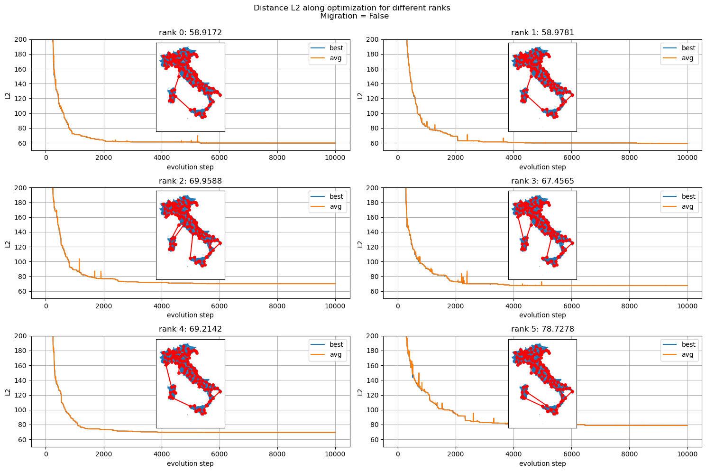
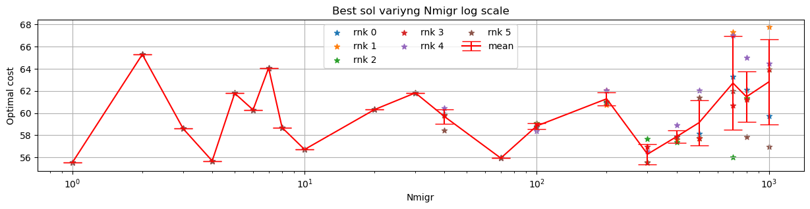
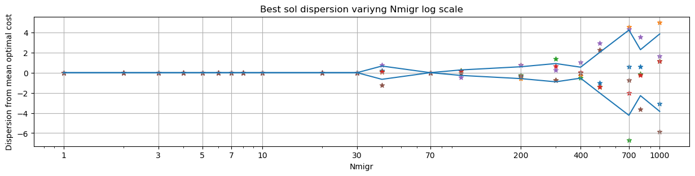

```python
import pandas as pd
import matplotlib.pyplot as plt
import numpy as np
from mpl_toolkits.axes_grid1.inset_locator import inset_axes
```

# Exercise 10.1: Parallelization of GA

## Code implementation

I implemented the migration process using non-blocking communication between processors:
```C++

int size, rank;
MPI_Init(&argc, &argv);
MPI_Comm_size(MPI_COMM_WORLD, &size);
MPI_Comm_rank(MPI_COMM_WORLD, &rank);

MPI_Status stat;
MPI_Request req;
coordinates coord;

coord.initialize();

if(rank == 0) coord.print();

// initialize seed of every process with his rank
int seed [4] {0,0,0, rank};
std::srand(rank);
population pop(coord, seed);

pop.set_avg_filename(
    "avg_cost_rank_"+to_string(rank)
    +".dat"
);
pop.set_best_filename(
    "best_sol_rank_"+to_string(rank)
    +".dat"
);

pop.initialize();

if(rank == 0) 
{
    pop.print_setup();
    string msg = (pop.get_migration())?"true":"false";
    cout << "Migration " << msg << endl;
}

crom immigrant(coord.get_ncities(), 0);

for(int j=0; j<pop.get_nsteps(); j++)
{

    if((j%pop.get_nmigr()==0) and pop.get_migration())
    {
        crom bs = pop.get_best();
        
        MPI_Isend(
            &bs[0], bs.size(), 
            MPI_INTEGER, (rank+1)%size, 
            rank, MPI_COMM_WORLD, &req
        );

        int src = (rank==0)?size-1:rank-1;
        
        int newnum=0;
        MPI_Recv(
            &immigrant[0], 
            immigrant.size(), 
            MPI_INTEGER, src, 
            src, MPI_COMM_WORLD, 
            &stat
        );

        MPI_Wait(&req, &stat);
        pop.receive_migration(immigrant);

    }

    pop.evolve();
    pop.save_population_best();
    pop.save_avg_cost();
}

cout << "Evolution ended"<<endl;

MPI_Finalize();
```

## Data visualization: Cities along the circle

Below are reported the results of optimization obtained with migration each 10 steps


```python
circle_coord = pd.read_csv('SOURCE/coord_CIRCLE_34cities.dat', skiprows=0, sep=' ', names=['x','y'])

```


```python
fig, ax = plt.subplots(figsize=(15, 3))
ax.set_title('best solution costs divided by rank')
for k in range(6):


    best0=pd.read_csv(f'SOURCE/OUTPUT/circles/best_sol_rank_{k}.dat', skiprows=1, names=[f'c{j}' for j in range(35)]+['dist'])
    # avg=pd.read_csv(f'SOURCE/OUTPUT/circles/avg_cost_rank_{k}.dat', skiprows=1, names=['avg_dist'])

    plt.plot(best0.dist, label=f'rank {k}')
# plt.ylim([0,5])
plt.legend()
plt.xscale('log')
plt.xlabel('step')
plt.ylabel('L2 cost')
plt.grid()
plt.show()
```


    

    


```python
fig, axs = plt.subplots(2,3,figsize=(15, 5))
for k in range(6):

    ax = axs[k//3, k%3]

    best0=pd.read_csv(f'SOURCE/OUTPUT/best_sol_rank_{k}.dat', skiprows=1, names=[f'c{k}' for k in range(35)]+['dist'])
    ax.plot(best0.dist,label=f'rank {k}')

    sub_ax = inset_axes(
        parent_axes=ax,
        width="30%",
        height="40%",
        loc='upper center',
        borderpad=0.5  # padding between parent and inset axes
    )

    x=np.array([circle_coord.iloc[int(k)-1].x for k in best0.iloc[len(best0.index)-1][:-1].array])
    y=np.array([circle_coord.iloc[int(k)-1].y for k in best0.iloc[len(best0.index)-1][:-1].array])

    # plt.plot(x, y, '-o', ms=4)

    sub_ax.plot(x, y, '-o', ms=4)
    # sub_ax.get_xaxis().set_visible(False)
    # sub_ax.get_yaxis().set_visible(False)


    ax.legend()
    ax.set_xlim([0, 300])

    ax.set_yticks(range(0, 45, 5))
    ax.grid()
plt.show()
```


    

    


## Exercise 10.2
Below are reported the results comparing the search performed by the processor independently or with the migration process.

The result obtained by migration are characterized by lower costs respect to the independent GA searches


```python
import geopandas as gpd
```


```python
cap = pd.read_csv('SOURCE/cap_prov_ita.dat', sep=' ', names = ['x','y'])
italy = gpd.read_file('SOURCE/it.json')
```


```python
import matplotlib.patches as mpatches

fig, ax = plt.subplots(1,1,figsize=(15, 5))
# plt.figure(figsize=(15, 5))
for k in range(6):
    best0=pd.read_csv(f'SOURCE/OUTPUT/italy_migration/best_sol_rank_{k}.dat', skiprows=1, names=[f'c{j}' for j in range(111)]+['dist'])
    plt.plot(best0.dist,label=f'migration rank {k}',c='b')
for k in range(6):
    best0=pd.read_csv(f'SOURCE/OUTPUT/italy_nonmigration/best_sol_rank_{k}.dat', skiprows=1, names=[f'c{j}' for j in range(111)]+['dist'])
    plt.plot(best0.dist,label=f'non migration rank {k}', c='r')

#plt.xlim([200, 1000])   
plt.ylim([0, 300])   
#plt.vlines(100, 0, 300)

mig = mpatches.Patch(color='blue', label='migration each 10')
notmig = mpatches.Patch(color='red', label='not-migration')

plt.legend(handles=[mig, notmig])
plt.grid()
plt.show()
```


    

    


```python
fig, ax = plt.subplots(figsize=(10, 20))

italy.plot(ax=ax, markersize=.5)
plt.scatter(cap.x, cap.y, c='r')

x=np.array([cap.iloc[int(k)-1].x for k in best0.iloc[len(best0)-1][:-1].array])
y=np.array([cap.iloc[int(k)-1].y for k in best0.iloc[len(best0)-1][:-1].array])

plt.plot(x, y, c='r')
plt.show()

```


    

    


## Single processor optimal solutions
Below are reported the solutions obtained by the processor in the independent and in the parallelized case.


```python
def plot_rank(Nrank, dir, title='Distance L2 along optimization for different ranks \n Migration = True'):
    n=2
    fig, ax = plt.subplots(Nrank//n,n,figsize=(15, 5*n))
    fig.suptitle(title, y=0.99)
    # data_dir = "OUTPUT/square_setup1/"


    for j in range(Nrank):
        best0=pd.read_csv(f'SOURCE/OUTPUT/'+dir+f'/best_sol_rank_{j}.dat', skiprows=1, names=[f'c{k}' for k in range(111)]+['dist'])
        avg=pd.read_csv(f'SOURCE/OUTPUT/'+dir+f'/avg_cost_rank_{j}.dat', skiprows=1, names=['avg_dist'])

        ax[j//n, j%n].plot(best0.index, best0['dist'], '-', label = f"best") 
        ax[j//n, j%n].plot(avg.index, avg['avg_dist'], '-', label = f"avg") 
        ax[j//n, j%n].set_title(f'rank {j}: {best0.dist.min()}')

        ax[j//n, j%n].grid()
        ax[j//n, j%n].legend()
        ax[j//n, j%n].set_xlabel('evolution step')
        ax[j//n, j%n].set_ylabel('L2')
        # ax[j//n, j%n].set_xlim([0,1000])
        ax[j//n, j%n].set_ylim([50,200])

        sub_ax = inset_axes(
            parent_axes=ax[j//n, j%n],
            width="40%",
            height="80%",
            loc='upper center',
            borderpad=0.5  # padding between parent and inset axes
        )
        x=np.array([cap.iloc[int(k)-1].x for k in best0.iloc[len(best0)-1][:-1].array])
        y=np.array([cap.iloc[int(k)-1].y for k in best0.iloc[len(best0)-1][:-1].array])

        italy.plot(ax=sub_ax, markersize=.5)

        sub_ax.plot(x, y, '-o', ms=4, c='r')
        sub_ax.get_xaxis().set_visible(False)
        sub_ax.get_yaxis().set_visible(False)

    plt.tight_layout()
    plt.show()
```


```python
plot_rank(6, 'italy_migration', title='Distance L2 along optimization for different ranks \n Migration = True | Nmigr=10')
plot_rank(6, 'italy_nonmigration', title='Distance L2 along optimization for different ranks \n Migration = False')

```

    /tmp/ipykernel_4374/1091052167.py:40: UserWarning: This figure includes Axes that are not compatible with tight_layout, so results might be incorrect.
      plt.tight_layout()


    

    


    /tmp/ipykernel_4374/1091052167.py:40: UserWarning: This figure includes Axes that are not compatible with tight_layout, so results might be incorrect.
      plt.tight_layout()


    

    


Below two example (generated by this [code](animation.py)) to visualize a solution which converge to the optimum (rank 0) and one stuck in a local minimum (the values are different from the one reported in the graphs because the simulations are stopped earlier).


rank = 0             |  rank = 2
:-------------------------:|:-------------------------:
 |  


## Varying migration frequence
Varying the frequence of migration with respect to the number of annealing steps one can see that for higher frequency the diffent continents tend to converge to the same best solution, exploring less optimum realizations. 

Probably due to the fact that there is always a shared best solution and not enough steps to create significative differences between the best individuals of different continents.


```python
import os

df=pd.DataFrame(columns=['Nmigr']+[f'rnk{k}' for k in range(6)])

for j, dir in enumerate(os.listdir('SOURCE/OUTPUT/varN/')):
    N=(int(dir.split('N')[1]))
    rnks=[]
    for inputFile in os.listdir('SOURCE/OUTPUT/varN/'+dir):
        if not 'best_sol_rank' in inputFile:
            continue
        # print()
        # print(inputFile)
        with open('SOURCE/OUTPUT/varN/'+dir+'/'+inputFile, "r") as f1:
            last_line = f1.readlines()[-1]
            rnks.append(float(last_line.split(',')[-1]))
    df.loc[j]=[N]+rnks

```


```python
df.sort_values(by='Nmigr',inplace=True)
df.reset_index(drop=True, inplace=True)

df['mean']=df[[f'rnk{j}' for j in range(6)]].mean(axis=1)
df['sig']=df[[f'rnk{j}' for j in range(6)]].std(axis=1)

```


```python
plt.figure(figsize=(15, 3))
plt.title('Best sol variyng Nmigr')
for k in range(6):
    plt.scatter(df.Nmigr,df[f'rnk{k}'],label=f'rnk {k}', marker='*')

plt.xticks(range(0,int(df.Nmigr.max()), 10)[::10])

plt.errorbar(x=df.Nmigr, y=df['mean'], yerr=df['sig'], capsize=10,c='r',label='mean')
plt.grid()
plt.legend(ncol=3)

# plt.xscale('log')
plt.xlabel('Nmigr')
plt.ylabel('Optimal cost')
plt.show()

plt.figure(figsize=(15, 3))
plt.title('Best sol variyng Nmigr log scale')
for k in range(6):
    plt.scatter(df.Nmigr,df[f'rnk{k}'],label=f'rnk {k}', marker='*')

plt.xticks(range(0,int(df.Nmigr.max()), 10)[::10])

plt.errorbar(x=df.Nmigr, y=df['mean'], yerr=df['sig'], capsize=10,c='r',label='mean')
plt.grid()
plt.legend(ncol=3)
plt.xscale('log')
plt.xlabel('Nmigr')
plt.ylabel('Optimal cost')
plt.show()
```


    

    


    

    


To visualize better the dispersion of single-rank solutions along the migration step i subtract the mean cost values


```python
plt.figure(figsize=(15, 3))
plt.title('Best sol dispersion variyng Nmigr ')
for k in range(6):
    plt.scatter(df.Nmigr,df[f'rnk{k}']-df['mean'],label=f'rnk {k}', marker='*')
# plt.plot(df.Nmigr, df['mean'],c='r',label='mean')
plt.plot(df.Nmigr, df['sig'])
plt.plot(df.Nmigr, -df['sig'],c='C0')
plt.grid()
#plt.legend(loc='left')
# plt.xscale('log')
# plt.xticks(df.Nmigr, df.Nmigr.array.astype(int))
plt.xlabel('Nmigr')
plt.ylabel('Dispersion from mean optimal cost')
plt.show()

plt.figure(figsize=(15, 3))
plt.title('Best sol dispersion variyng Nmigr log scale')
for k in range(6):
    plt.scatter(df.Nmigr,df[f'rnk{k}']-df['mean'],label=f'rnk {k}', marker='*')
# plt.plot(df.Nmigr, df['mean'],c='r',label='mean')
plt.plot(df.Nmigr, df['sig'])
plt.plot(df.Nmigr, -df['sig'],c='C0')
plt.grid()
#plt.legend(loc='left')
plt.xscale('log')
plt.xticks(df.Nmigr[::2], df.Nmigr[::2].array.astype(int))
plt.xlabel('Nmigr')
plt.ylabel('Dispersion from mean optimal cost')
plt.show()


```


    

    


    

    

