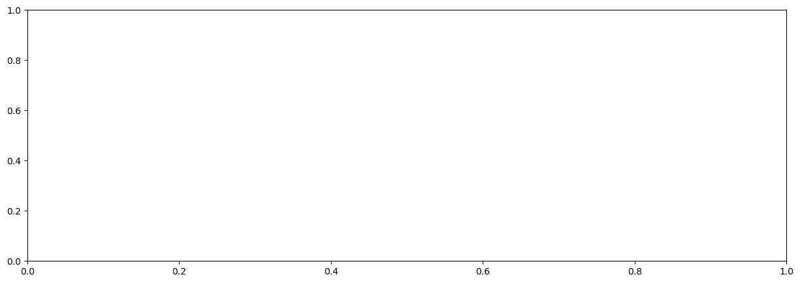
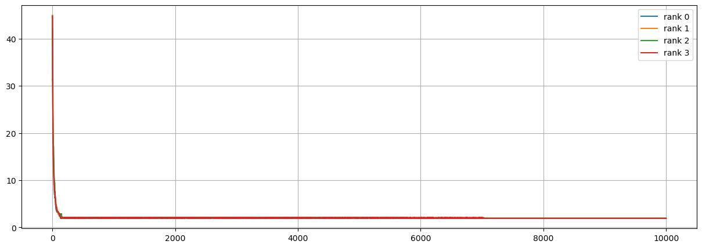

```python
import pandas as pd
import matplotlib.pyplot as plt
import numpy as np
from mpl_toolkits.axes_grid1.inset_locator import inset_axes
```


```python
circle_coord = pd.read_csv('SOURCE/coordinates.csv', skiprows=1)
# plt.figure(figsize=(15, 5))
for k in range(4):


    fig, ax = plt.subplots(1,1,figsize=(15, 5))
    best0=pd.read_csv(f'SOURCE/OUTPUT/best_sol_rank_{k}.dat', skiprows=1, names=[f'c{j}' for j in range(35)]+['dist'])

    x=np.array([circle_coord.iloc[int(k)-1].x for k in best0.iloc[len(best0)-1][:-1].array])
    y=np.array([circle_coord.iloc[int(k)-1].y for k in best0.iloc[len(best0)-1][:-1].array])

    plt.plot(x, y, '-o', ms=4)

    plt.grid()
    plt.show()
```


    ---------------------------------------------------------------------------

    IndexError                                Traceback (most recent call last)

    Cell In[16], line 9
          6 fig, ax = plt.subplots(1,1,figsize=(15, 5))
          7 best0=pd.read_csv(f'SOURCE/OUTPUT/best_sol_rank_{k}.dat', skiprows=1, names=[f'c{j}' for j in range(35)]+['dist'])
    ----> 9 x=np.array([circle_coord.iloc[int(k)-1].x for k in best0.iloc[len(best0)-1][:-1].array])
         10 y=np.array([circle_coord.iloc[int(k)-1].y for k in best0.iloc[len(best0)-1][:-1].array])
         12 plt.plot(x, y, '-o', ms=4)


    File ~/miniconda3/envs/dl/lib/python3.12/site-packages/pandas/core/indexing.py:1191, in _LocationIndexer.__getitem__(self, key)
       1189 maybe_callable = com.apply_if_callable(key, self.obj)
       1190 maybe_callable = self._check_deprecated_callable_usage(key, maybe_callable)
    -> 1191 return self._getitem_axis(maybe_callable, axis=axis)


    File ~/miniconda3/envs/dl/lib/python3.12/site-packages/pandas/core/indexing.py:1752, in _iLocIndexer._getitem_axis(self, key, axis)
       1749     raise TypeError("Cannot index by location index with a non-integer key")
       1751 # validate the location
    -> 1752 self._validate_integer(key, axis)
       1754 return self.obj._ixs(key, axis=axis)


    File ~/miniconda3/envs/dl/lib/python3.12/site-packages/pandas/core/indexing.py:1685, in _iLocIndexer._validate_integer(self, key, axis)
       1683 len_axis = len(self.obj._get_axis(axis))
       1684 if key >= len_axis or key < -len_axis:
    -> 1685     raise IndexError("single positional indexer is out-of-bounds")


    IndexError: single positional indexer is out-of-bounds


    

    


```python
circle_coord = pd.read_csv('SOURCE/coordinates.csv', skiprows=1)
fig, ax = plt.subplots(1,1,figsize=(15, 5))
# plt.figure(figsize=(15, 5))
for k in range(4):


    best0=pd.read_csv(f'SOURCE/OUTPUT/best_sol_rank_{k}.dat', skiprows=1, names=[f'c{k}' for k in range(35)]+['dist'])
    plt.plot(best0.dist,label=f'rank {k}')
    
    # sub_ax = inset_axes(
    #     parent_axes=ax,
    #     width=1,#"40%",
    #     height=1,#"40%",
    #     loc='upper center',
    #     borderpad=0.5  # padding between parent and inset axes
    # )

    # x=np.array([circle_coord.iloc[int(k)-1].x for k in best0.iloc[len(best0)-1][:-1].array])
    # y=np.array([circle_coord.iloc[int(k)-1].y for k in best0.iloc[len(best0)-1][:-1].array])

    # plt.plot(x, y, '-o', ms=4)

    # sub_ax.plot(x, y, '-o', ms=4)
    # sub_ax.get_xaxis().set_visible(False)
    # sub_ax.get_yaxis().set_visible(False)


# for k in range(100):
#     plt.vlines(100*k,  0, 40)
#     plt.xticks(range(0, 10000, 200), range(0, 10000, 200), rotation=90)
#     plt.yticks(range(0,50,5))
plt.legend()
plt.grid()
plt.show()
```


    

    


```python
n=2
fig, ax = plt.subplots(Nseed//(5*n), n, figsize=(5*n, 3*n))
fig.suptitle('Distance L2 along optimization for run at different seeds', y=0.99)
data_dir = "OUTPUT/square_setup1/"


for ind, seed in enumerate(range(2,21, 5)):
    ax[ind//n, ind%n].set_title(f'GA with seed = {seed}')
    df_avg = pd.read_csv(data_dir+f'avg_square_seed{seed}.dat', names=['avg'], skiprows=1)
    ax[ind//n, ind%n].plot(df_avg.index, df_avg['avg'], '-', label = f"avg") 

    df_best = pd.read_csv(data_dir+f'best_sol_square_seed{seed}.dat', names=[f'city{k}' for k in range(35)]+['dist'], skiprows=1)
    ax[ind//n, ind%n].plot(df_best.index, df_best['dist'], '-', label = f"best") 

    ax[ind//n, ind%n].set_yticks(range(0, 15), range(0, 15))
    ax[ind//n, ind%n].grid()
    ax[ind//n, ind%n].legend()
    ax[ind//n, ind%n].set_xlim([-1, 300])
    ax[ind//n, ind%n].set_xlabel('evolution step')
    ax[ind//n, ind%n].set_ylabel('L2')

    sub_ax = inset_axes(
        parent_axes=ax[ind//n, ind%n],
        width=1,#"40%",
        height=1,#"40%",
        loc='upper center',
        borderpad=0.5  # padding between parent and inset axes
    )

    x=np.array([square_coord.iloc[int(k)-1].x for k in df_best.iloc[len(df_best)-1][:-1].array])
    y=np.array([square_coord.iloc[int(k)-1].y for k in df_best.iloc[len(df_best)-1][:-1].array])

    sub_ax.plot(x, y, '-o', ms=4)
    sub_ax.get_xaxis().set_visible(False)
    sub_ax.get_yaxis().set_visible(False)
plt.savefig(data_dir+'seed_distances.png', dpi=300)
plt.tight_layout()
plt.show()
```


    ---------------------------------------------------------------------------

    NameError                                 Traceback (most recent call last)

    Cell In[17], line 2
          1 n=2
    ----> 2 fig, ax = plt.subplots(Nseed//(5*n), n, figsize=(5*n, 3*n))
          3 fig.suptitle('Distance L2 along optimization for run at different seeds', y=0.99)
          4 data_dir = "OUTPUT/square_setup1/"


    NameError: name 'Nseed' is not defined


## ES 10.2


```python
cap = pd.read_csv('SOURCE/cap_prov_ita.dat', sep=' ', names = ['x','y'])

```


```python
import geopandas as gpd
```


```python
italy = gpd.read_file('SOURCE/it.json')
```


```python
fig, ax = plt.subplots(figsize=(10, 20))

italy.plot(ax=ax, markersize=.5)
plt.scatter(cap.x, cap.y, c='r')

plt.show()
```


    

    


```python
fig, ax = plt.subplots(1,1,figsize=(15, 5))
# plt.figure(figsize=(15, 5))
for k in range(4):


    best0=pd.read_csv(f'SOURCE/OUTPUT/best_sol_rank_{k}.dat', skiprows=1, names=[f'c{j}' for j in range(111)]+['dist'])
    plt.plot(best0.dist,label=f'rank {k}')

#plt.xlim([200, 1000])   
plt.ylim([0, 300])   
plt.vlines(100, 0, 300)
plt.legend()
plt.grid()
plt.show()
```


    

    


```python
fig, ax = plt.subplots(figsize=(10, 20))

italy.plot(ax=ax, markersize=.5)
plt.scatter(cap.x, cap.y, c='r')

x=np.array([cap.iloc[int(k)-1].x for k in best0.iloc[len(best0)-1][:-1].array])
y=np.array([cap.iloc[int(k)-1].y for k in best0.iloc[len(best0)-1][:-1].array])

plt.plot(x, y, c='r')
plt.show()

```


    

    


```python
import os

```


    ['best_sol.dat',
     'best_sol_rank_3.dat',
     'best_sol_rank_1.dat',
     'best_sol_rank_2.dat',
     'best_sol_rank_0.dat',
     'setup.dat',
     'avg_cost_rank_2.dat',
     'avg_cost_rank_0.dat',
     'avg_cost_rank_1.dat',
     'avg_cost_rank_3.dat',
     'best_sol_rank_4.dat',
     'best_sol_rank_5.dat',
     'avg_cost_rank_4.dat',
     'avg_cost_rank_5.dat',
     'gifs']


```python
Nrank=6

n=2
fig, ax = plt.subplots(Nrank//n,n,figsize=(10*n, 5*n))
fig.suptitle('Distance L2 along optimization for different ranks ', y=0.99)
# data_dir = "OUTPUT/square_setup1/"


for j in range(Nrank):
    best0=pd.read_csv(f'SOURCE/OUTPUT/best_sol_rank_{j}.dat', skiprows=1, names=[f'c{k}' for k in range(111)]+['dist'])

    ax[j//n, j%n].plot(best0.index, best0['dist'], '-', label = f"") 
    ax[j//n, j%n].set_title(f'rank {j}: {best0.dist.min()}')

    ax[j//n, j%n].grid()
    ax[j//n, j%n].legend()
    ax[j//n, j%n].set_xlabel('evolution step')
    ax[j//n, j%n].set_ylabel('L2')

    sub_ax = inset_axes(
        parent_axes=ax[j//n, j%n],
        width="40%",
        height="80%",
        loc='upper center',
        borderpad=0.5  # padding between parent and inset axes
    )
    x=np.array([cap.iloc[int(k)-1].x for k in best0.iloc[len(best0)-1][:-1].array])
    y=np.array([cap.iloc[int(k)-1].y for k in best0.iloc[len(best0)-1][:-1].array])

    italy.plot(ax=sub_ax, markersize=.5)

    sub_ax.plot(x, y, '-o', ms=4, c='r')
    sub_ax.get_xaxis().set_visible(False)
    sub_ax.get_yaxis().set_visible(False)

plt.tight_layout()
plt.show()
```

    /tmp/ipykernel_4597/3239147650.py:17: UserWarning: No artists with labels found to put in legend.  Note that artists whose label start with an underscore are ignored when legend() is called with no argument.
      ax[j//n, j%n].legend()
    /tmp/ipykernel_4597/3239147650.py:17: UserWarning: No artists with labels found to put in legend.  Note that artists whose label start with an underscore are ignored when legend() is called with no argument.
      ax[j//n, j%n].legend()
    /tmp/ipykernel_4597/3239147650.py:17: UserWarning: No artists with labels found to put in legend.  Note that artists whose label start with an underscore are ignored when legend() is called with no argument.
      ax[j//n, j%n].legend()
    /tmp/ipykernel_4597/3239147650.py:17: UserWarning: No artists with labels found to put in legend.  Note that artists whose label start with an underscore are ignored when legend() is called with no argument.
      ax[j//n, j%n].legend()
    /tmp/ipykernel_4597/3239147650.py:17: UserWarning: No artists with labels found to put in legend.  Note that artists whose label start with an underscore are ignored when legend() is called with no argument.
      ax[j//n, j%n].legend()
    /tmp/ipykernel_4597/3239147650.py:17: UserWarning: No artists with labels found to put in legend.  Note that artists whose label start with an underscore are ignored when legend() is called with no argument.
      ax[j//n, j%n].legend()
    /tmp/ipykernel_4597/3239147650.py:37: UserWarning: This figure includes Axes that are not compatible with tight_layout, so results might be incorrect.
      plt.tight_layout()


    

    


Scrivere qualcosa commentando e mettendo link codice per creare gif [codice gif](animation.py)

Esempio di una run che finisce trovando effettivamente il minimo assoluto e una che non riesce a generarlo


rank = 0             |  rank = 1
:-------------------------:|:-------------------------:
 | 


rank = 2             |  rank = 3
:-------------------------:|:-------------------------:
 | 


```python
best0=pd.read_csv(f'SOURCE/OUTPUT/best_sol_rank_{0}.dat', skiprows=1, names=[f'c{j}' for j in range(111)]+['dist'])

```


```python
best0.dist.min()
```


    56.722


```python

```
