```python
import numpy as np
import matplotlib.pyplot as plt
```

# Exercise 11.1: Linear Fit
## Data generation


```python
# generate training inputs
def generate_linear_data(m:float, b:float, sigma:float=0.0, seed:int=0):
    """
    Generate linear data with gaussian noise
    Parameter:
        - m     [float] : linear weight
        - b     [float] : bias
        - sigma [float] : gaussian noise STD [default 0]
        - seed  [int]   : numpy random seed [default 0]
    Return:
        - x_train  [array], y_train [array] : training dataset
        - x_valid  [array], y_valid [array] : validation dataset
        - y_target [array]                  : noiseless output for x_valid
    """
    np.random.seed(seed)
    x_train = np.random.uniform(-1, 1, 500)
    x_valid = np.random.uniform(-1, 1, 50)
    x_valid.sort()
    y_target = m * x_valid + b # ideal (target) linear function

    y_train = np.random.normal(m * x_train + b, sigma) # actual measures from which we want to guess regression parameters
    y_valid = np.random.normal(m * x_valid + b, sigma)

    return x_train, y_train, x_valid, y_valid, y_target    
    
```


```python
# target parameters of f(x) = m*x + b
m = 2 # slope
b = 1 # intersect
sigma=0.1
x_train, y_train, x_valid, y_valid, y_target=generate_linear_data(m,b, sigma)

# plot validation and target dataset
plt.title(f'Linear Data with gaussian white noise '+r"$\sigma$ = "+"%.2f"%sigma)
plt.plot(x_valid, y_target, label='target')
plt.scatter(x_valid, y_valid, color='r', label='validation data')
plt.legend()
plt.grid(True)
plt.show()
```


    

    


## Model definition
For linear regression is sufficient one node without activation function (the goal is to estimate a linear function)


```python
# compose the NN model
import tensorflow as tf
from tensorflow import keras

from tensorflow.keras.models import Sequential
from tensorflow.keras.layers import Dense, Activation
from tensorflow.keras import backend as K
from tensorflow.keras.utils import get_custom_objects
```

    2025-12-17 09:43:56.442633: I tensorflow/core/platform/cpu_feature_guard.cc:210] This TensorFlow binary is optimized to use available CPU instructions in performance-critical operations.
    To enable the following instructions: SSE4.1 SSE4.2 AVX AVX2 FMA, in other operations, rebuild TensorFlow with the appropriate compiler flags.


```python
def init_regression_model(optimizer='sgd', loss='mse', metrics=['mse'], kernel_initializer='glorot_uniform'):
    """
    Create a one-neuron network to perform linear regression
    Parameter:
        - optimizer [string] : algorithm to optimize the regression parameters
        - loss      [string] : cost function to minimize on the train dataset
        - metrics   [list]   : cost functions to evaluate on the validation dataset
    Return:
        - model     [Keras.Sequential]
    """
    model=tf.keras.Sequential()
    model.add(
        Dense(
            1, input_shape=(1,),
            kernel_initializer=kernel_initializer
        )
    )

    model.compile(optimizer=optimizer, loss=loss, metrics=metrics)
    
    return model
```


```python
model=init_regression_model(metrics=['mse', 'accuracy'])

history = model.fit(x=x_train, y=y_train,
          batch_size=32, epochs=30,
          shuffle=True, # a good idea is to shuffle input before at each epoch
          validation_data=(x_valid, y_valid), verbose=0)

```

    /home/td/miniconda3/envs/dl/lib/python3.12/site-packages/keras/src/layers/core/dense.py:93: UserWarning: Do not pass an `input_shape`/`input_dim` argument to a layer. When using Sequential models, prefer using an `Input(shape)` object as the first layer in the model instead.
      super().__init__(activity_regularizer=activity_regularizer, **kwargs)


```python
fig, ax = plt.subplots(1, 2, figsize=(10,3))

x_predicted = np.random.uniform(-1, 1, 100)
y_predicted = model.predict(x_predicted)

fig.suptitle('Regression model for '+ r"$\sigma=$"+"%.2f"%sigma)
ax[0].set_title('Model prediction')
ax[0].scatter(x_predicted, y_predicted,color='r', label='predicted')
ax[0].plot(x_valid, y_target, label='actual function')
ax[0].grid(True)
ax[0].legend()


# look into training history
# Plot training & validation loss values
ax[1].plot(history.history['loss'])
ax[1].plot(history.history['val_loss'])
ax[1].set_title('Regression model loss')
ax[1].set_ylabel('Loss')
ax[1].set_xlabel('Epoch')
ax[1].legend(['Train', 'Test'], loc='best')
plt.tight_layout()
plt.show()

# evaluate model
valid_score = model.evaluate(x_valid, y_valid, batch_size=32, verbose=1)
# evaluate model with the exact curve
target_score = model.evaluate(x_valid, y_target, batch_size=32, verbose=1)
# print performance
print('Validation loss:', valid_score[0])
print('Target loss:', target_score[0])
m_pred, b_pred =model.get_weights()
print('linear weight prediction', m_pred)
print('bias prediction', b_pred)

```

    4/4 ━━━━━━━━━━━━━━━━━━━━ 0s 10ms/step


    

    


    2/2 ━━━━━━━━━━━━━━━━━━━━ 0s 19ms/step - accuracy: 0.0000e+00 - loss: 0.0135 - mse: 0.0135
    2/2 ━━━━━━━━━━━━━━━━━━━━ 0s 18ms/step - accuracy: 0.0000e+00 - loss: 0.0035 - mse: 0.0035
    Validation loss: 0.01487063616514206
    Target loss: 0.0038621975108981133
    linear weight prediction [[1.8899937]]
    bias prediction [0.9883172]


## Variation along number of epochs

I tested the linear model plotting the loss on train and validation dataset up to 100 epochs with a white noise carachterized by $\sigma=0.1$

Both the validation and the training loss perform better with an higher number of epochs


```python
m1 = init_regression_model()
m1.summary()
h1 = m1.fit(
    x=x_train, y=y_train,
    batch_size=32, epochs=100,
    shuffle=True, # a good idea is to shuffle input before at each epoch
    validation_data=(x_valid, y_valid), verbose=0
)

```


<pre style="white-space:pre;overflow-x:auto;line-height:normal;font-family:Menlo,'DejaVu Sans Mono',consolas,'Courier New',monospace"><span style="font-weight: bold">Model: "sequential_1"</span>
</pre>


<pre style="white-space:pre;overflow-x:auto;line-height:normal;font-family:Menlo,'DejaVu Sans Mono',consolas,'Courier New',monospace">┏━━━━━━━━━━━━━━━━━━━━━━━━━━━━━━━━━┳━━━━━━━━━━━━━━━━━━━━━━━━┳━━━━━━━━━━━━━━━┓
┃<span style="font-weight: bold"> Layer (type)                    </span>┃<span style="font-weight: bold"> Output Shape           </span>┃<span style="font-weight: bold">       Param # </span>┃
┡━━━━━━━━━━━━━━━━━━━━━━━━━━━━━━━━━╇━━━━━━━━━━━━━━━━━━━━━━━━╇━━━━━━━━━━━━━━━┩
│ dense_1 (<span style="color: #0087ff; text-decoration-color: #0087ff">Dense</span>)                 │ (<span style="color: #00d7ff; text-decoration-color: #00d7ff">None</span>, <span style="color: #00af00; text-decoration-color: #00af00">1</span>)              │             <span style="color: #00af00; text-decoration-color: #00af00">2</span> │
└─────────────────────────────────┴────────────────────────┴───────────────┘
</pre>


<pre style="white-space:pre;overflow-x:auto;line-height:normal;font-family:Menlo,'DejaVu Sans Mono',consolas,'Courier New',monospace"><span style="font-weight: bold"> Total params: </span><span style="color: #00af00; text-decoration-color: #00af00">2</span> (8.00 B)
</pre>


<pre style="white-space:pre;overflow-x:auto;line-height:normal;font-family:Menlo,'DejaVu Sans Mono',consolas,'Courier New',monospace"><span style="font-weight: bold"> Trainable params: </span><span style="color: #00af00; text-decoration-color: #00af00">2</span> (8.00 B)
</pre>


<pre style="white-space:pre;overflow-x:auto;line-height:normal;font-family:Menlo,'DejaVu Sans Mono',consolas,'Courier New',monospace"><span style="font-weight: bold"> Non-trainable params: </span><span style="color: #00af00; text-decoration-color: #00af00">0</span> (0.00 B)
</pre>


```python
plt.figure(figsize=(10,5))

# look into training history
# Plot training & validation loss values
plt.plot(h1.history['loss'])
plt.plot(h1.history['val_loss'])
plt.title('Regression model loss for '+ r"$\sigma=$"+"%.2f"%sigma)
plt.ylabel('Loss')
plt.xlabel('Epoch')
plt.legend(['Train', 'Test'], loc='best')
plt.grid(True)
plt.show()


# evaluate model
valid_score = m1.evaluate(x_valid, y_valid, batch_size=32, verbose=1)
# evaluate model with the exact curve
target_score = m1.evaluate(x_valid, y_target, batch_size=32, verbose=1)
# print performance
print('Validation loss:', valid_score[0])
print('Target loss    :', target_score[0])
print()
m_pred, b_pred =model.get_weights()
print('linear weight prediction:', m_pred)
print('bias prediction         :', b_pred)

```


    

    


    2/2 ━━━━━━━━━━━━━━━━━━━━ 0s 21ms/step - loss: 0.0113 - mse: 0.0113
    2/2 ━━━━━━━━━━━━━━━━━━━━ 0s 21ms/step - loss: 1.8517e-04 - mse: 1.8517e-04
    Validation loss: 0.011137852445244789
    Target loss    : 0.00016021686315070838
    
    linear weight prediction: [[1.8899937]]
    bias prediction         : [0.9883172]


## Variation of train dataset dimension

I first tested the linear model passing gradually bigger slices of the train dataset keeping the number of epochs fixed.

After some initial oscillation a convergent behaviour emerge when the training dataset dimension grow.


```python
from tqdm import tqdm

loss=[]
val_loss=[]


scores=[]

# consider different slice of the dataset
for k in tqdm(range(1, len(x_train), 10)):

    model = init_regression_model()
    
    history = model.fit(x=x_train[:k], y=y_train[:k],
            batch_size=32, epochs=60,
            shuffle=True,
            validation_data=(x_valid, y_valid),
            verbose=0
    )
    loss.append(history.history['loss'][-1])
    val_loss.append(history.history['val_loss'][-1])

```

    100%|██████████| 50/50 [04:04<00:00,  4.88s/it]


```python
plt.figure(figsize=(10,3))
plt.title('Loss varing train dataset dimension [optimizer sgd, epochs=60]')
plt.plot(range(1, len(x_train), 10), loss, marker='*',label='train loss')
plt.plot(range(1, len(x_train), 10), val_loss, marker='o', label='validation loss')
plt.ylabel('Loss')
plt.xlabel('train dataset dimension')
plt.grid(True)
plt.legend()
plt.show()
```


    

    


We can se that both the the training and the validation loss converge to a minimum while growing the train dataset dimension 

### Variation of train dimension with different epochs

I repeted the process varying the number of epochs. It's visible how an higher number of epochs return a more regular behaviour and better performance on the data.


```python
from tqdm import tqdm

sigma=0.0
y_train = np.random.normal(m * x_train + b, sigma) # actual measures from which we want to guess regression parameters
y_valid = np.random.normal(m * x_valid + b, sigma)


ep_loss=[]
ep_valloss=[]

ep=[5, 20, 40, 60]

for e in ep:
    loss=[]
    val_loss=[]
    
    for k in tqdm(range(1, len(x_train), 20), desc=f'{e} epochs'):
    
        model = init_regression_model()
        
        #print(f'\t\t --> size {k} <-- ')
        history = model.fit(x=x_train[:k], y=y_train[:k],
                batch_size=32, epochs=e,
                shuffle=True, # a good idea is to shuffle input before at each epoch
                validation_data=(x_valid, y_valid),
                verbose=0
        )
        loss.append(history.history['loss'][-1])
        val_loss.append(history.history['val_loss'][-1])
    ep_loss.append(loss)
    ep_valloss.append(val_loss)

    
```

    5 epochs: 100%|██████████| 25/25 [00:18<00:00,  1.32it/s]
    20 epochs: 100%|██████████| 25/25 [00:53<00:00,  2.15s/it]
    40 epochs: 100%|██████████| 25/25 [01:37<00:00,  3.89s/it]
    60 epochs: 100%|██████████| 25/25 [02:16<00:00,  5.45s/it]


```python
fig, axs = plt.subplots(1, 2,figsize=(10,3))
axs[0].set_title('Loss on train dataset')
for e in range(3):
    axs[0].plot(range(1, len(x_train), 20), ep_loss[e], marker='*',label=f'{ep[e]} epochs')
axs[0].set_xlabel('train dataset dimension')

axs[0].legend()
axs[0].grid()

axs[1].set_title('Loss on validation dataset')
for e in range(3):
    axs[1].plot(range(1, len(x_train), 20), ep_valloss[e], marker='o', label=f'{ep[e]} epochs')

axs[1].set_xlabel('train dataset dimension')

axs[1].legend()
axs[1].grid()

plt.show()
```


    

    


## White Noise

I tested the model varying the value of sigma in the interval [0,2] with a 0.1 step at a fixed number of epochs and using the whole training dataset.

It's visible how the model perform less on more noisy data.


```python
import numpy as np

# generate training inputs
np.random.seed(0)
x_train = np.random.uniform(-1, 1, 500)
x_valid = np.random.uniform(-1, 1, 50)
x_valid.sort()
y_target = m * x_valid + b # ideal (target) linear function

sigma_loss=[]
sigma_val_loss=[]

weights=[]
biases =[]

sigmas=np.arange(0, 2, 0.1)

fig, axs = plt.subplots(int((len(sigmas)/10)//2), 2, figsize=(10, 3*((len(sigmas)/10)//4)))
for n, sigma in enumerate(sigmas):

  print(f'\t\t--> sigma {sigma} <--')
  #sigma = 0.0 # noise standard deviation, for the moment it is absent
  y_train = np.random.normal(m * x_train + b, sigma) # actual measures from which we want to guess regression parameters
  y_valid = np.random.normal(m * x_valid + b, sigma)
  

  model=init_regression_model()
  # fit the model using training dataset
  # over 10 epochs of 32 batch size each
  # report training progress against validation data
  history = model.fit(x=x_train, y=y_train,
            batch_size=32, epochs=30,
            shuffle=True, # a good idea is to shuffle input before at each epoch
            validation_data=(x_valid, y_valid),
            verbose=0
  )

  weights.append(model.get_weights()[0][0][0])
  biases.append(model.get_weights()[1][0])
    
  x_predicted = np.random.uniform(-1, 1, 100)
  y_predicted = model.predict(x_predicted)


  sigma_loss.append(history.history['loss'][-1])
  sigma_val_loss.append(history.history['val_loss'][-1])

#plt.tight_layout()
#plt.show()

```

    		--> sigma 0.0 <--


    /home/td/miniconda3/envs/dl/lib/python3.12/site-packages/keras/src/layers/core/dense.py:93: UserWarning: Do not pass an `input_shape`/`input_dim` argument to a layer. When using Sequential models, prefer using an `Input(shape)` object as the first layer in the model instead.
      super().__init__(activity_regularizer=activity_regularizer, **kwargs)


    4/4 ━━━━━━━━━━━━━━━━━━━━ 0s 11ms/step
    		--> sigma 0.1 <--
    4/4 ━━━━━━━━━━━━━━━━━━━━ 0s 11ms/step
    		--> sigma 0.2 <--
    WARNING:tensorflow:5 out of the last 9 calls to <function TensorFlowTrainer.make_predict_function.<locals>.one_step_on_data_distributed at 0x7faeec2f1300> triggered tf.function retracing. Tracing is expensive and the excessive number of tracings could be due to (1) creating @tf.function repeatedly in a loop, (2) passing tensors with different shapes, (3) passing Python objects instead of tensors. For (1), please define your @tf.function outside of the loop. For (2), @tf.function has reduce_retracing=True option that can avoid unnecessary retracing. For (3), please refer to https://www.tensorflow.org/guide/function#controlling_retracing and https://www.tensorflow.org/api_docs/python/tf/function for  more details.
    1/4 ━━━━━━━━━━━━━━━━━━━━ 0s 30ms/stepWARNING:tensorflow:6 out of the last 12 calls to <function TensorFlowTrainer.make_predict_function.<locals>.one_step_on_data_distributed at 0x7faeec2f1300> triggered tf.function retracing. Tracing is expensive and the excessive number of tracings could be due to (1) creating @tf.function repeatedly in a loop, (2) passing tensors with different shapes, (3) passing Python objects instead of tensors. For (1), please define your @tf.function outside of the loop. For (2), @tf.function has reduce_retracing=True option that can avoid unnecessary retracing. For (3), please refer to https://www.tensorflow.org/guide/function#controlling_retracing and https://www.tensorflow.org/api_docs/python/tf/function for  more details.
    4/4 ━━━━━━━━━━━━━━━━━━━━ 0s 12ms/step
    		--> sigma 0.30000000000000004 <--
    4/4 ━━━━━━━━━━━━━━━━━━━━ 0s 12ms/step
    		--> sigma 0.4 <--
    4/4 ━━━━━━━━━━━━━━━━━━━━ 0s 14ms/step
    		--> sigma 0.5 <--
    4/4 ━━━━━━━━━━━━━━━━━━━━ 0s 11ms/step
    		--> sigma 0.6000000000000001 <--
    4/4 ━━━━━━━━━━━━━━━━━━━━ 0s 11ms/step
    		--> sigma 0.7000000000000001 <--
    4/4 ━━━━━━━━━━━━━━━━━━━━ 0s 10ms/step
    		--> sigma 0.8 <--
    4/4 ━━━━━━━━━━━━━━━━━━━━ 0s 11ms/step
    		--> sigma 0.9 <--
    4/4 ━━━━━━━━━━━━━━━━━━━━ 0s 11ms/step
    		--> sigma 1.0 <--
    4/4 ━━━━━━━━━━━━━━━━━━━━ 0s 13ms/step
    		--> sigma 1.1 <--
    4/4 ━━━━━━━━━━━━━━━━━━━━ 0s 11ms/step
    		--> sigma 1.2000000000000002 <--
    4/4 ━━━━━━━━━━━━━━━━━━━━ 0s 12ms/step
    		--> sigma 1.3 <--
    4/4 ━━━━━━━━━━━━━━━━━━━━ 0s 10ms/step
    		--> sigma 1.4000000000000001 <--
    4/4 ━━━━━━━━━━━━━━━━━━━━ 0s 10ms/step
    		--> sigma 1.5 <--
    4/4 ━━━━━━━━━━━━━━━━━━━━ 0s 12ms/step
    		--> sigma 1.6 <--
    4/4 ━━━━━━━━━━━━━━━━━━━━ 0s 11ms/step
    		--> sigma 1.7000000000000002 <--
    4/4 ━━━━━━━━━━━━━━━━━━━━ 0s 10ms/step
    		--> sigma 1.8 <--
    4/4 ━━━━━━━━━━━━━━━━━━━━ 0s 9ms/step 
    		--> sigma 1.9000000000000001 <--
    4/4 ━━━━━━━━━━━━━━━━━━━━ 0s 11ms/step


    /home/td/miniconda3/envs/dl/lib/python3.12/site-packages/matplotlib/_tight_bbox.py:67: RuntimeWarning: divide by zero encountered in scalar divide
      fig.patch.set_bounds(x0 / w1, y0 / h1,
    /home/td/miniconda3/envs/dl/lib/python3.12/site-packages/matplotlib/_tight_bbox.py:68: RuntimeWarning: divide by zero encountered in scalar divide
      fig.bbox.width / w1, fig.bbox.height / h1)
    /home/td/miniconda3/envs/dl/lib/python3.12/site-packages/matplotlib/patches.py:797: RuntimeWarning: invalid value encountered in scalar add
      y1 = self.convert_yunits(self._y0 + self._height)
    /home/td/miniconda3/envs/dl/lib/python3.12/site-packages/matplotlib/transforms.py:2036: RuntimeWarning: invalid value encountered in scalar add
      self._mtx[1, 2] += ty


    
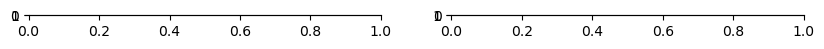
    


```python
plt.figure(figsize=(15, 3))

plt.plot(sigmas, sigma_loss, marker='*',label='train loss')
plt.plot(sigmas, sigma_val_loss, marker='o', label='validation loss')

plt.xlabel('noise')
plt.ylabel('loss')
plt.title('MSE')
plt.legend()
plt.grid()
plt.show()
```


    
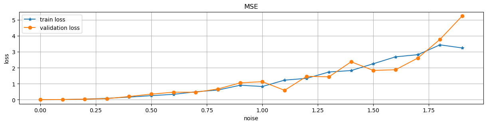
    


Below i plotted the linear fit parameters along the values of sigma explored.

The estimated values of the model seem to distribute near the real values.


```python
fig, ax = plt.subplots(1,2, figsize=(15,3))

ax[0].set_title('linear regression weights')
ax[0].plot(sigmas, weights, '--d')
ax[0].hlines(2, 0, 1.9, colors='r')
ax[0].grid()
ax[0].set_xlabel('sigma')
ax[0].set_ylabel('m')


ax[1].set_title('linear regression biases')
ax[1].plot(sigmas, biases, '--^')
ax[1].hlines(1, 0, 1.9, colors='r')
ax[1].grid()
ax[1].set_xlabel('sigma')
plt.show()
```


    
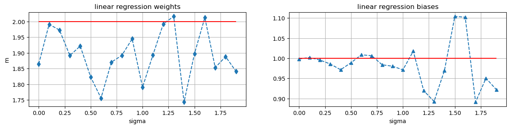
    


### Uniform search on parameters (x_train_dimension, epochs) for different values of sigma
I generated different values of the train dataset dimension, the number of epochs and the values of sigma following a uniform distribution using the function `regression_search` defined in the file [model_def.py](model_def.py).


Then i plotted the loss functions for different sigma values along the train dataset's dimension and the number of epochs


```python
import pandas as pd
import matplotlib.pyplot as plt
import numpy as np
grid=pd.read_csv('regression_grid.csv')
grid
```


<div>
<style scoped>
    .dataframe tbody tr th:only-of-type {
        vertical-align: middle;
    }

    .dataframe tbody tr th {
        vertical-align: top;
    }

    .dataframe thead th {
        text-align: right;
    }
</style>
<table border="1" class="dataframe">
  <thead>
    <tr style="text-align: right;">
      <th></th>
      <th>Unnamed: 0</th>
      <th>sigma</th>
      <th>epochs</th>
      <th>train_dim</th>
      <th>loss</th>
      <th>val_loss</th>
    </tr>
  </thead>
  <tbody>
    <tr>
      <th>0</th>
      <td>0</td>
      <td>0.073645</td>
      <td>85</td>
      <td>39</td>
      <td>0.051839</td>
      <td>0.061568</td>
    </tr>
    <tr>
      <th>1</th>
      <td>1</td>
      <td>0.073645</td>
      <td>26</td>
      <td>198</td>
      <td>0.008271</td>
      <td>0.008431</td>
    </tr>
    <tr>
      <th>2</th>
      <td>2</td>
      <td>0.073645</td>
      <td>30</td>
      <td>20</td>
      <td>0.635386</td>
      <td>0.446353</td>
    </tr>
    <tr>
      <th>3</th>
      <td>3</td>
      <td>0.073645</td>
      <td>77</td>
      <td>412</td>
      <td>0.005514</td>
      <td>0.003803</td>
    </tr>
    <tr>
      <th>4</th>
      <td>4</td>
      <td>0.073645</td>
      <td>48</td>
      <td>339</td>
      <td>0.008353</td>
      <td>0.009227</td>
    </tr>
    <tr>
      <th>...</th>
      <td>...</td>
      <td>...</td>
      <td>...</td>
      <td>...</td>
      <td>...</td>
      <td>...</td>
    </tr>
    <tr>
      <th>995</th>
      <td>995</td>
      <td>0.647308</td>
      <td>94</td>
      <td>482</td>
      <td>0.404973</td>
      <td>0.543839</td>
    </tr>
    <tr>
      <th>996</th>
      <td>996</td>
      <td>0.647308</td>
      <td>87</td>
      <td>479</td>
      <td>0.396619</td>
      <td>0.335324</td>
    </tr>
    <tr>
      <th>997</th>
      <td>997</td>
      <td>0.647308</td>
      <td>47</td>
      <td>283</td>
      <td>0.426991</td>
      <td>0.432184</td>
    </tr>
    <tr>
      <th>998</th>
      <td>998</td>
      <td>0.647308</td>
      <td>57</td>
      <td>463</td>
      <td>0.403493</td>
      <td>0.352792</td>
    </tr>
    <tr>
      <th>999</th>
      <td>999</td>
      <td>0.647308</td>
      <td>51</td>
      <td>99</td>
      <td>0.712915</td>
      <td>0.774687</td>
    </tr>
  </tbody>
</table>
<p>1000 rows × 6 columns</p>
</div>


```python
sigmas = grid.sort_values(by='sigma')['sigma'].unique()[:2].tolist()+\
         grid.sort_values(by='sigma')['sigma'].unique()[3:-4].tolist()+\
         grid.sort_values(by='sigma')['sigma'].unique()[-1:].tolist()
```


```python
fig = plt.figure(figsize=(20,12),layout='constrained')
fig.suptitle('Loss for different values of Sigma')

rows=len(sigmas)//2
cols=4

subfigs = fig.subfigures(rows, 2, wspace=0.07)
for k, sigma in enumerate(sigmas):

    gr=grid.loc[grid['sigma']==sigma].reset_index(drop=True)
    gr.sort_values(by='loss').reset_index(drop=True)
    
    X = gr['train_dim'].array
    Y = gr['epochs'].array
    Z1 = gr['loss'].array
    Z2 = gr['val_loss'].array

    subfigs[k//2][k%2].suptitle(f'sigma = {"%.3f"%sigma}', y=0.9, fontweight="bold")
    subfigs[k//2][k%2].set_linewidth(1)

    subfigs[k//2][k%2].set_edgecolor('black')
    #subfigs[k//2][k%2].subplots_adjust(right=1.5)

    ax = subfigs[k//2][k%2].add_subplot(1, 2, 1 ,projection='3d')
    ax.set_title(f'Loss', y=0.9)
    ax.bar3d(X-25 , Y-5, np.zeros(len(Z1)), 50,10,Z1, label=f'loss sigma={sigma}', alpha=0.5)
    
    ax.set_ylabel('epochs')
    ax.set_xlabel('train_dim')
    ax.set_zlabel('loss', rotation = 90)
    

    ax = subfigs[k//2][k%2].add_subplot(1, 2, 2 ,projection='3d')
    ax.set_title('Validation loss', y=0.9)
    ax.bar3d(X-25 , Y-5, np.zeros(len(Z2)), 50,10,Z2, label=f'loss sigma={sigma}', alpha=0.5, color='orange')
    ax.set_ylabel('epochs')
    ax.set_xlabel('train_dim')
    ax.set_zlabel('val_loss', rotation = 90)

    
plt.show()
```


    
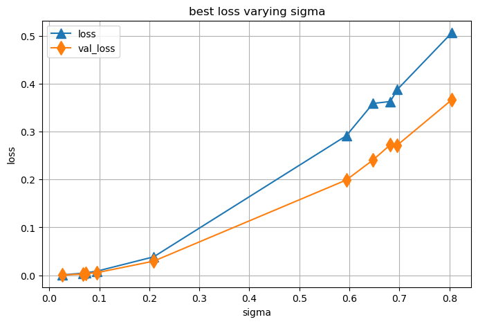
    


Both validation and training loss show a convergent behaviour along the growing of the number of epochs and train dataset's dimension for each value of sigma.


```python
plt.figure(figsize=(15,5))
plt.title('best loss varying sigma')
plt.plot(
    grid.sort_values(by='sigma')['sigma'].unique(),
    [grid.loc[grid['sigma']==sigma]['loss'].min() for sigma in grid.sort_values(by='sigma')['sigma'].unique()],
    '-^',
    markersize=10,
    label='loss'
)
plt.plot(
    grid.sort_values(by='sigma')['sigma'].unique(),
    [grid.loc[grid['sigma']==sigma]['val_loss'].min() for sigma in grid.sort_values(by='sigma')['sigma'].unique()],
    '-d',
    markersize=10,
    label='val_loss'
)
plt.ylabel('loss')
plt.xlabel('sigma')
plt.grid()
plt.legend()
plt.show()

```


    

    


# Exercise 11.2

Try to extend the model to obtain a reasonable fit of the following polynomial of order 3:

$$
f(x)=4-3x-2x^2+3x^3
$$
for $x \in [-1,1]$.

Find good (& reasonable) choices for:

- the number of layers
- the number of neurons in each layer
- the activation function
- the optimizer
- the loss function
  
Check your NN model by seeing how well your fits predict newly generated test data (including on data outside the range you fit. 

- How well do your NN do on points in the range of $x$ where you trained the model? 
- How about points outside the original training data set?
- Summarize what you have learned about the relationship between model complexity (number of parameters), goodness of fit on training data, and the ability to predict well.

## Data generation


```python
import numpy as np
import matplotlib.pyplot as plt
# compose the NN model
import tensorflow as tf
from tensorflow import keras

from tensorflow.keras.models import Sequential
from tensorflow.keras.layers import Dense, Activation
from tensorflow.keras import backend as K
from tensorflow.keras.utils import get_custom_objects


from tqdm import tqdm
```


```python
def pol(x):
  return 4-3*x - 2*x**2 + 3*x**3
```


```python
def generate_poly_data(pol, seed=0):
    # generate training inputs
    np.random.seed(seed)
    x_train = np.random.uniform(-1, 1, 500)
    x_valid = np.random.uniform(-1, 1, 50)
    x_valid.sort()
    
    
    y_target =  pol(x_valid)# ideal (target) polynomial
    
    sigma = 0.1 # noise standard deviation, for the moment it is absent
    y_train = np.random.normal(pol(x_train), sigma) # actual measures from which we want to guess regression parameters
    y_valid = np.random.normal(pol(x_valid), sigma)

    return x_train, y_train, x_valid, y_valid, y_target
```


```python
x_train, y_train, x_valid, y_valid, y_target = generate_poly_data(pol)
```


```python
plt.title('datasets polymonial')

plt.plot(x_valid, y_target, c='r', label='target')
plt.scatter(x_train, y_train, label='train')
plt.scatter(x_valid, y_valid, label='validation')

plt.legend()
plt.show()

```


    

    


## Model definition


```python
from model_def import test_arch
from drawing import DrawNN
import os

import matplotlib.pyplot as plt
import numpy as np
import pandas as pd
from tensorflow.keras.layers import Dense, Activation, Input
```


```python
def NN(
    n_layer:int=2,
    neurons:list=[3, 2],
    activations=['relu'],
    kernel_initializer='glorot_uniform'
):
    """
    Generate a Deep Neural network specifing the architecture:
    Parameters:
        - n_layer            [int]      : number of hidden layers
        - neurons            [list(int)]: number of neurons of the corresponding index layer
        - activations        [list(str)]: list of activation functions 
            (if less than the layers the last function will be apllied to the remaining layers)
        - kernel_initializer [str]      : Initializer for the `kernel` weights matrix.
    Return:
        model [Keras.Sequential]
    """

    if (len(neurons)!=n_layer):
        raise ValueError('ERROR: List of neurons incompatible with number of layers')
    model = tf.keras.Sequential()
    model.add(Input(shape=(1,))) #input layer

    activation_index=0
    
    for layer in range(n_layer):
        model.add(
            Dense(
                neurons[layer], 
                activations[activation_index],
                kernel_initializer=kernel_initializer # to confront architectures
            )
        )

        if activation_index+1<len(activations):
            activation_index+=1
    model.add(Dense(1, activation='linear'))

    return model
```


```python
layers=[2, 3, 4]
mnn=NN(5, [4, 16, 32, 16, 4])

mnn.summary()
```


<pre style="white-space:pre;overflow-x:auto;line-height:normal;font-family:Menlo,'DejaVu Sans Mono',consolas,'Courier New',monospace"><span style="font-weight: bold">Model: "sequential"</span>
</pre>


<pre style="white-space:pre;overflow-x:auto;line-height:normal;font-family:Menlo,'DejaVu Sans Mono',consolas,'Courier New',monospace">┏━━━━━━━━━━━━━━━━━━━━━━━━━━━━━━━━━┳━━━━━━━━━━━━━━━━━━━━━━━━┳━━━━━━━━━━━━━━━┓
┃<span style="font-weight: bold"> Layer (type)                    </span>┃<span style="font-weight: bold"> Output Shape           </span>┃<span style="font-weight: bold">       Param # </span>┃
┡━━━━━━━━━━━━━━━━━━━━━━━━━━━━━━━━━╇━━━━━━━━━━━━━━━━━━━━━━━━╇━━━━━━━━━━━━━━━┩
│ dense (<span style="color: #0087ff; text-decoration-color: #0087ff">Dense</span>)                   │ (<span style="color: #00d7ff; text-decoration-color: #00d7ff">None</span>, <span style="color: #00af00; text-decoration-color: #00af00">4</span>)              │             <span style="color: #00af00; text-decoration-color: #00af00">8</span> │
├─────────────────────────────────┼────────────────────────┼───────────────┤
│ dense_1 (<span style="color: #0087ff; text-decoration-color: #0087ff">Dense</span>)                 │ (<span style="color: #00d7ff; text-decoration-color: #00d7ff">None</span>, <span style="color: #00af00; text-decoration-color: #00af00">16</span>)             │            <span style="color: #00af00; text-decoration-color: #00af00">80</span> │
├─────────────────────────────────┼────────────────────────┼───────────────┤
│ dense_2 (<span style="color: #0087ff; text-decoration-color: #0087ff">Dense</span>)                 │ (<span style="color: #00d7ff; text-decoration-color: #00d7ff">None</span>, <span style="color: #00af00; text-decoration-color: #00af00">32</span>)             │           <span style="color: #00af00; text-decoration-color: #00af00">544</span> │
├─────────────────────────────────┼────────────────────────┼───────────────┤
│ dense_3 (<span style="color: #0087ff; text-decoration-color: #0087ff">Dense</span>)                 │ (<span style="color: #00d7ff; text-decoration-color: #00d7ff">None</span>, <span style="color: #00af00; text-decoration-color: #00af00">16</span>)             │           <span style="color: #00af00; text-decoration-color: #00af00">528</span> │
├─────────────────────────────────┼────────────────────────┼───────────────┤
│ dense_4 (<span style="color: #0087ff; text-decoration-color: #0087ff">Dense</span>)                 │ (<span style="color: #00d7ff; text-decoration-color: #00d7ff">None</span>, <span style="color: #00af00; text-decoration-color: #00af00">4</span>)              │            <span style="color: #00af00; text-decoration-color: #00af00">68</span> │
├─────────────────────────────────┼────────────────────────┼───────────────┤
│ dense_5 (<span style="color: #0087ff; text-decoration-color: #0087ff">Dense</span>)                 │ (<span style="color: #00d7ff; text-decoration-color: #00d7ff">None</span>, <span style="color: #00af00; text-decoration-color: #00af00">1</span>)              │             <span style="color: #00af00; text-decoration-color: #00af00">5</span> │
└─────────────────────────────────┴────────────────────────┴───────────────┘
</pre>


<pre style="white-space:pre;overflow-x:auto;line-height:normal;font-family:Menlo,'DejaVu Sans Mono',consolas,'Courier New',monospace"><span style="font-weight: bold"> Total params: </span><span style="color: #00af00; text-decoration-color: #00af00">1,233</span> (4.82 KB)
</pre>


<pre style="white-space:pre;overflow-x:auto;line-height:normal;font-family:Menlo,'DejaVu Sans Mono',consolas,'Courier New',monospace"><span style="font-weight: bold"> Trainable params: </span><span style="color: #00af00; text-decoration-color: #00af00">1,233</span> (4.82 KB)
</pre>


<pre style="white-space:pre;overflow-x:auto;line-height:normal;font-family:Menlo,'DejaVu Sans Mono',consolas,'Courier New',monospace"><span style="font-weight: bold"> Non-trainable params: </span><span style="color: #00af00; text-decoration-color: #00af00">0</span> (0.00 B)
</pre>


## Testing architectures
in the file [model_def.py](model_def.py) the function test_arch(line 139) is used to select the best performing NN architecture at fixed number of layers, optimizer and activation function testing all the possible combination in n_layers of different neuron's numbers per layer (specified in input).


Below i writed an example for NN with 2 layers,trained with the optimizer sgd and activation relu using 60 epochs. The function test all the possible combination on two layers of the number of neurons per layer: [2, 4, 8, 16, 32]


```python
bestloss, bindex, combs, losses, val_losses, xpred, ypred = test_arch(
    2, x_train, y_train, x_valid, y_valid,
    'sgd', 'relu', 60, [2, 4, 8, 16, 32]
)

print('best validation loss value for a 2 layers NN trained with 60 epochs using optimizer=sgd and activation=relu:')
print('\t', bestloss)
print('Corresponding neurons combination: ', combs[bindex])

```

      8%|██████████████                                                                                                                                                                  | 2/25 [00:08<01:33,  4.08s/it]

    WARNING:tensorflow:5 out of the last 9 calls to <function TensorFlowTrainer.make_predict_function.<locals>.one_step_on_data_distributed at 0x7fe8a47b7380> triggered tf.function retracing. Tracing is expensive and the excessive number of tracings could be due to (1) creating @tf.function repeatedly in a loop, (2) passing tensors with different shapes, (3) passing Python objects instead of tensors. For (1), please define your @tf.function outside of the loop. For (2), @tf.function has reduce_retracing=True option that can avoid unnecessary retracing. For (3), please refer to https://www.tensorflow.org/guide/function#controlling_retracing and https://www.tensorflow.org/api_docs/python/tf/function for  more details.
    WARNING:tensorflow:6 out of the last 12 calls to <function TensorFlowTrainer.make_predict_function.<locals>.one_step_on_data_distributed at 0x7fe8a47b7380> triggered tf.function retracing. Tracing is expensive and the excessive number of tracings could be due to (1) creating @tf.function repeatedly in a loop, (2) passing tensors with different shapes, (3) passing Python objects instead of tensors. For (1), please define your @tf.function outside of the loop. For (2), @tf.function has reduce_retracing=True option that can avoid unnecessary retracing. For (3), please refer to https://www.tensorflow.org/guide/function#controlling_retracing and https://www.tensorflow.org/api_docs/python/tf/function for  more details.


    100%|███████████████████████████████████████████████████████████████████████████████████████████████████████████████████████████████████████████████████████████████████████████████| 25/25 [01:47<00:00,  4.30s/it]

    best validation loss value for a 2 layers NN trained with 60 epochs using optimizer=sgd and activation=relu:
    	 0.031055059283971786
    Corresponding neurons combination:  [4 8]


    


The best performing NN has 4 neurons in the first layer and 8 on the second with a validation loss of 0.031055059283971786.


```python
fig,axs=plt.subplots(1,3, figsize=(15,5))

nn=DrawNN([1]+combs[bindex].tolist()+[1])
nn.draw(axs[2])
axs[2].axis('scaled')
axs[2].axis('off')
axs[2].set_title( 'Neural Network architecture', fontsize=15 )

#print(loss_3l)
axs[0].plot(losses[bindex], label = 'training')
axs[0].plot(val_losses[bindex], label = 'validation')
axs[0].set_title('Loss')
axs[0].set_xlabel('Epochs')
axs[0].legend()
axs[0].grid()

axs[1].plot(xpred, ypred[bindex], label='predicted')
axs[1].plot(x_valid, y_valid, marker='^', label='validation')
axs[1].legend()
axs[1].grid()
fig.suptitle(f'Best NN with {2} layers: loss {bestloss}')
plt.tight_layout()

```


    

    


The code for visualizing Neural network is slightly modified from the function posted [here](https://stackoverflow.com/questions/29888233/how-to-visualize-a-neural-network) on stack overflow


I repeted this process varying the number of layer for different optimizers and activation functions and plotted the results in the graph below.


```python
fig, ax = plt.subplots(1, 2, figsize=(10, 5), layout='constrained')

fig.suptitle('Best loss obtained at different layers ')

for k in range(2):
    ax[k].set_prop_cycle(color=[
        '#1f77b4', '#aec7e8', '#ff7f0e', '#ffbb78', '#2ca02c', '#98df8a',
        '#d62728', '#ff9896', '#9467bd', '#c5b0d5', '#8c564b', '#c49c94',
        '#e377c2', '#f7b6d2', '#7f7f7f', '#c7c7c7', '#bcbd22', '#dbdb8d',
        '#17becf', '#9edae5'])

for opt in ['sgd','adam','lion', 'adagrad']: 
    for k, act in enumerate(os.listdir(opt)):
    
        loss=pd.read_csv(opt+'/'+act+'/losses.dat')
        
        min_valloss = [ min(loss[f'val_loss_{k}layers']) for k in range(1, 5)]
        min_loss = [ min(loss[f'loss_{k}layers']) for k in range(1, 5)]
        pref:str='('+opt+', '+act+') '

        ax[0].set_title('validation loss')
        line, = ax[0].plot(min_valloss, lw=2.5)
        # text to the left 
        y_pos = min_valloss[0]
        ax[0].text(-1, y_pos, pref,
            color=line.get_color())#, transform=trans)

        # loss 
        ax[1].set_title('loss')
        line, = ax[1].plot(min_loss, lw=2.5)

        y_pos = min_loss[0]
        ax[1].text(-1, y_pos, pref,
            color=line.get_color())#, transform=trans)


for k in range(2):
    #ax[k].spines[:].set_visible(False)
#    ax[k].tick_params(axis='both', which='both', labelsize='large',
#                   bottom=False, top=False, labelbottom=True,
#                   left=False, right=False, labelleft=True)
    ax[k].xaxis.tick_bottom()
    #ax.yaxis.tick_left()
    ax[k].set_xlabel('layers')
    ax[k].set_ylabel('loss')
    ax[k].yaxis.set_label_position("right")
    ax[k].set_yscale('log')
    ax[k].yaxis.tick_right()
    ax[k].grid()

plt.show()

```


    

    


This graph it's not much informative because shows only the number of layers and not the number of neurons per layer. The number of neurons per layer determine the number of parameters contained by the NN, and the growth of the number of parameters should allow a greater expressibility.

The goal is to find a sufficient expressive network to produce a good estimation of our function without learn to reproduce the noise of the training data.

So i remade the plot with the number of parameters on the x-axis but due to the implementation of the best NN search i wrote the data are extremely dishomogeneous.


```python
def combfromfile(filename:str):
    file = open(filename, 'r')
    
    lines=[line.strip() for line in file]
    
    file.close()
    
    lines=lines[1:]
    
    comb = [np.array(line.split(' '), dtype=float) for line in lines]
    
    return comb
```


```python
def numparam(neur):
    n=0
    for k in range(len(neur)):
        n+=2*neur[k] # biases
        if (k==0):
            n+= neur[k] 
        else: 
            n+=neur[k]*neur[k-1]
    return n
```


```python
markers=['o', '*', '^', '1', '<','p','x']
```


```python
fig, ax = plt.subplots(1, 2, figsize=(15, 3))


for opt in ['sgd','adam','lion', 'adagrad']: 
    for k, act in enumerate(os.listdir(opt)):

    
        loss=pd.read_csv(opt+'/'+act+'/losses.dat')
        combs = combfromfile(opt+'/'+act+'/combination.dat')
        
        sizeloss = pd.DataFrame({
            'nparam':[numparam(k) for k in combs], 
            'loss':[loss[f'loss_{k+1}layers'].min() for k in range(len(combs))],
            'val_loss':[loss[f'val_loss_{k+1}layers'].min() for k in range(len(combs))]
        })
        
        
        sizeloss=sizeloss.sort_values(by='nparam', ignore_index=True)
        
        ax[0].plot(sizeloss.nparam, sizeloss.loss, ls='-',marker=markers[k], label = opt+'-'+act)
        ax[1].plot(sizeloss.nparam, sizeloss.val_loss, ls='-',marker=markers[k], label = opt+'-'+act)

ax[0].set_title('training')
ax[1].set_title('validation')

for k in range(2):
    ax[k].set_xlabel('# params')
    ax[k].set_ylabel('MSE')
    ax[k].grid()
    ax[k].legend(loc=(0,-0.5), ncols=3)
    ax[k].set_yscale('log')

plt.show()
```


    

    


It'still visible a convergent behaviour of the loss function, with some exception for worst performing combinations, while the number of parameters grow.


Below are reported the loss functions on the validation dataset of those architectures divided in the used optimizer-activation function combinations.


```python

fig, ax = plt.subplots(3, 3, figsize=(10, 10))

counter = 0
for opt in ['sgd','adam','lion', 'adagrad']: 
    for k, act in enumerate(os.listdir(opt)):

        col = counter//3
        row = counter%3

    
        loss=pd.read_csv(opt+'/'+act+'/losses.dat')
        combs = combfromfile(opt+'/'+act+'/combination.dat')
        npar = [numparam(k) for k in combs]
        ax[col, row].set_title('validation loss for Optimizer = '+opt+'\nActivation = '+act)
        
        for k in range(4):
            #ax[col, row].plot(loss[f'loss_{k+1}layers'], label=f'train {k+1} layers - #param = {npar[k]}')
            ax[col, row].plot(loss[f'val_loss_{k+1}layers'], label=f'{k+1} layers - #param = {npar[k]}', c=f'C{k+1}')
        ax[col, row].set_xlabel('epochs')
        ax[col, row].set_ylabel('MSE')
        ax[col, row].legend(fontsize='xx-small')
        ax[col, row].grid()
        
        counter +=1        
plt.tight_layout()
plt.show()        
        

```


    

    


From those graphs doesn't seem to emerge an overfitting behaviour.


```python

fig, ax = plt.subplots(3, 3, figsize=(10, 10))

counter = 0
for opt in ['sgd','adam','lion', 'adagrad']: 
    for act in os.listdir(opt):

        col = counter//3
        row = counter%3
        
        pred=pd.read_csv(opt+'/'+act+'/predictions.dat')
        combs = combfromfile(opt+'/'+act+'/combination.dat')
        npar = [numparam(k) for k in combs]
        ax[col, row].set_title('Optimizer = '+opt+'\nActivation = '+act)
        ax[col, row].plot(x_valid, y_valid, marker='o', label='validation')
        
        for k in range(4):
            #ax[k].set_title(f'{k+1} layers - #param = {npar[k]} \nbest val_loss = {min(loss.val_loss_1layers)}')
            ax[col, row].plot(pred[f'xpred_{k+1}layers'], pred[f'ypred_{k+1}layers'], label=f'{k+1} layers - #param = {npar[k]}')
        ax[col, row].set_xlabel('x')
        ax[col, row].set_ylabel('y')
        ax[col, row].legend(fontsize='xx-small')
    
        counter +=1        
plt.tight_layout()
plt.show()
```


    

    


I selected the more competitive realizations based on the network dimension and the perfomance (measured by validation loss)"

- sgd  - relu 2 layers [64 parameters]
- sgd  - tanh 2 layers [14  parameters]
- lion - tanh 1 layers [96  parameters]


```python
sgdr = pd.read_csv('sgd/relu/losses.dat')
sgdt = pd.read_csv('sgd/tanh/losses.dat')
liot = pd.read_csv('lion/tanh/losses.dat')

sgdr_pred = pd.read_csv('sgd/relu/predictions.dat')
sgdt_pred = pd.read_csv('sgd/tanh/predictions.dat')
liot_pred = pd.read_csv('lion/tanh/predictions.dat')


fig, ax = plt.subplots(1,2, figsize=(13, 4))

ax[0].plot(sgdr['val_loss_2layers'], label = 'sgd  relu 64 params')
ax[0].plot(sgdt['val_loss_2layers'], label = 'sgd  tanh  14 params')
ax[0].plot(liot['val_loss_1layers'], label = 'lion tanh  96 params')

ax[0].set_xlabel('epochs')
ax[0].set_ylabel('MSE')

ax[0].legend()
ax[0].grid()


ax[1].scatter(x_valid, y_valid, label='validation')
ax[1].plot(sgdr_pred.xpred_2layers, sgdr_pred.ypred_2layers, label = 'sgd -relu 2 layers - 64 params')
ax[1].plot(sgdt_pred.xpred_2layers, sgdt_pred.ypred_2layers, label = 'sgd -tanh 2 layers - 14  params')
ax[1].plot(liot_pred.xpred_1layers, liot_pred.ypred_1layers, label = 'lion-tanh 1 layers - 96  params')
ax[1].set_xlabel('x')
ax[1].set_ylabel('y')

ax[1].legend(loc = (0.5, 0.7))
ax[1].grid()


plt.show()
```


    
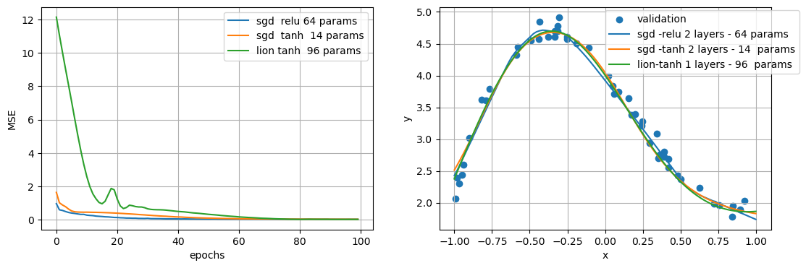
    


```python
liotcomb = combfromfile('lion/tanh/'+'combination.dat')[0]
sgdrcomb = combfromfile('sgd/relu/'+'combination.dat')[1]
sgdtcomb = combfromfile('sgd/tanh/'+'combination.dat')[1]

fig,axs=plt.subplots(1,3, figsize=(15,5))

for k, comb in enumerate([sgdrcomb,sgdtcomb, liotcomb]):
    nn=DrawNN([1]+comb.astype(int).tolist()+[1])
    nn.draw(axs[k])
    axs[k].axis('scaled')
    axs[k].axis('off')
    axs[k].set_title( '' , fontsize=15, y=1)

    
plt.text(.23, 0.87, 'sgd-relu', transform=fig.transFigure, horizontalalignment='center', fontweight='bold')
plt.text(.51, 0.87, 'sgd-tanh',  transform=fig.transFigure, horizontalalignment='center', fontweight='bold')
plt.text(.78, 0.87, 'lion-tanh', transform=fig.transFigure, horizontalalignment='center', fontweight='bold')

plt.show()
```


    

    


The network with optimizer sgd and activation tanh seem to perform well with a low number of parameters (so not computationally expensive) but it could be just a very lucky choose of initial parameters.

So i decided to reproduce some realization of the same network with a randomic initialization of the weights to see if the results were reproduced.


```python
nattemps = 100

xp = np.random.uniform(-1, 1, 100)

yp=[]
losses=[]
val_losses = []

for k in tqdm(range(nattemps)):
    mod = NN(2, [2, 2], activations=['tanh'])
    
    mod.compile(
        optimizer='sgd', loss = 'mse', metrics=['mse']
    )
    
    h = mod.fit(
        x_train, y_train,
        batch_size=32, epochs=100,
        validation_data=[x_valid, y_valid], verbose = 0
    )

    yp.append(mod.predict(xp, verbose=0))
    losses.append(h.history['loss'])
    val_losses.append(h.history['val_loss'])
```

      2%|███▌                                                                                                                                                                           | 2/100 [00:33<27:33, 16.87s/it]

    WARNING:tensorflow:5 out of the last 9 calls to <function TensorFlowTrainer.make_predict_function.<locals>.one_step_on_data_distributed at 0x7f25fc52a840> triggered tf.function retracing. Tracing is expensive and the excessive number of tracings could be due to (1) creating @tf.function repeatedly in a loop, (2) passing tensors with different shapes, (3) passing Python objects instead of tensors. For (1), please define your @tf.function outside of the loop. For (2), @tf.function has reduce_retracing=True option that can avoid unnecessary retracing. For (3), please refer to https://www.tensorflow.org/guide/function#controlling_retracing and https://www.tensorflow.org/api_docs/python/tf/function for  more details.
    WARNING:tensorflow:6 out of the last 12 calls to <function TensorFlowTrainer.make_predict_function.<locals>.one_step_on_data_distributed at 0x7f25fc52a840> triggered tf.function retracing. Tracing is expensive and the excessive number of tracings could be due to (1) creating @tf.function repeatedly in a loop, (2) passing tensors with different shapes, (3) passing Python objects instead of tensors. For (1), please define your @tf.function outside of the loop. For (2), @tf.function has reduce_retracing=True option that can avoid unnecessary retracing. For (3), please refer to https://www.tensorflow.org/guide/function#controlling_retracing and https://www.tensorflow.org/api_docs/python/tf/function for  more details.


    100%|█████████████████████████████████████████████████████████████████████████████████████████████████████████████████████████████████████████████████████████████████████████████| 100/100 [25:00<00:00, 15.00s/it]


```python


fig, ax = plt.subplots(1,2, figsize=(13, 4))
    
for k in range(nattemps):
    #ax[0].plot(losses[k], label = f'training run {k}')
    ax[0].plot(val_losses[k])#, label = f'validation run {k}')
    ax[0].legend()
    ax[0].set_xlabel('Epochs')
    ax[0].set_ylabel('MSE')
    
    
    ax[1].scatter(xp, yp[k])#, label='prediction')

ax[1].set_xlabel('x')
ax[1].set_ylabel('y')
ax[1].scatter(x_valid, y_valid, marker = '^',label='validation')
ax[0].set_title('Mean Square Error')
ax[1].plot(x_valid, y_target, label='target', color='r')

ax[1].legend()
```

    /tmp/ipykernel_7634/2430505857.py:6: UserWarning: No artists with labels found to put in legend.  Note that artists whose label start with an underscore are ignored when legend() is called with no argument.
      ax[0].legend()


    <matplotlib.legend.Legend at 0x7f25f5ccf110>


    
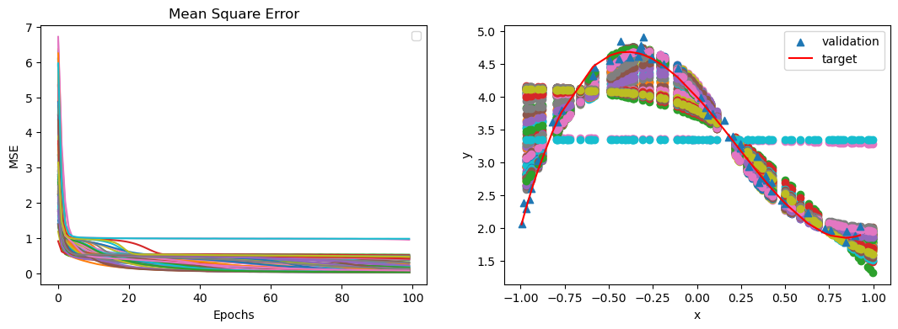
    


I plotted the final values of the validation losses in a histogram to see how they distributed.


```python
hist = plt.hist([val[-1] for val in val_losses], bins=30, density=True)
plt.title('validation loss for the 4x4 NN with \nactivation tanh optimized by sgd on 100 epochs')

plt.xlabel('validation loss')

plt.show()
```


    

    


It'seem that also these NN with a small dimension can produce a good fit, even if growing the size of the Network the prevision abilities improve.

### Loss function

I tested various architectures, with optimizer sgd and activation function relu, optimizing on 3 different loss functions:
- MSE
- MAE (mean absolute error)
- MSLE (mean squared logarithmic error)

To compare them i reported below the predictions obtained.


```python
mse = pd.read_csv('sgd/relu/predictions.dat')
mae = pd.read_csv('sgd/relu/predictionsmae.dat')
msle= pd.read_csv('sgd/relu/predictionsmsle.dat')
```


```python
fig, ax = plt.subplots(1, 3, figsize=(9, 3))
fig.suptitle('sgd -- relu')

for k in range(3):
    ax[k].set_title(f'{k+1} layer')
    
    ax[k].plot(mse [f'xpred_{k+1}layers'], mse [f'ypred_{k+1}layers'], label='mse')
    ax[k].plot(mae [f'xpred_{k+1}layers'], mae [f'ypred_{k+1}layers'], label='mae')
    ax[k].plot(msle[f'xpred_{k+1}layers'], msle[f'ypred_{k+1}layers'], label='msle')
    
    ax[k].plot(x_valid, y_target, c='r', label='target')

    ax[k].legend()
    ax[k].grid()
    ax[k].set_xlabel('x')
    ax[k].set_ylabel('y')
plt.tight_layout()
plt.show()
```


    

    


MSE and MAE seems to performa equal, while the MSLE loss function didn't produce a good estimation of the polynomial function.

### Data outside training range

I then tested the 3 best performing models showed before outside the training dataset's range. 


```python
msgdr = NN(n_layer=2, neurons=[32, 2], activations=['relu'])
msgdt = NN(n_layer=2, neurons=[2, 2], activations=['tanh'])
mliot = NN(n_layer=1, neurons=[32], activations=['tanh'])

msgdr.compile(
    optimizer='sgd',
    loss='mse', metrics=['mse'],
)


msgdt.compile(
    optimizer='sgd',
    loss='mse', metrics=['mse'],
)

mliot.compile(
    optimizer='lion',
    loss='mse', metrics=['mse'],
)
```


```python
print('\t\tsgd - relu')
hist_msr = msgdr.fit(
            x=x_train, y=y_train,
            batch_size=32, epochs=100,
            shuffle=True, validation_data=(x_valid, y_valid),
            verbose=0
)
print('\t\tsgd - tanh')
hist_mst = msgdt.fit(
            x=x_train, y=y_train,
            batch_size=32, epochs=100,
            shuffle=True, validation_data=(x_valid, y_valid),
            verbose=0
)
print('\t\tlion - tanh')
hist_mlt = mliot.fit(
            x=x_train, y=y_train,
            batch_size=32, epochs=100,
            shuffle=True, validation_data=(x_valid, y_valid),
            verbose=0
)
```

    		sgd - relu
    		sgd - tanh
    		lion - tanh


```python
plt.figure(figsize=(15,3))
plt.title('validation loss inside training range')
plt.plot(hist_msr.history['val_loss'], label='sgd-relu')
plt.plot(hist_mst.history['val_loss'], label='sgd-tanh')
plt.plot(hist_mlt.history['val_loss'], label='lion-tanh')

plt.grid()
plt.legend()

plt.show()
```


    

    


```python
x_pred = np.linspace(-2, 2, 100)

pred_msr = msgdr.predict(x_pred)
pred_mst = msgdt.predict(x_pred)
pred_mlt = mliot.predict(x_pred)


plt.figure(figsize=(10, 5))
plt.plot(x_pred, pred_msr, '-^',label = 'sgd relu')
plt.plot(x_pred, pred_mst, '-^',label = 'sgd tanh')
plt.plot(x_pred, pred_mlt, '-^',label = 'lion tanh')


plt.plot(x_pred, pol(x_pred), label='target')


plt.grid()
plt.legend()
plt.show()

```

    4/4 ━━━━━━━━━━━━━━━━━━━━ 0s 15ms/step
    4/4 ━━━━━━━━━━━━━━━━━━━━ 0s 13ms/step
    4/4 ━━━━━━━━━━━━━━━━━━━━ 0s 12ms/step


    

    


```python
print('sgd - relu')
ev_msr = msgdr.evaluate(x_pred, pol(x_pred), batch_size=32)
print('sgd - tanh')
ev_mst = msgdt.evaluate(x_pred, pol(x_pred), batch_size=32)
print('lion - tanh')
ev_mlt = mliot.evaluate(x_pred, pol(x_pred), batch_size=32)

```

    sgd - relu
    4/4 ━━━━━━━━━━━━━━━━━━━━ 0s 7ms/step - loss: 55.1478 - mse: 55.1478   
    sgd - tanh
    4/4 ━━━━━━━━━━━━━━━━━━━━ 0s 7ms/step - loss: 62.6527 - mse: 62.6527   
    lion - tanh
    4/4 ━━━━━━━━━━━━━━━━━━━━ 0s 7ms/step - loss: 37.3917 - mse: 37.3917 


All 3 models didn't perform well on the new region of data.

# Exercise 11.3

I tested different architectures varying the values of sigma.

The model that perform better were the one with an higher number of parameters.

The other tested model can be found in the appendix.


## Data generation


```python
import numpy as np
import matplotlib.pyplot as plt
import tensorflow as tf
from tensorflow.keras import Sequential
from tensorflow.keras.layers import Dense, Activation, Input
from model_def import test_arch
from drawing import DrawNN
import os
from tqdm import tqdm
import pandas as pd

```


```python
def f(x, y):
    return np.sin(x**2 + y**2)
```


```python
def gen_sinxy(nval=10000, ntrain=10000, sigma:float=0.01):
    x_valid = np.random.uniform(-3./2., 3./2., nval)
    y_valid = np.random.uniform(-3./2., 3./2., nval)
    
    x_train = np.random.uniform(-3./2., 3./2., ntrain)
    y_train = np.random.uniform(-3./2., 3./2., ntrain)
    
    
    z_target = f(x_valid, y_valid)
        
    z_valid = z_target + np.random.uniform(0, sigma, nval)
    z_train = f(x_train, y_train) + np.random.uniform(0, sigma, ntrain)

    return (x_train, y_train, z_train), (x_valid, y_valid, (z_valid, z_target))


```

## Model definition


```python
def NN2(
    n_layer:int=2,
    neurons:list=[3, 2],
    activations=['relu'],
    kernel_initializer='glorot_uniform'
):
    """
    Generate a Deep Neural network specifing the architecture:
    Parameters:
        - n_layer            [int]      : number of hidden layers
        - neurons            [list(int)]: number of neurons of the corresponding index layer
        - activations        [list(str)]: list of activation functions 
            (if less than the layers the last function will be apllied to the remaining layers)
        - kernel_initializer [str]      : Initializer for the `kernel` weights matrix.
    Return:
        model [Keras.Sequential]
    """

    if (len(neurons)!=n_layer):
        raise ValueError('ERROR: List of neurons incompatible with number of layers')
    model = tf.keras.Sequential()
    model.add(Input(shape=(2,))) #input layer

    activation_index=0
    
    for layer in range(n_layer):
        model.add(
            Dense(
                neurons[layer], 
                activations[activation_index],
                kernel_initializer=kernel_initializer # to confront architectures
            )
        )

        if activation_index+1<len(activations):
            activation_index+=1
    model.add(Dense(1, activation='linear'))

    return model
```


```python
def fitsin(neurs:list, opt:str, epochs:int=100, sigma:float = 0.):    

    (x_train, y_train, z_train), (x_valid, y_valid, (z_valid, z_target)) = gen_sinxy(sigma=sigma)
    
    Xtrain = np.column_stack((x_train, y_train))
    Xvalid = np.column_stack((x_valid, y_valid))

    mod = NN2(len(neurs), neurs)
    
    
    #mod.summary()
    
    mod.compile(optimizer=opt, loss='mse', metrics=['mse'])
    
    
    hist = mod.fit(
        x=Xtrain, y=z_train,
        batch_size=32, epochs=epochs, shuffle=True,
        validation_data=(Xvalid, z_valid), verbose = 0
    )
    

    return mod, hist
```

## Performance visualization


```python
from matplotlib.gridspec import GridSpec

def plot_mod_perf(mod, hist):
    
    x_pred = np.random.uniform(-3./2., 3./2., 10000)
    y_pred = np.random.uniform(-3./2., 3./2., 10000)

    conf = [2]+[k.output.shape[1] for k in mod.layers]
    
    fig = plt.figure(layout="constrained", figsize=(10, 5))

    title = 'NN 2' 
    for k in conf[1:]:
        title += f'x{k}' 
    
    fig.suptitle(title, x=0.3)
    gs = GridSpec(3, 3, figure=fig)
    ax1 = fig.add_subplot(gs[:, 0])
    DrawNN(conf).draw(ax1)
    
    # identical to ax1 = plt.subplot(gs.new_subplotspec((0, 0), colspan=3))
    ax2 = fig.add_subplot(gs[0, 1:])
    ax2.set_title('MSE')
    ax2.plot(hist.history['loss'], label='training')
    ax2.plot(hist.history['val_loss'], label='validation')
    ax2.grid()
    ax2.set_xlabel('epochs')
    ax2.set_ylabel('loss')
    ax2.legend()
    
    ax3 = fig.add_subplot(gs[1:, 1], box_aspect=1)
    hx3 = ax3.hexbin(x_valid, y_valid, C=z_valid, vmin=-1.0, vmax=1.0, gridsize=50)
    #plt.colorbar(hx, ax=ax3)
    ax3.set_title('validation', y=1)
    
    ax4 = fig.add_subplot(gs[1:, 2], box_aspect=1)
    hx4 = ax4.hexbin(
        x_pred, y_pred, 
        C=mod.predict(np.column_stack((x_pred, y_pred)), verbose=0), 
        vmin=-1.0, vmax=1.0, gridsize=50)
    plt.colorbar(hx4, ax=ax4)
    ax4.set_title('predictions')
    
    
    plt.show()

```

### values for sigma 0.01


```python
(x_train, y_train, z_train), (x_valid, y_valid, (z_valid, z_target)) = gen_sinxy()
```


```python
X, Y = np.meshgrid(np.linspace(-3./2., 3./2., 1000), np.linspace(-3./2., 3./2., 1000))

fig, ax = plt.subplots(1, 2,subplot_kw={"projection": "3d"}, figsize=(8, 3))
ax[0].plot_surface(X, Y, f(X, Y))

ax[1].scatter(x_train, y_train, z_train,  alpha= 0.3, c='C3', label = 'validation')
ax[1].scatter(x_valid, y_valid, z_valid,  alpha= 1.0, c='C2', label = 'validation')
ax[1].scatter(x_valid, y_valid, z_target, alpha= 1.0, c='C4', label = 'target')
ax[1].legend()
plt.tight_layout()
plt.show()
```


    

    


```python
Xtrain = np.column_stack((x_train, y_train))
Xvalid = np.column_stack((x_valid, y_valid))
```


```python
mod16x16, hist16x16 =fitsin([16,16], 'sgd')
plot_mod_perf(mod16x16, hist16x16)
```


    
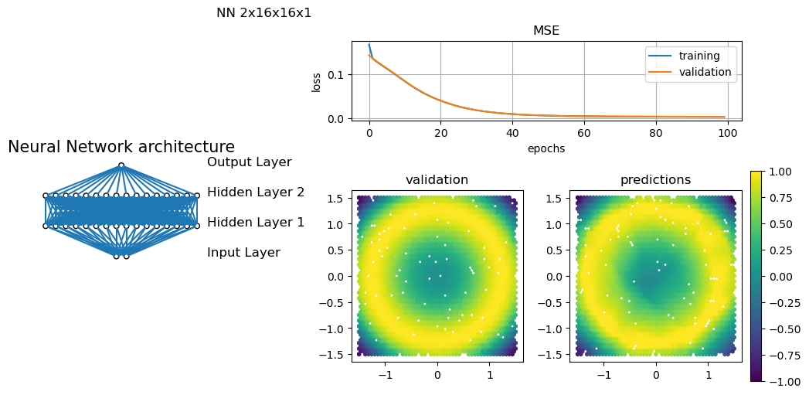
    


### values for sigma = 0.1


```python
(x_train, y_train, z_train), (x_valid, y_valid, (z_valid, z_target)) = gen_sinxy(sigma=0.1)
```


```python
X, Y = np.meshgrid(np.linspace(-3./2., 3./2., 1000), np.linspace(-3./2., 3./2., 1000))

fig, ax = plt.subplots(1, 2,subplot_kw={"projection": "3d"}, figsize=(8, 3))
ax[0].plot_surface(X, Y, f(X, Y))

ax[1].scatter(x_train, y_train, z_train,  alpha= 0.3, c='C3', label = 'validation')
ax[1].scatter(x_valid, y_valid, z_valid,  alpha= 1.0, c='C2', label = 'validation')
ax[1].scatter(x_valid, y_valid, z_target, alpha= 1.0, c='C4', label = 'target')
ax[1].legend()
plt.tight_layout()
plt.show()
```


    
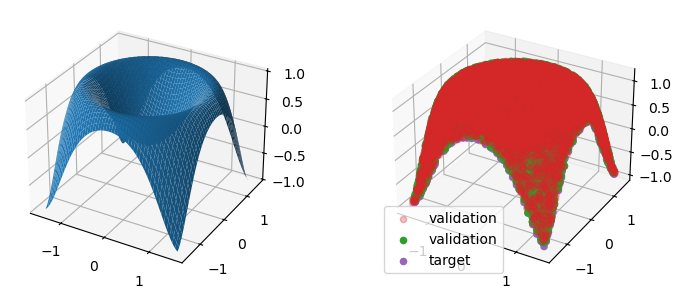
    


```python
Xtrain = np.column_stack((x_train, y_train))
Xvalid = np.column_stack((x_valid, y_valid))
```


```python
mod16x16_s01, hist16x16_s01 =fitsin([16,16], 'sgd')
plot_mod_perf(mod16x16_s01, hist16x16_s01)

```


    
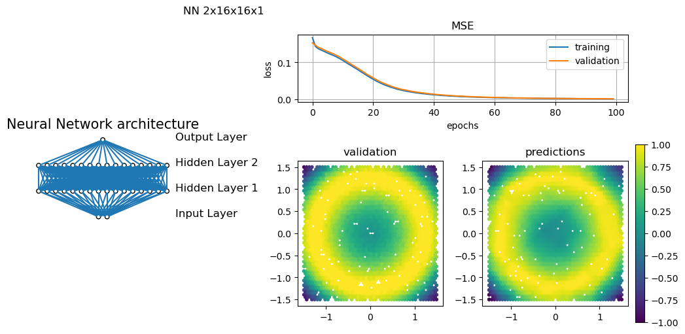
    


### values for sigma = 0.5


```python
(x_train, y_train, z_train), (x_valid, y_valid, (z_valid, z_target)) = gen_sinxy(sigma=0.5)
```


```python
X, Y = np.meshgrid(np.linspace(-3./2., 3./2., 1000), np.linspace(-3./2., 3./2., 1000))

fig, ax = plt.subplots(1, 2,subplot_kw={"projection": "3d"}, figsize=(8, 3))
ax[0].plot_surface(X, Y, f(X, Y))

ax[1].scatter(x_train, y_train, z_train,  alpha= 0.3, c='C3', label = 'training')
ax[1].scatter(x_valid, y_valid, z_valid,  alpha= 1.0, c='C2', label = 'validation')
ax[1].scatter(x_valid, y_valid, z_target, alpha= 1.0, c='C4', label = 'target')
ax[1].legend()
plt.tight_layout()
plt.show()
```


    
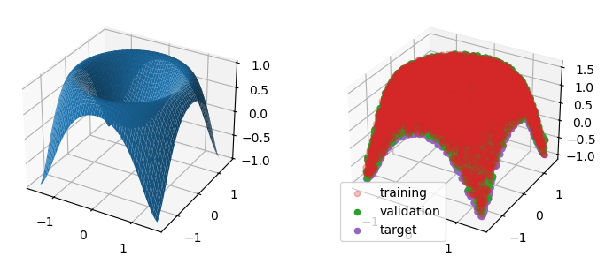
    


```python
Xtrain = np.column_stack((x_train, y_train))
Xvalid = np.column_stack((x_valid, y_valid))
```


```python
mod16x16_s05, hist16x16_s05 =fitsin([16,16], 'sgd')
plot_mod_perf(mod16x16_s05, hist16x16_s05)
```


    

    


### values for sigma = 1


```python
(x_train, y_train, z_train), (x_valid, y_valid, (z_valid, z_target)) = gen_sinxy(sigma=1)
```


```python
X, Y = np.meshgrid(np.linspace(-3./2., 3./2., 1000), np.linspace(-3./2., 3./2., 1000))

fig, ax = plt.subplots(1, 2,subplot_kw={"projection": "3d"}, figsize=(8, 3))
ax[0].plot_surface(X, Y, f(X, Y))

ax[1].scatter(x_train, y_train, z_train,  alpha= 0.3, c='C3', label = 'validation')
ax[1].scatter(x_valid, y_valid, z_valid,  alpha= 1.0, c='C2', label = 'validation')
ax[1].scatter(x_valid, y_valid, z_target, alpha= 1.0, c='C4', label = 'target')
ax[1].legend()
plt.tight_layout()
plt.show()
```


    

    


```python
Xtrain = np.column_stack((x_train, y_train))
Xvalid = np.column_stack((x_valid, y_valid))
```


```python
mod16x16_s1, hist16x16_s1 =fitsin([16,16], 'sgd')
plot_mod_perf(mod16x16_s1, hist16x16_s1)

```


    
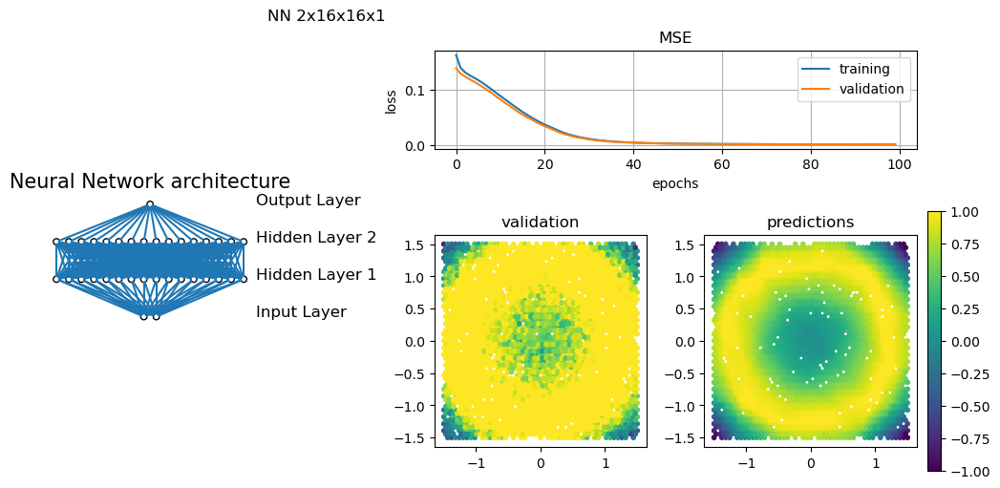
    


## Appendix

### Sigma 0.001


```python
(x_train, y_train, z_train), (x_valid, y_valid, (z_valid, z_target)) = gen_sinxy(sigma=0.001)
Xtrain = np.column_stack((x_train, y_train))
Xvalid = np.column_stack((x_valid, y_valid))

mod2x4, hist2x4 = fitsin([2,4], 'sgd')
mod4x2, hist4x2 = fitsin([4, 2], 'sgd')
mod4x4, hist4x4 = fitsin([4, 4], 'sgd')
mod4x8, hist4x8 = fitsin([4, 8], 'sgd')
mod8x4, hist8x4 = fitsin([8, 4], 'sgd')
mod8x8, hist8x8 = fitsin([8, 8], 'sgd')
mod8x16, hist8x16 = fitsin([8, 16], 'sgd')
mod16x8, hist16x8 = fitsin([16, 8], 'sgd')
```


<pre style="white-space:pre;overflow-x:auto;line-height:normal;font-family:Menlo,'DejaVu Sans Mono',consolas,'Courier New',monospace"><span style="font-weight: bold">Model: "sequential"</span>
</pre>


<pre style="white-space:pre;overflow-x:auto;line-height:normal;font-family:Menlo,'DejaVu Sans Mono',consolas,'Courier New',monospace">┏━━━━━━━━━━━━━━━━━━━━━━━━━━━━━━━━━┳━━━━━━━━━━━━━━━━━━━━━━━━┳━━━━━━━━━━━━━━━┓
┃<span style="font-weight: bold"> Layer (type)                    </span>┃<span style="font-weight: bold"> Output Shape           </span>┃<span style="font-weight: bold">       Param # </span>┃
┡━━━━━━━━━━━━━━━━━━━━━━━━━━━━━━━━━╇━━━━━━━━━━━━━━━━━━━━━━━━╇━━━━━━━━━━━━━━━┩
│ dense (<span style="color: #0087ff; text-decoration-color: #0087ff">Dense</span>)                   │ (<span style="color: #00d7ff; text-decoration-color: #00d7ff">None</span>, <span style="color: #00af00; text-decoration-color: #00af00">2</span>)              │             <span style="color: #00af00; text-decoration-color: #00af00">6</span> │
├─────────────────────────────────┼────────────────────────┼───────────────┤
│ dense_1 (<span style="color: #0087ff; text-decoration-color: #0087ff">Dense</span>)                 │ (<span style="color: #00d7ff; text-decoration-color: #00d7ff">None</span>, <span style="color: #00af00; text-decoration-color: #00af00">4</span>)              │            <span style="color: #00af00; text-decoration-color: #00af00">12</span> │
├─────────────────────────────────┼────────────────────────┼───────────────┤
│ dense_2 (<span style="color: #0087ff; text-decoration-color: #0087ff">Dense</span>)                 │ (<span style="color: #00d7ff; text-decoration-color: #00d7ff">None</span>, <span style="color: #00af00; text-decoration-color: #00af00">1</span>)              │             <span style="color: #00af00; text-decoration-color: #00af00">5</span> │
└─────────────────────────────────┴────────────────────────┴───────────────┘
</pre>


<pre style="white-space:pre;overflow-x:auto;line-height:normal;font-family:Menlo,'DejaVu Sans Mono',consolas,'Courier New',monospace"><span style="font-weight: bold"> Total params: </span><span style="color: #00af00; text-decoration-color: #00af00">23</span> (92.00 B)
</pre>


<pre style="white-space:pre;overflow-x:auto;line-height:normal;font-family:Menlo,'DejaVu Sans Mono',consolas,'Courier New',monospace"><span style="font-weight: bold"> Trainable params: </span><span style="color: #00af00; text-decoration-color: #00af00">23</span> (92.00 B)
</pre>


<pre style="white-space:pre;overflow-x:auto;line-height:normal;font-family:Menlo,'DejaVu Sans Mono',consolas,'Courier New',monospace"><span style="font-weight: bold"> Non-trainable params: </span><span style="color: #00af00; text-decoration-color: #00af00">0</span> (0.00 B)
</pre>


```python
plot_mod_perf(mod2x4,   hist2x4) 
plot_mod_perf(mod4x2,   hist4x2) 
plot_mod_perf(mod4x4,   hist4x4) 
plot_mod_perf(mod4x8,   hist4x8) 
plot_mod_perf(mod8x4,   hist8x4)
plot_mod_perf(mod8x8,   hist8x8) 
plot_mod_perf(mod8x16,  hist8x16) 
plot_mod_perf(mod16x8,  hist8x16)
plot_mod_perf(mod16x16, hist16x16)
```


    
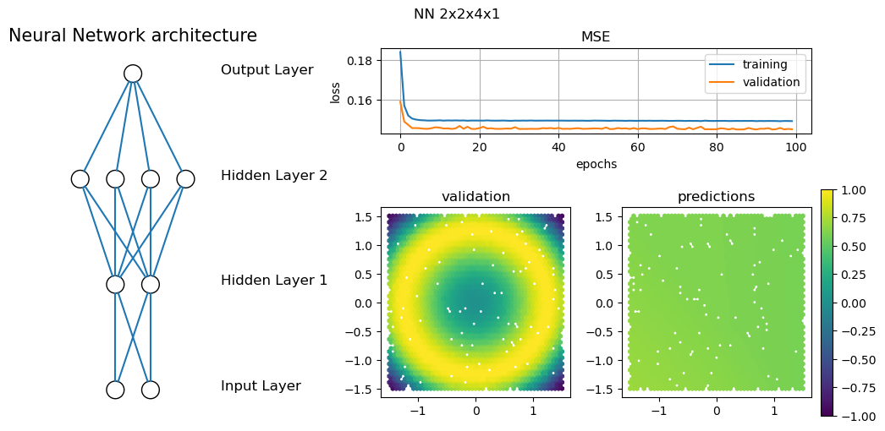
    


    

    


    

    


    
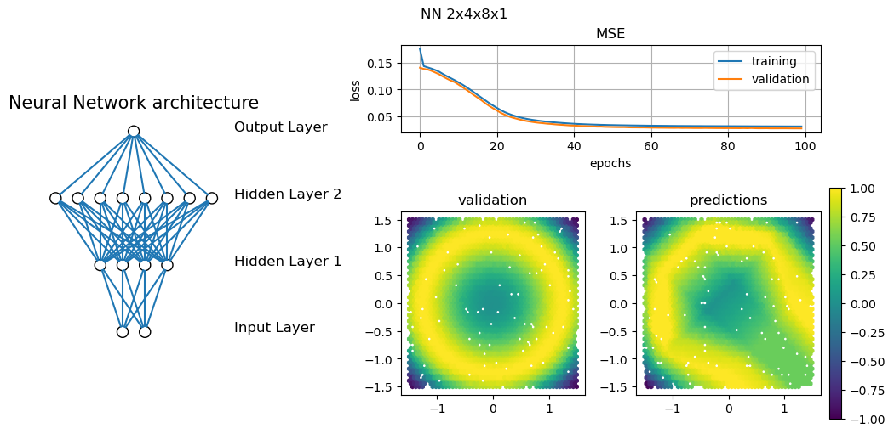
    


    

    


    

    


    

    


    

    


    

    


### sigma 0.1


```python
(x_train, y_train, z_train), (x_valid, y_valid, (z_valid, z_target)) = gen_sinxy(sigma=0.1)
Xtrain = np.column_stack((x_train, y_train))
Xvalid = np.column_stack((x_valid, y_valid))

mod2x4_s01, hist2x4_s01 = fitsin([2,4], 'sgd')
mod4x2_s01, hist4x2_s01 = fitsin([4, 2], 'sgd')
mod4x4_s01, hist4x4_s01 = fitsin([4, 4], 'sgd')
mod4x8_s01, hist4x8_s01 = fitsin([4, 8], 'sgd')
mod8x4_s01, hist8x4_s01 = fitsin([8, 4], 'sgd')
mod8x8_s01, hist8x8_s01 = fitsin([8, 8], 'sgd')
mod8x16_s01, hist8x16_s01 = fitsin([8, 16], 'sgd')
mod16x8_s01, hist16x8_s01 = fitsin([16, 8], 'sgd')
mod16x16_s01, hist16x16_s01 =fitsin([16,16], 'sgd')
```


<pre style="white-space:pre;overflow-x:auto;line-height:normal;font-family:Menlo,'DejaVu Sans Mono',consolas,'Courier New',monospace"><span style="font-weight: bold">Model: "sequential_10"</span>
</pre>


<pre style="white-space:pre;overflow-x:auto;line-height:normal;font-family:Menlo,'DejaVu Sans Mono',consolas,'Courier New',monospace">┏━━━━━━━━━━━━━━━━━━━━━━━━━━━━━━━━━┳━━━━━━━━━━━━━━━━━━━━━━━━┳━━━━━━━━━━━━━━━┓
┃<span style="font-weight: bold"> Layer (type)                    </span>┃<span style="font-weight: bold"> Output Shape           </span>┃<span style="font-weight: bold">       Param # </span>┃
┡━━━━━━━━━━━━━━━━━━━━━━━━━━━━━━━━━╇━━━━━━━━━━━━━━━━━━━━━━━━╇━━━━━━━━━━━━━━━┩
│ dense_30 (<span style="color: #0087ff; text-decoration-color: #0087ff">Dense</span>)                │ (<span style="color: #00d7ff; text-decoration-color: #00d7ff">None</span>, <span style="color: #00af00; text-decoration-color: #00af00">4</span>)              │            <span style="color: #00af00; text-decoration-color: #00af00">12</span> │
├─────────────────────────────────┼────────────────────────┼───────────────┤
│ dense_31 (<span style="color: #0087ff; text-decoration-color: #0087ff">Dense</span>)                │ (<span style="color: #00d7ff; text-decoration-color: #00d7ff">None</span>, <span style="color: #00af00; text-decoration-color: #00af00">2</span>)              │            <span style="color: #00af00; text-decoration-color: #00af00">10</span> │
├─────────────────────────────────┼────────────────────────┼───────────────┤
│ dense_32 (<span style="color: #0087ff; text-decoration-color: #0087ff">Dense</span>)                │ (<span style="color: #00d7ff; text-decoration-color: #00d7ff">None</span>, <span style="color: #00af00; text-decoration-color: #00af00">1</span>)              │             <span style="color: #00af00; text-decoration-color: #00af00">3</span> │
└─────────────────────────────────┴────────────────────────┴───────────────┘
</pre>


<pre style="white-space:pre;overflow-x:auto;line-height:normal;font-family:Menlo,'DejaVu Sans Mono',consolas,'Courier New',monospace"><span style="font-weight: bold"> Total params: </span><span style="color: #00af00; text-decoration-color: #00af00">25</span> (100.00 B)
</pre>


<pre style="white-space:pre;overflow-x:auto;line-height:normal;font-family:Menlo,'DejaVu Sans Mono',consolas,'Courier New',monospace"><span style="font-weight: bold"> Trainable params: </span><span style="color: #00af00; text-decoration-color: #00af00">25</span> (100.00 B)
</pre>


<pre style="white-space:pre;overflow-x:auto;line-height:normal;font-family:Menlo,'DejaVu Sans Mono',consolas,'Courier New',monospace"><span style="font-weight: bold"> Non-trainable params: </span><span style="color: #00af00; text-decoration-color: #00af00">0</span> (0.00 B)
</pre>


```python
plot_mod_perf(mod2x4_s01,   hist2x4_s01) 
plot_mod_perf(mod4x2_s01,   hist4x2_s01) 
plot_mod_perf(mod4x4_s01,   hist4x4_s01) 
plot_mod_perf(mod4x8_s01,   hist4x8_s01) 
plot_mod_perf(mod8x4_s01,   hist8x4_s01)
plot_mod_perf(mod8x8_s01,   hist8x8_s01) 
plot_mod_perf(mod8x16_s01,  hist8x16_s01) 
plot_mod_perf(mod16x8_s01,  hist8x16_s01)
plot_mod_perf(mod16x16_s01, hist16x16_s01)
```


    
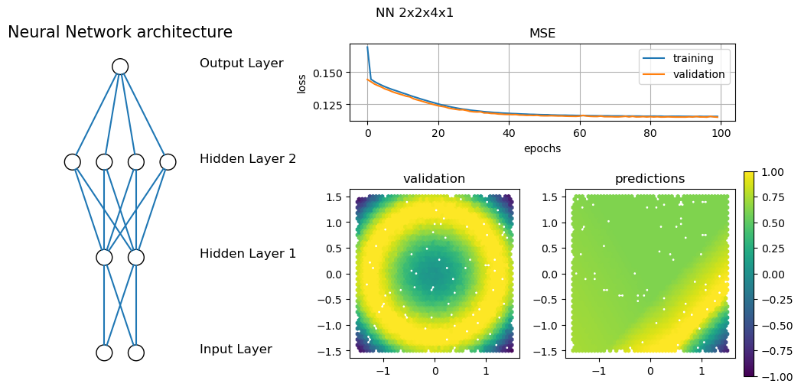
    


    
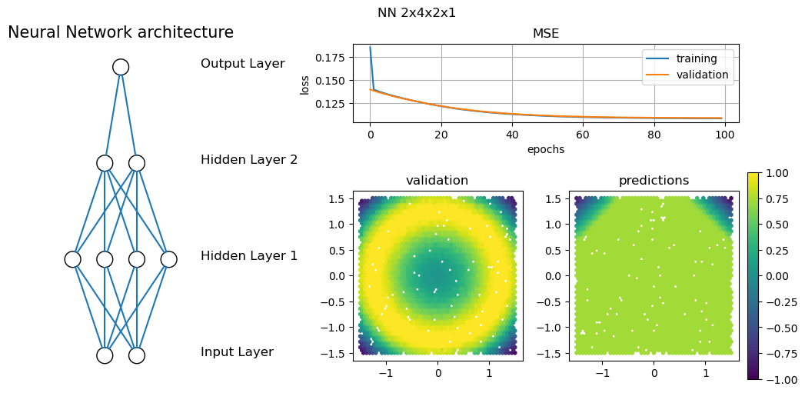
    


    
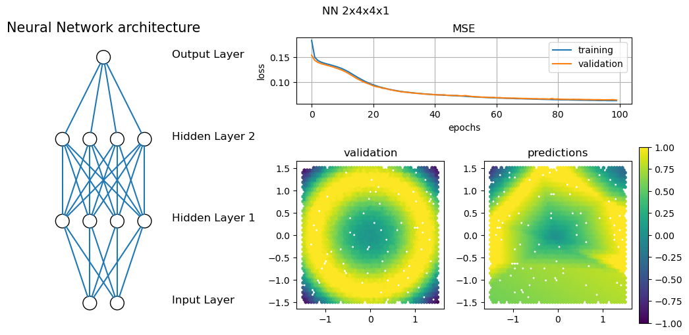
    


    

    


    
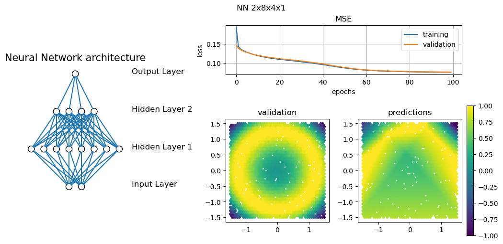
    


    
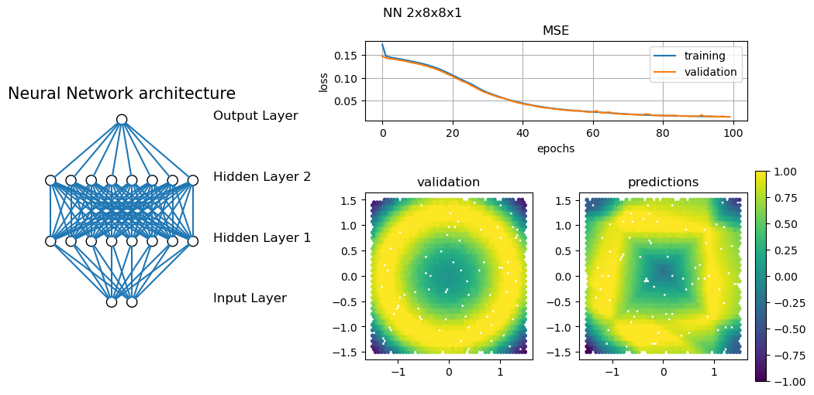
    


    

    


    

    


    
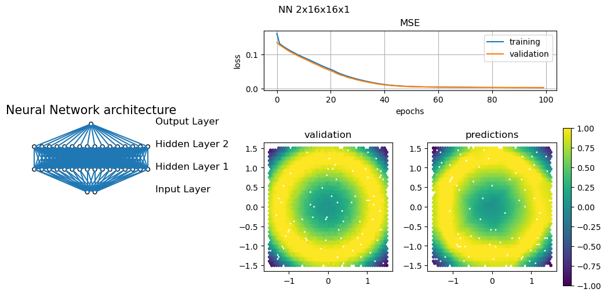
    


### sigma 0.5


```python
(x_train, y_train, z_train), (x_valid, y_valid, (z_valid, z_target)) = gen_sinxy(sigma=0.5)
Xtrain = np.column_stack((x_train, y_train))
Xvalid = np.column_stack((x_valid, y_valid))

mod2x4_s05, hist2x4_s05 = fitsin([2,4], 'sgd')
mod4x2_s05, hist4x2_s05 = fitsin([4, 2], 'sgd')
mod4x4_s05, hist4x4_s05 = fitsin([4, 4], 'sgd')
mod4x8_s05, hist4x8_s05 = fitsin([4, 8], 'sgd')
mod8x4_s05, hist8x4_s05 = fitsin([8, 4], 'sgd')
mod8x8_s05, hist8x8_s05 = fitsin([8, 8], 'sgd')
mod8x16_s05, hist8x16_s05 = fitsin([8, 16], 'sgd')
mod16x8_s05, hist16x8_s05 = fitsin([16, 8], 'sgd')
mod16x16_s05, hist16x16_s05 =fitsin([16,16], 'sgd')


```


<pre style="white-space:pre;overflow-x:auto;line-height:normal;font-family:Menlo,'DejaVu Sans Mono',consolas,'Courier New',monospace"><span style="font-weight: bold">Model: "sequential_18"</span>
</pre>


<pre style="white-space:pre;overflow-x:auto;line-height:normal;font-family:Menlo,'DejaVu Sans Mono',consolas,'Courier New',monospace">┏━━━━━━━━━━━━━━━━━━━━━━━━━━━━━━━━━┳━━━━━━━━━━━━━━━━━━━━━━━━┳━━━━━━━━━━━━━━━┓
┃<span style="font-weight: bold"> Layer (type)                    </span>┃<span style="font-weight: bold"> Output Shape           </span>┃<span style="font-weight: bold">       Param # </span>┃
┡━━━━━━━━━━━━━━━━━━━━━━━━━━━━━━━━━╇━━━━━━━━━━━━━━━━━━━━━━━━╇━━━━━━━━━━━━━━━┩
│ dense_54 (<span style="color: #0087ff; text-decoration-color: #0087ff">Dense</span>)                │ (<span style="color: #00d7ff; text-decoration-color: #00d7ff">None</span>, <span style="color: #00af00; text-decoration-color: #00af00">2</span>)              │             <span style="color: #00af00; text-decoration-color: #00af00">6</span> │
├─────────────────────────────────┼────────────────────────┼───────────────┤
│ dense_55 (<span style="color: #0087ff; text-decoration-color: #0087ff">Dense</span>)                │ (<span style="color: #00d7ff; text-decoration-color: #00d7ff">None</span>, <span style="color: #00af00; text-decoration-color: #00af00">4</span>)              │            <span style="color: #00af00; text-decoration-color: #00af00">12</span> │
├─────────────────────────────────┼────────────────────────┼───────────────┤
│ dense_56 (<span style="color: #0087ff; text-decoration-color: #0087ff">Dense</span>)                │ (<span style="color: #00d7ff; text-decoration-color: #00d7ff">None</span>, <span style="color: #00af00; text-decoration-color: #00af00">1</span>)              │             <span style="color: #00af00; text-decoration-color: #00af00">5</span> │
└─────────────────────────────────┴────────────────────────┴───────────────┘
</pre>


<pre style="white-space:pre;overflow-x:auto;line-height:normal;font-family:Menlo,'DejaVu Sans Mono',consolas,'Courier New',monospace"><span style="font-weight: bold"> Total params: </span><span style="color: #00af00; text-decoration-color: #00af00">23</span> (92.00 B)
</pre>


<pre style="white-space:pre;overflow-x:auto;line-height:normal;font-family:Menlo,'DejaVu Sans Mono',consolas,'Courier New',monospace"><span style="font-weight: bold"> Trainable params: </span><span style="color: #00af00; text-decoration-color: #00af00">23</span> (92.00 B)
</pre>


<pre style="white-space:pre;overflow-x:auto;line-height:normal;font-family:Menlo,'DejaVu Sans Mono',consolas,'Courier New',monospace"><span style="font-weight: bold"> Non-trainable params: </span><span style="color: #00af00; text-decoration-color: #00af00">0</span> (0.00 B)
</pre>


```python
plot_mod_perf(mod2x4_s05,   hist2x4_s05) 
plot_mod_perf(mod4x2_s05,   hist4x2_s05) 
plot_mod_perf(mod4x4_s05,   hist4x4_s05) 
plot_mod_perf(mod4x8_s05,   hist4x8_s05) 
plot_mod_perf(mod8x4_s05,   hist8x4_s05)
plot_mod_perf(mod8x8_s05,   hist8x8_s05) 
plot_mod_perf(mod8x16_s05,  hist8x16_s05) 
plot_mod_perf(mod16x8_s05,  hist8x16_s05)
plot_mod_perf(mod16x16_s05, hist16x16_s05)
```


    

    


    
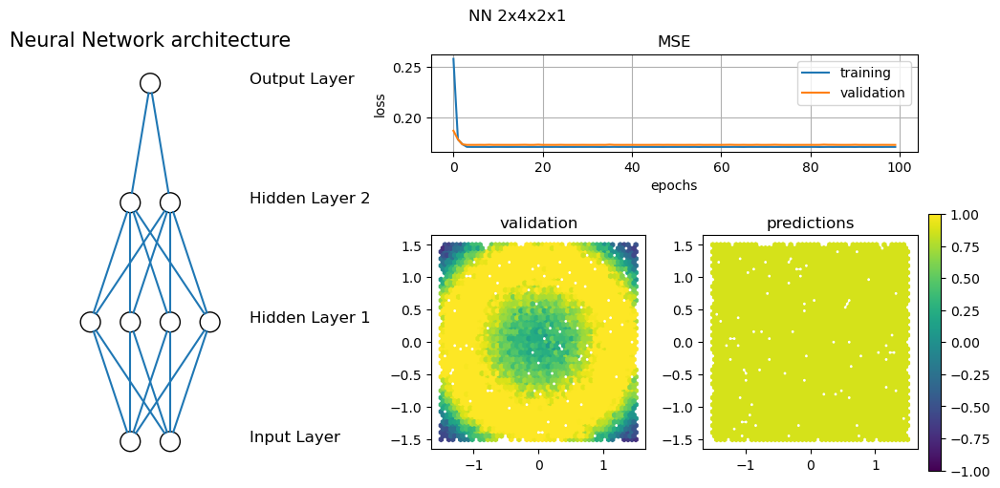
    


    
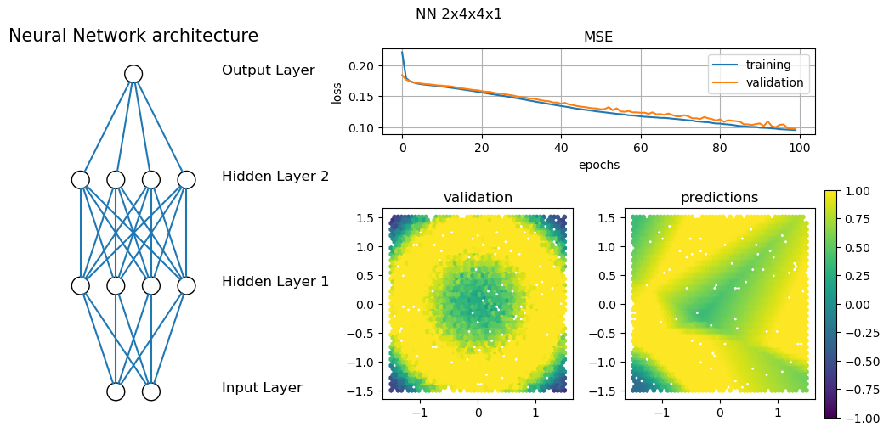
    


    
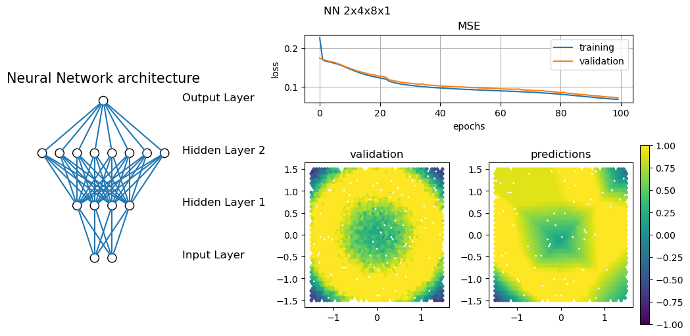
    


    
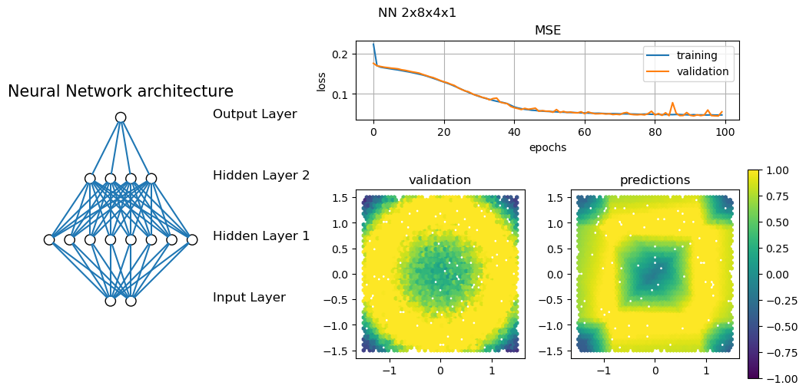
    


    
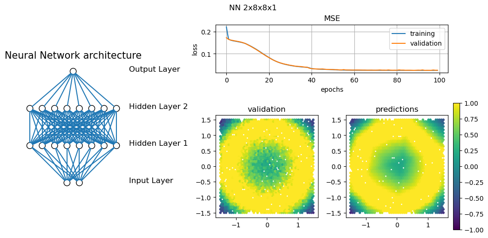
    


    
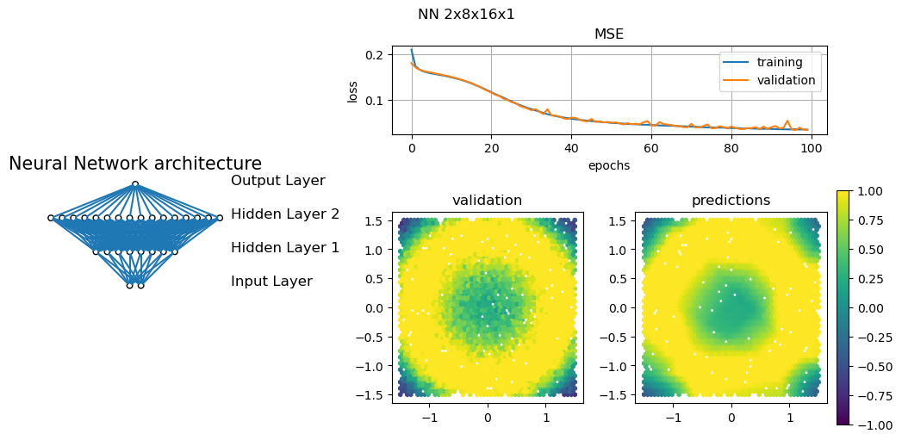
    


    

    


    

    


```python

```

### Sigma 1


```python
(x_train, y_train, z_train), (x_valid, y_valid, (z_valid, z_target)) = gen_sinxy(sigma=1)
Xtrain = np.column_stack((x_train, y_train))
Xvalid = np.column_stack((x_valid, y_valid))

mod2x4_s1, hist2x4_s1 = fitsin([2,4], 'sgd')
mod4x2_s1, hist4x2_s1 = fitsin([4, 2], 'sgd')
mod4x4_s1, hist4x4_s1 = fitsin([4, 4], 'sgd')
mod4x8_s1, hist4x8_s1 = fitsin([4, 8], 'sgd')
mod8x4_s1, hist8x4_s1 = fitsin([8, 4], 'sgd')
mod8x8_s1, hist8x8_s1 = fitsin([8, 8], 'sgd')
mod8x16_s1, hist8x16_s1 = fitsin([8, 16], 'sgd')
mod16x8_s1, hist16x8_s1 = fitsin([16, 8], 'sgd')
mod16x16_s1, hist16x16_s1 =fitsin([16,16], 'sgd')
```


<pre style="white-space:pre;overflow-x:auto;line-height:normal;font-family:Menlo,'DejaVu Sans Mono',consolas,'Courier New',monospace"><span style="font-weight: bold">Model: "sequential_27"</span>
</pre>


<pre style="white-space:pre;overflow-x:auto;line-height:normal;font-family:Menlo,'DejaVu Sans Mono',consolas,'Courier New',monospace">┏━━━━━━━━━━━━━━━━━━━━━━━━━━━━━━━━━┳━━━━━━━━━━━━━━━━━━━━━━━━┳━━━━━━━━━━━━━━━┓
┃<span style="font-weight: bold"> Layer (type)                    </span>┃<span style="font-weight: bold"> Output Shape           </span>┃<span style="font-weight: bold">       Param # </span>┃
┡━━━━━━━━━━━━━━━━━━━━━━━━━━━━━━━━━╇━━━━━━━━━━━━━━━━━━━━━━━━╇━━━━━━━━━━━━━━━┩
│ dense_81 (<span style="color: #0087ff; text-decoration-color: #0087ff">Dense</span>)                │ (<span style="color: #00d7ff; text-decoration-color: #00d7ff">None</span>, <span style="color: #00af00; text-decoration-color: #00af00">2</span>)              │             <span style="color: #00af00; text-decoration-color: #00af00">6</span> │
├─────────────────────────────────┼────────────────────────┼───────────────┤
│ dense_82 (<span style="color: #0087ff; text-decoration-color: #0087ff">Dense</span>)                │ (<span style="color: #00d7ff; text-decoration-color: #00d7ff">None</span>, <span style="color: #00af00; text-decoration-color: #00af00">4</span>)              │            <span style="color: #00af00; text-decoration-color: #00af00">12</span> │
├─────────────────────────────────┼────────────────────────┼───────────────┤
│ dense_83 (<span style="color: #0087ff; text-decoration-color: #0087ff">Dense</span>)                │ (<span style="color: #00d7ff; text-decoration-color: #00d7ff">None</span>, <span style="color: #00af00; text-decoration-color: #00af00">1</span>)              │             <span style="color: #00af00; text-decoration-color: #00af00">5</span> │
└─────────────────────────────────┴────────────────────────┴───────────────┘
</pre>


<pre style="white-space:pre;overflow-x:auto;line-height:normal;font-family:Menlo,'DejaVu Sans Mono',consolas,'Courier New',monospace"><span style="font-weight: bold"> Total params: </span><span style="color: #00af00; text-decoration-color: #00af00">23</span> (92.00 B)
</pre>


<pre style="white-space:pre;overflow-x:auto;line-height:normal;font-family:Menlo,'DejaVu Sans Mono',consolas,'Courier New',monospace"><span style="font-weight: bold"> Trainable params: </span><span style="color: #00af00; text-decoration-color: #00af00">23</span> (92.00 B)
</pre>


<pre style="white-space:pre;overflow-x:auto;line-height:normal;font-family:Menlo,'DejaVu Sans Mono',consolas,'Courier New',monospace"><span style="font-weight: bold"> Non-trainable params: </span><span style="color: #00af00; text-decoration-color: #00af00">0</span> (0.00 B)
</pre>


```python
plot_mod_perf(mod2x4_s1,   hist2x4_s1) 
plot_mod_perf(mod4x2_s1,   hist4x2_s1) 
plot_mod_perf(mod4x4_s1,   hist4x4_s1) 
plot_mod_perf(mod4x8_s1,   hist4x8_s1) 
plot_mod_perf(mod8x4_s1,   hist8x4_s1)
plot_mod_perf(mod8x8_s1,   hist8x8_s1) 
plot_mod_perf(mod8x16_s1,  hist8x16_s1) 
plot_mod_perf(mod16x8_s1,  hist8x16_s1)
plot_mod_perf(mod16x16_s1, hist16x16_s1)
```


    

    


    
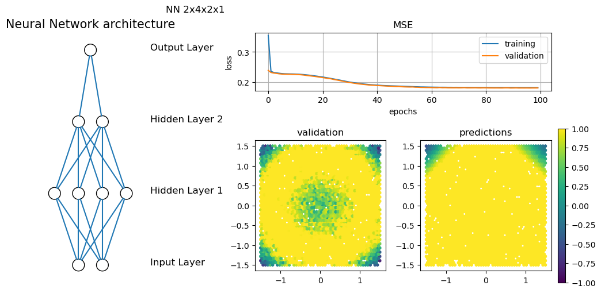
    


    

    


    

    


    
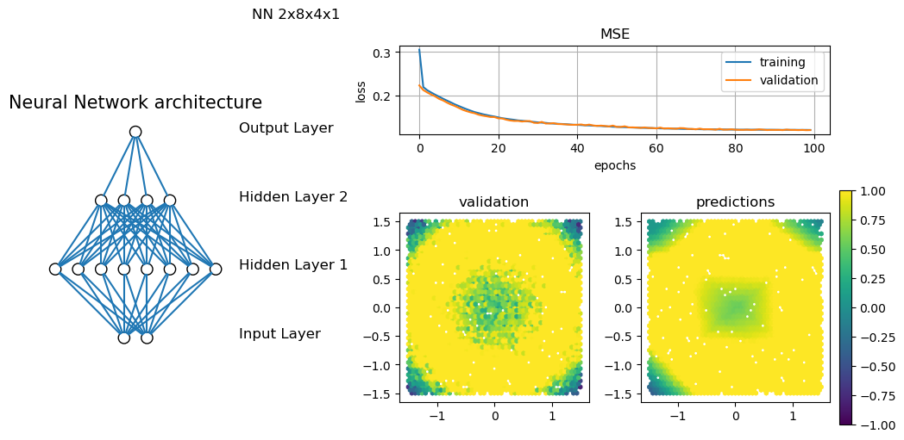
    


    
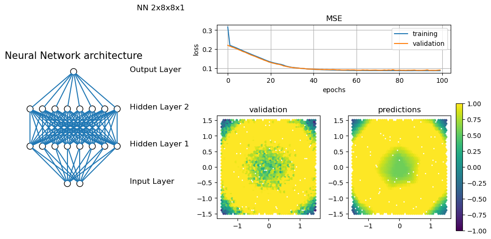
    


    

    


    

    


    

    


### Arch testing

Example of code to test different architectures:
```python
archs = {
    '2x4':{},'4x2':{},'4x4':{},'4x8':{},
    '8x4':{},'8x8':{}, '8x16':{}, 
    '16x8':{}, '16x16':{}
}

for key in archs:
    comb = np.array(key.split('x'), dtype=int)
    archs[key] = {
        0.0: {},
        0.1: {},
        0.5: {},
        1.0: {}
    }
    print('training at different sigma the configuration '+key)
    for sigma in tqdm([0.0, 0.1, 0.5, 1.0]):
        mod, hist = fitsin(neurs=comb.tolist(), opt='sgd', sigma=sigma)

        archs[key][sigma] = {'mod':mod, 'hist': hist}
```


```python

archs = {
    '2x4':{},'4x2':{},'4x4':{},'4x8':{},
    '8x4':{},'8x8':{}, '8x16':{}, 
    '16x8':{}, '16x16':{}
}

for key in archs:
    comb = np.array(key.split('x'), dtype=int)
    archs[key] = {
        0.0: {},
        0.1: {},
        0.5: {},
        1.0: {}
    }
    print('training at different sigma the configuration '+key)
    for sigma in tqdm([0.0, 0.1, 0.5, 1.0]):
        mod, hist = fitsin(neurs=comb.tolist(), opt='sgd', sigma=sigma)

        archs[key][sigma] = {'mod':mod, 'hist': hist}
```

    training at different sigma the configuration 2x4


    100%|█████████████████████████████████████████████████████████████████████████████████████████████████████████████████████████████████████████████████████████████████████████████████| 4/4 [03:27<00:00, 51.93s/it]


    training at different sigma the configuration 4x2


    100%|█████████████████████████████████████████████████████████████████████████████████████████████████████████████████████████████████████████████████████████████████████████████████| 4/4 [03:27<00:00, 51.80s/it]


    training at different sigma the configuration 4x4


    100%|█████████████████████████████████████████████████████████████████████████████████████████████████████████████████████████████████████████████████████████████████████████████████| 4/4 [03:29<00:00, 52.47s/it]


    training at different sigma the configuration 4x8


    100%|█████████████████████████████████████████████████████████████████████████████████████████████████████████████████████████████████████████████████████████████████████████████████| 4/4 [03:25<00:00, 51.30s/it]


    training at different sigma the configuration 8x4


    100%|█████████████████████████████████████████████████████████████████████████████████████████████████████████████████████████████████████████████████████████████████████████████████| 4/4 [03:17<00:00, 49.48s/it]


    training at different sigma the configuration 8x8


    100%|█████████████████████████████████████████████████████████████████████████████████████████████████████████████████████████████████████████████████████████████████████████████████| 4/4 [03:16<00:00, 49.04s/it]


    training at different sigma the configuration 8x16


    100%|█████████████████████████████████████████████████████████████████████████████████████████████████████████████████████████████████████████████████████████████████████████████████| 4/4 [03:19<00:00, 49.92s/it]


    training at different sigma the configuration 16x8


    100%|█████████████████████████████████████████████████████████████████████████████████████████████████████████████████████████████████████████████████████████████████████████████████| 4/4 [04:01<00:00, 60.48s/it]


    training at different sigma the configuration 16x16


    100%|█████████████████████████████████████████████████████████████████████████████████████████████████████████████████████████████████████████████████████████████████████████████████| 4/4 [03:54<00:00, 58.69s/it]


```python

from matplotlib.gridspec import GridSpec

def plotperf(archs):
    
    fig = plt.figure(layout="constrained", figsize=(10, 40))
    #figs = fig.subfigures(len(archs), 2)
    gs = GridSpec(3*len(archs), 3, figure=fig)
    counter=0
    for key, el in archs.items():
        sigmas = el.keys()

        
    
        title = 'NN 2' 
        
        #figs[counter].suptitle(title, x=0.3)
        ax1 = fig.add_subplot(gs[3*counter:3*(counter+1), 0])
        DrawNN([2]+np.array(key.split('x'), dtype=int).tolist()+[1]).draw(ax1)
        ax1.set_title('NN 2x'+key+'x1')
        ax2 = fig.add_subplot(gs[3*counter, 1:])
        ax2.set_title('MSE')

        #ax3 = fig.add_subplot(gs[1:, 1], box_aspect=1)
        #ax3.set_title('validation', y=1)
        
        ax4 = [fig.add_subplot(gs[3*counter+k//2+1, k%2+1], box_aspect=1) for k, sigma in enumerate(sigmas)]
        [ax4[k].set_title(r'$\sigma  = $'+f'{s}') for k,s  in enumerate(sigmas)]
        

        x_pred = np.random.uniform(-3./2., 3./2., 10000)
        y_pred = np.random.uniform(-3./2., 3./2., 10000)
        
        
        for k, sigma in enumerate(sigmas):
            mod = el[sigma]['mod']
            hist = el[sigma]['hist']
    
            
        
            # identical to ax1 = plt.subplot(gs.new_subplotspec((0, 0), colspan=3))
            #ax2.plot(hist.history['loss'], label='training')
            ax2.plot(hist.history['val_loss'], label=f'sigma = {sigma}')
            
            #hx3 = ax3.hexbin(x_valid, y_valid, C=z_valid, vmin=-1.0, vmax=1.0, gridsize=50)
            #plt.colorbar(hx, ax=ax3)
            
            hx4 = ax4[k].hexbin(
                x_pred, y_pred, 
                C=mod.predict(np.column_stack((x_pred, y_pred)), verbose=0), 
                vmin=-1.0, vmax=1.0, gridsize=50)
        counter+=1
        
        ax2.grid()
        ax2.set_xlabel('epochs')
        ax2.set_ylabel('loss')
        ax2.legend(loc=(1.1,0))
        plt.colorbar(hx4, ax=ax4)
        
    
    plt.show()

```


```python
plotperf(archs)
```


    ---------------------------------------------------------------------------

    NameError                                 Traceback (most recent call last)

    Cell In[2], line 1
    ----> 1 plotperf(archs)


    NameError: name 'archs' is not defined


