```python
import numpy as np
import matplotlib.pyplot as plt
```

# Exercise 11.1: Linear Fit
## Data generation


```python
# generate training inputs
def generate_linear_data(m:float, b:float, sigma:float=0.0, seed:int=0):
    """
    Generate linear data with gaussian noise
    Parameter:
        - m     [float] : linear weight
        - b     [float] : bias
        - sigma [float] : gaussian noise STD [default 0]
        - seed  [int]   : numpy random seed [default 0]
    Return:
        - x_train  [array], y_train [array] : training dataset
        - x_valid  [array], y_valid [array] : validation dataset
        - y_target [array]                  : noiseless output for x_valid
    """
    np.random.seed(seed)
    x_train = np.random.uniform(-1, 1, 500)
    x_valid = np.random.uniform(-1, 1, 50)
    x_valid.sort()
    y_target = m * x_valid + b # ideal (target) linear function

    y_train = np.random.normal(m * x_train + b, sigma) # actual measures from which we want to guess regression parameters
    y_valid = np.random.normal(m * x_valid + b, sigma)

    return x_train, y_train, x_valid, y_valid, y_target    
    
```


```python
# target parameters of f(x) = m*x + b
m = 2 # slope
b = 1 # intersect
sigma=0.1
x_train, y_train, x_valid, y_valid, y_target=generate_linear_data(m,b, sigma)

# plot validation and target dataset
plt.title(f'Linear Data with gaussian white noise '+r"$\sigma$ = "+"%.2f"%sigma)
plt.plot(x_valid, y_target, label='target')
plt.scatter(x_valid, y_valid, color='r', label='validation data')
plt.legend()
plt.grid(True)
plt.show()
```


    
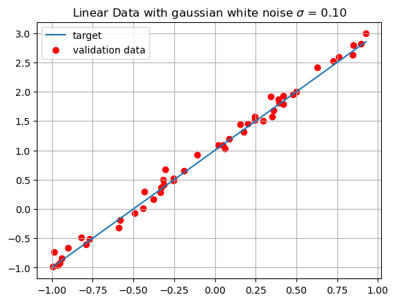
    


## Model definition
For linear regression is sufficient one node without activation function (the goal is to estimate a linear function)


```python
# compose the NN model
import tensorflow as tf
from tensorflow import keras

from tensorflow.keras.models import Sequential
from tensorflow.keras.layers import Dense, Activation
from tensorflow.keras import backend as K
from tensorflow.keras.utils import get_custom_objects
```

    2025-12-03 12:25:07.052840: I tensorflow/core/platform/cpu_feature_guard.cc:210] This TensorFlow binary is optimized to use available CPU instructions in performance-critical operations.
    To enable the following instructions: SSE4.1 SSE4.2 AVX AVX2 FMA, in other operations, rebuild TensorFlow with the appropriate compiler flags.


```python
def init_regression_model(optimizer='sgd', loss='mse', metrics=['mse'], kernel_initializer='glorot_uniform'):
    """
    Create a one-neuron network to perform linear regression
    Parameter:
        - optimizer [string] : algorithm to optimize the regression parameters
        - loss      [string] : cost function to minimize on the train dataset
        - metrics   [list]   : cost functions to evaluate on the validation dataset
    Return:
        - model     [Keras.Sequential]
    """
    model=tf.keras.Sequential()
    model.add(
        Dense(
            1, input_shape=(1,),
            kernel_initializer=kernel_initializer
        )
    )

    model.compile(optimizer=optimizer, loss=loss, metrics=metrics)
    
    return model
```


```python
model=init_regression_model(metrics=['mse', 'accuracy'])

history = model.fit(x=x_train, y=y_train,
          batch_size=32, epochs=30,
          shuffle=True, # a good idea is to shuffle input before at each epoch
          validation_data=(x_valid, y_valid), verbose=0)

```

    /home/td/miniconda3/envs/dl/lib/python3.12/site-packages/keras/src/layers/core/dense.py:93: UserWarning: Do not pass an `input_shape`/`input_dim` argument to a layer. When using Sequential models, prefer using an `Input(shape)` object as the first layer in the model instead.
      super().__init__(activity_regularizer=activity_regularizer, **kwargs)


```python
fig, ax = plt.subplots(1, 2, figsize=(10,3))

x_predicted = np.random.uniform(-1, 1, 100)
y_predicted = model.predict(x_predicted)

fig.suptitle('Regression model for '+ r"$\sigma=$"+"%.2f"%sigma)
ax[0].set_title('Model prediction')
ax[0].scatter(x_predicted, y_predicted,color='r', label='predicted')
ax[0].plot(x_valid, y_target, label='actual function')
ax[0].grid(True)
ax[0].legend()


# look into training history
# Plot training & validation loss values
ax[1].plot(history.history['loss'])
ax[1].plot(history.history['val_loss'])
ax[1].set_title('Regression model loss')
ax[1].set_ylabel('Loss')
ax[1].set_xlabel('Epoch')
ax[1].legend(['Train', 'Test'], loc='best')
plt.tight_layout()
plt.show()

# evaluate model
valid_score = model.evaluate(x_valid, y_valid, batch_size=32, verbose=1)
# evaluate model with the exact curve
target_score = model.evaluate(x_valid, y_target, batch_size=32, verbose=1)
# print performance
print('Validation loss:', valid_score[0])
print('Target loss:', target_score[0])
m_pred, b_pred =model.get_weights()
print('linear weight prediction', m_pred)
print('bias prediction', b_pred)

```

    4/4 ━━━━━━━━━━━━━━━━━━━━ 0s 10ms/step


    
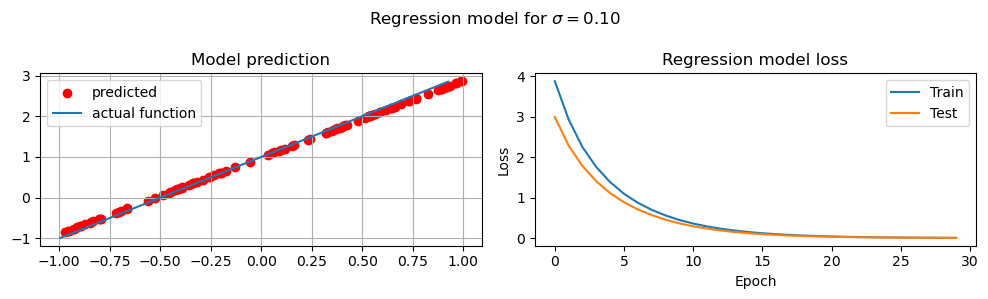
    


    2/2 ━━━━━━━━━━━━━━━━━━━━ 0s 19ms/step - accuracy: 0.0000e+00 - loss: 0.0135 - mse: 0.0135
    2/2 ━━━━━━━━━━━━━━━━━━━━ 0s 18ms/step - accuracy: 0.0000e+00 - loss: 0.0035 - mse: 0.0035
    Validation loss: 0.01487063616514206
    Target loss: 0.0038621975108981133
    linear weight prediction [[1.8899937]]
    bias prediction [0.9883172]


## Variation along number of epochs


```python
m1 = init_regression_model()
m1.summary()
h1 = m1.fit(
    x=x_train, y=y_train,
    batch_size=32, epochs=100,
    shuffle=True, # a good idea is to shuffle input before at each epoch
    validation_data=(x_valid, y_valid), verbose=0
)

```


<pre style="white-space:pre;overflow-x:auto;line-height:normal;font-family:Menlo,'DejaVu Sans Mono',consolas,'Courier New',monospace"><span style="font-weight: bold">Model: "sequential_1"</span>
</pre>


<pre style="white-space:pre;overflow-x:auto;line-height:normal;font-family:Menlo,'DejaVu Sans Mono',consolas,'Courier New',monospace">┏━━━━━━━━━━━━━━━━━━━━━━━━━━━━━━━━━┳━━━━━━━━━━━━━━━━━━━━━━━━┳━━━━━━━━━━━━━━━┓
┃<span style="font-weight: bold"> Layer (type)                    </span>┃<span style="font-weight: bold"> Output Shape           </span>┃<span style="font-weight: bold">       Param # </span>┃
┡━━━━━━━━━━━━━━━━━━━━━━━━━━━━━━━━━╇━━━━━━━━━━━━━━━━━━━━━━━━╇━━━━━━━━━━━━━━━┩
│ dense_1 (<span style="color: #0087ff; text-decoration-color: #0087ff">Dense</span>)                 │ (<span style="color: #00d7ff; text-decoration-color: #00d7ff">None</span>, <span style="color: #00af00; text-decoration-color: #00af00">1</span>)              │             <span style="color: #00af00; text-decoration-color: #00af00">2</span> │
└─────────────────────────────────┴────────────────────────┴───────────────┘
</pre>


<pre style="white-space:pre;overflow-x:auto;line-height:normal;font-family:Menlo,'DejaVu Sans Mono',consolas,'Courier New',monospace"><span style="font-weight: bold"> Total params: </span><span style="color: #00af00; text-decoration-color: #00af00">2</span> (8.00 B)
</pre>


<pre style="white-space:pre;overflow-x:auto;line-height:normal;font-family:Menlo,'DejaVu Sans Mono',consolas,'Courier New',monospace"><span style="font-weight: bold"> Trainable params: </span><span style="color: #00af00; text-decoration-color: #00af00">2</span> (8.00 B)
</pre>


<pre style="white-space:pre;overflow-x:auto;line-height:normal;font-family:Menlo,'DejaVu Sans Mono',consolas,'Courier New',monospace"><span style="font-weight: bold"> Non-trainable params: </span><span style="color: #00af00; text-decoration-color: #00af00">0</span> (0.00 B)
</pre>


```python
plt.figure(figsize=(10,5))

# look into training history
# Plot training & validation loss values
plt.plot(h1.history['loss'])
plt.plot(h1.history['val_loss'])
plt.title('Regression model loss for '+ r"$\sigma=$"+"%.2f"%sigma)
plt.ylabel('Loss')
plt.xlabel('Epoch')
plt.legend(['Train', 'Test'], loc='best')
plt.grid(True)
plt.show()


# evaluate model
valid_score = m1.evaluate(x_valid, y_valid, batch_size=32, verbose=1)
# evaluate model with the exact curve
target_score = m1.evaluate(x_valid, y_target, batch_size=32, verbose=1)
# print performance
print('Validation loss:', valid_score[0])
print('Target loss    :', target_score[0])
print()
m_pred, b_pred =model.get_weights()
print('linear weight prediction:', m_pred)
print('bias prediction         :', b_pred)

```


    
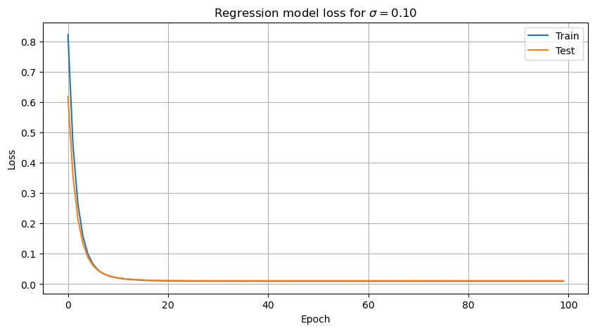
    


    2/2 ━━━━━━━━━━━━━━━━━━━━ 0s 21ms/step - loss: 0.0113 - mse: 0.0113
    2/2 ━━━━━━━━━━━━━━━━━━━━ 0s 21ms/step - loss: 1.8517e-04 - mse: 1.8517e-04
    Validation loss: 0.011137852445244789
    Target loss    : 0.00016021686315070838
    
    linear weight prediction: [[1.8899937]]
    bias prediction         : [0.9883172]


## Variation of train dataset dimension


```python
from tqdm import tqdm

loss=[]
val_loss=[]


scores=[]

# consider different slice of the dataset
for k in tqdm(range(1, len(x_train), 10)):

    model = init_regression_model()
    
    history = model.fit(x=x_train[:k], y=y_train[:k],
            batch_size=32, epochs=60,
            shuffle=True,
            validation_data=(x_valid, y_valid),
            verbose=0
    )
    loss.append(history.history['loss'][-1])
    val_loss.append(history.history['val_loss'][-1])

```

    100%|██████████| 50/50 [04:04<00:00,  4.88s/it]


```python
plt.figure(figsize=(10,3))
plt.title('Loss varing train dataset dimension [optimizer sgd, epochs=60]')
plt.plot(range(1, len(x_train), 10), loss, marker='*',label='train loss')
plt.plot(range(1, len(x_train), 10), val_loss, marker='o', label='validation loss')
plt.ylabel('Loss')
plt.xlabel('train dataset dimension')
plt.grid(True)
plt.legend()
plt.show()
```


    
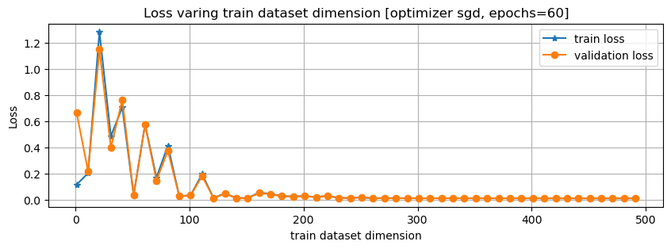
    


We can se that both the the training and the validation loss converge to a minimum while growing the train dataset dimension 

### Variation of train dimension with different epochs


```python
from tqdm import tqdm

sigma=0.0
y_train = np.random.normal(m * x_train + b, sigma) # actual measures from which we want to guess regression parameters
y_valid = np.random.normal(m * x_valid + b, sigma)


ep_loss=[]
ep_valloss=[]

ep=[5, 20, 40, 60]

for e in ep:
    loss=[]
    val_loss=[]
    
    for k in tqdm(range(1, len(x_train), 20), desc=f'{e} epochs'):
    
        model = init_regression_model()
        
        #print(f'\t\t --> size {k} <-- ')
        history = model.fit(x=x_train[:k], y=y_train[:k],
                batch_size=32, epochs=e,
                shuffle=True, # a good idea is to shuffle input before at each epoch
                validation_data=(x_valid, y_valid),
                verbose=0
        )
        loss.append(history.history['loss'][-1])
        val_loss.append(history.history['val_loss'][-1])
    ep_loss.append(loss)
    ep_valloss.append(val_loss)

    
```

    5 epochs: 100%|██████████| 25/25 [00:18<00:00,  1.32it/s]
    20 epochs: 100%|██████████| 25/25 [00:53<00:00,  2.15s/it]
    40 epochs: 100%|██████████| 25/25 [01:37<00:00,  3.89s/it]
    60 epochs: 100%|██████████| 25/25 [02:16<00:00,  5.45s/it]


```python
fig, axs = plt.subplots(1, 2,figsize=(10,3))
axs[0].set_title('Loss on train dataset')
for e in range(3):
    axs[0].plot(range(1, len(x_train), 20), ep_loss[e], marker='*',label=f'{ep[e]} epochs')
axs[0].set_xlabel('train dataset dimension')

axs[0].legend()
axs[0].grid()

axs[1].set_title('Loss on validation dataset')
for e in range(3):
    axs[1].plot(range(1, len(x_train), 20), ep_valloss[e], marker='o', label=f'{ep[e]} epochs')

axs[1].set_xlabel('train dataset dimension')

axs[1].legend()
axs[1].grid()

plt.show()
```


    
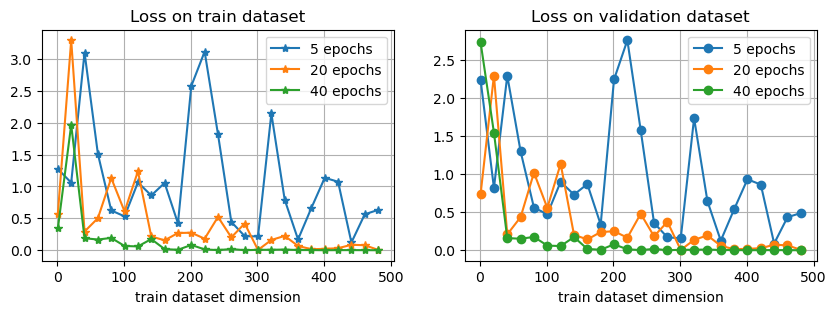
    


## White Noise


```python
import numpy as np

# generate training inputs
np.random.seed(0)
x_train = np.random.uniform(-1, 1, 500)
x_valid = np.random.uniform(-1, 1, 50)
x_valid.sort()
y_target = m * x_valid + b # ideal (target) linear function

sigma_loss=[]
sigma_val_loss=[]

weights=[]
biases =[]

sigmas=np.arange(0, 2, 0.1)

fig, axs = plt.subplots(int((len(sigmas)/10)//2), 2, figsize=(10, 3*((len(sigmas)/10)//4)))
for n, sigma in enumerate(sigmas):

  print(f'\t\t--> sigma {sigma} <--')
  #sigma = 0.0 # noise standard deviation, for the moment it is absent
  y_train = np.random.normal(m * x_train + b, sigma) # actual measures from which we want to guess regression parameters
  y_valid = np.random.normal(m * x_valid + b, sigma)
  

  model=init_regression_model()
  # fit the model using training dataset
  # over 10 epochs of 32 batch size each
  # report training progress against validation data
  history = model.fit(x=x_train, y=y_train,
            batch_size=32, epochs=30,
            shuffle=True, # a good idea is to shuffle input before at each epoch
            validation_data=(x_valid, y_valid),
            verbose=0
  )

  weights.append(model.get_weights()[0][0][0])
  biases.append(model.get_weights()[1][0])
    
  x_predicted = np.random.uniform(-1, 1, 100)
  y_predicted = model.predict(x_predicted)

  """if n%10==0:
      axs[(n/10)//4, (n/10)%4].set_title(f'data with noise {"%.2f" % sigma}')
      axs[(n/10)//4, (n/10)%4].scatter(x_train, y_train, label='train')
      axs[(n/10)//4, (n/10)%4].scatter(x_valid, y_valid, label='validation')
      axs[(n/10)//4, (n/10)%4].plot(x_predicted, y_predicted, c='r', label='prediction')

      axs[(n/10)//4, (n/10)%4].legend()
      axs[(n/10)//4, (n/10)%4].set_ylim([-3.1, 3.1])
    """

  sigma_loss.append(history.history['loss'][-1])
  sigma_val_loss.append(history.history['val_loss'][-1])

#plt.tight_layout()
#plt.show()

```


```python
plt.figure(figsize=(8, 3))

plt.plot(sigmas, sigma_loss, marker='*',label='train loss')
plt.plot(sigmas, sigma_val_loss, marker='o', label='validation loss')

plt.xlabel('noise')

plt.title('MSE')
plt.legend()
plt.grid()
plt.show()
```


```python
fig, ax = plt.subplots(1,2, figsize=(10,3))

ax[0].set_title('linear regression weights')
ax[0].plot(sigmas, weights, '--d')
ax[0].grid()
ax[0].set_xlabel('sigma')

ax[1].set_title('linear regression biases')
ax[1].plot(sigmas, biases, '--^')
ax[1].grid()
ax[1].set_xlabel('sigma')
plt.show()
```

### Uniform search on parameters (x_train_dimension, epochs) for different values of sigma


```python
import pandas as pd
import matplotlib.pyplot as plt
import numpy as np
grid=pd.read_csv('regression_grid.csv')
grid
```


<div>
<style scoped>
    .dataframe tbody tr th:only-of-type {
        vertical-align: middle;
    }

    .dataframe tbody tr th {
        vertical-align: top;
    }

    .dataframe thead th {
        text-align: right;
    }
</style>
<table border="1" class="dataframe">
  <thead>
    <tr style="text-align: right;">
      <th></th>
      <th>Unnamed: 0</th>
      <th>sigma</th>
      <th>epochs</th>
      <th>train_dim</th>
      <th>loss</th>
      <th>val_loss</th>
    </tr>
  </thead>
  <tbody>
    <tr>
      <th>0</th>
      <td>0</td>
      <td>0.073645</td>
      <td>85</td>
      <td>39</td>
      <td>0.051839</td>
      <td>0.061568</td>
    </tr>
    <tr>
      <th>1</th>
      <td>1</td>
      <td>0.073645</td>
      <td>26</td>
      <td>198</td>
      <td>0.008271</td>
      <td>0.008431</td>
    </tr>
    <tr>
      <th>2</th>
      <td>2</td>
      <td>0.073645</td>
      <td>30</td>
      <td>20</td>
      <td>0.635386</td>
      <td>0.446353</td>
    </tr>
    <tr>
      <th>3</th>
      <td>3</td>
      <td>0.073645</td>
      <td>77</td>
      <td>412</td>
      <td>0.005514</td>
      <td>0.003803</td>
    </tr>
    <tr>
      <th>4</th>
      <td>4</td>
      <td>0.073645</td>
      <td>48</td>
      <td>339</td>
      <td>0.008353</td>
      <td>0.009227</td>
    </tr>
    <tr>
      <th>...</th>
      <td>...</td>
      <td>...</td>
      <td>...</td>
      <td>...</td>
      <td>...</td>
      <td>...</td>
    </tr>
    <tr>
      <th>995</th>
      <td>995</td>
      <td>0.647308</td>
      <td>94</td>
      <td>482</td>
      <td>0.404973</td>
      <td>0.543839</td>
    </tr>
    <tr>
      <th>996</th>
      <td>996</td>
      <td>0.647308</td>
      <td>87</td>
      <td>479</td>
      <td>0.396619</td>
      <td>0.335324</td>
    </tr>
    <tr>
      <th>997</th>
      <td>997</td>
      <td>0.647308</td>
      <td>47</td>
      <td>283</td>
      <td>0.426991</td>
      <td>0.432184</td>
    </tr>
    <tr>
      <th>998</th>
      <td>998</td>
      <td>0.647308</td>
      <td>57</td>
      <td>463</td>
      <td>0.403493</td>
      <td>0.352792</td>
    </tr>
    <tr>
      <th>999</th>
      <td>999</td>
      <td>0.647308</td>
      <td>51</td>
      <td>99</td>
      <td>0.712915</td>
      <td>0.774687</td>
    </tr>
  </tbody>
</table>
<p>1000 rows × 6 columns</p>
</div>


```python
sigmas = grid.sort_values(by='sigma')['sigma'].unique()[:2].tolist()+\
         grid.sort_values(by='sigma')['sigma'].unique()[3:-4].tolist()+\
         grid.sort_values(by='sigma')['sigma'].unique()[-1:].tolist()
```


```python
fig = plt.figure(figsize=(20,12),layout='constrained')
fig.suptitle('Loss for different values of Sigma')

rows=len(sigmas)//2
cols=4

subfigs = fig.subfigures(rows, 2, wspace=0.07)
for k, sigma in enumerate(sigmas):

    gr=grid.loc[grid['sigma']==sigma].reset_index(drop=True)
    gr.sort_values(by='loss').reset_index(drop=True)
    
    X = gr['train_dim'].array
    Y = gr['epochs'].array
    Z1 = gr['loss'].array
    Z2 = gr['val_loss'].array

    subfigs[k//2][k%2].suptitle(f'sigma = {"%.3f"%sigma}', y=0.9, fontweight="bold")
    subfigs[k//2][k%2].set_linewidth(1)

    subfigs[k//2][k%2].set_edgecolor('black')
    #subfigs[k//2][k%2].subplots_adjust(right=1.5)

    ax = subfigs[k//2][k%2].add_subplot(1, 2, 1 ,projection='3d')
    ax.set_title(f'Loss', y=0.9)
    ax.bar3d(X-25 , Y-5, np.zeros(len(Z1)), 50,10,Z1, label=f'loss sigma={sigma}', alpha=0.5)
    
    ax.set_ylabel('epochs')
    ax.set_xlabel('train_dim')
    ax.set_zlabel('loss', rotation = 90)
    

    ax = subfigs[k//2][k%2].add_subplot(1, 2, 2 ,projection='3d')
    ax.set_title('Validation loss', y=0.9)
    ax.bar3d(X-25 , Y-5, np.zeros(len(Z2)), 50,10,Z2, label=f'loss sigma={sigma}', alpha=0.5, color='orange')
    ax.set_ylabel('epochs')
    ax.set_xlabel('train_dim')
    ax.set_zlabel('val_loss', rotation = 90)

    
plt.show()
```


    
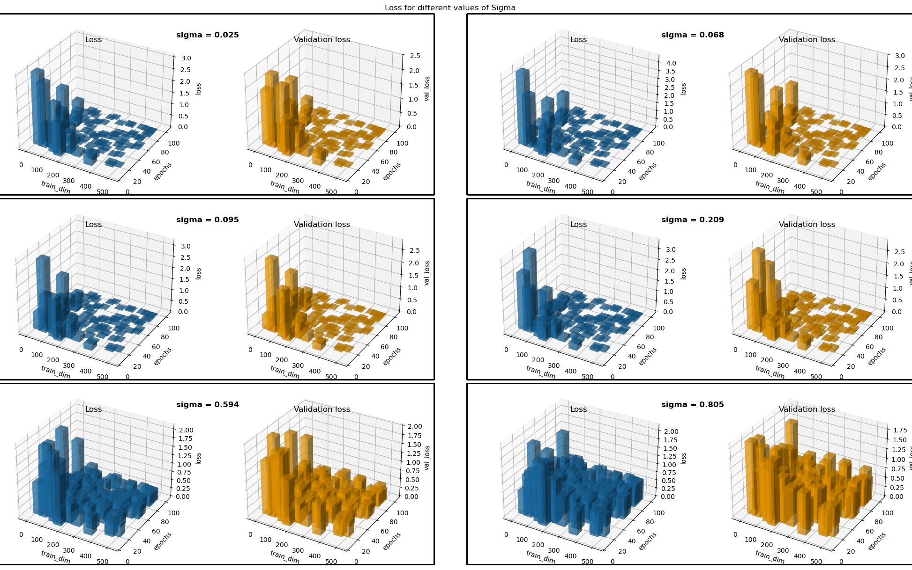
    


chiedersi se la dimensione del training ha una legge di scala che dipende da sigma

It's visible that the best fits are obtained with the max number of epochs and train dataset dimension


```python
plt.figure(figsize=(8,5))
plt.title('best loss varying sigma')
plt.plot(
    grid.sort_values(by='sigma')['sigma'].unique(),
    [grid.loc[grid['sigma']==sigma]['loss'].min() for sigma in grid.sort_values(by='sigma')['sigma'].unique()],
    '-^',
    markersize=10,
    label='loss'
)
plt.plot(
    grid.sort_values(by='sigma')['sigma'].unique(),
    [grid.loc[grid['sigma']==sigma]['val_loss'].min() for sigma in grid.sort_values(by='sigma')['sigma'].unique()],
    '-d',
    markersize=10,
    label='val_loss'
)
plt.ylabel('loss')
plt.xlabel('sigma')
plt.grid()
plt.legend()
plt.show()

```


    

    


# Exercise 11.2

Try to extend the model to obtain a reasonable fit of the following polynomial of order 3:

$$
f(x)=4-3x-2x^2+3x^3
$$
for $x \in [-1,1]$.

Find good (& reasonable) choices for:

- the number of layers
- the number of neurons in each layer
- the activation function
- the optimizer
- the loss function
  
Check your NN model by seeing how well your fits predict newly generated test data (including on data outside the range you fit. How well do your NN do on points in the range of $x$ where you trained the model? How about points outside the original training data set?
Summarize what you have learned about the relationship between model complexity (number of parameters), goodness of fit on training data, and the ability to predict well.


```python
import numpy as np
import matplotlib.pyplot as plt
# compose the NN model
import tensorflow as tf
from tensorflow import keras

from tensorflow.keras.models import Sequential
from tensorflow.keras.layers import Dense, Activation
from tensorflow.keras import backend as K
from tensorflow.keras.utils import get_custom_objects


from tqdm import tqdm
```


```python
def pol(x):
  return 4-3*x - 2*x**2 + 3*x**3
```


```python
def generate_poly_data(pol, seed=0):
    # generate training inputs
    np.random.seed(seed)
    x_train = np.random.uniform(-1, 1, 500)
    x_valid = np.random.uniform(-1, 1, 50)
    x_valid.sort()
    
    
    y_target =  pol(x_valid)# ideal (target) polynomial
    
    sigma = 0.1 # noise standard deviation, for the moment it is absent
    y_train = np.random.normal(pol(x_train), sigma) # actual measures from which we want to guess regression parameters
    y_valid = np.random.normal(pol(x_valid), sigma)

    return x_train, y_train, x_valid, y_valid, y_target
```


```python
x_train, y_train, x_valid, y_valid, y_target = generate_poly_data(pol)
```


```python
plt.title('datasets polymonial')

plt.plot(x_valid, y_target, c='r', label='target')
plt.scatter(x_train, y_train, label='train')
plt.scatter(x_valid, y_valid, label='validation')

plt.legend()
plt.show()

```


    
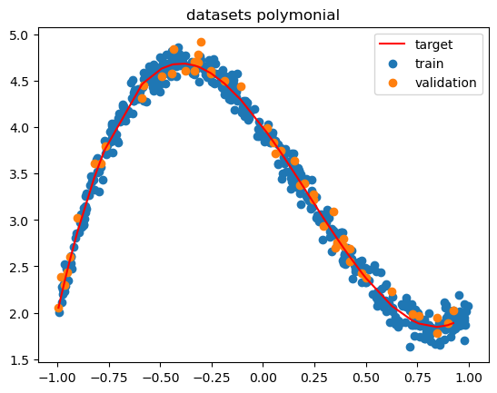
    


# Testing architectures
in the file [model_def.py](model_def.py) the function test_arch(line 139) is used to select the best performing NN architecture at fixed number of layers, optimizer and activation function testing all the possible combination in n_layers of different neuron's numbers per layer.


```python
from model_def import test_arch
from drawing import DrawNN
import os

import matplotlib.pyplot as plt
import numpy as np
```

    2025-10-03 15:04:13.889262: I tensorflow/core/platform/cpu_feature_guard.cc:210] This TensorFlow binary is optimized to use available CPU instructions in performance-critical operations.
    To enable the following instructions: SSE4.1 SSE4.2 AVX AVX2 FMA, in other operations, rebuild TensorFlow with the appropriate compiler flags.


```python
import pandas as pd
from tensorflow.keras.layers import Dense, Activation, Input

```


```python
def NN(
    n_layer:int=2,
    neurons:list=[3, 2],
    activations=['relu'],
    kernel_initializer='glorot_uniform'
):
    """
    Generate a Deep Neural network specifing the architecture:
    Parameters:
        - n_layer            [int]      : number of hidden layers
        - neurons            [list(int)]: number of neurons of the corresponding index layer
        - activations        [list(str)]: list of activation functions 
            (if less than the layers the last function will be apllied to the remaining layers)
        - kernel_initializer [str]      : Initializer for the `kernel` weights matrix.
    Return:
        model [Keras.Sequential]
    """

    if (len(neurons)!=n_layer):
        raise ValueError('ERROR: List of neurons incompatible with number of layers')
    model = tf.keras.Sequential()
    model.add(Input(shape=(1,))) #input layer

    activation_index=0
    
    for layer in range(n_layer):
        model.add(
            Dense(
                neurons[layer], 
                activations[activation_index],
                kernel_initializer=kernel_initializer # to confront architectures
            )
        )

        if activation_index+1<len(activations):
            activation_index+=1
    model.add(Dense(1, activation='linear'))

    return model
```


```python
layers=[2, 3, 4]
mnn=NN(5, [4, 16, 32, 16, 4])

mnn.summary()
```


<pre style="white-space:pre;overflow-x:auto;line-height:normal;font-family:Menlo,'DejaVu Sans Mono',consolas,'Courier New',monospace"><span style="font-weight: bold">Model: "sequential"</span>
</pre>


<pre style="white-space:pre;overflow-x:auto;line-height:normal;font-family:Menlo,'DejaVu Sans Mono',consolas,'Courier New',monospace">┏━━━━━━━━━━━━━━━━━━━━━━━━━━━━━━━━━┳━━━━━━━━━━━━━━━━━━━━━━━━┳━━━━━━━━━━━━━━━┓
┃<span style="font-weight: bold"> Layer (type)                    </span>┃<span style="font-weight: bold"> Output Shape           </span>┃<span style="font-weight: bold">       Param # </span>┃
┡━━━━━━━━━━━━━━━━━━━━━━━━━━━━━━━━━╇━━━━━━━━━━━━━━━━━━━━━━━━╇━━━━━━━━━━━━━━━┩
│ dense (<span style="color: #0087ff; text-decoration-color: #0087ff">Dense</span>)                   │ (<span style="color: #00d7ff; text-decoration-color: #00d7ff">None</span>, <span style="color: #00af00; text-decoration-color: #00af00">4</span>)              │             <span style="color: #00af00; text-decoration-color: #00af00">8</span> │
├─────────────────────────────────┼────────────────────────┼───────────────┤
│ dense_1 (<span style="color: #0087ff; text-decoration-color: #0087ff">Dense</span>)                 │ (<span style="color: #00d7ff; text-decoration-color: #00d7ff">None</span>, <span style="color: #00af00; text-decoration-color: #00af00">16</span>)             │            <span style="color: #00af00; text-decoration-color: #00af00">80</span> │
├─────────────────────────────────┼────────────────────────┼───────────────┤
│ dense_2 (<span style="color: #0087ff; text-decoration-color: #0087ff">Dense</span>)                 │ (<span style="color: #00d7ff; text-decoration-color: #00d7ff">None</span>, <span style="color: #00af00; text-decoration-color: #00af00">32</span>)             │           <span style="color: #00af00; text-decoration-color: #00af00">544</span> │
├─────────────────────────────────┼────────────────────────┼───────────────┤
│ dense_3 (<span style="color: #0087ff; text-decoration-color: #0087ff">Dense</span>)                 │ (<span style="color: #00d7ff; text-decoration-color: #00d7ff">None</span>, <span style="color: #00af00; text-decoration-color: #00af00">16</span>)             │           <span style="color: #00af00; text-decoration-color: #00af00">528</span> │
├─────────────────────────────────┼────────────────────────┼───────────────┤
│ dense_4 (<span style="color: #0087ff; text-decoration-color: #0087ff">Dense</span>)                 │ (<span style="color: #00d7ff; text-decoration-color: #00d7ff">None</span>, <span style="color: #00af00; text-decoration-color: #00af00">4</span>)              │            <span style="color: #00af00; text-decoration-color: #00af00">68</span> │
├─────────────────────────────────┼────────────────────────┼───────────────┤
│ dense_5 (<span style="color: #0087ff; text-decoration-color: #0087ff">Dense</span>)                 │ (<span style="color: #00d7ff; text-decoration-color: #00d7ff">None</span>, <span style="color: #00af00; text-decoration-color: #00af00">1</span>)              │             <span style="color: #00af00; text-decoration-color: #00af00">5</span> │
└─────────────────────────────────┴────────────────────────┴───────────────┘
</pre>


<pre style="white-space:pre;overflow-x:auto;line-height:normal;font-family:Menlo,'DejaVu Sans Mono',consolas,'Courier New',monospace"><span style="font-weight: bold"> Total params: </span><span style="color: #00af00; text-decoration-color: #00af00">1,233</span> (4.82 KB)
</pre>


<pre style="white-space:pre;overflow-x:auto;line-height:normal;font-family:Menlo,'DejaVu Sans Mono',consolas,'Courier New',monospace"><span style="font-weight: bold"> Trainable params: </span><span style="color: #00af00; text-decoration-color: #00af00">1,233</span> (4.82 KB)
</pre>


<pre style="white-space:pre;overflow-x:auto;line-height:normal;font-family:Menlo,'DejaVu Sans Mono',consolas,'Courier New',monospace"><span style="font-weight: bold"> Non-trainable params: </span><span style="color: #00af00; text-decoration-color: #00af00">0</span> (0.00 B)
</pre>


Sotto un esempio per reti a due layer allenate con ottimizzatore sgd a 60 epoche in cui vengono testate le combinazini di possibili neuroni per layer: [2, 4, 8, 16, 32]


```python
bestloss, bindex, combs, losses, val_losses, xpred, ypred = test_arch(
    2, x_train, y_train, x_valid, y_valid,
    'sgd', 'relu', 60, [2, 4, 8, 16, 32]
)

print('best validation loss value for a 2 layers NN trained with 60 epochs using optimizer=sgd and activation=relu:')
print('\t', bestloss)
print('Corresponding neurons combination: ', combs[bindex])

```

      8%|██████████████                                                                                                                                                                  | 2/25 [00:08<01:33,  4.08s/it]

    WARNING:tensorflow:5 out of the last 9 calls to <function TensorFlowTrainer.make_predict_function.<locals>.one_step_on_data_distributed at 0x7fe8a47b7380> triggered tf.function retracing. Tracing is expensive and the excessive number of tracings could be due to (1) creating @tf.function repeatedly in a loop, (2) passing tensors with different shapes, (3) passing Python objects instead of tensors. For (1), please define your @tf.function outside of the loop. For (2), @tf.function has reduce_retracing=True option that can avoid unnecessary retracing. For (3), please refer to https://www.tensorflow.org/guide/function#controlling_retracing and https://www.tensorflow.org/api_docs/python/tf/function for  more details.
    WARNING:tensorflow:6 out of the last 12 calls to <function TensorFlowTrainer.make_predict_function.<locals>.one_step_on_data_distributed at 0x7fe8a47b7380> triggered tf.function retracing. Tracing is expensive and the excessive number of tracings could be due to (1) creating @tf.function repeatedly in a loop, (2) passing tensors with different shapes, (3) passing Python objects instead of tensors. For (1), please define your @tf.function outside of the loop. For (2), @tf.function has reduce_retracing=True option that can avoid unnecessary retracing. For (3), please refer to https://www.tensorflow.org/guide/function#controlling_retracing and https://www.tensorflow.org/api_docs/python/tf/function for  more details.


    100%|███████████████████████████████████████████████████████████████████████████████████████████████████████████████████████████████████████████████████████████████████████████████| 25/25 [01:47<00:00,  4.30s/it]

    best validation loss value for a 2 layers NN trained with 60 epochs using optimizer=sgd and activation=relu:
    	 0.031055059283971786
    Corresponding neurons combination:  [4 8]


    


```python
fig,axs=plt.subplots(1,3, figsize=(15,5))

nn=DrawNN([1]+combs[bindex].tolist()+[1])
nn.draw(axs[2])
axs[2].axis('scaled')
axs[2].axis('off')
axs[2].set_title( 'Neural Network architecture', fontsize=15 )

#print(loss_3l)
axs[0].plot(losses[bindex], label = 'training')
axs[0].plot(val_losses[bindex], label = 'validation')
axs[0].set_title('Loss')
axs[0].set_xlabel('Epochs')
axs[0].legend()
axs[0].grid()

axs[1].plot(xpred, ypred[bindex], label='predicted')
axs[1].plot(x_valid, y_valid, marker='^', label='validation')
axs[1].legend()
axs[1].grid()
fig.suptitle(f'Best NN with {2} layers: loss {bestloss}')
plt.tight_layout()

```


    
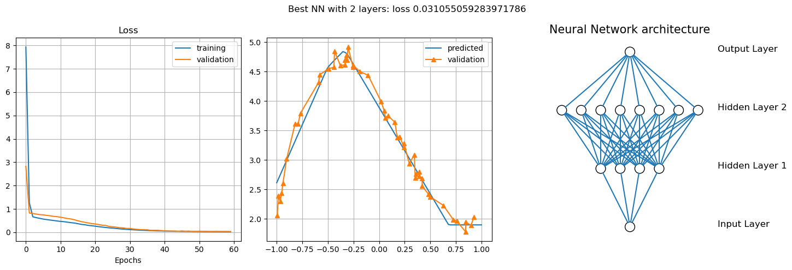
    


The code for visualizing Neural network is slightly modified from the function posted [here](https://stackoverflow.com/questions/29888233/how-to-visualize-a-neural-network)

Facendo un paragone tra i risultati ottenuti con diversi ottimizzatori e funzioni di attivazione al variare del numero di layer si ottiene:


```python
fig, ax = plt.subplots(1, 2, figsize=(10, 5), layout='constrained')

fig.suptitle('Best loss obtained at different layers ')

for k in range(2):
    ax[k].set_prop_cycle(color=[
        '#1f77b4', '#aec7e8', '#ff7f0e', '#ffbb78', '#2ca02c', '#98df8a',
        '#d62728', '#ff9896', '#9467bd', '#c5b0d5', '#8c564b', '#c49c94',
        '#e377c2', '#f7b6d2', '#7f7f7f', '#c7c7c7', '#bcbd22', '#dbdb8d',
        '#17becf', '#9edae5'])

for opt in ['sgd','adam','lion', 'adagrad']: 
    for k, act in enumerate(os.listdir(opt)):
    
        loss=pd.read_csv(opt+'/'+act+'/losses.dat')
        
        min_valloss = [ min(loss[f'val_loss_{k}layers']) for k in range(1, 5)]
        min_loss = [ min(loss[f'loss_{k}layers']) for k in range(1, 5)]
        pref:str='('+opt+', '+act+') '

        ax[0].set_title('validation loss')
        line, = ax[0].plot(min_valloss, lw=2.5)
        # text to the left 
        y_pos = min_valloss[0]
        ax[0].text(-1, y_pos, pref,
            color=line.get_color())#, transform=trans)

        # loss 
        ax[1].set_title('loss')
        line, = ax[1].plot(min_loss, lw=2.5)

        #combs = combfromfile(opt+'/'+act+'/combination.dat')
        #for k in range(len(combs)):
        #    print(numparam(combs[k]), min_loss[k])
        #    ax[1].annotate(numparam(combs[k]), (k, min_loss[k]))
        # text to the left 
        y_pos = min_loss[0]
        ax[1].text(-1, y_pos, pref,
            color=line.get_color())#, transform=trans)


for k in range(2):
    # Ensure that the axis ticks only show up on the bottom and left of the plot.
    # Ticks on the right and top of the plot are generally unnecessary.
    #ax[k].spines[:].set_visible(False)
#    ax[k].tick_params(axis='both', which='both', labelsize='large',
#                   bottom=False, top=False, labelbottom=True,
#                   left=False, right=False, labelleft=True)
    ax[k].xaxis.tick_bottom()
    #ax.yaxis.tick_left()
    ax[k].set_xlabel('layers')
    ax[k].set_ylabel('loss')
    ax[k].yaxis.set_label_position("right")
    ax[k].set_yscale('log')
    ax[k].yaxis.tick_right()
    ax[k].grid()

plt.show()

```


    
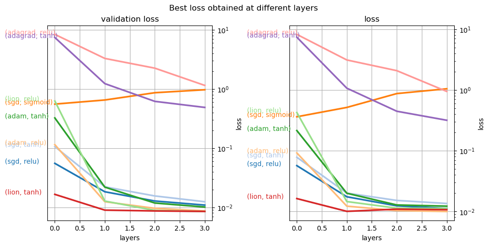
    


Questo grafico non e' particolarmente informativo perche' il numero di neuroni per layer determina il numero di parametri che crescendo dovrebbero garantire una maggiore espressivita' per la rete, quello che cerchiamo e' una rete sufficientemente espressiva da produrre una buona stima senza imparare l'errore presente nei dati di training.


```python
def combfromfile(filename:str):
    file = open(filename, 'r')
    
    lines=[line.strip() for line in file]
    
    file.close()
    
    lines=lines[1:]
    
    comb = [np.array(line.split(' '), dtype=float) for line in lines]
    
    return comb
```


```python
def numparam(neur):
    n=0
    for k in range(len(neur)):
        n+=2*neur[k] # biases
        if (k==0):
            n+= neur[k] 
        else: 
            n+=neur[k]*neur[k-1]
    return n
```


```python
markers=['o', '*', '^', '1', '<','p','x']
```


```python
fig, ax = plt.subplots(1, 2, figsize=(15, 3))


for opt in ['sgd','adam','lion', 'adagrad']: 
    for k, act in enumerate(os.listdir(opt)):

    
        loss=pd.read_csv(opt+'/'+act+'/losses.dat')
        combs = combfromfile(opt+'/'+act+'/combination.dat')
        
        sizeloss = pd.DataFrame({
            'nparam':[numparam(k) for k in combs], 
            'loss':[loss[f'loss_{k+1}layers'].min() for k in range(len(combs))],
            'val_loss':[loss[f'val_loss_{k+1}layers'].min() for k in range(len(combs))]
        })
        
        
        sizeloss=sizeloss.sort_values(by='nparam', ignore_index=True)
        
        ax[0].plot(sizeloss.nparam, sizeloss.loss, ls='-',marker=markers[k], label = opt+'-'+act)
        ax[1].plot(sizeloss.nparam, sizeloss.val_loss, ls='-',marker=markers[k], label = opt+'-'+act)

ax[0].set_title('training')
ax[1].set_title('validation')

for k in range(2):
    ax[k].set_xlabel('# params')
    ax[k].set_ylabel('MSE')
    ax[k].grid()
    ax[k].legend(loc=(0,-0.5), ncols=3)
    ax[k].set_yscale('log')

plt.show()
```


    
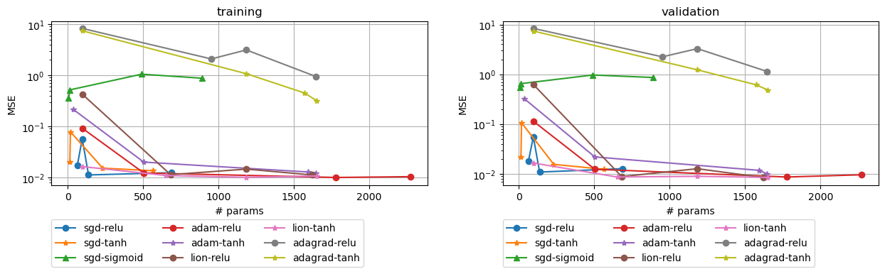
    


Si puo' vedere che al crescere del numero di parametri nei casi selezionati la loss migliore tende a diminuire 


```python
os.listdir('sgd')
```


    ['relu', 'tanh', 'sigmoid']


```python

fig, ax = plt.subplots(3, 3, figsize=(10, 10))

counter = 0
for opt in ['sgd','adam','lion', 'adagrad']: 
    for k, act in enumerate(os.listdir(opt)):

        col = counter//3
        row = counter%3

    
        loss=pd.read_csv(opt+'/'+act+'/losses.dat')
        combs = combfromfile(opt+'/'+act+'/combination.dat')
        npar = [numparam(k) for k in combs]
        ax[col, row].set_title('validation loss for Optimizer = '+opt+'\nActivation = '+act)
        
        for k in range(4):
            #ax[col, row].plot(loss[f'loss_{k+1}layers'], label=f'train {k+1} layers - #param = {npar[k]}')
            ax[col, row].plot(loss[f'val_loss_{k+1}layers'], label=f'{k+1} layers - #param = {npar[k]}', c=f'C{k+1}')
        ax[col, row].set_xlabel('epochs')
        ax[col, row].set_ylabel('MSE')
        ax[col, row].legend(fontsize='xx-small')
        ax[col, row].grid()
        
        counter +=1        
plt.tight_layout()
plt.show()        
        

```


    
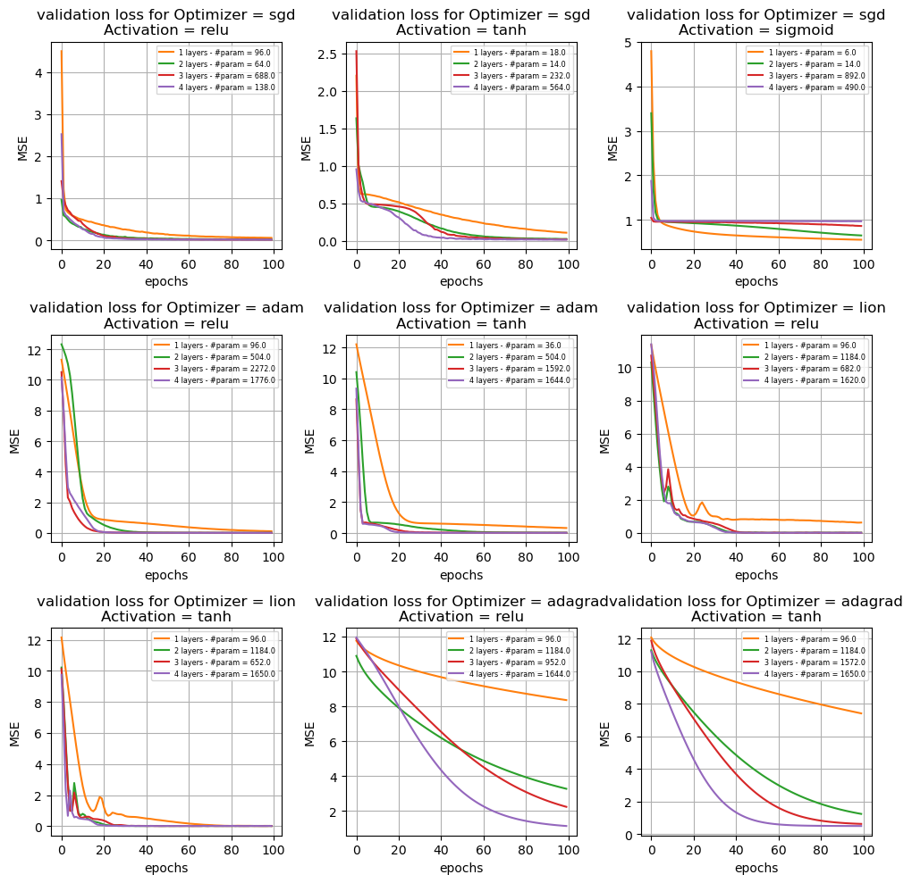
    


Non sembrano emergere casi particolarmente terribili di overfitting nelle reti esplorate


```python

fig, ax = plt.subplots(3, 3, figsize=(10, 10))

counter = 0
for opt in ['sgd','adam','lion', 'adagrad']: 
    for act in os.listdir(opt):

        col = counter//3
        row = counter%3
        
        pred=pd.read_csv(opt+'/'+act+'/predictions.dat')
        combs = combfromfile(opt+'/'+act+'/combination.dat')
        npar = [numparam(k) for k in combs]
        ax[col, row].set_title('Optimizer = '+opt+'\nActivation = '+act)
        ax[col, row].plot(x_valid, y_valid, marker='o', label='validation')
        
        for k in range(4):
            #ax[k].set_title(f'{k+1} layers - #param = {npar[k]} \nbest val_loss = {min(loss.val_loss_1layers)}')
            ax[col, row].plot(pred[f'xpred_{k+1}layers'], pred[f'ypred_{k+1}layers'], label=f'{k+1} layers - #param = {npar[k]}')
        ax[col, row].set_xlabel('x')
        ax[col, row].set_ylabel('y')
        ax[col, row].legend(fontsize='xx-small')
    
        counter +=1        
plt.tight_layout()
plt.show()
```


    
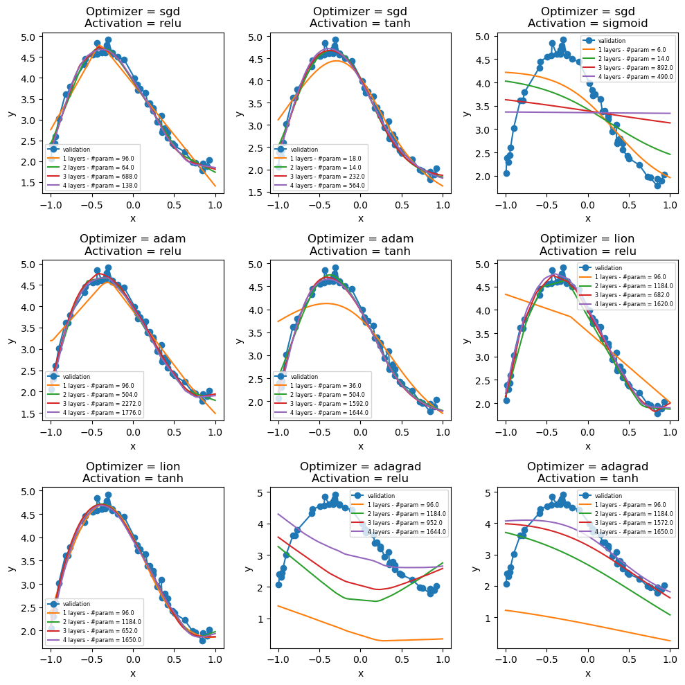
    


I piu' competitivi a livello di dimensioni e prestazioni(validation loss) sono confrontati qua sotto:
- sgd  - relu 2 layers [64 params]
- sgd  - tanh 2 layers [14  params]
- lion - tanh 1 layers [96  params]


```python
sgdr = pd.read_csv('sgd/relu/losses.dat')
sgdt = pd.read_csv('sgd/tanh/losses.dat')
liot = pd.read_csv('lion/tanh/losses.dat')

sgdr_pred = pd.read_csv('sgd/relu/predictions.dat')
sgdt_pred = pd.read_csv('sgd/tanh/predictions.dat')
liot_pred = pd.read_csv('lion/tanh/predictions.dat')


fig, ax = plt.subplots(1,2, figsize=(13, 4))

ax[0].plot(sgdr['val_loss_2layers'], label = 'sgd  relu 64 params')
ax[0].plot(sgdt['val_loss_2layers'], label = 'sgd  tanh  14 params')
ax[0].plot(liot['val_loss_1layers'], label = 'lion tanh  96 params')

ax[0].set_xlabel('epochs')
ax[0].set_ylabel('MSE')

ax[0].legend()
ax[0].grid()


ax[1].scatter(x_valid, y_valid, label='validation')
ax[1].plot(sgdr_pred.xpred_2layers, sgdr_pred.ypred_2layers, label = 'sgd -relu 2 layers - 64 params')
ax[1].plot(sgdt_pred.xpred_2layers, sgdt_pred.ypred_2layers, label = 'sgd -tanh 2 layers - 14  params')
ax[1].plot(liot_pred.xpred_1layers, liot_pred.ypred_1layers, label = 'lion-tanh 1 layers - 96  params')
ax[1].set_xlabel('x')
ax[1].set_ylabel('y')

ax[1].legend(loc = (0.5, 0.7))
ax[1].grid()


plt.show()
```


    
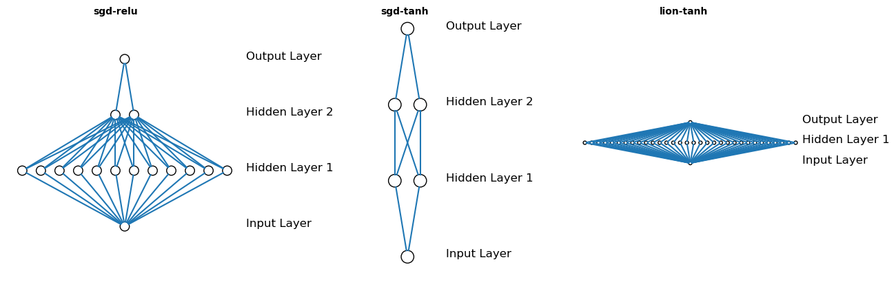
    


```python
liotcomb = combfromfile('lion/tanh/'+'combination.dat')[0]
sgdrcomb = combfromfile('sgd/relu/'+'combination.dat')[1]
sgdtcomb = combfromfile('sgd/tanh/'+'combination.dat')[1]

fig,axs=plt.subplots(1,3, figsize=(15,5))

for k, comb in enumerate([sgdrcomb,sgdtcomb, liotcomb]):
    nn=DrawNN([1]+comb.astype(int).tolist()+[1])
    nn.draw(axs[k])
    axs[k].axis('scaled')
    axs[k].axis('off')
    axs[k].set_title( '' , fontsize=15, y=1)

    
plt.text(.23, 0.87, 'sgd-relu', transform=fig.transFigure, horizontalalignment='center', fontweight='bold')
plt.text(.51, 0.87, 'sgd-tanh',  transform=fig.transFigure, horizontalalignment='center', fontweight='bold')
plt.text(.78, 0.87, 'lion-tanh', transform=fig.transFigure, horizontalalignment='center', fontweight='bold')

plt.show()
```


    

    


la rete con ottimizzatore sgd e funzione di attivazione tanh sembra performare molto bene con un numero molto basso ma porebbe essere dovuto a una scelta particolarmente fortunata dei parametri quindi proviamo a riprodurla un paio di volte con inizializzazione randomica dei pesi per vedere se siamo stati semplicemente molto fortunati


```python
nattemps = 100

xp = np.random.uniform(-1, 1, 100)

yp=[]
losses=[]
val_losses = []

for k in tqdm(range(nattemps)):
    mod = NN(2, [2, 2], activations=['tanh'])
    
    mod.compile(
        optimizer='sgd', loss = 'mse', metrics=['mse']
    )
    
    h = mod.fit(
        x_train, y_train,
        batch_size=32, epochs=100,
        validation_data=[x_valid, y_valid], verbose = 0
    )

    yp.append(mod.predict(xp, verbose=0))
    losses.append(h.history['loss'])
    val_losses.append(h.history['val_loss'])
```

      2%|███▌                                                                                                                                                                           | 2/100 [00:33<27:33, 16.87s/it]

    WARNING:tensorflow:5 out of the last 9 calls to <function TensorFlowTrainer.make_predict_function.<locals>.one_step_on_data_distributed at 0x7f25fc52a840> triggered tf.function retracing. Tracing is expensive and the excessive number of tracings could be due to (1) creating @tf.function repeatedly in a loop, (2) passing tensors with different shapes, (3) passing Python objects instead of tensors. For (1), please define your @tf.function outside of the loop. For (2), @tf.function has reduce_retracing=True option that can avoid unnecessary retracing. For (3), please refer to https://www.tensorflow.org/guide/function#controlling_retracing and https://www.tensorflow.org/api_docs/python/tf/function for  more details.
    WARNING:tensorflow:6 out of the last 12 calls to <function TensorFlowTrainer.make_predict_function.<locals>.one_step_on_data_distributed at 0x7f25fc52a840> triggered tf.function retracing. Tracing is expensive and the excessive number of tracings could be due to (1) creating @tf.function repeatedly in a loop, (2) passing tensors with different shapes, (3) passing Python objects instead of tensors. For (1), please define your @tf.function outside of the loop. For (2), @tf.function has reduce_retracing=True option that can avoid unnecessary retracing. For (3), please refer to https://www.tensorflow.org/guide/function#controlling_retracing and https://www.tensorflow.org/api_docs/python/tf/function for  more details.


    100%|█████████████████████████████████████████████████████████████████████████████████████████████████████████████████████████████████████████████████████████████████████████████| 100/100 [25:00<00:00, 15.00s/it]


```python


fig, ax = plt.subplots(1,2, figsize=(13, 4))
    
for k in range(nattemps):
    #ax[0].plot(losses[k], label = f'training run {k}')
    ax[0].plot(val_losses[k])#, label = f'validation run {k}')
    ax[0].legend()
    ax[0].set_xlabel('Epochs')
    ax[0].set_ylabel('MSE')
    
    
    ax[1].scatter(xp, yp[k])#, label='prediction')

ax[1].set_xlabel('x')
ax[1].set_ylabel('y')
ax[1].scatter(x_valid, y_valid, marker = '^',label='validation')
ax[0].set_title('Mean Square Error')
ax[1].plot(x_valid, y_target, label='target', color='r')

ax[1].legend()
```

    /tmp/ipykernel_7634/2430505857.py:6: UserWarning: No artists with labels found to put in legend.  Note that artists whose label start with an underscore are ignored when legend() is called with no argument.
      ax[0].legend()


    <matplotlib.legend.Legend at 0x7f25f5ccf110>


    

    


```python
hist = plt.hist([val[-1] for val in val_losses], bins=30, density=True)
plt.title('validation loss for the 4x4 NN with \nactivation tanh optimized by sgd on 100 epochs')

plt.xlabel('validation loss')

plt.show()
```


    
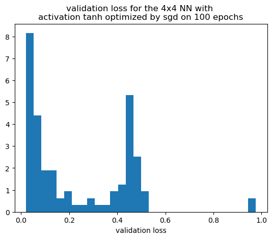
    


La conclusione e' che anche una rete cosi' piccola puo' fare un buon fit anche se evidentemente su reti piu' grandi le capacita' di previsione migliorano

### Loss function


```python
mse = pd.read_csv('sgd/relu/predictions.dat')
mae = pd.read_csv('sgd/relu/predictionsmae.dat')
msle= pd.read_csv('sgd/relu/predictionsmsle.dat')
```


```python
fig, ax = plt.subplots(1, 3, figsize=(9, 3))
fig.suptitle('sgd -- relu')

for k in range(3):
    ax[k].set_title(f'{k+1} layer')
    
    ax[k].plot(mse [f'xpred_{k+1}layers'], mse [f'ypred_{k+1}layers'], label='mse')
    ax[k].plot(mae [f'xpred_{k+1}layers'], mae [f'ypred_{k+1}layers'], label='mae')
    ax[k].plot(msle[f'xpred_{k+1}layers'], msle[f'ypred_{k+1}layers'], label='msle')
    
    ax[k].plot(x_valid, y_target, c='r', label='target')

    ax[k].legend()
    ax[k].grid()
    ax[k].set_xlabel('x')
    ax[k].set_ylabel('y')
plt.tight_layout()
plt.show()
```


    
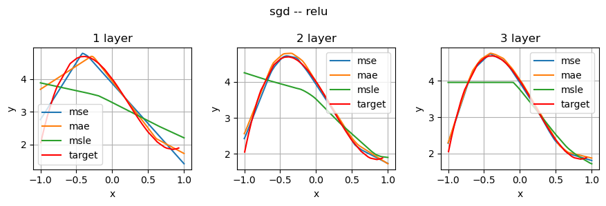
    


```python

```

### data outside training range

Proviamo a prendere i modelli best fuori dal range


```python
msgdr = NN(n_layer=2, neurons=[32, 2], activations=['relu'])
msgdt = NN(n_layer=2, neurons=[2, 2], activations=['tanh'])
mliot = NN(n_layer=1, neurons=[32], activations=['tanh'])

msgdr.compile(
    optimizer='sgd',
    loss='mse', metrics=['mse'],
)


msgdt.compile(
    optimizer='sgd',
    loss='mse', metrics=['mse'],
)

mliot.compile(
    optimizer='lion',
    loss='mse', metrics=['mse'],
)
```


```python
print('\t\tsgd - relu')
hist_msr = msgdr.fit(
            x=x_train, y=y_train,
            batch_size=32, epochs=100,
            shuffle=True, validation_data=(x_valid, y_valid),
            verbose=1
)
print('\t\tsgd - tanh')
hist_mst = msgdt.fit(
            x=x_train, y=y_train,
            batch_size=32, epochs=100,
            shuffle=True, validation_data=(x_valid, y_valid),
            verbose=1
)
print('\t\tlion - tanh')
hist_mlt = mliot.fit(
            x=x_train, y=y_train,
            batch_size=32, epochs=100,
            shuffle=True, validation_data=(x_valid, y_valid),
            verbose=1
)
```

    sgd - relu
    Epoch 1/100
    16/16 ━━━━━━━━━━━━━━━━━━━━ 0s 10ms/step - loss: 8.4606 - mse: 8.4606 - val_loss: 1.0394 - val_mse: 1.0394
    Epoch 2/100
    16/16 ━━━━━━━━━━━━━━━━━━━━ 0s 4ms/step - loss: 0.7554 - mse: 0.7554 - val_loss: 0.7334 - val_mse: 0.7334
    Epoch 3/100
    16/16 ━━━━━━━━━━━━━━━━━━━━ 0s 4ms/step - loss: 0.5296 - mse: 0.5296 - val_loss: 0.6920 - val_mse: 0.6920
    Epoch 4/100
    16/16 ━━━━━━━━━━━━━━━━━━━━ 0s 4ms/step - loss: 0.5222 - mse: 0.5222 - val_loss: 0.6822 - val_mse: 0.6822
    Epoch 5/100
    16/16 ━━━━━━━━━━━━━━━━━━━━ 0s 4ms/step - loss: 0.4696 - mse: 0.4696 - val_loss: 0.6443 - val_mse: 0.6443
    Epoch 6/100
    16/16 ━━━━━━━━━━━━━━━━━━━━ 0s 4ms/step - loss: 0.4592 - mse: 0.4592 - val_loss: 0.6406 - val_mse: 0.6406
    Epoch 7/100
    16/16 ━━━━━━━━━━━━━━━━━━━━ 0s 4ms/step - loss: 0.3747 - mse: 0.3747 - val_loss: 0.6065 - val_mse: 0.6065
    Epoch 8/100
    16/16 ━━━━━━━━━━━━━━━━━━━━ 0s 3ms/step - loss: 0.4172 - mse: 0.4172 - val_loss: 0.5762 - val_mse: 0.5762
    Epoch 9/100
    16/16 ━━━━━━━━━━━━━━━━━━━━ 0s 4ms/step - loss: 0.4067 - mse: 0.4067 - val_loss: 0.5603 - val_mse: 0.5603
    Epoch 10/100
    16/16 ━━━━━━━━━━━━━━━━━━━━ 0s 4ms/step - loss: 0.3680 - mse: 0.3680 - val_loss: 0.5371 - val_mse: 0.5371
    Epoch 11/100
    16/16 ━━━━━━━━━━━━━━━━━━━━ 0s 4ms/step - loss: 0.3195 - mse: 0.3195 - val_loss: 0.5051 - val_mse: 0.5051
    Epoch 12/100
    16/16 ━━━━━━━━━━━━━━━━━━━━ 0s 4ms/step - loss: 0.3271 - mse: 0.3271 - val_loss: 0.4913 - val_mse: 0.4913
    Epoch 13/100
    16/16 ━━━━━━━━━━━━━━━━━━━━ 0s 3ms/step - loss: 0.3396 - mse: 0.3396 - val_loss: 0.4614 - val_mse: 0.4614
    Epoch 14/100
    16/16 ━━━━━━━━━━━━━━━━━━━━ 0s 4ms/step - loss: 0.3112 - mse: 0.3112 - val_loss: 0.4491 - val_mse: 0.4491
    Epoch 15/100
    16/16 ━━━━━━━━━━━━━━━━━━━━ 0s 3ms/step - loss: 0.2628 - mse: 0.2628 - val_loss: 0.4146 - val_mse: 0.4146
    Epoch 16/100
    16/16 ━━━━━━━━━━━━━━━━━━━━ 0s 3ms/step - loss: 0.2407 - mse: 0.2407 - val_loss: 0.3836 - val_mse: 0.3836
    Epoch 17/100
    16/16 ━━━━━━━━━━━━━━━━━━━━ 0s 3ms/step - loss: 0.2726 - mse: 0.2726 - val_loss: 0.3780 - val_mse: 0.3780
    Epoch 18/100
    16/16 ━━━━━━━━━━━━━━━━━━━━ 0s 4ms/step - loss: 0.2105 - mse: 0.2105 - val_loss: 0.3371 - val_mse: 0.3371
    Epoch 19/100
    16/16 ━━━━━━━━━━━━━━━━━━━━ 0s 3ms/step - loss: 0.2458 - mse: 0.2458 - val_loss: 0.3207 - val_mse: 0.3207
    Epoch 20/100
    16/16 ━━━━━━━━━━━━━━━━━━━━ 0s 4ms/step - loss: 0.2032 - mse: 0.2032 - val_loss: 0.3040 - val_mse: 0.3040
    Epoch 21/100
    16/16 ━━━━━━━━━━━━━━━━━━━━ 0s 4ms/step - loss: 0.1737 - mse: 0.1737 - val_loss: 0.2755 - val_mse: 0.2755
    Epoch 22/100
    16/16 ━━━━━━━━━━━━━━━━━━━━ 0s 4ms/step - loss: 0.1808 - mse: 0.1808 - val_loss: 0.2632 - val_mse: 0.2632
    Epoch 23/100
    16/16 ━━━━━━━━━━━━━━━━━━━━ 0s 4ms/step - loss: 0.1771 - mse: 0.1771 - val_loss: 0.2454 - val_mse: 0.2454
    Epoch 24/100
    16/16 ━━━━━━━━━━━━━━━━━━━━ 0s 4ms/step - loss: 0.1885 - mse: 0.1885 - val_loss: 0.2282 - val_mse: 0.2282
    Epoch 25/100
    16/16 ━━━━━━━━━━━━━━━━━━━━ 0s 4ms/step - loss: 0.1630 - mse: 0.1630 - val_loss: 0.2125 - val_mse: 0.2125
    Epoch 26/100
    16/16 ━━━━━━━━━━━━━━━━━━━━ 0s 4ms/step - loss: 0.1595 - mse: 0.1595 - val_loss: 0.2043 - val_mse: 0.2043
    Epoch 27/100
    16/16 ━━━━━━━━━━━━━━━━━━━━ 0s 4ms/step - loss: 0.1471 - mse: 0.1471 - val_loss: 0.1865 - val_mse: 0.1865
    Epoch 28/100
    16/16 ━━━━━━━━━━━━━━━━━━━━ 0s 4ms/step - loss: 0.1376 - mse: 0.1376 - val_loss: 0.1709 - val_mse: 0.1709
    Epoch 29/100
    16/16 ━━━━━━━━━━━━━━━━━━━━ 0s 4ms/step - loss: 0.1411 - mse: 0.1411 - val_loss: 0.1755 - val_mse: 0.1755
    Epoch 30/100
    16/16 ━━━━━━━━━━━━━━━━━━━━ 0s 4ms/step - loss: 0.1143 - mse: 0.1143 - val_loss: 0.1505 - val_mse: 0.1505
    Epoch 31/100
    16/16 ━━━━━━━━━━━━━━━━━━━━ 0s 4ms/step - loss: 0.1103 - mse: 0.1103 - val_loss: 0.1444 - val_mse: 0.1444
    Epoch 32/100
    16/16 ━━━━━━━━━━━━━━━━━━━━ 0s 4ms/step - loss: 0.1045 - mse: 0.1045 - val_loss: 0.1289 - val_mse: 0.1289
    Epoch 33/100
    16/16 ━━━━━━━━━━━━━━━━━━━━ 0s 4ms/step - loss: 0.1043 - mse: 0.1043 - val_loss: 0.1182 - val_mse: 0.1182
    Epoch 34/100
    16/16 ━━━━━━━━━━━━━━━━━━━━ 0s 4ms/step - loss: 0.1025 - mse: 0.1025 - val_loss: 0.1185 - val_mse: 0.1185
    Epoch 35/100
    16/16 ━━━━━━━━━━━━━━━━━━━━ 0s 4ms/step - loss: 0.0963 - mse: 0.0963 - val_loss: 0.1055 - val_mse: 0.1055
    Epoch 36/100
    16/16 ━━━━━━━━━━━━━━━━━━━━ 0s 4ms/step - loss: 0.0925 - mse: 0.0925 - val_loss: 0.1066 - val_mse: 0.1066
    Epoch 37/100
    16/16 ━━━━━━━━━━━━━━━━━━━━ 0s 4ms/step - loss: 0.0888 - mse: 0.0888 - val_loss: 0.1030 - val_mse: 0.1030
    Epoch 38/100
    16/16 ━━━━━━━━━━━━━━━━━━━━ 0s 4ms/step - loss: 0.0889 - mse: 0.0889 - val_loss: 0.0891 - val_mse: 0.0891
    Epoch 39/100
    16/16 ━━━━━━━━━━━━━━━━━━━━ 0s 4ms/step - loss: 0.0743 - mse: 0.0743 - val_loss: 0.0878 - val_mse: 0.0878
    Epoch 40/100
    16/16 ━━━━━━━━━━━━━━━━━━━━ 0s 4ms/step - loss: 0.0709 - mse: 0.0709 - val_loss: 0.0834 - val_mse: 0.0834
    Epoch 41/100
    16/16 ━━━━━━━━━━━━━━━━━━━━ 0s 4ms/step - loss: 0.0702 - mse: 0.0702 - val_loss: 0.0850 - val_mse: 0.0850
    Epoch 42/100
    16/16 ━━━━━━━━━━━━━━━━━━━━ 0s 4ms/step - loss: 0.0612 - mse: 0.0612 - val_loss: 0.0782 - val_mse: 0.0782
    Epoch 43/100
    16/16 ━━━━━━━━━━━━━━━━━━━━ 0s 4ms/step - loss: 0.0702 - mse: 0.0702 - val_loss: 0.0721 - val_mse: 0.0721
    Epoch 44/100
    16/16 ━━━━━━━━━━━━━━━━━━━━ 0s 3ms/step - loss: 0.0683 - mse: 0.0683 - val_loss: 0.0693 - val_mse: 0.0693
    Epoch 45/100
    16/16 ━━━━━━━━━━━━━━━━━━━━ 0s 4ms/step - loss: 0.0578 - mse: 0.0578 - val_loss: 0.0700 - val_mse: 0.0700
    Epoch 46/100
    16/16 ━━━━━━━━━━━━━━━━━━━━ 0s 4ms/step - loss: 0.0659 - mse: 0.0659 - val_loss: 0.0661 - val_mse: 0.0661
    Epoch 47/100
    16/16 ━━━━━━━━━━━━━━━━━━━━ 0s 4ms/step - loss: 0.0530 - mse: 0.0530 - val_loss: 0.0631 - val_mse: 0.0631
    Epoch 48/100
    16/16 ━━━━━━━━━━━━━━━━━━━━ 0s 4ms/step - loss: 0.0560 - mse: 0.0560 - val_loss: 0.0587 - val_mse: 0.0587
    Epoch 49/100
    16/16 ━━━━━━━━━━━━━━━━━━━━ 0s 4ms/step - loss: 0.0650 - mse: 0.0650 - val_loss: 0.0585 - val_mse: 0.0585
    Epoch 50/100
    16/16 ━━━━━━━━━━━━━━━━━━━━ 0s 4ms/step - loss: 0.0554 - mse: 0.0554 - val_loss: 0.0534 - val_mse: 0.0534
    Epoch 51/100
    16/16 ━━━━━━━━━━━━━━━━━━━━ 0s 3ms/step - loss: 0.0549 - mse: 0.0549 - val_loss: 0.0538 - val_mse: 0.0538
    Epoch 52/100
    16/16 ━━━━━━━━━━━━━━━━━━━━ 0s 4ms/step - loss: 0.0561 - mse: 0.0561 - val_loss: 0.0510 - val_mse: 0.0510
    Epoch 53/100
    16/16 ━━━━━━━━━━━━━━━━━━━━ 0s 4ms/step - loss: 0.0489 - mse: 0.0489 - val_loss: 0.0535 - val_mse: 0.0535
    Epoch 54/100
    16/16 ━━━━━━━━━━━━━━━━━━━━ 0s 3ms/step - loss: 0.0519 - mse: 0.0519 - val_loss: 0.0492 - val_mse: 0.0492
    Epoch 55/100
    16/16 ━━━━━━━━━━━━━━━━━━━━ 0s 4ms/step - loss: 0.0512 - mse: 0.0512 - val_loss: 0.0490 - val_mse: 0.0490
    Epoch 56/100
    16/16 ━━━━━━━━━━━━━━━━━━━━ 0s 4ms/step - loss: 0.0477 - mse: 0.0477 - val_loss: 0.0456 - val_mse: 0.0456
    Epoch 57/100
    16/16 ━━━━━━━━━━━━━━━━━━━━ 0s 3ms/step - loss: 0.0465 - mse: 0.0465 - val_loss: 0.0451 - val_mse: 0.0451
    Epoch 58/100
    16/16 ━━━━━━━━━━━━━━━━━━━━ 0s 3ms/step - loss: 0.0477 - mse: 0.0477 - val_loss: 0.0495 - val_mse: 0.0495
    Epoch 59/100
    16/16 ━━━━━━━━━━━━━━━━━━━━ 0s 3ms/step - loss: 0.0474 - mse: 0.0474 - val_loss: 0.0450 - val_mse: 0.0450
    Epoch 60/100
    16/16 ━━━━━━━━━━━━━━━━━━━━ 0s 3ms/step - loss: 0.0515 - mse: 0.0515 - val_loss: 0.0446 - val_mse: 0.0446
    Epoch 61/100
    16/16 ━━━━━━━━━━━━━━━━━━━━ 0s 4ms/step - loss: 0.0420 - mse: 0.0420 - val_loss: 0.0419 - val_mse: 0.0419
    Epoch 62/100
    16/16 ━━━━━━━━━━━━━━━━━━━━ 0s 3ms/step - loss: 0.0441 - mse: 0.0441 - val_loss: 0.0413 - val_mse: 0.0413
    Epoch 63/100
    16/16 ━━━━━━━━━━━━━━━━━━━━ 0s 3ms/step - loss: 0.0475 - mse: 0.0475 - val_loss: 0.0420 - val_mse: 0.0420
    Epoch 64/100
    16/16 ━━━━━━━━━━━━━━━━━━━━ 0s 4ms/step - loss: 0.0440 - mse: 0.0440 - val_loss: 0.0415 - val_mse: 0.0415
    Epoch 65/100
    16/16 ━━━━━━━━━━━━━━━━━━━━ 0s 4ms/step - loss: 0.0427 - mse: 0.0427 - val_loss: 0.0397 - val_mse: 0.0397
    Epoch 66/100
    16/16 ━━━━━━━━━━━━━━━━━━━━ 0s 3ms/step - loss: 0.0418 - mse: 0.0418 - val_loss: 0.0419 - val_mse: 0.0419
    Epoch 67/100
    16/16 ━━━━━━━━━━━━━━━━━━━━ 0s 3ms/step - loss: 0.0428 - mse: 0.0428 - val_loss: 0.0390 - val_mse: 0.0390
    Epoch 68/100
    16/16 ━━━━━━━━━━━━━━━━━━━━ 0s 3ms/step - loss: 0.0406 - mse: 0.0406 - val_loss: 0.0401 - val_mse: 0.0401
    Epoch 69/100
    16/16 ━━━━━━━━━━━━━━━━━━━━ 0s 3ms/step - loss: 0.0391 - mse: 0.0391 - val_loss: 0.0360 - val_mse: 0.0360
    Epoch 70/100
    16/16 ━━━━━━━━━━━━━━━━━━━━ 0s 4ms/step - loss: 0.0393 - mse: 0.0393 - val_loss: 0.0359 - val_mse: 0.0359
    Epoch 71/100
    16/16 ━━━━━━━━━━━━━━━━━━━━ 0s 4ms/step - loss: 0.0416 - mse: 0.0416 - val_loss: 0.0373 - val_mse: 0.0373
    Epoch 72/100
    16/16 ━━━━━━━━━━━━━━━━━━━━ 0s 3ms/step - loss: 0.0396 - mse: 0.0396 - val_loss: 0.0359 - val_mse: 0.0359
    Epoch 73/100
    16/16 ━━━━━━━━━━━━━━━━━━━━ 0s 4ms/step - loss: 0.0395 - mse: 0.0395 - val_loss: 0.0360 - val_mse: 0.0360
    Epoch 74/100
    16/16 ━━━━━━━━━━━━━━━━━━━━ 0s 4ms/step - loss: 0.0379 - mse: 0.0379 - val_loss: 0.0375 - val_mse: 0.0375
    Epoch 75/100
    16/16 ━━━━━━━━━━━━━━━━━━━━ 0s 4ms/step - loss: 0.0385 - mse: 0.0385 - val_loss: 0.0353 - val_mse: 0.0353
    Epoch 76/100
    16/16 ━━━━━━━━━━━━━━━━━━━━ 0s 4ms/step - loss: 0.0391 - mse: 0.0391 - val_loss: 0.0348 - val_mse: 0.0348
    Epoch 77/100
    16/16 ━━━━━━━━━━━━━━━━━━━━ 0s 3ms/step - loss: 0.0384 - mse: 0.0384 - val_loss: 0.0339 - val_mse: 0.0339
    Epoch 78/100
    16/16 ━━━━━━━━━━━━━━━━━━━━ 0s 3ms/step - loss: 0.0377 - mse: 0.0377 - val_loss: 0.0334 - val_mse: 0.0334
    Epoch 79/100
    16/16 ━━━━━━━━━━━━━━━━━━━━ 0s 3ms/step - loss: 0.0364 - mse: 0.0364 - val_loss: 0.0325 - val_mse: 0.0325
    Epoch 80/100
    16/16 ━━━━━━━━━━━━━━━━━━━━ 0s 4ms/step - loss: 0.0379 - mse: 0.0379 - val_loss: 0.0331 - val_mse: 0.0331
    Epoch 81/100
    16/16 ━━━━━━━━━━━━━━━━━━━━ 0s 4ms/step - loss: 0.0358 - mse: 0.0358 - val_loss: 0.0339 - val_mse: 0.0339
    Epoch 82/100
    16/16 ━━━━━━━━━━━━━━━━━━━━ 0s 4ms/step - loss: 0.0355 - mse: 0.0355 - val_loss: 0.0313 - val_mse: 0.0313
    Epoch 83/100
    16/16 ━━━━━━━━━━━━━━━━━━━━ 0s 3ms/step - loss: 0.0360 - mse: 0.0360 - val_loss: 0.0330 - val_mse: 0.0330
    Epoch 84/100
    16/16 ━━━━━━━━━━━━━━━━━━━━ 0s 3ms/step - loss: 0.0322 - mse: 0.0322 - val_loss: 0.0313 - val_mse: 0.0313
    Epoch 85/100
    16/16 ━━━━━━━━━━━━━━━━━━━━ 0s 4ms/step - loss: 0.0375 - mse: 0.0375 - val_loss: 0.0324 - val_mse: 0.0324
    Epoch 86/100
    16/16 ━━━━━━━━━━━━━━━━━━━━ 0s 4ms/step - loss: 0.0364 - mse: 0.0364 - val_loss: 0.0306 - val_mse: 0.0306
    Epoch 87/100
    16/16 ━━━━━━━━━━━━━━━━━━━━ 0s 4ms/step - loss: 0.0347 - mse: 0.0347 - val_loss: 0.0307 - val_mse: 0.0307
    Epoch 88/100
    16/16 ━━━━━━━━━━━━━━━━━━━━ 0s 4ms/step - loss: 0.0365 - mse: 0.0365 - val_loss: 0.0317 - val_mse: 0.0317
    Epoch 89/100
    16/16 ━━━━━━━━━━━━━━━━━━━━ 0s 4ms/step - loss: 0.0346 - mse: 0.0346 - val_loss: 0.0297 - val_mse: 0.0297
    Epoch 90/100
    16/16 ━━━━━━━━━━━━━━━━━━━━ 0s 4ms/step - loss: 0.0340 - mse: 0.0340 - val_loss: 0.0305 - val_mse: 0.0305
    Epoch 91/100
    16/16 ━━━━━━━━━━━━━━━━━━━━ 0s 3ms/step - loss: 0.0352 - mse: 0.0352 - val_loss: 0.0294 - val_mse: 0.0294
    Epoch 92/100
    16/16 ━━━━━━━━━━━━━━━━━━━━ 0s 3ms/step - loss: 0.0308 - mse: 0.0308 - val_loss: 0.0292 - val_mse: 0.0292
    Epoch 93/100
    16/16 ━━━━━━━━━━━━━━━━━━━━ 0s 4ms/step - loss: 0.0335 - mse: 0.0335 - val_loss: 0.0304 - val_mse: 0.0304
    Epoch 94/100
    16/16 ━━━━━━━━━━━━━━━━━━━━ 0s 3ms/step - loss: 0.0313 - mse: 0.0313 - val_loss: 0.0281 - val_mse: 0.0281
    Epoch 95/100
    16/16 ━━━━━━━━━━━━━━━━━━━━ 0s 3ms/step - loss: 0.0342 - mse: 0.0342 - val_loss: 0.0291 - val_mse: 0.0291
    Epoch 96/100
    16/16 ━━━━━━━━━━━━━━━━━━━━ 0s 3ms/step - loss: 0.0330 - mse: 0.0330 - val_loss: 0.0288 - val_mse: 0.0288
    Epoch 97/100
    16/16 ━━━━━━━━━━━━━━━━━━━━ 0s 4ms/step - loss: 0.0354 - mse: 0.0354 - val_loss: 0.0280 - val_mse: 0.0280
    Epoch 98/100
    16/16 ━━━━━━━━━━━━━━━━━━━━ 0s 4ms/step - loss: 0.0370 - mse: 0.0370 - val_loss: 0.0277 - val_mse: 0.0277
    Epoch 99/100
    16/16 ━━━━━━━━━━━━━━━━━━━━ 0s 3ms/step - loss: 0.0323 - mse: 0.0323 - val_loss: 0.0273 - val_mse: 0.0273
    Epoch 100/100
    16/16 ━━━━━━━━━━━━━━━━━━━━ 0s 4ms/step - loss: 0.0321 - mse: 0.0321 - val_loss: 0.0264 - val_mse: 0.0264
    sgd - tanh
    Epoch 1/100
    16/16 ━━━━━━━━━━━━━━━━━━━━ 0s 9ms/step - loss: 8.6218 - mse: 8.6218 - val_loss: 2.3776 - val_mse: 2.3776
    Epoch 2/100
    16/16 ━━━━━━━━━━━━━━━━━━━━ 0s 4ms/step - loss: 1.8841 - mse: 1.8841 - val_loss: 1.0923 - val_mse: 1.0923
    Epoch 3/100
    16/16 ━━━━━━━━━━━━━━━━━━━━ 0s 4ms/step - loss: 1.0179 - mse: 1.0179 - val_loss: 0.8665 - val_mse: 0.8665
    Epoch 4/100
    16/16 ━━━━━━━━━━━━━━━━━━━━ 0s 3ms/step - loss: 0.8521 - mse: 0.8521 - val_loss: 0.7980 - val_mse: 0.7980
    Epoch 5/100
    16/16 ━━━━━━━━━━━━━━━━━━━━ 0s 3ms/step - loss: 0.7518 - mse: 0.7518 - val_loss: 0.7529 - val_mse: 0.7529
    Epoch 6/100
    16/16 ━━━━━━━━━━━━━━━━━━━━ 0s 3ms/step - loss: 0.7244 - mse: 0.7244 - val_loss: 0.7119 - val_mse: 0.7119
    Epoch 7/100
    16/16 ━━━━━━━━━━━━━━━━━━━━ 0s 3ms/step - loss: 0.6084 - mse: 0.6084 - val_loss: 0.6742 - val_mse: 0.6742
    Epoch 8/100
    16/16 ━━━━━━━━━━━━━━━━━━━━ 0s 3ms/step - loss: 0.5708 - mse: 0.5708 - val_loss: 0.6419 - val_mse: 0.6419
    Epoch 9/100
    16/16 ━━━━━━━━━━━━━━━━━━━━ 0s 4ms/step - loss: 0.5197 - mse: 0.5197 - val_loss: 0.6143 - val_mse: 0.6143
    Epoch 10/100
    16/16 ━━━━━━━━━━━━━━━━━━━━ 0s 3ms/step - loss: 0.4683 - mse: 0.4683 - val_loss: 0.5922 - val_mse: 0.5922
    Epoch 11/100
    16/16 ━━━━━━━━━━━━━━━━━━━━ 0s 4ms/step - loss: 0.4599 - mse: 0.4599 - val_loss: 0.5732 - val_mse: 0.5732
    Epoch 12/100
    16/16 ━━━━━━━━━━━━━━━━━━━━ 0s 3ms/step - loss: 0.4443 - mse: 0.4443 - val_loss: 0.5587 - val_mse: 0.5587
    Epoch 13/100
    16/16 ━━━━━━━━━━━━━━━━━━━━ 0s 4ms/step - loss: 0.3949 - mse: 0.3949 - val_loss: 0.5468 - val_mse: 0.5468
    Epoch 14/100
    16/16 ━━━━━━━━━━━━━━━━━━━━ 0s 4ms/step - loss: 0.3607 - mse: 0.3607 - val_loss: 0.5366 - val_mse: 0.5366
    Epoch 15/100
    16/16 ━━━━━━━━━━━━━━━━━━━━ 0s 4ms/step - loss: 0.3608 - mse: 0.3608 - val_loss: 0.5284 - val_mse: 0.5284
    Epoch 16/100
    16/16 ━━━━━━━━━━━━━━━━━━━━ 0s 4ms/step - loss: 0.3692 - mse: 0.3692 - val_loss: 0.5219 - val_mse: 0.5219
    Epoch 17/100
    16/16 ━━━━━━━━━━━━━━━━━━━━ 0s 3ms/step - loss: 0.3469 - mse: 0.3469 - val_loss: 0.5153 - val_mse: 0.5153
    Epoch 18/100
    16/16 ━━━━━━━━━━━━━━━━━━━━ 0s 3ms/step - loss: 0.3192 - mse: 0.3192 - val_loss: 0.5098 - val_mse: 0.5098
    Epoch 19/100
    16/16 ━━━━━━━━━━━━━━━━━━━━ 0s 3ms/step - loss: 0.3448 - mse: 0.3448 - val_loss: 0.5052 - val_mse: 0.5052
    Epoch 20/100
    16/16 ━━━━━━━━━━━━━━━━━━━━ 0s 4ms/step - loss: 0.3601 - mse: 0.3601 - val_loss: 0.5003 - val_mse: 0.5003
    Epoch 21/100
    16/16 ━━━━━━━━━━━━━━━━━━━━ 0s 3ms/step - loss: 0.3015 - mse: 0.3015 - val_loss: 0.4964 - val_mse: 0.4964
    Epoch 22/100
    16/16 ━━━━━━━━━━━━━━━━━━━━ 0s 4ms/step - loss: 0.3646 - mse: 0.3646 - val_loss: 0.4932 - val_mse: 0.4932
    Epoch 23/100
    16/16 ━━━━━━━━━━━━━━━━━━━━ 0s 3ms/step - loss: 0.3291 - mse: 0.3291 - val_loss: 0.4894 - val_mse: 0.4894
    Epoch 24/100
    16/16 ━━━━━━━━━━━━━━━━━━━━ 0s 4ms/step - loss: 0.3169 - mse: 0.3169 - val_loss: 0.4876 - val_mse: 0.4876
    Epoch 25/100
    16/16 ━━━━━━━━━━━━━━━━━━━━ 0s 4ms/step - loss: 0.2881 - mse: 0.2881 - val_loss: 0.4843 - val_mse: 0.4843
    Epoch 26/100
    16/16 ━━━━━━━━━━━━━━━━━━━━ 0s 3ms/step - loss: 0.2960 - mse: 0.2960 - val_loss: 0.4827 - val_mse: 0.4827
    Epoch 27/100
    16/16 ━━━━━━━━━━━━━━━━━━━━ 0s 3ms/step - loss: 0.3196 - mse: 0.3196 - val_loss: 0.4803 - val_mse: 0.4803
    Epoch 28/100
    16/16 ━━━━━━━━━━━━━━━━━━━━ 0s 3ms/step - loss: 0.2806 - mse: 0.2806 - val_loss: 0.4776 - val_mse: 0.4776
    Epoch 29/100
    16/16 ━━━━━━━━━━━━━━━━━━━━ 0s 4ms/step - loss: 0.2738 - mse: 0.2738 - val_loss: 0.4749 - val_mse: 0.4749
    Epoch 30/100
    16/16 ━━━━━━━━━━━━━━━━━━━━ 0s 4ms/step - loss: 0.3011 - mse: 0.3011 - val_loss: 0.4738 - val_mse: 0.4738
    Epoch 31/100
    16/16 ━━━━━━━━━━━━━━━━━━━━ 0s 4ms/step - loss: 0.2761 - mse: 0.2761 - val_loss: 0.4721 - val_mse: 0.4721
    Epoch 32/100
    16/16 ━━━━━━━━━━━━━━━━━━━━ 0s 4ms/step - loss: 0.2523 - mse: 0.2523 - val_loss: 0.4695 - val_mse: 0.4695
    Epoch 33/100
    16/16 ━━━━━━━━━━━━━━━━━━━━ 0s 4ms/step - loss: 0.3192 - mse: 0.3192 - val_loss: 0.4681 - val_mse: 0.4681
    Epoch 34/100
    16/16 ━━━━━━━━━━━━━━━━━━━━ 0s 4ms/step - loss: 0.2704 - mse: 0.2704 - val_loss: 0.4665 - val_mse: 0.4665
    Epoch 35/100
    16/16 ━━━━━━━━━━━━━━━━━━━━ 0s 4ms/step - loss: 0.2889 - mse: 0.2889 - val_loss: 0.4639 - val_mse: 0.4639
    Epoch 36/100
    16/16 ━━━━━━━━━━━━━━━━━━━━ 0s 3ms/step - loss: 0.2832 - mse: 0.2832 - val_loss: 0.4622 - val_mse: 0.4622
    Epoch 37/100
    16/16 ━━━━━━━━━━━━━━━━━━━━ 0s 4ms/step - loss: 0.2659 - mse: 0.2659 - val_loss: 0.4608 - val_mse: 0.4608
    Epoch 38/100
    16/16 ━━━━━━━━━━━━━━━━━━━━ 0s 4ms/step - loss: 0.2971 - mse: 0.2971 - val_loss: 0.4592 - val_mse: 0.4592
    Epoch 39/100
    16/16 ━━━━━━━━━━━━━━━━━━━━ 0s 3ms/step - loss: 0.2803 - mse: 0.2803 - val_loss: 0.4578 - val_mse: 0.4578
    Epoch 40/100
    16/16 ━━━━━━━━━━━━━━━━━━━━ 0s 3ms/step - loss: 0.2762 - mse: 0.2762 - val_loss: 0.4563 - val_mse: 0.4563
    Epoch 41/100
    16/16 ━━━━━━━━━━━━━━━━━━━━ 0s 4ms/step - loss: 0.2601 - mse: 0.2601 - val_loss: 0.4533 - val_mse: 0.4533
    Epoch 42/100
    16/16 ━━━━━━━━━━━━━━━━━━━━ 0s 4ms/step - loss: 0.2927 - mse: 0.2927 - val_loss: 0.4520 - val_mse: 0.4520
    Epoch 43/100
    16/16 ━━━━━━━━━━━━━━━━━━━━ 0s 4ms/step - loss: 0.3249 - mse: 0.3249 - val_loss: 0.4507 - val_mse: 0.4507
    Epoch 44/100
    16/16 ━━━━━━━━━━━━━━━━━━━━ 0s 4ms/step - loss: 0.2685 - mse: 0.2685 - val_loss: 0.4489 - val_mse: 0.4489
    Epoch 45/100
    16/16 ━━━━━━━━━━━━━━━━━━━━ 0s 4ms/step - loss: 0.2715 - mse: 0.2715 - val_loss: 0.4473 - val_mse: 0.4473
    Epoch 46/100
    16/16 ━━━━━━━━━━━━━━━━━━━━ 0s 4ms/step - loss: 0.2676 - mse: 0.2676 - val_loss: 0.4436 - val_mse: 0.4436
    Epoch 47/100
    16/16 ━━━━━━━━━━━━━━━━━━━━ 0s 4ms/step - loss: 0.2533 - mse: 0.2533 - val_loss: 0.4404 - val_mse: 0.4404
    Epoch 48/100
    16/16 ━━━━━━━━━━━━━━━━━━━━ 0s 4ms/step - loss: 0.2362 - mse: 0.2362 - val_loss: 0.4383 - val_mse: 0.4383
    Epoch 49/100
    16/16 ━━━━━━━━━━━━━━━━━━━━ 0s 4ms/step - loss: 0.2654 - mse: 0.2654 - val_loss: 0.4353 - val_mse: 0.4353
    Epoch 50/100
    16/16 ━━━━━━━━━━━━━━━━━━━━ 0s 4ms/step - loss: 0.2408 - mse: 0.2408 - val_loss: 0.4324 - val_mse: 0.4324
    Epoch 51/100
    16/16 ━━━━━━━━━━━━━━━━━━━━ 0s 4ms/step - loss: 0.2581 - mse: 0.2581 - val_loss: 0.4299 - val_mse: 0.4299
    Epoch 52/100
    16/16 ━━━━━━━━━━━━━━━━━━━━ 0s 4ms/step - loss: 0.2073 - mse: 0.2073 - val_loss: 0.4268 - val_mse: 0.4268
    Epoch 53/100
    16/16 ━━━━━━━━━━━━━━━━━━━━ 0s 4ms/step - loss: 0.2465 - mse: 0.2465 - val_loss: 0.4233 - val_mse: 0.4233
    Epoch 54/100
    16/16 ━━━━━━━━━━━━━━━━━━━━ 0s 4ms/step - loss: 0.2534 - mse: 0.2534 - val_loss: 0.4210 - val_mse: 0.4210
    Epoch 55/100
    16/16 ━━━━━━━━━━━━━━━━━━━━ 0s 4ms/step - loss: 0.2201 - mse: 0.2201 - val_loss: 0.4188 - val_mse: 0.4188
    Epoch 56/100
    16/16 ━━━━━━━━━━━━━━━━━━━━ 0s 4ms/step - loss: 0.2593 - mse: 0.2593 - val_loss: 0.4166 - val_mse: 0.4166
    Epoch 57/100
    16/16 ━━━━━━━━━━━━━━━━━━━━ 0s 4ms/step - loss: 0.2535 - mse: 0.2535 - val_loss: 0.4128 - val_mse: 0.4128
    Epoch 58/100
    16/16 ━━━━━━━━━━━━━━━━━━━━ 0s 4ms/step - loss: 0.2941 - mse: 0.2941 - val_loss: 0.4108 - val_mse: 0.4108
    Epoch 59/100
    16/16 ━━━━━━━━━━━━━━━━━━━━ 0s 4ms/step - loss: 0.2659 - mse: 0.2659 - val_loss: 0.4063 - val_mse: 0.4063
    Epoch 60/100
    16/16 ━━━━━━━━━━━━━━━━━━━━ 0s 3ms/step - loss: 0.2339 - mse: 0.2339 - val_loss: 0.4005 - val_mse: 0.4005
    Epoch 61/100
    16/16 ━━━━━━━━━━━━━━━━━━━━ 0s 4ms/step - loss: 0.2076 - mse: 0.2076 - val_loss: 0.3951 - val_mse: 0.3951
    Epoch 62/100
    16/16 ━━━━━━━━━━━━━━━━━━━━ 0s 4ms/step - loss: 0.2262 - mse: 0.2262 - val_loss: 0.3902 - val_mse: 0.3902
    Epoch 63/100
    16/16 ━━━━━━━━━━━━━━━━━━━━ 0s 4ms/step - loss: 0.2219 - mse: 0.2219 - val_loss: 0.3855 - val_mse: 0.3855
    Epoch 64/100
    16/16 ━━━━━━━━━━━━━━━━━━━━ 0s 4ms/step - loss: 0.2480 - mse: 0.2480 - val_loss: 0.3803 - val_mse: 0.3803
    Epoch 65/100
    16/16 ━━━━━━━━━━━━━━━━━━━━ 0s 3ms/step - loss: 0.2267 - mse: 0.2267 - val_loss: 0.3744 - val_mse: 0.3744
    Epoch 66/100
    16/16 ━━━━━━━━━━━━━━━━━━━━ 0s 4ms/step - loss: 0.2478 - mse: 0.2478 - val_loss: 0.3686 - val_mse: 0.3686
    Epoch 67/100
    16/16 ━━━━━━━━━━━━━━━━━━━━ 0s 4ms/step - loss: 0.2460 - mse: 0.2460 - val_loss: 0.3624 - val_mse: 0.3624
    Epoch 68/100
    16/16 ━━━━━━━━━━━━━━━━━━━━ 0s 3ms/step - loss: 0.2099 - mse: 0.2099 - val_loss: 0.3550 - val_mse: 0.3550
    Epoch 69/100
    16/16 ━━━━━━━━━━━━━━━━━━━━ 0s 4ms/step - loss: 0.2248 - mse: 0.2248 - val_loss: 0.3474 - val_mse: 0.3474
    Epoch 70/100
    16/16 ━━━━━━━━━━━━━━━━━━━━ 0s 4ms/step - loss: 0.2103 - mse: 0.2103 - val_loss: 0.3417 - val_mse: 0.3417
    Epoch 71/100
    16/16 ━━━━━━━━━━━━━━━━━━━━ 0s 4ms/step - loss: 0.2149 - mse: 0.2149 - val_loss: 0.3332 - val_mse: 0.3332
    Epoch 72/100
    16/16 ━━━━━━━━━━━━━━━━━━━━ 0s 4ms/step - loss: 0.2032 - mse: 0.2032 - val_loss: 0.3252 - val_mse: 0.3252
    Epoch 73/100
    16/16 ━━━━━━━━━━━━━━━━━━━━ 0s 4ms/step - loss: 0.2126 - mse: 0.2126 - val_loss: 0.3192 - val_mse: 0.3192
    Epoch 74/100
    16/16 ━━━━━━━━━━━━━━━━━━━━ 0s 4ms/step - loss: 0.1978 - mse: 0.1978 - val_loss: 0.3102 - val_mse: 0.3102
    Epoch 75/100
    16/16 ━━━━━━━━━━━━━━━━━━━━ 0s 4ms/step - loss: 0.2009 - mse: 0.2009 - val_loss: 0.3029 - val_mse: 0.3029
    Epoch 76/100
    16/16 ━━━━━━━━━━━━━━━━━━━━ 0s 4ms/step - loss: 0.1582 - mse: 0.1582 - val_loss: 0.2934 - val_mse: 0.2934
    Epoch 77/100
    16/16 ━━━━━━━━━━━━━━━━━━━━ 0s 4ms/step - loss: 0.2031 - mse: 0.2031 - val_loss: 0.2893 - val_mse: 0.2893
    Epoch 78/100
    16/16 ━━━━━━━━━━━━━━━━━━━━ 0s 4ms/step - loss: 0.1706 - mse: 0.1706 - val_loss: 0.2806 - val_mse: 0.2806
    Epoch 79/100
    16/16 ━━━━━━━━━━━━━━━━━━━━ 0s 4ms/step - loss: 0.1471 - mse: 0.1471 - val_loss: 0.2698 - val_mse: 0.2698
    Epoch 80/100
    16/16 ━━━━━━━━━━━━━━━━━━━━ 0s 4ms/step - loss: 0.1714 - mse: 0.1714 - val_loss: 0.2622 - val_mse: 0.2622
    Epoch 81/100
    16/16 ━━━━━━━━━━━━━━━━━━━━ 0s 4ms/step - loss: 0.1960 - mse: 0.1960 - val_loss: 0.2543 - val_mse: 0.2543
    Epoch 82/100
    16/16 ━━━━━━━━━━━━━━━━━━━━ 0s 4ms/step - loss: 0.1408 - mse: 0.1408 - val_loss: 0.2428 - val_mse: 0.2428
    Epoch 83/100
    16/16 ━━━━━━━━━━━━━━━━━━━━ 0s 4ms/step - loss: 0.1566 - mse: 0.1566 - val_loss: 0.2393 - val_mse: 0.2393
    Epoch 84/100
    16/16 ━━━━━━━━━━━━━━━━━━━━ 0s 4ms/step - loss: 0.1441 - mse: 0.1441 - val_loss: 0.2305 - val_mse: 0.2305
    Epoch 85/100
    16/16 ━━━━━━━━━━━━━━━━━━━━ 0s 4ms/step - loss: 0.1458 - mse: 0.1458 - val_loss: 0.2238 - val_mse: 0.2238
    Epoch 86/100
    16/16 ━━━━━━━━━━━━━━━━━━━━ 0s 4ms/step - loss: 0.1392 - mse: 0.1392 - val_loss: 0.2143 - val_mse: 0.2143
    Epoch 87/100
    16/16 ━━━━━━━━━━━━━━━━━━━━ 0s 4ms/step - loss: 0.1599 - mse: 0.1599 - val_loss: 0.2072 - val_mse: 0.2072
    Epoch 88/100
    16/16 ━━━━━━━━━━━━━━━━━━━━ 0s 4ms/step - loss: 0.1600 - mse: 0.1600 - val_loss: 0.1998 - val_mse: 0.1998
    Epoch 89/100
    16/16 ━━━━━━━━━━━━━━━━━━━━ 0s 4ms/step - loss: 0.1370 - mse: 0.1370 - val_loss: 0.1903 - val_mse: 0.1903
    Epoch 90/100
    16/16 ━━━━━━━━━━━━━━━━━━━━ 0s 4ms/step - loss: 0.1223 - mse: 0.1223 - val_loss: 0.1852 - val_mse: 0.1852
    Epoch 91/100
    16/16 ━━━━━━━━━━━━━━━━━━━━ 0s 4ms/step - loss: 0.1253 - mse: 0.1253 - val_loss: 0.1829 - val_mse: 0.1829
    Epoch 92/100
    16/16 ━━━━━━━━━━━━━━━━━━━━ 0s 5ms/step - loss: 0.1051 - mse: 0.1051 - val_loss: 0.1708 - val_mse: 0.1708
    Epoch 93/100
    16/16 ━━━━━━━━━━━━━━━━━━━━ 0s 4ms/step - loss: 0.1168 - mse: 0.1168 - val_loss: 0.1694 - val_mse: 0.1694
    Epoch 94/100
    16/16 ━━━━━━━━━━━━━━━━━━━━ 0s 4ms/step - loss: 0.1065 - mse: 0.1065 - val_loss: 0.1606 - val_mse: 0.1606
    Epoch 95/100
    16/16 ━━━━━━━━━━━━━━━━━━━━ 0s 4ms/step - loss: 0.1044 - mse: 0.1044 - val_loss: 0.1570 - val_mse: 0.1570
    Epoch 96/100
    16/16 ━━━━━━━━━━━━━━━━━━━━ 0s 4ms/step - loss: 0.1150 - mse: 0.1150 - val_loss: 0.1539 - val_mse: 0.1539
    Epoch 97/100
    16/16 ━━━━━━━━━━━━━━━━━━━━ 0s 3ms/step - loss: 0.0987 - mse: 0.0987 - val_loss: 0.1463 - val_mse: 0.1463
    Epoch 98/100
    16/16 ━━━━━━━━━━━━━━━━━━━━ 0s 4ms/step - loss: 0.1002 - mse: 0.1002 - val_loss: 0.1455 - val_mse: 0.1455
    Epoch 99/100
    16/16 ━━━━━━━━━━━━━━━━━━━━ 0s 4ms/step - loss: 0.0985 - mse: 0.0985 - val_loss: 0.1402 - val_mse: 0.1402
    Epoch 100/100
    16/16 ━━━━━━━━━━━━━━━━━━━━ 0s 5ms/step - loss: 0.0977 - mse: 0.0977 - val_loss: 0.1333 - val_mse: 0.1333
    lion - tanh
    Epoch 1/100
    16/16 ━━━━━━━━━━━━━━━━━━━━ 0s 9ms/step - loss: 12.3075 - mse: 12.3075 - val_loss: 11.2792 - val_mse: 11.2792
    Epoch 2/100
    16/16 ━━━━━━━━━━━━━━━━━━━━ 0s 4ms/step - loss: 11.3172 - mse: 11.3172 - val_loss: 10.2987 - val_mse: 10.2987
    Epoch 3/100
    16/16 ━━━━━━━━━━━━━━━━━━━━ 0s 4ms/step - loss: 9.6407 - mse: 9.6407 - val_loss: 9.3154 - val_mse: 9.3154
    Epoch 4/100
    16/16 ━━━━━━━━━━━━━━━━━━━━ 0s 4ms/step - loss: 9.0630 - mse: 9.0630 - val_loss: 8.3143 - val_mse: 8.3143
    Epoch 5/100
    16/16 ━━━━━━━━━━━━━━━━━━━━ 0s 4ms/step - loss: 7.6832 - mse: 7.6832 - val_loss: 7.2965 - val_mse: 7.2965
    Epoch 6/100
    16/16 ━━━━━━━━━━━━━━━━━━━━ 0s 4ms/step - loss: 7.0301 - mse: 7.0301 - val_loss: 6.2932 - val_mse: 6.2932
    Epoch 7/100
    16/16 ━━━━━━━━━━━━━━━━━━━━ 0s 4ms/step - loss: 6.1704 - mse: 6.1704 - val_loss: 5.3297 - val_mse: 5.3297
    Epoch 8/100
    16/16 ━━━━━━━━━━━━━━━━━━━━ 0s 4ms/step - loss: 5.1956 - mse: 5.1956 - val_loss: 4.4324 - val_mse: 4.4324
    Epoch 9/100
    16/16 ━━━━━━━━━━━━━━━━━━━━ 0s 4ms/step - loss: 4.1960 - mse: 4.1960 - val_loss: 3.6185 - val_mse: 3.6185
    Epoch 10/100
    16/16 ━━━━━━━━━━━━━━━━━━━━ 0s 4ms/step - loss: 3.3015 - mse: 3.3015 - val_loss: 2.8559 - val_mse: 2.8559
    Epoch 11/100
    16/16 ━━━━━━━━━━━━━━━━━━━━ 0s 4ms/step - loss: 2.4871 - mse: 2.4871 - val_loss: 2.1314 - val_mse: 2.1314
    Epoch 12/100
    16/16 ━━━━━━━━━━━━━━━━━━━━ 0s 4ms/step - loss: 1.7989 - mse: 1.7989 - val_loss: 1.5223 - val_mse: 1.5223
    Epoch 13/100
    16/16 ━━━━━━━━━━━━━━━━━━━━ 0s 4ms/step - loss: 1.2214 - mse: 1.2214 - val_loss: 1.0642 - val_mse: 1.0642
    Epoch 14/100
    16/16 ━━━━━━━━━━━━━━━━━━━━ 0s 4ms/step - loss: 0.7732 - mse: 0.7732 - val_loss: 0.7899 - val_mse: 0.7899
    Epoch 15/100
    16/16 ━━━━━━━━━━━━━━━━━━━━ 0s 4ms/step - loss: 0.5404 - mse: 0.5404 - val_loss: 0.7301 - val_mse: 0.7301
    Epoch 16/100
    16/16 ━━━━━━━━━━━━━━━━━━━━ 0s 4ms/step - loss: 0.6232 - mse: 0.6232 - val_loss: 0.9183 - val_mse: 0.9183
    Epoch 17/100
    16/16 ━━━━━━━━━━━━━━━━━━━━ 0s 4ms/step - loss: 0.8326 - mse: 0.8326 - val_loss: 1.3790 - val_mse: 1.3790
    Epoch 18/100
    16/16 ━━━━━━━━━━━━━━━━━━━━ 0s 4ms/step - loss: 1.2120 - mse: 1.2120 - val_loss: 1.9630 - val_mse: 1.9630
    Epoch 19/100
    16/16 ━━━━━━━━━━━━━━━━━━━━ 0s 5ms/step - loss: 1.6245 - mse: 1.6245 - val_loss: 1.8634 - val_mse: 1.8634
    Epoch 20/100
    16/16 ━━━━━━━━━━━━━━━━━━━━ 0s 4ms/step - loss: 1.4087 - mse: 1.4087 - val_loss: 1.2725 - val_mse: 1.2725
    Epoch 21/100
    16/16 ━━━━━━━━━━━━━━━━━━━━ 0s 4ms/step - loss: 0.8489 - mse: 0.8489 - val_loss: 0.8673 - val_mse: 0.8673
    Epoch 22/100
    16/16 ━━━━━━━━━━━━━━━━━━━━ 0s 4ms/step - loss: 0.5147 - mse: 0.5147 - val_loss: 0.7108 - val_mse: 0.7108
    Epoch 23/100
    16/16 ━━━━━━━━━━━━━━━━━━━━ 0s 5ms/step - loss: 0.5145 - mse: 0.5145 - val_loss: 0.7766 - val_mse: 0.7766
    Epoch 24/100
    16/16 ━━━━━━━━━━━━━━━━━━━━ 0s 5ms/step - loss: 0.6038 - mse: 0.6038 - val_loss: 0.9147 - val_mse: 0.9147
    Epoch 25/100
    16/16 ━━━━━━━━━━━━━━━━━━━━ 0s 4ms/step - loss: 0.7195 - mse: 0.7195 - val_loss: 0.8557 - val_mse: 0.8557
    Epoch 26/100
    16/16 ━━━━━━━━━━━━━━━━━━━━ 0s 4ms/step - loss: 0.6322 - mse: 0.6322 - val_loss: 0.6933 - val_mse: 0.6933
    Epoch 27/100
    16/16 ━━━━━━━━━━━━━━━━━━━━ 0s 5ms/step - loss: 0.4608 - mse: 0.4608 - val_loss: 0.6548 - val_mse: 0.6548
    Epoch 28/100
    16/16 ━━━━━━━━━━━━━━━━━━━━ 0s 4ms/step - loss: 0.4439 - mse: 0.4439 - val_loss: 0.6848 - val_mse: 0.6848
    Epoch 29/100
    16/16 ━━━━━━━━━━━━━━━━━━━━ 0s 4ms/step - loss: 0.4830 - mse: 0.4830 - val_loss: 0.6596 - val_mse: 0.6596
    Epoch 30/100
    16/16 ━━━━━━━━━━━━━━━━━━━━ 0s 4ms/step - loss: 0.4493 - mse: 0.4493 - val_loss: 0.6084 - val_mse: 0.6084
    Epoch 31/100
    16/16 ━━━━━━━━━━━━━━━━━━━━ 0s 4ms/step - loss: 0.4309 - mse: 0.4309 - val_loss: 0.5918 - val_mse: 0.5918
    Epoch 32/100
    16/16 ━━━━━━━━━━━━━━━━━━━━ 0s 4ms/step - loss: 0.4137 - mse: 0.4137 - val_loss: 0.5833 - val_mse: 0.5833
    Epoch 33/100
    16/16 ━━━━━━━━━━━━━━━━━━━━ 0s 4ms/step - loss: 0.4393 - mse: 0.4393 - val_loss: 0.5786 - val_mse: 0.5786
    Epoch 34/100
    16/16 ━━━━━━━━━━━━━━━━━━━━ 0s 4ms/step - loss: 0.4002 - mse: 0.4002 - val_loss: 0.5682 - val_mse: 0.5682
    Epoch 35/100
    16/16 ━━━━━━━━━━━━━━━━━━━━ 0s 4ms/step - loss: 0.3680 - mse: 0.3680 - val_loss: 0.5483 - val_mse: 0.5483
    Epoch 36/100
    16/16 ━━━━━━━━━━━━━━━━━━━━ 0s 4ms/step - loss: 0.3256 - mse: 0.3256 - val_loss: 0.5298 - val_mse: 0.5298
    Epoch 37/100
    16/16 ━━━━━━━━━━━━━━━━━━━━ 0s 5ms/step - loss: 0.3779 - mse: 0.3779 - val_loss: 0.5093 - val_mse: 0.5093
    Epoch 38/100
    16/16 ━━━━━━━━━━━━━━━━━━━━ 0s 4ms/step - loss: 0.3626 - mse: 0.3626 - val_loss: 0.4935 - val_mse: 0.4935
    Epoch 39/100
    16/16 ━━━━━━━━━━━━━━━━━━━━ 0s 4ms/step - loss: 0.3412 - mse: 0.3412 - val_loss: 0.4820 - val_mse: 0.4820
    Epoch 40/100
    16/16 ━━━━━━━━━━━━━━━━━━━━ 0s 4ms/step - loss: 0.3034 - mse: 0.3034 - val_loss: 0.4704 - val_mse: 0.4704
    Epoch 41/100
    16/16 ━━━━━━━━━━━━━━━━━━━━ 0s 4ms/step - loss: 0.2882 - mse: 0.2882 - val_loss: 0.4495 - val_mse: 0.4495
    Epoch 42/100
    16/16 ━━━━━━━━━━━━━━━━━━━━ 0s 4ms/step - loss: 0.2633 - mse: 0.2633 - val_loss: 0.4300 - val_mse: 0.4300
    Epoch 43/100
    16/16 ━━━━━━━━━━━━━━━━━━━━ 0s 5ms/step - loss: 0.2920 - mse: 0.2920 - val_loss: 0.4124 - val_mse: 0.4124
    Epoch 44/100
    16/16 ━━━━━━━━━━━━━━━━━━━━ 0s 5ms/step - loss: 0.2735 - mse: 0.2735 - val_loss: 0.3977 - val_mse: 0.3977
    Epoch 45/100
    16/16 ━━━━━━━━━━━━━━━━━━━━ 0s 4ms/step - loss: 0.2489 - mse: 0.2489 - val_loss: 0.3822 - val_mse: 0.3822
    Epoch 46/100
    16/16 ━━━━━━━━━━━━━━━━━━━━ 0s 4ms/step - loss: 0.2551 - mse: 0.2551 - val_loss: 0.3654 - val_mse: 0.3654
    Epoch 47/100
    16/16 ━━━━━━━━━━━━━━━━━━━━ 0s 4ms/step - loss: 0.2567 - mse: 0.2567 - val_loss: 0.3544 - val_mse: 0.3544
    Epoch 48/100
    16/16 ━━━━━━━━━━━━━━━━━━━━ 0s 4ms/step - loss: 0.2670 - mse: 0.2670 - val_loss: 0.3380 - val_mse: 0.3380
    Epoch 49/100
    16/16 ━━━━━━━━━━━━━━━━━━━━ 0s 4ms/step - loss: 0.2098 - mse: 0.2098 - val_loss: 0.3214 - val_mse: 0.3214
    Epoch 50/100
    16/16 ━━━━━━━━━━━━━━━━━━━━ 0s 4ms/step - loss: 0.2105 - mse: 0.2105 - val_loss: 0.3012 - val_mse: 0.3012
    Epoch 51/100
    16/16 ━━━━━━━━━━━━━━━━━━━━ 0s 4ms/step - loss: 0.2104 - mse: 0.2104 - val_loss: 0.2858 - val_mse: 0.2858
    Epoch 52/100
    16/16 ━━━━━━━━━━━━━━━━━━━━ 0s 4ms/step - loss: 0.1929 - mse: 0.1929 - val_loss: 0.2680 - val_mse: 0.2680
    Epoch 53/100
    16/16 ━━━━━━━━━━━━━━━━━━━━ 0s 4ms/step - loss: 0.2075 - mse: 0.2075 - val_loss: 0.2520 - val_mse: 0.2520
    Epoch 54/100
    16/16 ━━━━━━━━━━━━━━━━━━━━ 0s 5ms/step - loss: 0.1934 - mse: 0.1934 - val_loss: 0.2397 - val_mse: 0.2397
    Epoch 55/100
    16/16 ━━━━━━━━━━━━━━━━━━━━ 0s 5ms/step - loss: 0.1818 - mse: 0.1818 - val_loss: 0.2238 - val_mse: 0.2238
    Epoch 56/100
    16/16 ━━━━━━━━━━━━━━━━━━━━ 0s 4ms/step - loss: 0.1688 - mse: 0.1688 - val_loss: 0.2098 - val_mse: 0.2098
    Epoch 57/100
    16/16 ━━━━━━━━━━━━━━━━━━━━ 0s 5ms/step - loss: 0.1613 - mse: 0.1613 - val_loss: 0.1958 - val_mse: 0.1958
    Epoch 58/100
    16/16 ━━━━━━━━━━━━━━━━━━━━ 0s 5ms/step - loss: 0.1651 - mse: 0.1651 - val_loss: 0.1858 - val_mse: 0.1858
    Epoch 59/100
    16/16 ━━━━━━━━━━━━━━━━━━━━ 0s 4ms/step - loss: 0.1436 - mse: 0.1436 - val_loss: 0.1724 - val_mse: 0.1724
    Epoch 60/100
    16/16 ━━━━━━━━━━━━━━━━━━━━ 0s 4ms/step - loss: 0.1273 - mse: 0.1273 - val_loss: 0.1591 - val_mse: 0.1591
    Epoch 61/100
    16/16 ━━━━━━━━━━━━━━━━━━━━ 0s 4ms/step - loss: 0.1293 - mse: 0.1293 - val_loss: 0.1477 - val_mse: 0.1477
    Epoch 62/100
    16/16 ━━━━━━━━━━━━━━━━━━━━ 0s 4ms/step - loss: 0.1182 - mse: 0.1182 - val_loss: 0.1352 - val_mse: 0.1352
    Epoch 63/100
    16/16 ━━━━━━━━━━━━━━━━━━━━ 0s 4ms/step - loss: 0.1128 - mse: 0.1128 - val_loss: 0.1254 - val_mse: 0.1254
    Epoch 64/100
    16/16 ━━━━━━━━━━━━━━━━━━━━ 0s 4ms/step - loss: 0.0935 - mse: 0.0935 - val_loss: 0.1141 - val_mse: 0.1141
    Epoch 65/100
    16/16 ━━━━━━━━━━━━━━━━━━━━ 0s 4ms/step - loss: 0.1016 - mse: 0.1016 - val_loss: 0.1064 - val_mse: 0.1064
    Epoch 66/100
    16/16 ━━━━━━━━━━━━━━━━━━━━ 0s 4ms/step - loss: 0.0868 - mse: 0.0868 - val_loss: 0.0969 - val_mse: 0.0969
    Epoch 67/100
    16/16 ━━━━━━━━━━━━━━━━━━━━ 0s 4ms/step - loss: 0.0823 - mse: 0.0823 - val_loss: 0.0888 - val_mse: 0.0888
    Epoch 68/100
    16/16 ━━━━━━━━━━━━━━━━━━━━ 0s 4ms/step - loss: 0.0707 - mse: 0.0707 - val_loss: 0.0814 - val_mse: 0.0814
    Epoch 69/100
    16/16 ━━━━━━━━━━━━━━━━━━━━ 0s 4ms/step - loss: 0.0603 - mse: 0.0603 - val_loss: 0.0713 - val_mse: 0.0713
    Epoch 70/100
    16/16 ━━━━━━━━━━━━━━━━━━━━ 0s 4ms/step - loss: 0.0579 - mse: 0.0579 - val_loss: 0.0651 - val_mse: 0.0651
    Epoch 71/100
    16/16 ━━━━━━━━━━━━━━━━━━━━ 0s 4ms/step - loss: 0.0545 - mse: 0.0545 - val_loss: 0.0569 - val_mse: 0.0569
    Epoch 72/100
    16/16 ━━━━━━━━━━━━━━━━━━━━ 0s 4ms/step - loss: 0.0407 - mse: 0.0407 - val_loss: 0.0505 - val_mse: 0.0505
    Epoch 73/100
    16/16 ━━━━━━━━━━━━━━━━━━━━ 0s 4ms/step - loss: 0.0388 - mse: 0.0388 - val_loss: 0.0451 - val_mse: 0.0451
    Epoch 74/100
    16/16 ━━━━━━━━━━━━━━━━━━━━ 0s 4ms/step - loss: 0.0344 - mse: 0.0344 - val_loss: 0.0380 - val_mse: 0.0380
    Epoch 75/100
    16/16 ━━━━━━━━━━━━━━━━━━━━ 0s 5ms/step - loss: 0.0307 - mse: 0.0307 - val_loss: 0.0316 - val_mse: 0.0316
    Epoch 76/100
    16/16 ━━━━━━━━━━━━━━━━━━━━ 0s 4ms/step - loss: 0.0321 - mse: 0.0321 - val_loss: 0.0308 - val_mse: 0.0308
    Epoch 77/100
    16/16 ━━━━━━━━━━━━━━━━━━━━ 0s 4ms/step - loss: 0.0213 - mse: 0.0213 - val_loss: 0.0234 - val_mse: 0.0234
    Epoch 78/100
    16/16 ━━━━━━━━━━━━━━━━━━━━ 0s 4ms/step - loss: 0.0201 - mse: 0.0201 - val_loss: 0.0187 - val_mse: 0.0187
    Epoch 79/100
    16/16 ━━━━━━━━━━━━━━━━━━━━ 0s 4ms/step - loss: 0.0199 - mse: 0.0199 - val_loss: 0.0181 - val_mse: 0.0181
    Epoch 80/100
    16/16 ━━━━━━━━━━━━━━━━━━━━ 0s 4ms/step - loss: 0.0174 - mse: 0.0174 - val_loss: 0.0158 - val_mse: 0.0158
    Epoch 81/100
    16/16 ━━━━━━━━━━━━━━━━━━━━ 0s 4ms/step - loss: 0.0150 - mse: 0.0150 - val_loss: 0.0145 - val_mse: 0.0145
    Epoch 82/100
    16/16 ━━━━━━━━━━━━━━━━━━━━ 0s 4ms/step - loss: 0.0167 - mse: 0.0167 - val_loss: 0.0158 - val_mse: 0.0158
    Epoch 83/100
    16/16 ━━━━━━━━━━━━━━━━━━━━ 0s 4ms/step - loss: 0.0155 - mse: 0.0155 - val_loss: 0.0201 - val_mse: 0.0201
    Epoch 84/100
    16/16 ━━━━━━━━━━━━━━━━━━━━ 0s 4ms/step - loss: 0.0181 - mse: 0.0181 - val_loss: 0.0199 - val_mse: 0.0199
    Epoch 85/100
    16/16 ━━━━━━━━━━━━━━━━━━━━ 0s 5ms/step - loss: 0.0187 - mse: 0.0187 - val_loss: 0.0223 - val_mse: 0.0223
    Epoch 86/100
    16/16 ━━━━━━━━━━━━━━━━━━━━ 0s 4ms/step - loss: 0.0204 - mse: 0.0204 - val_loss: 0.0230 - val_mse: 0.0230
    Epoch 87/100
    16/16 ━━━━━━━━━━━━━━━━━━━━ 0s 4ms/step - loss: 0.0213 - mse: 0.0213 - val_loss: 0.0230 - val_mse: 0.0230
    Epoch 88/100
    16/16 ━━━━━━━━━━━━━━━━━━━━ 0s 4ms/step - loss: 0.0180 - mse: 0.0180 - val_loss: 0.0200 - val_mse: 0.0200
    Epoch 89/100
    16/16 ━━━━━━━━━━━━━━━━━━━━ 0s 5ms/step - loss: 0.0174 - mse: 0.0174 - val_loss: 0.0175 - val_mse: 0.0175
    Epoch 90/100
    16/16 ━━━━━━━━━━━━━━━━━━━━ 0s 4ms/step - loss: 0.0156 - mse: 0.0156 - val_loss: 0.0183 - val_mse: 0.0183
    Epoch 91/100
    16/16 ━━━━━━━━━━━━━━━━━━━━ 0s 4ms/step - loss: 0.0150 - mse: 0.0150 - val_loss: 0.0135 - val_mse: 0.0135
    Epoch 92/100
    16/16 ━━━━━━━━━━━━━━━━━━━━ 0s 4ms/step - loss: 0.0147 - mse: 0.0147 - val_loss: 0.0160 - val_mse: 0.0160
    Epoch 93/100
    16/16 ━━━━━━━━━━━━━━━━━━━━ 0s 4ms/step - loss: 0.0139 - mse: 0.0139 - val_loss: 0.0143 - val_mse: 0.0143
    Epoch 94/100
    16/16 ━━━━━━━━━━━━━━━━━━━━ 0s 4ms/step - loss: 0.0145 - mse: 0.0145 - val_loss: 0.0129 - val_mse: 0.0129
    Epoch 95/100
    16/16 ━━━━━━━━━━━━━━━━━━━━ 0s 4ms/step - loss: 0.0149 - mse: 0.0149 - val_loss: 0.0143 - val_mse: 0.0143
    Epoch 96/100
    16/16 ━━━━━━━━━━━━━━━━━━━━ 0s 4ms/step - loss: 0.0165 - mse: 0.0165 - val_loss: 0.0175 - val_mse: 0.0175
    Epoch 97/100
    16/16 ━━━━━━━━━━━━━━━━━━━━ 0s 4ms/step - loss: 0.0159 - mse: 0.0159 - val_loss: 0.0127 - val_mse: 0.0127
    Epoch 98/100
    16/16 ━━━━━━━━━━━━━━━━━━━━ 0s 4ms/step - loss: 0.0150 - mse: 0.0150 - val_loss: 0.0134 - val_mse: 0.0134
    Epoch 99/100
    16/16 ━━━━━━━━━━━━━━━━━━━━ 0s 4ms/step - loss: 0.0140 - mse: 0.0140 - val_loss: 0.0163 - val_mse: 0.0163
    Epoch 100/100
    16/16 ━━━━━━━━━━━━━━━━━━━━ 0s 4ms/step - loss: 0.0147 - mse: 0.0147 - val_loss: 0.0169 - val_mse: 0.0169


```python
plt.plot(hist_msr.history['val_loss'], label='sgd-relu')
plt.plot(hist_mst.history['val_loss'], label='sgd-tanh')
plt.plot(hist_mlt.history['val_loss'], label='lion-tanh')

plt.grid()
plt.legend()

plt.show()
```


    
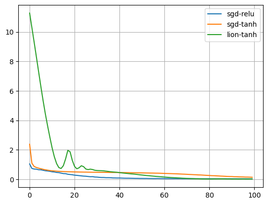
    


```python
x_pred = np.linspace(-2, 2, 100)

pred_msr = msgdr.predict(x_pred)
pred_mst = msgdt.predict(x_pred)
pred_mlt = mliot.predict(x_pred)


plt.figure(figsize=(10, 5))
plt.plot(x_pred, pred_msr, '-^',label = 'sgd relu')
plt.plot(x_pred, pred_mst, '-^',label = 'sgd tanh')
plt.plot(x_pred, pred_mlt, '-^',label = 'lion tanh')


plt.plot(x_pred, pol(x_pred), label='target')


plt.grid()
plt.legend()
plt.show()

```

    4/4 ━━━━━━━━━━━━━━━━━━━━ 0s 8ms/step 
    4/4 ━━━━━━━━━━━━━━━━━━━━ 0s 8ms/step 
    4/4 ━━━━━━━━━━━━━━━━━━━━ 0s 5ms/step 


    
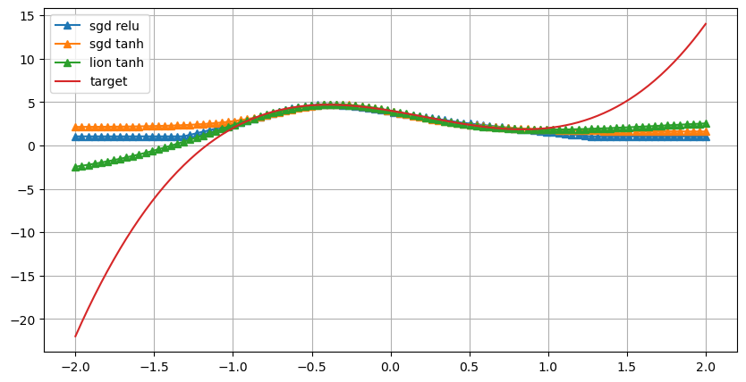
    


metti plot con la loss su questo intervallo a last epochs 

# Exercise 11.3


```python
import numpy as np
import matplotlib.pyplot as plt
import tensorflow as tf
from tensorflow.keras import Sequential
from tensorflow.keras.layers import Dense, Activation, Input
from model_def import test_arch
from drawing import DrawNN
import os
from tqdm import tqdm
import pandas as pd

```

    2025-10-09 11:53:38.416723: I tensorflow/core/platform/cpu_feature_guard.cc:210] This TensorFlow binary is optimized to use available CPU instructions in performance-critical operations.
    To enable the following instructions: SSE4.1 SSE4.2 AVX AVX2 FMA, in other operations, rebuild TensorFlow with the appropriate compiler flags.


```python
def f(x, y):
    return np.sin(x**2 + y**2)
```


```python
def gen_sinxy(nval=10000, ntrain=10000, sigma:float=0.01):
    x_valid = np.random.uniform(-3./2., 3./2., nval)
    y_valid = np.random.uniform(-3./2., 3./2., nval)
    
    x_train = np.random.uniform(-3./2., 3./2., ntrain)
    y_train = np.random.uniform(-3./2., 3./2., ntrain)
    
    
    z_target = f(x_valid, y_valid)
        
    z_valid = z_target + np.random.uniform(0, sigma, nval)
    z_train = f(x_train, y_train) + np.random.uniform(0, sigma, ntrain)

    return (x_train, y_train, z_train), (x_valid, y_valid, (z_valid, z_target))


```


```python
def NN2(
    n_layer:int=2,
    neurons:list=[3, 2],
    activations=['relu'],
    kernel_initializer='glorot_uniform'
):
    """
    Generate a Deep Neural network specifing the architecture:
    Parameters:
        - n_layer            [int]      : number of hidden layers
        - neurons            [list(int)]: number of neurons of the corresponding index layer
        - activations        [list(str)]: list of activation functions 
            (if less than the layers the last function will be apllied to the remaining layers)
        - kernel_initializer [str]      : Initializer for the `kernel` weights matrix.
    Return:
        model [Keras.Sequential]
    """

    if (len(neurons)!=n_layer):
        raise ValueError('ERROR: List of neurons incompatible with number of layers')
    model = tf.keras.Sequential()
    model.add(Input(shape=(2,))) #input layer

    activation_index=0
    
    for layer in range(n_layer):
        model.add(
            Dense(
                neurons[layer], 
                activations[activation_index],
                kernel_initializer=kernel_initializer # to confront architectures
            )
        )

        if activation_index+1<len(activations):
            activation_index+=1
    model.add(Dense(1, activation='linear'))

    return model
```


```python
def fitsin(neurs:list, opt:str, epochs:int=100, sigma:float = 0.):    

    (x_train, y_train, z_train), (x_valid, y_valid, (z_valid, z_target)) = gen_sinxy(sigma=sigma)
    
    Xtrain = np.column_stack((x_train, y_train))
    Xvalid = np.column_stack((x_valid, y_valid))

    mod = NN2(len(neurs), neurs)
    
    
    #mod.summary()
    
    mod.compile(optimizer=opt, loss='mse', metrics=['mse'])
    
    
    hist = mod.fit(
        x=Xtrain, y=z_train,
        batch_size=32, epochs=epochs, shuffle=True,
        validation_data=(Xvalid, z_valid), verbose = 0
    )
    

    return mod, hist
```


```python
from matplotlib.gridspec import GridSpec

def plot_mod_perf(mod, hist):
    
    x_pred = np.random.uniform(-3./2., 3./2., 10000)
    y_pred = np.random.uniform(-3./2., 3./2., 10000)

    conf = [2]+[k.output.shape[1] for k in mod.layers]
    
    fig = plt.figure(layout="constrained", figsize=(10, 5))

    title = 'NN 2' 
    for k in conf[1:]:
        title += f'x{k}' 
    
    fig.suptitle(title, x=0.3)
    gs = GridSpec(3, 3, figure=fig)
    ax1 = fig.add_subplot(gs[:, 0])
    DrawNN(conf).draw(ax1)
    
    # identical to ax1 = plt.subplot(gs.new_subplotspec((0, 0), colspan=3))
    ax2 = fig.add_subplot(gs[0, 1:])
    ax2.set_title('MSE')
    ax2.plot(hist.history['loss'], label='training')
    ax2.plot(hist.history['val_loss'], label='validation')
    ax2.grid()
    ax2.set_xlabel('epochs')
    ax2.set_ylabel('loss')
    ax2.legend()
    
    ax3 = fig.add_subplot(gs[1:, 1], box_aspect=1)
    hx3 = ax3.hexbin(x_valid, y_valid, C=z_valid, vmin=-1.0, vmax=1.0, gridsize=50)
    #plt.colorbar(hx, ax=ax3)
    ax3.set_title('validation', y=1)
    
    ax4 = fig.add_subplot(gs[1:, 2], box_aspect=1)
    hx4 = ax4.hexbin(
        x_pred, y_pred, 
        C=mod.predict(np.column_stack((x_pred, y_pred)), verbose=0), 
        vmin=-1.0, vmax=1.0, gridsize=50)
    plt.colorbar(hx4, ax=ax4)
    ax4.set_title('predictions')
    
    
    plt.show()

```

Example of code:
```python
archs = {
    '2x4':{},'4x2':{},'4x4':{},'4x8':{},
    '8x4':{},'8x8':{}, '8x16':{}, 
    '16x8':{}, '16x16':{}
}

for key in archs:
    comb = np.array(key.split('x'), dtype=int)
    archs[key] = {
        0.0: {},
        0.1: {},
        0.5: {},
        1.0: {}
    }
    print('training at different sigma the configuration '+key)
    for sigma in tqdm([0.0, 0.1, 0.5, 1.0]):
        mod, hist = fitsin(neurs=comb.tolist(), opt='sgd', sigma=sigma)

        archs[key][sigma] = {'mod':mod, 'hist': hist}
```


```python

archs = {
    '2x4':{},'4x2':{},'4x4':{},'4x8':{},
    '8x4':{},'8x8':{}, '8x16':{}, 
    '16x8':{}, '16x16':{}
}

for key in archs:
    comb = np.array(key.split('x'), dtype=int)
    archs[key] = {
        0.0: {},
        0.1: {},
        0.5: {},
        1.0: {}
    }
    print('training at different sigma the configuration '+key)
    for sigma in tqdm([0.0, 0.1, 0.5, 1.0]):
        mod, hist = fitsin(neurs=comb.tolist(), opt='sgd', sigma=sigma)

        archs[key][sigma] = {'mod':mod, 'hist': hist}
```

    training at different sigma the configuration 2x4


    100%|█████████████████████████████████████████████████████████████████████████████████████████████████████████████████████████████████████████████████████████████████████████████████| 4/4 [03:27<00:00, 51.93s/it]


    training at different sigma the configuration 4x2


    100%|█████████████████████████████████████████████████████████████████████████████████████████████████████████████████████████████████████████████████████████████████████████████████| 4/4 [03:27<00:00, 51.80s/it]


    training at different sigma the configuration 4x4


    100%|█████████████████████████████████████████████████████████████████████████████████████████████████████████████████████████████████████████████████████████████████████████████████| 4/4 [03:29<00:00, 52.47s/it]


    training at different sigma the configuration 4x8


    100%|█████████████████████████████████████████████████████████████████████████████████████████████████████████████████████████████████████████████████████████████████████████████████| 4/4 [03:25<00:00, 51.30s/it]


    training at different sigma the configuration 8x4


    100%|█████████████████████████████████████████████████████████████████████████████████████████████████████████████████████████████████████████████████████████████████████████████████| 4/4 [03:17<00:00, 49.48s/it]


    training at different sigma the configuration 8x8


    100%|█████████████████████████████████████████████████████████████████████████████████████████████████████████████████████████████████████████████████████████████████████████████████| 4/4 [03:16<00:00, 49.04s/it]


    training at different sigma the configuration 8x16


    100%|█████████████████████████████████████████████████████████████████████████████████████████████████████████████████████████████████████████████████████████████████████████████████| 4/4 [03:19<00:00, 49.92s/it]


    training at different sigma the configuration 16x8


    100%|█████████████████████████████████████████████████████████████████████████████████████████████████████████████████████████████████████████████████████████████████████████████████| 4/4 [04:01<00:00, 60.48s/it]


    training at different sigma the configuration 16x16


    100%|█████████████████████████████████████████████████████████████████████████████████████████████████████████████████████████████████████████████████████████████████████████████████| 4/4 [03:54<00:00, 58.69s/it]


```python

from matplotlib.gridspec import GridSpec

def plotperf(archs):
    
    fig = plt.figure(layout="constrained", figsize=(10, 40))
    #figs = fig.subfigures(len(archs), 2)
    gs = GridSpec(3*len(archs), 3, figure=fig)
    counter=0
    for key, el in archs.items():
        sigmas = el.keys()

        
    
        title = 'NN 2' 
        
        #figs[counter].suptitle(title, x=0.3)
        ax1 = fig.add_subplot(gs[3*counter:3*(counter+1), 0])
        DrawNN([2]+np.array(key.split('x'), dtype=int).tolist()+[1]).draw(ax1)
        ax1.set_title('NN 2x'+key+'x1')
        ax2 = fig.add_subplot(gs[3*counter, 1:])
        ax2.set_title('MSE')

        #ax3 = fig.add_subplot(gs[1:, 1], box_aspect=1)
        #ax3.set_title('validation', y=1)
        
        ax4 = [fig.add_subplot(gs[3*counter+k//2+1, k%2+1], box_aspect=1) for k, sigma in enumerate(sigmas)]
        [ax4[k].set_title(r'$\sigma  = $'+f'{s}') for k,s  in enumerate(sigmas)]
        

        x_pred = np.random.uniform(-3./2., 3./2., 10000)
        y_pred = np.random.uniform(-3./2., 3./2., 10000)
        
        
        for k, sigma in enumerate(sigmas):
            mod = el[sigma]['mod']
            hist = el[sigma]['hist']
    
            
        
            # identical to ax1 = plt.subplot(gs.new_subplotspec((0, 0), colspan=3))
            #ax2.plot(hist.history['loss'], label='training')
            ax2.plot(hist.history['val_loss'], label=f'sigma = {sigma}')
            
            #hx3 = ax3.hexbin(x_valid, y_valid, C=z_valid, vmin=-1.0, vmax=1.0, gridsize=50)
            #plt.colorbar(hx, ax=ax3)
            
            hx4 = ax4[k].hexbin(
                x_pred, y_pred, 
                C=mod.predict(np.column_stack((x_pred, y_pred)), verbose=0), 
                vmin=-1.0, vmax=1.0, gridsize=50)
        counter+=1
        
        ax2.grid()
        ax2.set_xlabel('epochs')
        ax2.set_ylabel('loss')
        ax2.legend(loc=(1.1,0))
        plt.colorbar(hx4, ax=ax4)
        
    
    plt.show()

```


```python
plotperf(archs)
```


    ---------------------------------------------------------------------------

    NameError                                 Traceback (most recent call last)

    Cell In[2], line 1
    ----> 1 plotperf(archs)


    NameError: name 'archs' is not defined


### Valori per sigma 0.01


```python
(x_train, y_train, z_train), (x_valid, y_valid, (z_valid, z_target)) = gen_sinxy()
```


```python
X, Y = np.meshgrid(np.linspace(-3./2., 3./2., 1000), np.linspace(-3./2., 3./2., 1000))

fig, ax = plt.subplots(1, 2,subplot_kw={"projection": "3d"}, figsize=(8, 3))
ax[0].plot_surface(X, Y, f(X, Y))

ax[1].scatter(x_train, y_train, z_train,  alpha= 0.3, c='C3', label = 'validation')
ax[1].scatter(x_valid, y_valid, z_valid,  alpha= 1.0, c='C2', label = 'validation')
ax[1].scatter(x_valid, y_valid, z_target, alpha= 1.0, c='C4', label = 'target')
ax[1].legend()
plt.tight_layout()
plt.show()
```


    
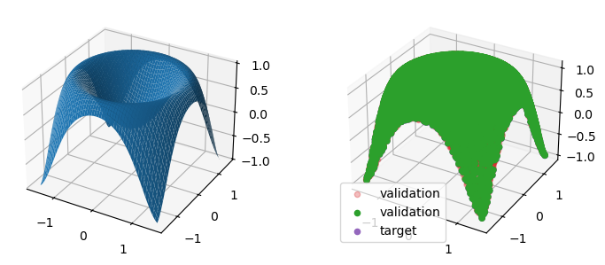
    


```python
Xtrain = np.column_stack((x_train, y_train))
Xvalid = np.column_stack((x_valid, y_valid))
```


```python
mod2x4, hist2x4 = fitsin([2,4], 'sgd')
```


<pre style="white-space:pre;overflow-x:auto;line-height:normal;font-family:Menlo,'DejaVu Sans Mono',consolas,'Courier New',monospace"><span style="font-weight: bold">Model: "sequential"</span>
</pre>


<pre style="white-space:pre;overflow-x:auto;line-height:normal;font-family:Menlo,'DejaVu Sans Mono',consolas,'Courier New',monospace">┏━━━━━━━━━━━━━━━━━━━━━━━━━━━━━━━━━┳━━━━━━━━━━━━━━━━━━━━━━━━┳━━━━━━━━━━━━━━━┓
┃<span style="font-weight: bold"> Layer (type)                    </span>┃<span style="font-weight: bold"> Output Shape           </span>┃<span style="font-weight: bold">       Param # </span>┃
┡━━━━━━━━━━━━━━━━━━━━━━━━━━━━━━━━━╇━━━━━━━━━━━━━━━━━━━━━━━━╇━━━━━━━━━━━━━━━┩
│ dense (<span style="color: #0087ff; text-decoration-color: #0087ff">Dense</span>)                   │ (<span style="color: #00d7ff; text-decoration-color: #00d7ff">None</span>, <span style="color: #00af00; text-decoration-color: #00af00">2</span>)              │             <span style="color: #00af00; text-decoration-color: #00af00">6</span> │
├─────────────────────────────────┼────────────────────────┼───────────────┤
│ dense_1 (<span style="color: #0087ff; text-decoration-color: #0087ff">Dense</span>)                 │ (<span style="color: #00d7ff; text-decoration-color: #00d7ff">None</span>, <span style="color: #00af00; text-decoration-color: #00af00">4</span>)              │            <span style="color: #00af00; text-decoration-color: #00af00">12</span> │
├─────────────────────────────────┼────────────────────────┼───────────────┤
│ dense_2 (<span style="color: #0087ff; text-decoration-color: #0087ff">Dense</span>)                 │ (<span style="color: #00d7ff; text-decoration-color: #00d7ff">None</span>, <span style="color: #00af00; text-decoration-color: #00af00">1</span>)              │             <span style="color: #00af00; text-decoration-color: #00af00">5</span> │
└─────────────────────────────────┴────────────────────────┴───────────────┘
</pre>


<pre style="white-space:pre;overflow-x:auto;line-height:normal;font-family:Menlo,'DejaVu Sans Mono',consolas,'Courier New',monospace"><span style="font-weight: bold"> Total params: </span><span style="color: #00af00; text-decoration-color: #00af00">23</span> (92.00 B)
</pre>


<pre style="white-space:pre;overflow-x:auto;line-height:normal;font-family:Menlo,'DejaVu Sans Mono',consolas,'Courier New',monospace"><span style="font-weight: bold"> Trainable params: </span><span style="color: #00af00; text-decoration-color: #00af00">23</span> (92.00 B)
</pre>


<pre style="white-space:pre;overflow-x:auto;line-height:normal;font-family:Menlo,'DejaVu Sans Mono',consolas,'Courier New',monospace"><span style="font-weight: bold"> Non-trainable params: </span><span style="color: #00af00; text-decoration-color: #00af00">0</span> (0.00 B)
</pre>


```python
mod4x2, hist4x2 = fitsin([4, 2], 'sgd')
```


<pre style="white-space:pre;overflow-x:auto;line-height:normal;font-family:Menlo,'DejaVu Sans Mono',consolas,'Courier New',monospace"><span style="font-weight: bold">Model: "sequential_1"</span>
</pre>


<pre style="white-space:pre;overflow-x:auto;line-height:normal;font-family:Menlo,'DejaVu Sans Mono',consolas,'Courier New',monospace">┏━━━━━━━━━━━━━━━━━━━━━━━━━━━━━━━━━┳━━━━━━━━━━━━━━━━━━━━━━━━┳━━━━━━━━━━━━━━━┓
┃<span style="font-weight: bold"> Layer (type)                    </span>┃<span style="font-weight: bold"> Output Shape           </span>┃<span style="font-weight: bold">       Param # </span>┃
┡━━━━━━━━━━━━━━━━━━━━━━━━━━━━━━━━━╇━━━━━━━━━━━━━━━━━━━━━━━━╇━━━━━━━━━━━━━━━┩
│ dense_3 (<span style="color: #0087ff; text-decoration-color: #0087ff">Dense</span>)                 │ (<span style="color: #00d7ff; text-decoration-color: #00d7ff">None</span>, <span style="color: #00af00; text-decoration-color: #00af00">4</span>)              │            <span style="color: #00af00; text-decoration-color: #00af00">12</span> │
├─────────────────────────────────┼────────────────────────┼───────────────┤
│ dense_4 (<span style="color: #0087ff; text-decoration-color: #0087ff">Dense</span>)                 │ (<span style="color: #00d7ff; text-decoration-color: #00d7ff">None</span>, <span style="color: #00af00; text-decoration-color: #00af00">2</span>)              │            <span style="color: #00af00; text-decoration-color: #00af00">10</span> │
├─────────────────────────────────┼────────────────────────┼───────────────┤
│ dense_5 (<span style="color: #0087ff; text-decoration-color: #0087ff">Dense</span>)                 │ (<span style="color: #00d7ff; text-decoration-color: #00d7ff">None</span>, <span style="color: #00af00; text-decoration-color: #00af00">1</span>)              │             <span style="color: #00af00; text-decoration-color: #00af00">3</span> │
└─────────────────────────────────┴────────────────────────┴───────────────┘
</pre>


<pre style="white-space:pre;overflow-x:auto;line-height:normal;font-family:Menlo,'DejaVu Sans Mono',consolas,'Courier New',monospace"><span style="font-weight: bold"> Total params: </span><span style="color: #00af00; text-decoration-color: #00af00">25</span> (100.00 B)
</pre>


<pre style="white-space:pre;overflow-x:auto;line-height:normal;font-family:Menlo,'DejaVu Sans Mono',consolas,'Courier New',monospace"><span style="font-weight: bold"> Trainable params: </span><span style="color: #00af00; text-decoration-color: #00af00">25</span> (100.00 B)
</pre>


<pre style="white-space:pre;overflow-x:auto;line-height:normal;font-family:Menlo,'DejaVu Sans Mono',consolas,'Courier New',monospace"><span style="font-weight: bold"> Non-trainable params: </span><span style="color: #00af00; text-decoration-color: #00af00">0</span> (0.00 B)
</pre>


```python
mod4x4, hist4x4 = fitsin([4, 4], 'sgd')
```


<pre style="white-space:pre;overflow-x:auto;line-height:normal;font-family:Menlo,'DejaVu Sans Mono',consolas,'Courier New',monospace"><span style="font-weight: bold">Model: "sequential_2"</span>
</pre>


<pre style="white-space:pre;overflow-x:auto;line-height:normal;font-family:Menlo,'DejaVu Sans Mono',consolas,'Courier New',monospace">┏━━━━━━━━━━━━━━━━━━━━━━━━━━━━━━━━━┳━━━━━━━━━━━━━━━━━━━━━━━━┳━━━━━━━━━━━━━━━┓
┃<span style="font-weight: bold"> Layer (type)                    </span>┃<span style="font-weight: bold"> Output Shape           </span>┃<span style="font-weight: bold">       Param # </span>┃
┡━━━━━━━━━━━━━━━━━━━━━━━━━━━━━━━━━╇━━━━━━━━━━━━━━━━━━━━━━━━╇━━━━━━━━━━━━━━━┩
│ dense_6 (<span style="color: #0087ff; text-decoration-color: #0087ff">Dense</span>)                 │ (<span style="color: #00d7ff; text-decoration-color: #00d7ff">None</span>, <span style="color: #00af00; text-decoration-color: #00af00">4</span>)              │            <span style="color: #00af00; text-decoration-color: #00af00">12</span> │
├─────────────────────────────────┼────────────────────────┼───────────────┤
│ dense_7 (<span style="color: #0087ff; text-decoration-color: #0087ff">Dense</span>)                 │ (<span style="color: #00d7ff; text-decoration-color: #00d7ff">None</span>, <span style="color: #00af00; text-decoration-color: #00af00">4</span>)              │            <span style="color: #00af00; text-decoration-color: #00af00">20</span> │
├─────────────────────────────────┼────────────────────────┼───────────────┤
│ dense_8 (<span style="color: #0087ff; text-decoration-color: #0087ff">Dense</span>)                 │ (<span style="color: #00d7ff; text-decoration-color: #00d7ff">None</span>, <span style="color: #00af00; text-decoration-color: #00af00">1</span>)              │             <span style="color: #00af00; text-decoration-color: #00af00">5</span> │
└─────────────────────────────────┴────────────────────────┴───────────────┘
</pre>


<pre style="white-space:pre;overflow-x:auto;line-height:normal;font-family:Menlo,'DejaVu Sans Mono',consolas,'Courier New',monospace"><span style="font-weight: bold"> Total params: </span><span style="color: #00af00; text-decoration-color: #00af00">37</span> (148.00 B)
</pre>


<pre style="white-space:pre;overflow-x:auto;line-height:normal;font-family:Menlo,'DejaVu Sans Mono',consolas,'Courier New',monospace"><span style="font-weight: bold"> Trainable params: </span><span style="color: #00af00; text-decoration-color: #00af00">37</span> (148.00 B)
</pre>


<pre style="white-space:pre;overflow-x:auto;line-height:normal;font-family:Menlo,'DejaVu Sans Mono',consolas,'Courier New',monospace"><span style="font-weight: bold"> Non-trainable params: </span><span style="color: #00af00; text-decoration-color: #00af00">0</span> (0.00 B)
</pre>


```python
mod4x8, hist4x8 = fitsin([4, 8], 'sgd')
```


<pre style="white-space:pre;overflow-x:auto;line-height:normal;font-family:Menlo,'DejaVu Sans Mono',consolas,'Courier New',monospace"><span style="font-weight: bold">Model: "sequential_3"</span>
</pre>


<pre style="white-space:pre;overflow-x:auto;line-height:normal;font-family:Menlo,'DejaVu Sans Mono',consolas,'Courier New',monospace">┏━━━━━━━━━━━━━━━━━━━━━━━━━━━━━━━━━┳━━━━━━━━━━━━━━━━━━━━━━━━┳━━━━━━━━━━━━━━━┓
┃<span style="font-weight: bold"> Layer (type)                    </span>┃<span style="font-weight: bold"> Output Shape           </span>┃<span style="font-weight: bold">       Param # </span>┃
┡━━━━━━━━━━━━━━━━━━━━━━━━━━━━━━━━━╇━━━━━━━━━━━━━━━━━━━━━━━━╇━━━━━━━━━━━━━━━┩
│ dense_9 (<span style="color: #0087ff; text-decoration-color: #0087ff">Dense</span>)                 │ (<span style="color: #00d7ff; text-decoration-color: #00d7ff">None</span>, <span style="color: #00af00; text-decoration-color: #00af00">4</span>)              │            <span style="color: #00af00; text-decoration-color: #00af00">12</span> │
├─────────────────────────────────┼────────────────────────┼───────────────┤
│ dense_10 (<span style="color: #0087ff; text-decoration-color: #0087ff">Dense</span>)                │ (<span style="color: #00d7ff; text-decoration-color: #00d7ff">None</span>, <span style="color: #00af00; text-decoration-color: #00af00">8</span>)              │            <span style="color: #00af00; text-decoration-color: #00af00">40</span> │
├─────────────────────────────────┼────────────────────────┼───────────────┤
│ dense_11 (<span style="color: #0087ff; text-decoration-color: #0087ff">Dense</span>)                │ (<span style="color: #00d7ff; text-decoration-color: #00d7ff">None</span>, <span style="color: #00af00; text-decoration-color: #00af00">1</span>)              │             <span style="color: #00af00; text-decoration-color: #00af00">9</span> │
└─────────────────────────────────┴────────────────────────┴───────────────┘
</pre>


<pre style="white-space:pre;overflow-x:auto;line-height:normal;font-family:Menlo,'DejaVu Sans Mono',consolas,'Courier New',monospace"><span style="font-weight: bold"> Total params: </span><span style="color: #00af00; text-decoration-color: #00af00">61</span> (244.00 B)
</pre>


<pre style="white-space:pre;overflow-x:auto;line-height:normal;font-family:Menlo,'DejaVu Sans Mono',consolas,'Courier New',monospace"><span style="font-weight: bold"> Trainable params: </span><span style="color: #00af00; text-decoration-color: #00af00">61</span> (244.00 B)
</pre>


<pre style="white-space:pre;overflow-x:auto;line-height:normal;font-family:Menlo,'DejaVu Sans Mono',consolas,'Courier New',monospace"><span style="font-weight: bold"> Non-trainable params: </span><span style="color: #00af00; text-decoration-color: #00af00">0</span> (0.00 B)
</pre>


```python
mod8x4, hist8x4 = fitsin([8, 4], 'sgd')
```


<pre style="white-space:pre;overflow-x:auto;line-height:normal;font-family:Menlo,'DejaVu Sans Mono',consolas,'Courier New',monospace"><span style="font-weight: bold">Model: "sequential_4"</span>
</pre>


<pre style="white-space:pre;overflow-x:auto;line-height:normal;font-family:Menlo,'DejaVu Sans Mono',consolas,'Courier New',monospace">┏━━━━━━━━━━━━━━━━━━━━━━━━━━━━━━━━━┳━━━━━━━━━━━━━━━━━━━━━━━━┳━━━━━━━━━━━━━━━┓
┃<span style="font-weight: bold"> Layer (type)                    </span>┃<span style="font-weight: bold"> Output Shape           </span>┃<span style="font-weight: bold">       Param # </span>┃
┡━━━━━━━━━━━━━━━━━━━━━━━━━━━━━━━━━╇━━━━━━━━━━━━━━━━━━━━━━━━╇━━━━━━━━━━━━━━━┩
│ dense_12 (<span style="color: #0087ff; text-decoration-color: #0087ff">Dense</span>)                │ (<span style="color: #00d7ff; text-decoration-color: #00d7ff">None</span>, <span style="color: #00af00; text-decoration-color: #00af00">8</span>)              │            <span style="color: #00af00; text-decoration-color: #00af00">24</span> │
├─────────────────────────────────┼────────────────────────┼───────────────┤
│ dense_13 (<span style="color: #0087ff; text-decoration-color: #0087ff">Dense</span>)                │ (<span style="color: #00d7ff; text-decoration-color: #00d7ff">None</span>, <span style="color: #00af00; text-decoration-color: #00af00">4</span>)              │            <span style="color: #00af00; text-decoration-color: #00af00">36</span> │
├─────────────────────────────────┼────────────────────────┼───────────────┤
│ dense_14 (<span style="color: #0087ff; text-decoration-color: #0087ff">Dense</span>)                │ (<span style="color: #00d7ff; text-decoration-color: #00d7ff">None</span>, <span style="color: #00af00; text-decoration-color: #00af00">1</span>)              │             <span style="color: #00af00; text-decoration-color: #00af00">5</span> │
└─────────────────────────────────┴────────────────────────┴───────────────┘
</pre>


<pre style="white-space:pre;overflow-x:auto;line-height:normal;font-family:Menlo,'DejaVu Sans Mono',consolas,'Courier New',monospace"><span style="font-weight: bold"> Total params: </span><span style="color: #00af00; text-decoration-color: #00af00">65</span> (260.00 B)
</pre>


<pre style="white-space:pre;overflow-x:auto;line-height:normal;font-family:Menlo,'DejaVu Sans Mono',consolas,'Courier New',monospace"><span style="font-weight: bold"> Trainable params: </span><span style="color: #00af00; text-decoration-color: #00af00">65</span> (260.00 B)
</pre>


<pre style="white-space:pre;overflow-x:auto;line-height:normal;font-family:Menlo,'DejaVu Sans Mono',consolas,'Courier New',monospace"><span style="font-weight: bold"> Non-trainable params: </span><span style="color: #00af00; text-decoration-color: #00af00">0</span> (0.00 B)
</pre>


```python
mod8x8, hist8x8 = fitsin([8, 8], 'sgd')
```


<pre style="white-space:pre;overflow-x:auto;line-height:normal;font-family:Menlo,'DejaVu Sans Mono',consolas,'Courier New',monospace"><span style="font-weight: bold">Model: "sequential_5"</span>
</pre>


<pre style="white-space:pre;overflow-x:auto;line-height:normal;font-family:Menlo,'DejaVu Sans Mono',consolas,'Courier New',monospace">┏━━━━━━━━━━━━━━━━━━━━━━━━━━━━━━━━━┳━━━━━━━━━━━━━━━━━━━━━━━━┳━━━━━━━━━━━━━━━┓
┃<span style="font-weight: bold"> Layer (type)                    </span>┃<span style="font-weight: bold"> Output Shape           </span>┃<span style="font-weight: bold">       Param # </span>┃
┡━━━━━━━━━━━━━━━━━━━━━━━━━━━━━━━━━╇━━━━━━━━━━━━━━━━━━━━━━━━╇━━━━━━━━━━━━━━━┩
│ dense_15 (<span style="color: #0087ff; text-decoration-color: #0087ff">Dense</span>)                │ (<span style="color: #00d7ff; text-decoration-color: #00d7ff">None</span>, <span style="color: #00af00; text-decoration-color: #00af00">8</span>)              │            <span style="color: #00af00; text-decoration-color: #00af00">24</span> │
├─────────────────────────────────┼────────────────────────┼───────────────┤
│ dense_16 (<span style="color: #0087ff; text-decoration-color: #0087ff">Dense</span>)                │ (<span style="color: #00d7ff; text-decoration-color: #00d7ff">None</span>, <span style="color: #00af00; text-decoration-color: #00af00">8</span>)              │            <span style="color: #00af00; text-decoration-color: #00af00">72</span> │
├─────────────────────────────────┼────────────────────────┼───────────────┤
│ dense_17 (<span style="color: #0087ff; text-decoration-color: #0087ff">Dense</span>)                │ (<span style="color: #00d7ff; text-decoration-color: #00d7ff">None</span>, <span style="color: #00af00; text-decoration-color: #00af00">1</span>)              │             <span style="color: #00af00; text-decoration-color: #00af00">9</span> │
└─────────────────────────────────┴────────────────────────┴───────────────┘
</pre>


<pre style="white-space:pre;overflow-x:auto;line-height:normal;font-family:Menlo,'DejaVu Sans Mono',consolas,'Courier New',monospace"><span style="font-weight: bold"> Total params: </span><span style="color: #00af00; text-decoration-color: #00af00">105</span> (420.00 B)
</pre>


<pre style="white-space:pre;overflow-x:auto;line-height:normal;font-family:Menlo,'DejaVu Sans Mono',consolas,'Courier New',monospace"><span style="font-weight: bold"> Trainable params: </span><span style="color: #00af00; text-decoration-color: #00af00">105</span> (420.00 B)
</pre>


<pre style="white-space:pre;overflow-x:auto;line-height:normal;font-family:Menlo,'DejaVu Sans Mono',consolas,'Courier New',monospace"><span style="font-weight: bold"> Non-trainable params: </span><span style="color: #00af00; text-decoration-color: #00af00">0</span> (0.00 B)
</pre>


```python
mod8x16, hist8x16 = fitsin([8, 16], 'sgd')
```


<pre style="white-space:pre;overflow-x:auto;line-height:normal;font-family:Menlo,'DejaVu Sans Mono',consolas,'Courier New',monospace"><span style="font-weight: bold">Model: "sequential_6"</span>
</pre>


<pre style="white-space:pre;overflow-x:auto;line-height:normal;font-family:Menlo,'DejaVu Sans Mono',consolas,'Courier New',monospace">┏━━━━━━━━━━━━━━━━━━━━━━━━━━━━━━━━━┳━━━━━━━━━━━━━━━━━━━━━━━━┳━━━━━━━━━━━━━━━┓
┃<span style="font-weight: bold"> Layer (type)                    </span>┃<span style="font-weight: bold"> Output Shape           </span>┃<span style="font-weight: bold">       Param # </span>┃
┡━━━━━━━━━━━━━━━━━━━━━━━━━━━━━━━━━╇━━━━━━━━━━━━━━━━━━━━━━━━╇━━━━━━━━━━━━━━━┩
│ dense_18 (<span style="color: #0087ff; text-decoration-color: #0087ff">Dense</span>)                │ (<span style="color: #00d7ff; text-decoration-color: #00d7ff">None</span>, <span style="color: #00af00; text-decoration-color: #00af00">8</span>)              │            <span style="color: #00af00; text-decoration-color: #00af00">24</span> │
├─────────────────────────────────┼────────────────────────┼───────────────┤
│ dense_19 (<span style="color: #0087ff; text-decoration-color: #0087ff">Dense</span>)                │ (<span style="color: #00d7ff; text-decoration-color: #00d7ff">None</span>, <span style="color: #00af00; text-decoration-color: #00af00">16</span>)             │           <span style="color: #00af00; text-decoration-color: #00af00">144</span> │
├─────────────────────────────────┼────────────────────────┼───────────────┤
│ dense_20 (<span style="color: #0087ff; text-decoration-color: #0087ff">Dense</span>)                │ (<span style="color: #00d7ff; text-decoration-color: #00d7ff">None</span>, <span style="color: #00af00; text-decoration-color: #00af00">1</span>)              │            <span style="color: #00af00; text-decoration-color: #00af00">17</span> │
└─────────────────────────────────┴────────────────────────┴───────────────┘
</pre>


<pre style="white-space:pre;overflow-x:auto;line-height:normal;font-family:Menlo,'DejaVu Sans Mono',consolas,'Courier New',monospace"><span style="font-weight: bold"> Total params: </span><span style="color: #00af00; text-decoration-color: #00af00">185</span> (740.00 B)
</pre>


<pre style="white-space:pre;overflow-x:auto;line-height:normal;font-family:Menlo,'DejaVu Sans Mono',consolas,'Courier New',monospace"><span style="font-weight: bold"> Trainable params: </span><span style="color: #00af00; text-decoration-color: #00af00">185</span> (740.00 B)
</pre>


<pre style="white-space:pre;overflow-x:auto;line-height:normal;font-family:Menlo,'DejaVu Sans Mono',consolas,'Courier New',monospace"><span style="font-weight: bold"> Non-trainable params: </span><span style="color: #00af00; text-decoration-color: #00af00">0</span> (0.00 B)
</pre>


```python
mod16x8, hist16x8 = fitsin([16, 8], 'sgd')
```


<pre style="white-space:pre;overflow-x:auto;line-height:normal;font-family:Menlo,'DejaVu Sans Mono',consolas,'Courier New',monospace"><span style="font-weight: bold">Model: "sequential_7"</span>
</pre>


<pre style="white-space:pre;overflow-x:auto;line-height:normal;font-family:Menlo,'DejaVu Sans Mono',consolas,'Courier New',monospace">┏━━━━━━━━━━━━━━━━━━━━━━━━━━━━━━━━━┳━━━━━━━━━━━━━━━━━━━━━━━━┳━━━━━━━━━━━━━━━┓
┃<span style="font-weight: bold"> Layer (type)                    </span>┃<span style="font-weight: bold"> Output Shape           </span>┃<span style="font-weight: bold">       Param # </span>┃
┡━━━━━━━━━━━━━━━━━━━━━━━━━━━━━━━━━╇━━━━━━━━━━━━━━━━━━━━━━━━╇━━━━━━━━━━━━━━━┩
│ dense_21 (<span style="color: #0087ff; text-decoration-color: #0087ff">Dense</span>)                │ (<span style="color: #00d7ff; text-decoration-color: #00d7ff">None</span>, <span style="color: #00af00; text-decoration-color: #00af00">16</span>)             │            <span style="color: #00af00; text-decoration-color: #00af00">48</span> │
├─────────────────────────────────┼────────────────────────┼───────────────┤
│ dense_22 (<span style="color: #0087ff; text-decoration-color: #0087ff">Dense</span>)                │ (<span style="color: #00d7ff; text-decoration-color: #00d7ff">None</span>, <span style="color: #00af00; text-decoration-color: #00af00">8</span>)              │           <span style="color: #00af00; text-decoration-color: #00af00">136</span> │
├─────────────────────────────────┼────────────────────────┼───────────────┤
│ dense_23 (<span style="color: #0087ff; text-decoration-color: #0087ff">Dense</span>)                │ (<span style="color: #00d7ff; text-decoration-color: #00d7ff">None</span>, <span style="color: #00af00; text-decoration-color: #00af00">1</span>)              │             <span style="color: #00af00; text-decoration-color: #00af00">9</span> │
└─────────────────────────────────┴────────────────────────┴───────────────┘
</pre>


<pre style="white-space:pre;overflow-x:auto;line-height:normal;font-family:Menlo,'DejaVu Sans Mono',consolas,'Courier New',monospace"><span style="font-weight: bold"> Total params: </span><span style="color: #00af00; text-decoration-color: #00af00">193</span> (772.00 B)
</pre>


<pre style="white-space:pre;overflow-x:auto;line-height:normal;font-family:Menlo,'DejaVu Sans Mono',consolas,'Courier New',monospace"><span style="font-weight: bold"> Trainable params: </span><span style="color: #00af00; text-decoration-color: #00af00">193</span> (772.00 B)
</pre>


<pre style="white-space:pre;overflow-x:auto;line-height:normal;font-family:Menlo,'DejaVu Sans Mono',consolas,'Courier New',monospace"><span style="font-weight: bold"> Non-trainable params: </span><span style="color: #00af00; text-decoration-color: #00af00">0</span> (0.00 B)
</pre>


```python
mod16x16, hist16x16 =fitsin([16,16], 'sgd')
```


<pre style="white-space:pre;overflow-x:auto;line-height:normal;font-family:Menlo,'DejaVu Sans Mono',consolas,'Courier New',monospace"><span style="font-weight: bold">Model: "sequential_8"</span>
</pre>


<pre style="white-space:pre;overflow-x:auto;line-height:normal;font-family:Menlo,'DejaVu Sans Mono',consolas,'Courier New',monospace">┏━━━━━━━━━━━━━━━━━━━━━━━━━━━━━━━━━┳━━━━━━━━━━━━━━━━━━━━━━━━┳━━━━━━━━━━━━━━━┓
┃<span style="font-weight: bold"> Layer (type)                    </span>┃<span style="font-weight: bold"> Output Shape           </span>┃<span style="font-weight: bold">       Param # </span>┃
┡━━━━━━━━━━━━━━━━━━━━━━━━━━━━━━━━━╇━━━━━━━━━━━━━━━━━━━━━━━━╇━━━━━━━━━━━━━━━┩
│ dense_24 (<span style="color: #0087ff; text-decoration-color: #0087ff">Dense</span>)                │ (<span style="color: #00d7ff; text-decoration-color: #00d7ff">None</span>, <span style="color: #00af00; text-decoration-color: #00af00">16</span>)             │            <span style="color: #00af00; text-decoration-color: #00af00">48</span> │
├─────────────────────────────────┼────────────────────────┼───────────────┤
│ dense_25 (<span style="color: #0087ff; text-decoration-color: #0087ff">Dense</span>)                │ (<span style="color: #00d7ff; text-decoration-color: #00d7ff">None</span>, <span style="color: #00af00; text-decoration-color: #00af00">16</span>)             │           <span style="color: #00af00; text-decoration-color: #00af00">272</span> │
├─────────────────────────────────┼────────────────────────┼───────────────┤
│ dense_26 (<span style="color: #0087ff; text-decoration-color: #0087ff">Dense</span>)                │ (<span style="color: #00d7ff; text-decoration-color: #00d7ff">None</span>, <span style="color: #00af00; text-decoration-color: #00af00">1</span>)              │            <span style="color: #00af00; text-decoration-color: #00af00">17</span> │
└─────────────────────────────────┴────────────────────────┴───────────────┘
</pre>


<pre style="white-space:pre;overflow-x:auto;line-height:normal;font-family:Menlo,'DejaVu Sans Mono',consolas,'Courier New',monospace"><span style="font-weight: bold"> Total params: </span><span style="color: #00af00; text-decoration-color: #00af00">337</span> (1.32 KB)
</pre>


<pre style="white-space:pre;overflow-x:auto;line-height:normal;font-family:Menlo,'DejaVu Sans Mono',consolas,'Courier New',monospace"><span style="font-weight: bold"> Trainable params: </span><span style="color: #00af00; text-decoration-color: #00af00">337</span> (1.32 KB)
</pre>


<pre style="white-space:pre;overflow-x:auto;line-height:normal;font-family:Menlo,'DejaVu Sans Mono',consolas,'Courier New',monospace"><span style="font-weight: bold"> Non-trainable params: </span><span style="color: #00af00; text-decoration-color: #00af00">0</span> (0.00 B)
</pre>


```python
plot_mod_perf(mod2x4,   hist2x4) 
plot_mod_perf(mod4x2,   hist4x2) 
plot_mod_perf(mod4x4,   hist4x4) 
plot_mod_perf(mod4x8,   hist4x8) 
plot_mod_perf(mod8x4,   hist8x4)
plot_mod_perf(mod8x8,   hist8x8) 
plot_mod_perf(mod8x16,  hist8x16) 
plot_mod_perf(mod16x8,  hist8x16)
plot_mod_perf(mod16x16, hist16x16)
```


    
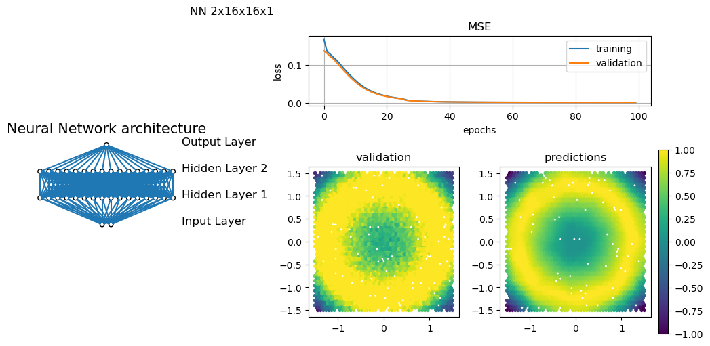
    


    
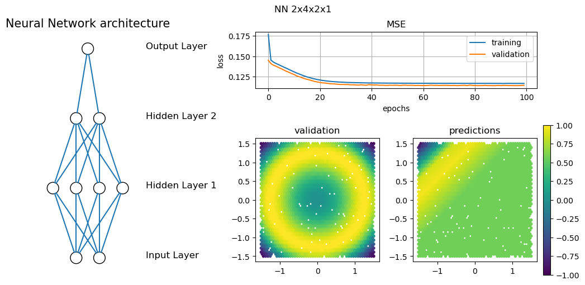
    


    
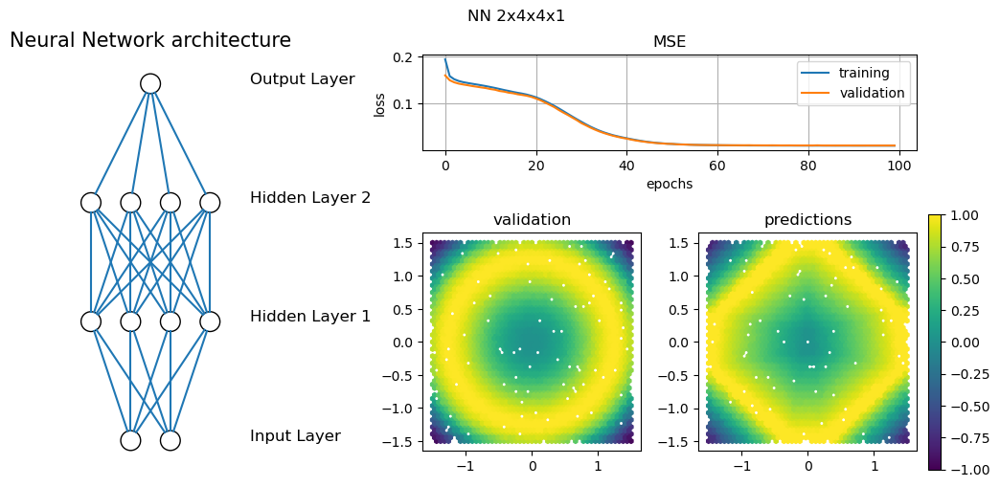
    


    

    


    
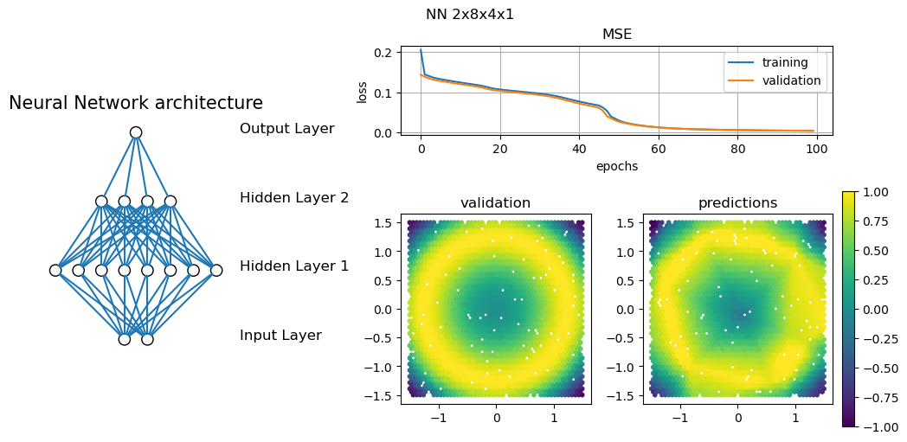
    


    
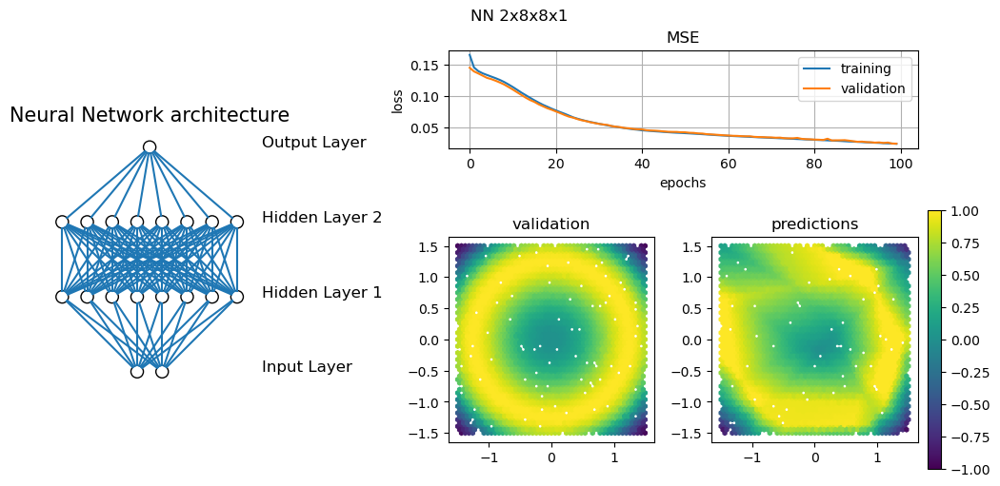
    


    
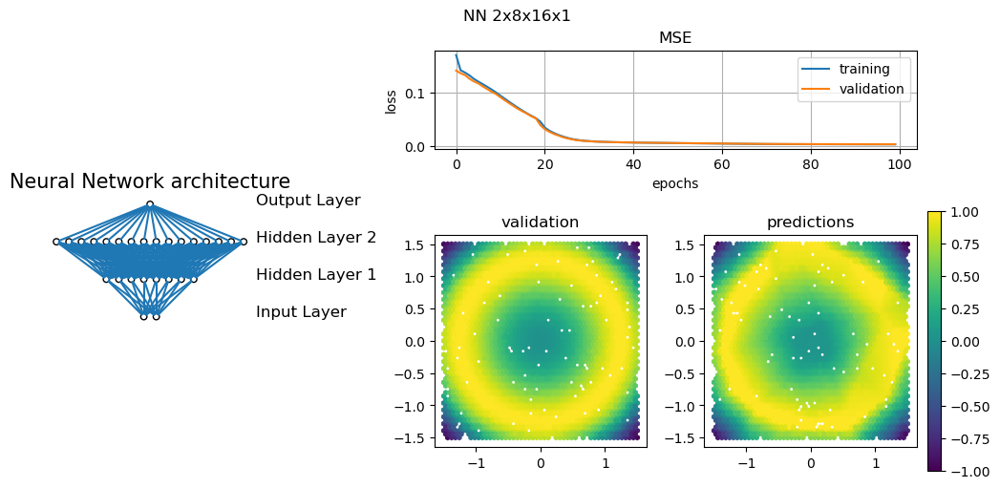
    


    
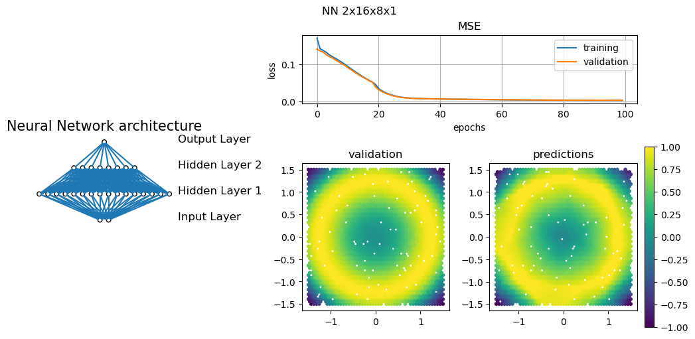
    


    
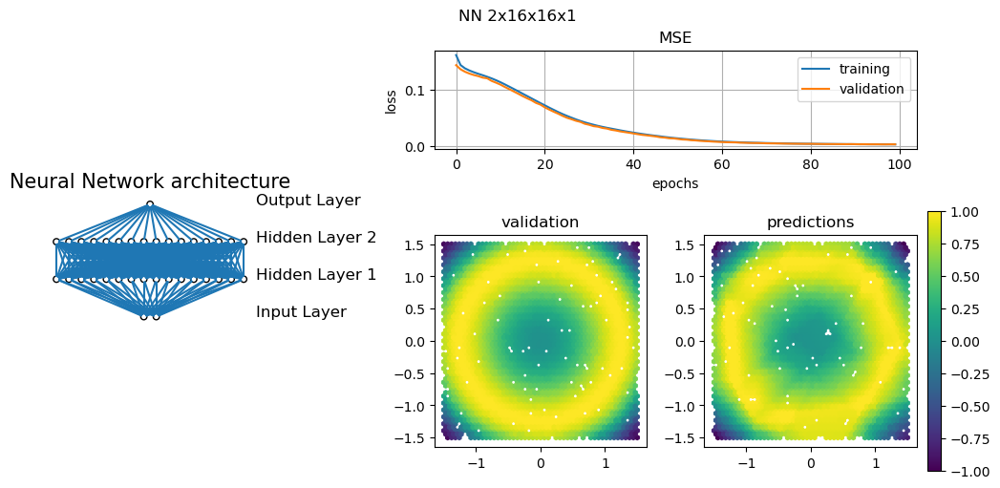
    


fai lo stesso plot ma con colonne  a diversi val di sigma x diversi ottimizzatori


### Valori per sigma = 0.1


```python
(x_train, y_train, z_train), (x_valid, y_valid, (z_valid, z_target)) = gen_sinxy(sigma=0.1)
```


```python
X, Y = np.meshgrid(np.linspace(-3./2., 3./2., 1000), np.linspace(-3./2., 3./2., 1000))

fig, ax = plt.subplots(1, 2,subplot_kw={"projection": "3d"}, figsize=(8, 3))
ax[0].plot_surface(X, Y, f(X, Y))

ax[1].scatter(x_train, y_train, z_train,  alpha= 0.3, c='C3', label = 'validation')
ax[1].scatter(x_valid, y_valid, z_valid,  alpha= 1.0, c='C2', label = 'validation')
ax[1].scatter(x_valid, y_valid, z_target, alpha= 1.0, c='C4', label = 'target')
ax[1].legend()
plt.tight_layout()
plt.show()
```


    

    


```python
Xtrain = np.column_stack((x_train, y_train))
Xvalid = np.column_stack((x_valid, y_valid))
```


```python

```


```python
mod2x4_s01, hist2x4_s01 = fitsin([2,4], 'sgd')
```


<pre style="white-space:pre;overflow-x:auto;line-height:normal;font-family:Menlo,'DejaVu Sans Mono',consolas,'Courier New',monospace"><span style="font-weight: bold">Model: "sequential_9"</span>
</pre>


<pre style="white-space:pre;overflow-x:auto;line-height:normal;font-family:Menlo,'DejaVu Sans Mono',consolas,'Courier New',monospace">┏━━━━━━━━━━━━━━━━━━━━━━━━━━━━━━━━━┳━━━━━━━━━━━━━━━━━━━━━━━━┳━━━━━━━━━━━━━━━┓
┃<span style="font-weight: bold"> Layer (type)                    </span>┃<span style="font-weight: bold"> Output Shape           </span>┃<span style="font-weight: bold">       Param # </span>┃
┡━━━━━━━━━━━━━━━━━━━━━━━━━━━━━━━━━╇━━━━━━━━━━━━━━━━━━━━━━━━╇━━━━━━━━━━━━━━━┩
│ dense_27 (<span style="color: #0087ff; text-decoration-color: #0087ff">Dense</span>)                │ (<span style="color: #00d7ff; text-decoration-color: #00d7ff">None</span>, <span style="color: #00af00; text-decoration-color: #00af00">2</span>)              │             <span style="color: #00af00; text-decoration-color: #00af00">6</span> │
├─────────────────────────────────┼────────────────────────┼───────────────┤
│ dense_28 (<span style="color: #0087ff; text-decoration-color: #0087ff">Dense</span>)                │ (<span style="color: #00d7ff; text-decoration-color: #00d7ff">None</span>, <span style="color: #00af00; text-decoration-color: #00af00">4</span>)              │            <span style="color: #00af00; text-decoration-color: #00af00">12</span> │
├─────────────────────────────────┼────────────────────────┼───────────────┤
│ dense_29 (<span style="color: #0087ff; text-decoration-color: #0087ff">Dense</span>)                │ (<span style="color: #00d7ff; text-decoration-color: #00d7ff">None</span>, <span style="color: #00af00; text-decoration-color: #00af00">1</span>)              │             <span style="color: #00af00; text-decoration-color: #00af00">5</span> │
└─────────────────────────────────┴────────────────────────┴───────────────┘
</pre>


<pre style="white-space:pre;overflow-x:auto;line-height:normal;font-family:Menlo,'DejaVu Sans Mono',consolas,'Courier New',monospace"><span style="font-weight: bold"> Total params: </span><span style="color: #00af00; text-decoration-color: #00af00">23</span> (92.00 B)
</pre>


<pre style="white-space:pre;overflow-x:auto;line-height:normal;font-family:Menlo,'DejaVu Sans Mono',consolas,'Courier New',monospace"><span style="font-weight: bold"> Trainable params: </span><span style="color: #00af00; text-decoration-color: #00af00">23</span> (92.00 B)
</pre>


<pre style="white-space:pre;overflow-x:auto;line-height:normal;font-family:Menlo,'DejaVu Sans Mono',consolas,'Courier New',monospace"><span style="font-weight: bold"> Non-trainable params: </span><span style="color: #00af00; text-decoration-color: #00af00">0</span> (0.00 B)
</pre>


```python
mod4x2_s01, hist4x2_s01 = fitsin([4, 2], 'sgd')
```


<pre style="white-space:pre;overflow-x:auto;line-height:normal;font-family:Menlo,'DejaVu Sans Mono',consolas,'Courier New',monospace"><span style="font-weight: bold">Model: "sequential_10"</span>
</pre>


<pre style="white-space:pre;overflow-x:auto;line-height:normal;font-family:Menlo,'DejaVu Sans Mono',consolas,'Courier New',monospace">┏━━━━━━━━━━━━━━━━━━━━━━━━━━━━━━━━━┳━━━━━━━━━━━━━━━━━━━━━━━━┳━━━━━━━━━━━━━━━┓
┃<span style="font-weight: bold"> Layer (type)                    </span>┃<span style="font-weight: bold"> Output Shape           </span>┃<span style="font-weight: bold">       Param # </span>┃
┡━━━━━━━━━━━━━━━━━━━━━━━━━━━━━━━━━╇━━━━━━━━━━━━━━━━━━━━━━━━╇━━━━━━━━━━━━━━━┩
│ dense_30 (<span style="color: #0087ff; text-decoration-color: #0087ff">Dense</span>)                │ (<span style="color: #00d7ff; text-decoration-color: #00d7ff">None</span>, <span style="color: #00af00; text-decoration-color: #00af00">4</span>)              │            <span style="color: #00af00; text-decoration-color: #00af00">12</span> │
├─────────────────────────────────┼────────────────────────┼───────────────┤
│ dense_31 (<span style="color: #0087ff; text-decoration-color: #0087ff">Dense</span>)                │ (<span style="color: #00d7ff; text-decoration-color: #00d7ff">None</span>, <span style="color: #00af00; text-decoration-color: #00af00">2</span>)              │            <span style="color: #00af00; text-decoration-color: #00af00">10</span> │
├─────────────────────────────────┼────────────────────────┼───────────────┤
│ dense_32 (<span style="color: #0087ff; text-decoration-color: #0087ff">Dense</span>)                │ (<span style="color: #00d7ff; text-decoration-color: #00d7ff">None</span>, <span style="color: #00af00; text-decoration-color: #00af00">1</span>)              │             <span style="color: #00af00; text-decoration-color: #00af00">3</span> │
└─────────────────────────────────┴────────────────────────┴───────────────┘
</pre>


<pre style="white-space:pre;overflow-x:auto;line-height:normal;font-family:Menlo,'DejaVu Sans Mono',consolas,'Courier New',monospace"><span style="font-weight: bold"> Total params: </span><span style="color: #00af00; text-decoration-color: #00af00">25</span> (100.00 B)
</pre>


<pre style="white-space:pre;overflow-x:auto;line-height:normal;font-family:Menlo,'DejaVu Sans Mono',consolas,'Courier New',monospace"><span style="font-weight: bold"> Trainable params: </span><span style="color: #00af00; text-decoration-color: #00af00">25</span> (100.00 B)
</pre>


<pre style="white-space:pre;overflow-x:auto;line-height:normal;font-family:Menlo,'DejaVu Sans Mono',consolas,'Courier New',monospace"><span style="font-weight: bold"> Non-trainable params: </span><span style="color: #00af00; text-decoration-color: #00af00">0</span> (0.00 B)
</pre>


```python
mod4x4_s01, hist4x4_s01 = fitsin([4, 4], 'sgd')
```


<pre style="white-space:pre;overflow-x:auto;line-height:normal;font-family:Menlo,'DejaVu Sans Mono',consolas,'Courier New',monospace"><span style="font-weight: bold">Model: "sequential_11"</span>
</pre>


<pre style="white-space:pre;overflow-x:auto;line-height:normal;font-family:Menlo,'DejaVu Sans Mono',consolas,'Courier New',monospace">┏━━━━━━━━━━━━━━━━━━━━━━━━━━━━━━━━━┳━━━━━━━━━━━━━━━━━━━━━━━━┳━━━━━━━━━━━━━━━┓
┃<span style="font-weight: bold"> Layer (type)                    </span>┃<span style="font-weight: bold"> Output Shape           </span>┃<span style="font-weight: bold">       Param # </span>┃
┡━━━━━━━━━━━━━━━━━━━━━━━━━━━━━━━━━╇━━━━━━━━━━━━━━━━━━━━━━━━╇━━━━━━━━━━━━━━━┩
│ dense_33 (<span style="color: #0087ff; text-decoration-color: #0087ff">Dense</span>)                │ (<span style="color: #00d7ff; text-decoration-color: #00d7ff">None</span>, <span style="color: #00af00; text-decoration-color: #00af00">4</span>)              │            <span style="color: #00af00; text-decoration-color: #00af00">12</span> │
├─────────────────────────────────┼────────────────────────┼───────────────┤
│ dense_34 (<span style="color: #0087ff; text-decoration-color: #0087ff">Dense</span>)                │ (<span style="color: #00d7ff; text-decoration-color: #00d7ff">None</span>, <span style="color: #00af00; text-decoration-color: #00af00">4</span>)              │            <span style="color: #00af00; text-decoration-color: #00af00">20</span> │
├─────────────────────────────────┼────────────────────────┼───────────────┤
│ dense_35 (<span style="color: #0087ff; text-decoration-color: #0087ff">Dense</span>)                │ (<span style="color: #00d7ff; text-decoration-color: #00d7ff">None</span>, <span style="color: #00af00; text-decoration-color: #00af00">1</span>)              │             <span style="color: #00af00; text-decoration-color: #00af00">5</span> │
└─────────────────────────────────┴────────────────────────┴───────────────┘
</pre>


<pre style="white-space:pre;overflow-x:auto;line-height:normal;font-family:Menlo,'DejaVu Sans Mono',consolas,'Courier New',monospace"><span style="font-weight: bold"> Total params: </span><span style="color: #00af00; text-decoration-color: #00af00">37</span> (148.00 B)
</pre>


<pre style="white-space:pre;overflow-x:auto;line-height:normal;font-family:Menlo,'DejaVu Sans Mono',consolas,'Courier New',monospace"><span style="font-weight: bold"> Trainable params: </span><span style="color: #00af00; text-decoration-color: #00af00">37</span> (148.00 B)
</pre>


<pre style="white-space:pre;overflow-x:auto;line-height:normal;font-family:Menlo,'DejaVu Sans Mono',consolas,'Courier New',monospace"><span style="font-weight: bold"> Non-trainable params: </span><span style="color: #00af00; text-decoration-color: #00af00">0</span> (0.00 B)
</pre>


```python
mod4x8_s01, hist4x8_s01 = fitsin([4, 8], 'sgd')
```


<pre style="white-space:pre;overflow-x:auto;line-height:normal;font-family:Menlo,'DejaVu Sans Mono',consolas,'Courier New',monospace"><span style="font-weight: bold">Model: "sequential_12"</span>
</pre>


<pre style="white-space:pre;overflow-x:auto;line-height:normal;font-family:Menlo,'DejaVu Sans Mono',consolas,'Courier New',monospace">┏━━━━━━━━━━━━━━━━━━━━━━━━━━━━━━━━━┳━━━━━━━━━━━━━━━━━━━━━━━━┳━━━━━━━━━━━━━━━┓
┃<span style="font-weight: bold"> Layer (type)                    </span>┃<span style="font-weight: bold"> Output Shape           </span>┃<span style="font-weight: bold">       Param # </span>┃
┡━━━━━━━━━━━━━━━━━━━━━━━━━━━━━━━━━╇━━━━━━━━━━━━━━━━━━━━━━━━╇━━━━━━━━━━━━━━━┩
│ dense_36 (<span style="color: #0087ff; text-decoration-color: #0087ff">Dense</span>)                │ (<span style="color: #00d7ff; text-decoration-color: #00d7ff">None</span>, <span style="color: #00af00; text-decoration-color: #00af00">4</span>)              │            <span style="color: #00af00; text-decoration-color: #00af00">12</span> │
├─────────────────────────────────┼────────────────────────┼───────────────┤
│ dense_37 (<span style="color: #0087ff; text-decoration-color: #0087ff">Dense</span>)                │ (<span style="color: #00d7ff; text-decoration-color: #00d7ff">None</span>, <span style="color: #00af00; text-decoration-color: #00af00">8</span>)              │            <span style="color: #00af00; text-decoration-color: #00af00">40</span> │
├─────────────────────────────────┼────────────────────────┼───────────────┤
│ dense_38 (<span style="color: #0087ff; text-decoration-color: #0087ff">Dense</span>)                │ (<span style="color: #00d7ff; text-decoration-color: #00d7ff">None</span>, <span style="color: #00af00; text-decoration-color: #00af00">1</span>)              │             <span style="color: #00af00; text-decoration-color: #00af00">9</span> │
└─────────────────────────────────┴────────────────────────┴───────────────┘
</pre>


<pre style="white-space:pre;overflow-x:auto;line-height:normal;font-family:Menlo,'DejaVu Sans Mono',consolas,'Courier New',monospace"><span style="font-weight: bold"> Total params: </span><span style="color: #00af00; text-decoration-color: #00af00">61</span> (244.00 B)
</pre>


<pre style="white-space:pre;overflow-x:auto;line-height:normal;font-family:Menlo,'DejaVu Sans Mono',consolas,'Courier New',monospace"><span style="font-weight: bold"> Trainable params: </span><span style="color: #00af00; text-decoration-color: #00af00">61</span> (244.00 B)
</pre>


<pre style="white-space:pre;overflow-x:auto;line-height:normal;font-family:Menlo,'DejaVu Sans Mono',consolas,'Courier New',monospace"><span style="font-weight: bold"> Non-trainable params: </span><span style="color: #00af00; text-decoration-color: #00af00">0</span> (0.00 B)
</pre>


```python
mod8x4_s01, hist8x4_s01 = fitsin([8, 4], 'sgd')
```


<pre style="white-space:pre;overflow-x:auto;line-height:normal;font-family:Menlo,'DejaVu Sans Mono',consolas,'Courier New',monospace"><span style="font-weight: bold">Model: "sequential_13"</span>
</pre>


<pre style="white-space:pre;overflow-x:auto;line-height:normal;font-family:Menlo,'DejaVu Sans Mono',consolas,'Courier New',monospace">┏━━━━━━━━━━━━━━━━━━━━━━━━━━━━━━━━━┳━━━━━━━━━━━━━━━━━━━━━━━━┳━━━━━━━━━━━━━━━┓
┃<span style="font-weight: bold"> Layer (type)                    </span>┃<span style="font-weight: bold"> Output Shape           </span>┃<span style="font-weight: bold">       Param # </span>┃
┡━━━━━━━━━━━━━━━━━━━━━━━━━━━━━━━━━╇━━━━━━━━━━━━━━━━━━━━━━━━╇━━━━━━━━━━━━━━━┩
│ dense_39 (<span style="color: #0087ff; text-decoration-color: #0087ff">Dense</span>)                │ (<span style="color: #00d7ff; text-decoration-color: #00d7ff">None</span>, <span style="color: #00af00; text-decoration-color: #00af00">8</span>)              │            <span style="color: #00af00; text-decoration-color: #00af00">24</span> │
├─────────────────────────────────┼────────────────────────┼───────────────┤
│ dense_40 (<span style="color: #0087ff; text-decoration-color: #0087ff">Dense</span>)                │ (<span style="color: #00d7ff; text-decoration-color: #00d7ff">None</span>, <span style="color: #00af00; text-decoration-color: #00af00">4</span>)              │            <span style="color: #00af00; text-decoration-color: #00af00">36</span> │
├─────────────────────────────────┼────────────────────────┼───────────────┤
│ dense_41 (<span style="color: #0087ff; text-decoration-color: #0087ff">Dense</span>)                │ (<span style="color: #00d7ff; text-decoration-color: #00d7ff">None</span>, <span style="color: #00af00; text-decoration-color: #00af00">1</span>)              │             <span style="color: #00af00; text-decoration-color: #00af00">5</span> │
└─────────────────────────────────┴────────────────────────┴───────────────┘
</pre>


<pre style="white-space:pre;overflow-x:auto;line-height:normal;font-family:Menlo,'DejaVu Sans Mono',consolas,'Courier New',monospace"><span style="font-weight: bold"> Total params: </span><span style="color: #00af00; text-decoration-color: #00af00">65</span> (260.00 B)
</pre>


<pre style="white-space:pre;overflow-x:auto;line-height:normal;font-family:Menlo,'DejaVu Sans Mono',consolas,'Courier New',monospace"><span style="font-weight: bold"> Trainable params: </span><span style="color: #00af00; text-decoration-color: #00af00">65</span> (260.00 B)
</pre>


<pre style="white-space:pre;overflow-x:auto;line-height:normal;font-family:Menlo,'DejaVu Sans Mono',consolas,'Courier New',monospace"><span style="font-weight: bold"> Non-trainable params: </span><span style="color: #00af00; text-decoration-color: #00af00">0</span> (0.00 B)
</pre>


```python
mod8x8_s01, hist8x8_s01 = fitsin([8, 8], 'sgd')
```


<pre style="white-space:pre;overflow-x:auto;line-height:normal;font-family:Menlo,'DejaVu Sans Mono',consolas,'Courier New',monospace"><span style="font-weight: bold">Model: "sequential_14"</span>
</pre>


<pre style="white-space:pre;overflow-x:auto;line-height:normal;font-family:Menlo,'DejaVu Sans Mono',consolas,'Courier New',monospace">┏━━━━━━━━━━━━━━━━━━━━━━━━━━━━━━━━━┳━━━━━━━━━━━━━━━━━━━━━━━━┳━━━━━━━━━━━━━━━┓
┃<span style="font-weight: bold"> Layer (type)                    </span>┃<span style="font-weight: bold"> Output Shape           </span>┃<span style="font-weight: bold">       Param # </span>┃
┡━━━━━━━━━━━━━━━━━━━━━━━━━━━━━━━━━╇━━━━━━━━━━━━━━━━━━━━━━━━╇━━━━━━━━━━━━━━━┩
│ dense_42 (<span style="color: #0087ff; text-decoration-color: #0087ff">Dense</span>)                │ (<span style="color: #00d7ff; text-decoration-color: #00d7ff">None</span>, <span style="color: #00af00; text-decoration-color: #00af00">8</span>)              │            <span style="color: #00af00; text-decoration-color: #00af00">24</span> │
├─────────────────────────────────┼────────────────────────┼───────────────┤
│ dense_43 (<span style="color: #0087ff; text-decoration-color: #0087ff">Dense</span>)                │ (<span style="color: #00d7ff; text-decoration-color: #00d7ff">None</span>, <span style="color: #00af00; text-decoration-color: #00af00">8</span>)              │            <span style="color: #00af00; text-decoration-color: #00af00">72</span> │
├─────────────────────────────────┼────────────────────────┼───────────────┤
│ dense_44 (<span style="color: #0087ff; text-decoration-color: #0087ff">Dense</span>)                │ (<span style="color: #00d7ff; text-decoration-color: #00d7ff">None</span>, <span style="color: #00af00; text-decoration-color: #00af00">1</span>)              │             <span style="color: #00af00; text-decoration-color: #00af00">9</span> │
└─────────────────────────────────┴────────────────────────┴───────────────┘
</pre>


<pre style="white-space:pre;overflow-x:auto;line-height:normal;font-family:Menlo,'DejaVu Sans Mono',consolas,'Courier New',monospace"><span style="font-weight: bold"> Total params: </span><span style="color: #00af00; text-decoration-color: #00af00">105</span> (420.00 B)
</pre>


<pre style="white-space:pre;overflow-x:auto;line-height:normal;font-family:Menlo,'DejaVu Sans Mono',consolas,'Courier New',monospace"><span style="font-weight: bold"> Trainable params: </span><span style="color: #00af00; text-decoration-color: #00af00">105</span> (420.00 B)
</pre>


<pre style="white-space:pre;overflow-x:auto;line-height:normal;font-family:Menlo,'DejaVu Sans Mono',consolas,'Courier New',monospace"><span style="font-weight: bold"> Non-trainable params: </span><span style="color: #00af00; text-decoration-color: #00af00">0</span> (0.00 B)
</pre>


```python
mod8x16_s01, hist8x16_s01 = fitsin([8, 16], 'sgd')
```


<pre style="white-space:pre;overflow-x:auto;line-height:normal;font-family:Menlo,'DejaVu Sans Mono',consolas,'Courier New',monospace"><span style="font-weight: bold">Model: "sequential_15"</span>
</pre>


<pre style="white-space:pre;overflow-x:auto;line-height:normal;font-family:Menlo,'DejaVu Sans Mono',consolas,'Courier New',monospace">┏━━━━━━━━━━━━━━━━━━━━━━━━━━━━━━━━━┳━━━━━━━━━━━━━━━━━━━━━━━━┳━━━━━━━━━━━━━━━┓
┃<span style="font-weight: bold"> Layer (type)                    </span>┃<span style="font-weight: bold"> Output Shape           </span>┃<span style="font-weight: bold">       Param # </span>┃
┡━━━━━━━━━━━━━━━━━━━━━━━━━━━━━━━━━╇━━━━━━━━━━━━━━━━━━━━━━━━╇━━━━━━━━━━━━━━━┩
│ dense_45 (<span style="color: #0087ff; text-decoration-color: #0087ff">Dense</span>)                │ (<span style="color: #00d7ff; text-decoration-color: #00d7ff">None</span>, <span style="color: #00af00; text-decoration-color: #00af00">8</span>)              │            <span style="color: #00af00; text-decoration-color: #00af00">24</span> │
├─────────────────────────────────┼────────────────────────┼───────────────┤
│ dense_46 (<span style="color: #0087ff; text-decoration-color: #0087ff">Dense</span>)                │ (<span style="color: #00d7ff; text-decoration-color: #00d7ff">None</span>, <span style="color: #00af00; text-decoration-color: #00af00">16</span>)             │           <span style="color: #00af00; text-decoration-color: #00af00">144</span> │
├─────────────────────────────────┼────────────────────────┼───────────────┤
│ dense_47 (<span style="color: #0087ff; text-decoration-color: #0087ff">Dense</span>)                │ (<span style="color: #00d7ff; text-decoration-color: #00d7ff">None</span>, <span style="color: #00af00; text-decoration-color: #00af00">1</span>)              │            <span style="color: #00af00; text-decoration-color: #00af00">17</span> │
└─────────────────────────────────┴────────────────────────┴───────────────┘
</pre>


<pre style="white-space:pre;overflow-x:auto;line-height:normal;font-family:Menlo,'DejaVu Sans Mono',consolas,'Courier New',monospace"><span style="font-weight: bold"> Total params: </span><span style="color: #00af00; text-decoration-color: #00af00">185</span> (740.00 B)
</pre>


<pre style="white-space:pre;overflow-x:auto;line-height:normal;font-family:Menlo,'DejaVu Sans Mono',consolas,'Courier New',monospace"><span style="font-weight: bold"> Trainable params: </span><span style="color: #00af00; text-decoration-color: #00af00">185</span> (740.00 B)
</pre>


<pre style="white-space:pre;overflow-x:auto;line-height:normal;font-family:Menlo,'DejaVu Sans Mono',consolas,'Courier New',monospace"><span style="font-weight: bold"> Non-trainable params: </span><span style="color: #00af00; text-decoration-color: #00af00">0</span> (0.00 B)
</pre>


```python
mod16x8_s01, hist16x8_s01 = fitsin([16, 8], 'sgd')
```


<pre style="white-space:pre;overflow-x:auto;line-height:normal;font-family:Menlo,'DejaVu Sans Mono',consolas,'Courier New',monospace"><span style="font-weight: bold">Model: "sequential_16"</span>
</pre>


<pre style="white-space:pre;overflow-x:auto;line-height:normal;font-family:Menlo,'DejaVu Sans Mono',consolas,'Courier New',monospace">┏━━━━━━━━━━━━━━━━━━━━━━━━━━━━━━━━━┳━━━━━━━━━━━━━━━━━━━━━━━━┳━━━━━━━━━━━━━━━┓
┃<span style="font-weight: bold"> Layer (type)                    </span>┃<span style="font-weight: bold"> Output Shape           </span>┃<span style="font-weight: bold">       Param # </span>┃
┡━━━━━━━━━━━━━━━━━━━━━━━━━━━━━━━━━╇━━━━━━━━━━━━━━━━━━━━━━━━╇━━━━━━━━━━━━━━━┩
│ dense_48 (<span style="color: #0087ff; text-decoration-color: #0087ff">Dense</span>)                │ (<span style="color: #00d7ff; text-decoration-color: #00d7ff">None</span>, <span style="color: #00af00; text-decoration-color: #00af00">16</span>)             │            <span style="color: #00af00; text-decoration-color: #00af00">48</span> │
├─────────────────────────────────┼────────────────────────┼───────────────┤
│ dense_49 (<span style="color: #0087ff; text-decoration-color: #0087ff">Dense</span>)                │ (<span style="color: #00d7ff; text-decoration-color: #00d7ff">None</span>, <span style="color: #00af00; text-decoration-color: #00af00">8</span>)              │           <span style="color: #00af00; text-decoration-color: #00af00">136</span> │
├─────────────────────────────────┼────────────────────────┼───────────────┤
│ dense_50 (<span style="color: #0087ff; text-decoration-color: #0087ff">Dense</span>)                │ (<span style="color: #00d7ff; text-decoration-color: #00d7ff">None</span>, <span style="color: #00af00; text-decoration-color: #00af00">1</span>)              │             <span style="color: #00af00; text-decoration-color: #00af00">9</span> │
└─────────────────────────────────┴────────────────────────┴───────────────┘
</pre>


<pre style="white-space:pre;overflow-x:auto;line-height:normal;font-family:Menlo,'DejaVu Sans Mono',consolas,'Courier New',monospace"><span style="font-weight: bold"> Total params: </span><span style="color: #00af00; text-decoration-color: #00af00">193</span> (772.00 B)
</pre>


<pre style="white-space:pre;overflow-x:auto;line-height:normal;font-family:Menlo,'DejaVu Sans Mono',consolas,'Courier New',monospace"><span style="font-weight: bold"> Trainable params: </span><span style="color: #00af00; text-decoration-color: #00af00">193</span> (772.00 B)
</pre>


<pre style="white-space:pre;overflow-x:auto;line-height:normal;font-family:Menlo,'DejaVu Sans Mono',consolas,'Courier New',monospace"><span style="font-weight: bold"> Non-trainable params: </span><span style="color: #00af00; text-decoration-color: #00af00">0</span> (0.00 B)
</pre>


```python
mod16x16_s01, hist16x16_s01 =fitsin([16,16], 'sgd')
```


<pre style="white-space:pre;overflow-x:auto;line-height:normal;font-family:Menlo,'DejaVu Sans Mono',consolas,'Courier New',monospace"><span style="font-weight: bold">Model: "sequential_17"</span>
</pre>


<pre style="white-space:pre;overflow-x:auto;line-height:normal;font-family:Menlo,'DejaVu Sans Mono',consolas,'Courier New',monospace">┏━━━━━━━━━━━━━━━━━━━━━━━━━━━━━━━━━┳━━━━━━━━━━━━━━━━━━━━━━━━┳━━━━━━━━━━━━━━━┓
┃<span style="font-weight: bold"> Layer (type)                    </span>┃<span style="font-weight: bold"> Output Shape           </span>┃<span style="font-weight: bold">       Param # </span>┃
┡━━━━━━━━━━━━━━━━━━━━━━━━━━━━━━━━━╇━━━━━━━━━━━━━━━━━━━━━━━━╇━━━━━━━━━━━━━━━┩
│ dense_51 (<span style="color: #0087ff; text-decoration-color: #0087ff">Dense</span>)                │ (<span style="color: #00d7ff; text-decoration-color: #00d7ff">None</span>, <span style="color: #00af00; text-decoration-color: #00af00">16</span>)             │            <span style="color: #00af00; text-decoration-color: #00af00">48</span> │
├─────────────────────────────────┼────────────────────────┼───────────────┤
│ dense_52 (<span style="color: #0087ff; text-decoration-color: #0087ff">Dense</span>)                │ (<span style="color: #00d7ff; text-decoration-color: #00d7ff">None</span>, <span style="color: #00af00; text-decoration-color: #00af00">16</span>)             │           <span style="color: #00af00; text-decoration-color: #00af00">272</span> │
├─────────────────────────────────┼────────────────────────┼───────────────┤
│ dense_53 (<span style="color: #0087ff; text-decoration-color: #0087ff">Dense</span>)                │ (<span style="color: #00d7ff; text-decoration-color: #00d7ff">None</span>, <span style="color: #00af00; text-decoration-color: #00af00">1</span>)              │            <span style="color: #00af00; text-decoration-color: #00af00">17</span> │
└─────────────────────────────────┴────────────────────────┴───────────────┘
</pre>


<pre style="white-space:pre;overflow-x:auto;line-height:normal;font-family:Menlo,'DejaVu Sans Mono',consolas,'Courier New',monospace"><span style="font-weight: bold"> Total params: </span><span style="color: #00af00; text-decoration-color: #00af00">337</span> (1.32 KB)
</pre>


<pre style="white-space:pre;overflow-x:auto;line-height:normal;font-family:Menlo,'DejaVu Sans Mono',consolas,'Courier New',monospace"><span style="font-weight: bold"> Trainable params: </span><span style="color: #00af00; text-decoration-color: #00af00">337</span> (1.32 KB)
</pre>


<pre style="white-space:pre;overflow-x:auto;line-height:normal;font-family:Menlo,'DejaVu Sans Mono',consolas,'Courier New',monospace"><span style="font-weight: bold"> Non-trainable params: </span><span style="color: #00af00; text-decoration-color: #00af00">0</span> (0.00 B)
</pre>


```python
plot_mod_perf(mod2x4_s01,   hist2x4_s01) 
plot_mod_perf(mod4x2_s01,   hist4x2_s01) 
plot_mod_perf(mod4x4_s01,   hist4x4_s01) 
plot_mod_perf(mod4x8_s01,   hist4x8_s01) 
plot_mod_perf(mod8x4_s01,   hist8x4_s01)
plot_mod_perf(mod8x8_s01,   hist8x8_s01) 
plot_mod_perf(mod8x16_s01,  hist8x16_s01) 
plot_mod_perf(mod16x8_s01,  hist8x16_s01)
plot_mod_perf(mod16x16_s01, hist16x16_s01)
```


    

    


    

    


    

    


    
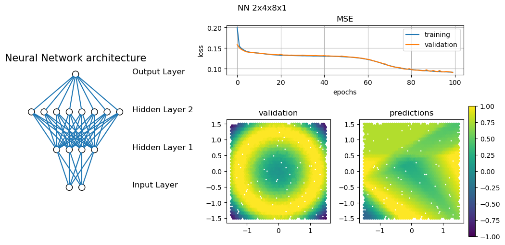
    


    

    


    

    


    
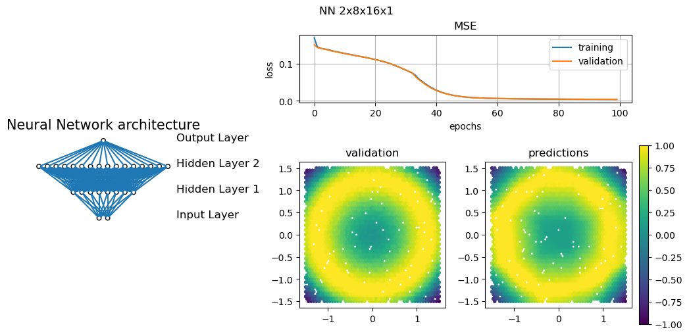
    


    
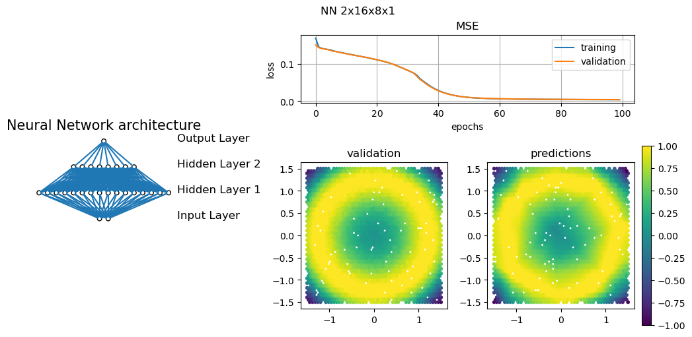
    


    

    


```python

```

### Valori per sigma = 0.5


```python
(x_train, y_train, z_train), (x_valid, y_valid, (z_valid, z_target)) = gen_sinxy(sigma=0.5)
```


```python
X, Y = np.meshgrid(np.linspace(-3./2., 3./2., 1000), np.linspace(-3./2., 3./2., 1000))

fig, ax = plt.subplots(1, 2,subplot_kw={"projection": "3d"}, figsize=(8, 3))
ax[0].plot_surface(X, Y, f(X, Y))

ax[1].scatter(x_train, y_train, z_train,  alpha= 0.3, c='C3', label = 'training')
ax[1].scatter(x_valid, y_valid, z_valid,  alpha= 1.0, c='C2', label = 'validation')
ax[1].scatter(x_valid, y_valid, z_target, alpha= 1.0, c='C4', label = 'target')
ax[1].legend()
plt.tight_layout()
plt.show()
```


    
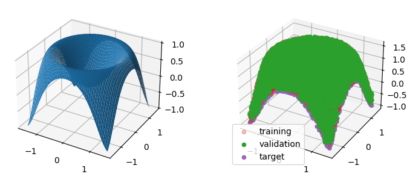
    


```python
Xtrain = np.column_stack((x_train, y_train))
Xvalid = np.column_stack((x_valid, y_valid))
```


```python

```


```python
mod2x4_s05, hist2x4_s05 = fitsin([2,4], 'sgd')
```


<pre style="white-space:pre;overflow-x:auto;line-height:normal;font-family:Menlo,'DejaVu Sans Mono',consolas,'Courier New',monospace"><span style="font-weight: bold">Model: "sequential_18"</span>
</pre>


<pre style="white-space:pre;overflow-x:auto;line-height:normal;font-family:Menlo,'DejaVu Sans Mono',consolas,'Courier New',monospace">┏━━━━━━━━━━━━━━━━━━━━━━━━━━━━━━━━━┳━━━━━━━━━━━━━━━━━━━━━━━━┳━━━━━━━━━━━━━━━┓
┃<span style="font-weight: bold"> Layer (type)                    </span>┃<span style="font-weight: bold"> Output Shape           </span>┃<span style="font-weight: bold">       Param # </span>┃
┡━━━━━━━━━━━━━━━━━━━━━━━━━━━━━━━━━╇━━━━━━━━━━━━━━━━━━━━━━━━╇━━━━━━━━━━━━━━━┩
│ dense_54 (<span style="color: #0087ff; text-decoration-color: #0087ff">Dense</span>)                │ (<span style="color: #00d7ff; text-decoration-color: #00d7ff">None</span>, <span style="color: #00af00; text-decoration-color: #00af00">2</span>)              │             <span style="color: #00af00; text-decoration-color: #00af00">6</span> │
├─────────────────────────────────┼────────────────────────┼───────────────┤
│ dense_55 (<span style="color: #0087ff; text-decoration-color: #0087ff">Dense</span>)                │ (<span style="color: #00d7ff; text-decoration-color: #00d7ff">None</span>, <span style="color: #00af00; text-decoration-color: #00af00">4</span>)              │            <span style="color: #00af00; text-decoration-color: #00af00">12</span> │
├─────────────────────────────────┼────────────────────────┼───────────────┤
│ dense_56 (<span style="color: #0087ff; text-decoration-color: #0087ff">Dense</span>)                │ (<span style="color: #00d7ff; text-decoration-color: #00d7ff">None</span>, <span style="color: #00af00; text-decoration-color: #00af00">1</span>)              │             <span style="color: #00af00; text-decoration-color: #00af00">5</span> │
└─────────────────────────────────┴────────────────────────┴───────────────┘
</pre>


<pre style="white-space:pre;overflow-x:auto;line-height:normal;font-family:Menlo,'DejaVu Sans Mono',consolas,'Courier New',monospace"><span style="font-weight: bold"> Total params: </span><span style="color: #00af00; text-decoration-color: #00af00">23</span> (92.00 B)
</pre>


<pre style="white-space:pre;overflow-x:auto;line-height:normal;font-family:Menlo,'DejaVu Sans Mono',consolas,'Courier New',monospace"><span style="font-weight: bold"> Trainable params: </span><span style="color: #00af00; text-decoration-color: #00af00">23</span> (92.00 B)
</pre>


<pre style="white-space:pre;overflow-x:auto;line-height:normal;font-family:Menlo,'DejaVu Sans Mono',consolas,'Courier New',monospace"><span style="font-weight: bold"> Non-trainable params: </span><span style="color: #00af00; text-decoration-color: #00af00">0</span> (0.00 B)
</pre>


```python
mod4x2_s05, hist4x2_s05 = fitsin([4, 2], 'sgd')
```


<pre style="white-space:pre;overflow-x:auto;line-height:normal;font-family:Menlo,'DejaVu Sans Mono',consolas,'Courier New',monospace"><span style="font-weight: bold">Model: "sequential_19"</span>
</pre>


<pre style="white-space:pre;overflow-x:auto;line-height:normal;font-family:Menlo,'DejaVu Sans Mono',consolas,'Courier New',monospace">┏━━━━━━━━━━━━━━━━━━━━━━━━━━━━━━━━━┳━━━━━━━━━━━━━━━━━━━━━━━━┳━━━━━━━━━━━━━━━┓
┃<span style="font-weight: bold"> Layer (type)                    </span>┃<span style="font-weight: bold"> Output Shape           </span>┃<span style="font-weight: bold">       Param # </span>┃
┡━━━━━━━━━━━━━━━━━━━━━━━━━━━━━━━━━╇━━━━━━━━━━━━━━━━━━━━━━━━╇━━━━━━━━━━━━━━━┩
│ dense_57 (<span style="color: #0087ff; text-decoration-color: #0087ff">Dense</span>)                │ (<span style="color: #00d7ff; text-decoration-color: #00d7ff">None</span>, <span style="color: #00af00; text-decoration-color: #00af00">4</span>)              │            <span style="color: #00af00; text-decoration-color: #00af00">12</span> │
├─────────────────────────────────┼────────────────────────┼───────────────┤
│ dense_58 (<span style="color: #0087ff; text-decoration-color: #0087ff">Dense</span>)                │ (<span style="color: #00d7ff; text-decoration-color: #00d7ff">None</span>, <span style="color: #00af00; text-decoration-color: #00af00">2</span>)              │            <span style="color: #00af00; text-decoration-color: #00af00">10</span> │
├─────────────────────────────────┼────────────────────────┼───────────────┤
│ dense_59 (<span style="color: #0087ff; text-decoration-color: #0087ff">Dense</span>)                │ (<span style="color: #00d7ff; text-decoration-color: #00d7ff">None</span>, <span style="color: #00af00; text-decoration-color: #00af00">1</span>)              │             <span style="color: #00af00; text-decoration-color: #00af00">3</span> │
└─────────────────────────────────┴────────────────────────┴───────────────┘
</pre>


<pre style="white-space:pre;overflow-x:auto;line-height:normal;font-family:Menlo,'DejaVu Sans Mono',consolas,'Courier New',monospace"><span style="font-weight: bold"> Total params: </span><span style="color: #00af00; text-decoration-color: #00af00">25</span> (100.00 B)
</pre>


<pre style="white-space:pre;overflow-x:auto;line-height:normal;font-family:Menlo,'DejaVu Sans Mono',consolas,'Courier New',monospace"><span style="font-weight: bold"> Trainable params: </span><span style="color: #00af00; text-decoration-color: #00af00">25</span> (100.00 B)
</pre>


<pre style="white-space:pre;overflow-x:auto;line-height:normal;font-family:Menlo,'DejaVu Sans Mono',consolas,'Courier New',monospace"><span style="font-weight: bold"> Non-trainable params: </span><span style="color: #00af00; text-decoration-color: #00af00">0</span> (0.00 B)
</pre>


```python
mod4x4_s05, hist4x4_s05 = fitsin([4, 4], 'sgd')
```


<pre style="white-space:pre;overflow-x:auto;line-height:normal;font-family:Menlo,'DejaVu Sans Mono',consolas,'Courier New',monospace"><span style="font-weight: bold">Model: "sequential_20"</span>
</pre>


<pre style="white-space:pre;overflow-x:auto;line-height:normal;font-family:Menlo,'DejaVu Sans Mono',consolas,'Courier New',monospace">┏━━━━━━━━━━━━━━━━━━━━━━━━━━━━━━━━━┳━━━━━━━━━━━━━━━━━━━━━━━━┳━━━━━━━━━━━━━━━┓
┃<span style="font-weight: bold"> Layer (type)                    </span>┃<span style="font-weight: bold"> Output Shape           </span>┃<span style="font-weight: bold">       Param # </span>┃
┡━━━━━━━━━━━━━━━━━━━━━━━━━━━━━━━━━╇━━━━━━━━━━━━━━━━━━━━━━━━╇━━━━━━━━━━━━━━━┩
│ dense_60 (<span style="color: #0087ff; text-decoration-color: #0087ff">Dense</span>)                │ (<span style="color: #00d7ff; text-decoration-color: #00d7ff">None</span>, <span style="color: #00af00; text-decoration-color: #00af00">4</span>)              │            <span style="color: #00af00; text-decoration-color: #00af00">12</span> │
├─────────────────────────────────┼────────────────────────┼───────────────┤
│ dense_61 (<span style="color: #0087ff; text-decoration-color: #0087ff">Dense</span>)                │ (<span style="color: #00d7ff; text-decoration-color: #00d7ff">None</span>, <span style="color: #00af00; text-decoration-color: #00af00">4</span>)              │            <span style="color: #00af00; text-decoration-color: #00af00">20</span> │
├─────────────────────────────────┼────────────────────────┼───────────────┤
│ dense_62 (<span style="color: #0087ff; text-decoration-color: #0087ff">Dense</span>)                │ (<span style="color: #00d7ff; text-decoration-color: #00d7ff">None</span>, <span style="color: #00af00; text-decoration-color: #00af00">1</span>)              │             <span style="color: #00af00; text-decoration-color: #00af00">5</span> │
└─────────────────────────────────┴────────────────────────┴───────────────┘
</pre>


<pre style="white-space:pre;overflow-x:auto;line-height:normal;font-family:Menlo,'DejaVu Sans Mono',consolas,'Courier New',monospace"><span style="font-weight: bold"> Total params: </span><span style="color: #00af00; text-decoration-color: #00af00">37</span> (148.00 B)
</pre>


<pre style="white-space:pre;overflow-x:auto;line-height:normal;font-family:Menlo,'DejaVu Sans Mono',consolas,'Courier New',monospace"><span style="font-weight: bold"> Trainable params: </span><span style="color: #00af00; text-decoration-color: #00af00">37</span> (148.00 B)
</pre>


<pre style="white-space:pre;overflow-x:auto;line-height:normal;font-family:Menlo,'DejaVu Sans Mono',consolas,'Courier New',monospace"><span style="font-weight: bold"> Non-trainable params: </span><span style="color: #00af00; text-decoration-color: #00af00">0</span> (0.00 B)
</pre>


```python
mod4x8_s05, hist4x8_s05 = fitsin([4, 8], 'sgd')
```


<pre style="white-space:pre;overflow-x:auto;line-height:normal;font-family:Menlo,'DejaVu Sans Mono',consolas,'Courier New',monospace"><span style="font-weight: bold">Model: "sequential_21"</span>
</pre>


<pre style="white-space:pre;overflow-x:auto;line-height:normal;font-family:Menlo,'DejaVu Sans Mono',consolas,'Courier New',monospace">┏━━━━━━━━━━━━━━━━━━━━━━━━━━━━━━━━━┳━━━━━━━━━━━━━━━━━━━━━━━━┳━━━━━━━━━━━━━━━┓
┃<span style="font-weight: bold"> Layer (type)                    </span>┃<span style="font-weight: bold"> Output Shape           </span>┃<span style="font-weight: bold">       Param # </span>┃
┡━━━━━━━━━━━━━━━━━━━━━━━━━━━━━━━━━╇━━━━━━━━━━━━━━━━━━━━━━━━╇━━━━━━━━━━━━━━━┩
│ dense_63 (<span style="color: #0087ff; text-decoration-color: #0087ff">Dense</span>)                │ (<span style="color: #00d7ff; text-decoration-color: #00d7ff">None</span>, <span style="color: #00af00; text-decoration-color: #00af00">4</span>)              │            <span style="color: #00af00; text-decoration-color: #00af00">12</span> │
├─────────────────────────────────┼────────────────────────┼───────────────┤
│ dense_64 (<span style="color: #0087ff; text-decoration-color: #0087ff">Dense</span>)                │ (<span style="color: #00d7ff; text-decoration-color: #00d7ff">None</span>, <span style="color: #00af00; text-decoration-color: #00af00">8</span>)              │            <span style="color: #00af00; text-decoration-color: #00af00">40</span> │
├─────────────────────────────────┼────────────────────────┼───────────────┤
│ dense_65 (<span style="color: #0087ff; text-decoration-color: #0087ff">Dense</span>)                │ (<span style="color: #00d7ff; text-decoration-color: #00d7ff">None</span>, <span style="color: #00af00; text-decoration-color: #00af00">1</span>)              │             <span style="color: #00af00; text-decoration-color: #00af00">9</span> │
└─────────────────────────────────┴────────────────────────┴───────────────┘
</pre>


<pre style="white-space:pre;overflow-x:auto;line-height:normal;font-family:Menlo,'DejaVu Sans Mono',consolas,'Courier New',monospace"><span style="font-weight: bold"> Total params: </span><span style="color: #00af00; text-decoration-color: #00af00">61</span> (244.00 B)
</pre>


<pre style="white-space:pre;overflow-x:auto;line-height:normal;font-family:Menlo,'DejaVu Sans Mono',consolas,'Courier New',monospace"><span style="font-weight: bold"> Trainable params: </span><span style="color: #00af00; text-decoration-color: #00af00">61</span> (244.00 B)
</pre>


<pre style="white-space:pre;overflow-x:auto;line-height:normal;font-family:Menlo,'DejaVu Sans Mono',consolas,'Courier New',monospace"><span style="font-weight: bold"> Non-trainable params: </span><span style="color: #00af00; text-decoration-color: #00af00">0</span> (0.00 B)
</pre>


```python
mod8x4_s05, hist8x4_s05 = fitsin([8, 4], 'sgd')
```


<pre style="white-space:pre;overflow-x:auto;line-height:normal;font-family:Menlo,'DejaVu Sans Mono',consolas,'Courier New',monospace"><span style="font-weight: bold">Model: "sequential_22"</span>
</pre>


<pre style="white-space:pre;overflow-x:auto;line-height:normal;font-family:Menlo,'DejaVu Sans Mono',consolas,'Courier New',monospace">┏━━━━━━━━━━━━━━━━━━━━━━━━━━━━━━━━━┳━━━━━━━━━━━━━━━━━━━━━━━━┳━━━━━━━━━━━━━━━┓
┃<span style="font-weight: bold"> Layer (type)                    </span>┃<span style="font-weight: bold"> Output Shape           </span>┃<span style="font-weight: bold">       Param # </span>┃
┡━━━━━━━━━━━━━━━━━━━━━━━━━━━━━━━━━╇━━━━━━━━━━━━━━━━━━━━━━━━╇━━━━━━━━━━━━━━━┩
│ dense_66 (<span style="color: #0087ff; text-decoration-color: #0087ff">Dense</span>)                │ (<span style="color: #00d7ff; text-decoration-color: #00d7ff">None</span>, <span style="color: #00af00; text-decoration-color: #00af00">8</span>)              │            <span style="color: #00af00; text-decoration-color: #00af00">24</span> │
├─────────────────────────────────┼────────────────────────┼───────────────┤
│ dense_67 (<span style="color: #0087ff; text-decoration-color: #0087ff">Dense</span>)                │ (<span style="color: #00d7ff; text-decoration-color: #00d7ff">None</span>, <span style="color: #00af00; text-decoration-color: #00af00">4</span>)              │            <span style="color: #00af00; text-decoration-color: #00af00">36</span> │
├─────────────────────────────────┼────────────────────────┼───────────────┤
│ dense_68 (<span style="color: #0087ff; text-decoration-color: #0087ff">Dense</span>)                │ (<span style="color: #00d7ff; text-decoration-color: #00d7ff">None</span>, <span style="color: #00af00; text-decoration-color: #00af00">1</span>)              │             <span style="color: #00af00; text-decoration-color: #00af00">5</span> │
└─────────────────────────────────┴────────────────────────┴───────────────┘
</pre>


<pre style="white-space:pre;overflow-x:auto;line-height:normal;font-family:Menlo,'DejaVu Sans Mono',consolas,'Courier New',monospace"><span style="font-weight: bold"> Total params: </span><span style="color: #00af00; text-decoration-color: #00af00">65</span> (260.00 B)
</pre>


<pre style="white-space:pre;overflow-x:auto;line-height:normal;font-family:Menlo,'DejaVu Sans Mono',consolas,'Courier New',monospace"><span style="font-weight: bold"> Trainable params: </span><span style="color: #00af00; text-decoration-color: #00af00">65</span> (260.00 B)
</pre>


<pre style="white-space:pre;overflow-x:auto;line-height:normal;font-family:Menlo,'DejaVu Sans Mono',consolas,'Courier New',monospace"><span style="font-weight: bold"> Non-trainable params: </span><span style="color: #00af00; text-decoration-color: #00af00">0</span> (0.00 B)
</pre>


```python
mod8x8_s05, hist8x8_s05 = fitsin([8, 8], 'sgd')
```


<pre style="white-space:pre;overflow-x:auto;line-height:normal;font-family:Menlo,'DejaVu Sans Mono',consolas,'Courier New',monospace"><span style="font-weight: bold">Model: "sequential_23"</span>
</pre>


<pre style="white-space:pre;overflow-x:auto;line-height:normal;font-family:Menlo,'DejaVu Sans Mono',consolas,'Courier New',monospace">┏━━━━━━━━━━━━━━━━━━━━━━━━━━━━━━━━━┳━━━━━━━━━━━━━━━━━━━━━━━━┳━━━━━━━━━━━━━━━┓
┃<span style="font-weight: bold"> Layer (type)                    </span>┃<span style="font-weight: bold"> Output Shape           </span>┃<span style="font-weight: bold">       Param # </span>┃
┡━━━━━━━━━━━━━━━━━━━━━━━━━━━━━━━━━╇━━━━━━━━━━━━━━━━━━━━━━━━╇━━━━━━━━━━━━━━━┩
│ dense_69 (<span style="color: #0087ff; text-decoration-color: #0087ff">Dense</span>)                │ (<span style="color: #00d7ff; text-decoration-color: #00d7ff">None</span>, <span style="color: #00af00; text-decoration-color: #00af00">8</span>)              │            <span style="color: #00af00; text-decoration-color: #00af00">24</span> │
├─────────────────────────────────┼────────────────────────┼───────────────┤
│ dense_70 (<span style="color: #0087ff; text-decoration-color: #0087ff">Dense</span>)                │ (<span style="color: #00d7ff; text-decoration-color: #00d7ff">None</span>, <span style="color: #00af00; text-decoration-color: #00af00">8</span>)              │            <span style="color: #00af00; text-decoration-color: #00af00">72</span> │
├─────────────────────────────────┼────────────────────────┼───────────────┤
│ dense_71 (<span style="color: #0087ff; text-decoration-color: #0087ff">Dense</span>)                │ (<span style="color: #00d7ff; text-decoration-color: #00d7ff">None</span>, <span style="color: #00af00; text-decoration-color: #00af00">1</span>)              │             <span style="color: #00af00; text-decoration-color: #00af00">9</span> │
└─────────────────────────────────┴────────────────────────┴───────────────┘
</pre>


<pre style="white-space:pre;overflow-x:auto;line-height:normal;font-family:Menlo,'DejaVu Sans Mono',consolas,'Courier New',monospace"><span style="font-weight: bold"> Total params: </span><span style="color: #00af00; text-decoration-color: #00af00">105</span> (420.00 B)
</pre>


<pre style="white-space:pre;overflow-x:auto;line-height:normal;font-family:Menlo,'DejaVu Sans Mono',consolas,'Courier New',monospace"><span style="font-weight: bold"> Trainable params: </span><span style="color: #00af00; text-decoration-color: #00af00">105</span> (420.00 B)
</pre>


<pre style="white-space:pre;overflow-x:auto;line-height:normal;font-family:Menlo,'DejaVu Sans Mono',consolas,'Courier New',monospace"><span style="font-weight: bold"> Non-trainable params: </span><span style="color: #00af00; text-decoration-color: #00af00">0</span> (0.00 B)
</pre>


```python
mod8x16_s05, hist8x16_s05 = fitsin([8, 16], 'sgd')
```


<pre style="white-space:pre;overflow-x:auto;line-height:normal;font-family:Menlo,'DejaVu Sans Mono',consolas,'Courier New',monospace"><span style="font-weight: bold">Model: "sequential_24"</span>
</pre>


<pre style="white-space:pre;overflow-x:auto;line-height:normal;font-family:Menlo,'DejaVu Sans Mono',consolas,'Courier New',monospace">┏━━━━━━━━━━━━━━━━━━━━━━━━━━━━━━━━━┳━━━━━━━━━━━━━━━━━━━━━━━━┳━━━━━━━━━━━━━━━┓
┃<span style="font-weight: bold"> Layer (type)                    </span>┃<span style="font-weight: bold"> Output Shape           </span>┃<span style="font-weight: bold">       Param # </span>┃
┡━━━━━━━━━━━━━━━━━━━━━━━━━━━━━━━━━╇━━━━━━━━━━━━━━━━━━━━━━━━╇━━━━━━━━━━━━━━━┩
│ dense_72 (<span style="color: #0087ff; text-decoration-color: #0087ff">Dense</span>)                │ (<span style="color: #00d7ff; text-decoration-color: #00d7ff">None</span>, <span style="color: #00af00; text-decoration-color: #00af00">8</span>)              │            <span style="color: #00af00; text-decoration-color: #00af00">24</span> │
├─────────────────────────────────┼────────────────────────┼───────────────┤
│ dense_73 (<span style="color: #0087ff; text-decoration-color: #0087ff">Dense</span>)                │ (<span style="color: #00d7ff; text-decoration-color: #00d7ff">None</span>, <span style="color: #00af00; text-decoration-color: #00af00">16</span>)             │           <span style="color: #00af00; text-decoration-color: #00af00">144</span> │
├─────────────────────────────────┼────────────────────────┼───────────────┤
│ dense_74 (<span style="color: #0087ff; text-decoration-color: #0087ff">Dense</span>)                │ (<span style="color: #00d7ff; text-decoration-color: #00d7ff">None</span>, <span style="color: #00af00; text-decoration-color: #00af00">1</span>)              │            <span style="color: #00af00; text-decoration-color: #00af00">17</span> │
└─────────────────────────────────┴────────────────────────┴───────────────┘
</pre>


<pre style="white-space:pre;overflow-x:auto;line-height:normal;font-family:Menlo,'DejaVu Sans Mono',consolas,'Courier New',monospace"><span style="font-weight: bold"> Total params: </span><span style="color: #00af00; text-decoration-color: #00af00">185</span> (740.00 B)
</pre>


<pre style="white-space:pre;overflow-x:auto;line-height:normal;font-family:Menlo,'DejaVu Sans Mono',consolas,'Courier New',monospace"><span style="font-weight: bold"> Trainable params: </span><span style="color: #00af00; text-decoration-color: #00af00">185</span> (740.00 B)
</pre>


<pre style="white-space:pre;overflow-x:auto;line-height:normal;font-family:Menlo,'DejaVu Sans Mono',consolas,'Courier New',monospace"><span style="font-weight: bold"> Non-trainable params: </span><span style="color: #00af00; text-decoration-color: #00af00">0</span> (0.00 B)
</pre>


```python
mod16x8_s05, hist16x8_s05 = fitsin([16, 8], 'sgd')
```


<pre style="white-space:pre;overflow-x:auto;line-height:normal;font-family:Menlo,'DejaVu Sans Mono',consolas,'Courier New',monospace"><span style="font-weight: bold">Model: "sequential_25"</span>
</pre>


<pre style="white-space:pre;overflow-x:auto;line-height:normal;font-family:Menlo,'DejaVu Sans Mono',consolas,'Courier New',monospace">┏━━━━━━━━━━━━━━━━━━━━━━━━━━━━━━━━━┳━━━━━━━━━━━━━━━━━━━━━━━━┳━━━━━━━━━━━━━━━┓
┃<span style="font-weight: bold"> Layer (type)                    </span>┃<span style="font-weight: bold"> Output Shape           </span>┃<span style="font-weight: bold">       Param # </span>┃
┡━━━━━━━━━━━━━━━━━━━━━━━━━━━━━━━━━╇━━━━━━━━━━━━━━━━━━━━━━━━╇━━━━━━━━━━━━━━━┩
│ dense_75 (<span style="color: #0087ff; text-decoration-color: #0087ff">Dense</span>)                │ (<span style="color: #00d7ff; text-decoration-color: #00d7ff">None</span>, <span style="color: #00af00; text-decoration-color: #00af00">16</span>)             │            <span style="color: #00af00; text-decoration-color: #00af00">48</span> │
├─────────────────────────────────┼────────────────────────┼───────────────┤
│ dense_76 (<span style="color: #0087ff; text-decoration-color: #0087ff">Dense</span>)                │ (<span style="color: #00d7ff; text-decoration-color: #00d7ff">None</span>, <span style="color: #00af00; text-decoration-color: #00af00">8</span>)              │           <span style="color: #00af00; text-decoration-color: #00af00">136</span> │
├─────────────────────────────────┼────────────────────────┼───────────────┤
│ dense_77 (<span style="color: #0087ff; text-decoration-color: #0087ff">Dense</span>)                │ (<span style="color: #00d7ff; text-decoration-color: #00d7ff">None</span>, <span style="color: #00af00; text-decoration-color: #00af00">1</span>)              │             <span style="color: #00af00; text-decoration-color: #00af00">9</span> │
└─────────────────────────────────┴────────────────────────┴───────────────┘
</pre>


<pre style="white-space:pre;overflow-x:auto;line-height:normal;font-family:Menlo,'DejaVu Sans Mono',consolas,'Courier New',monospace"><span style="font-weight: bold"> Total params: </span><span style="color: #00af00; text-decoration-color: #00af00">193</span> (772.00 B)
</pre>


<pre style="white-space:pre;overflow-x:auto;line-height:normal;font-family:Menlo,'DejaVu Sans Mono',consolas,'Courier New',monospace"><span style="font-weight: bold"> Trainable params: </span><span style="color: #00af00; text-decoration-color: #00af00">193</span> (772.00 B)
</pre>


<pre style="white-space:pre;overflow-x:auto;line-height:normal;font-family:Menlo,'DejaVu Sans Mono',consolas,'Courier New',monospace"><span style="font-weight: bold"> Non-trainable params: </span><span style="color: #00af00; text-decoration-color: #00af00">0</span> (0.00 B)
</pre>


```python
mod16x16_s05, hist16x16_s05 =fitsin([16,16], 'sgd')
```


<pre style="white-space:pre;overflow-x:auto;line-height:normal;font-family:Menlo,'DejaVu Sans Mono',consolas,'Courier New',monospace"><span style="font-weight: bold">Model: "sequential_26"</span>
</pre>


<pre style="white-space:pre;overflow-x:auto;line-height:normal;font-family:Menlo,'DejaVu Sans Mono',consolas,'Courier New',monospace">┏━━━━━━━━━━━━━━━━━━━━━━━━━━━━━━━━━┳━━━━━━━━━━━━━━━━━━━━━━━━┳━━━━━━━━━━━━━━━┓
┃<span style="font-weight: bold"> Layer (type)                    </span>┃<span style="font-weight: bold"> Output Shape           </span>┃<span style="font-weight: bold">       Param # </span>┃
┡━━━━━━━━━━━━━━━━━━━━━━━━━━━━━━━━━╇━━━━━━━━━━━━━━━━━━━━━━━━╇━━━━━━━━━━━━━━━┩
│ dense_78 (<span style="color: #0087ff; text-decoration-color: #0087ff">Dense</span>)                │ (<span style="color: #00d7ff; text-decoration-color: #00d7ff">None</span>, <span style="color: #00af00; text-decoration-color: #00af00">16</span>)             │            <span style="color: #00af00; text-decoration-color: #00af00">48</span> │
├─────────────────────────────────┼────────────────────────┼───────────────┤
│ dense_79 (<span style="color: #0087ff; text-decoration-color: #0087ff">Dense</span>)                │ (<span style="color: #00d7ff; text-decoration-color: #00d7ff">None</span>, <span style="color: #00af00; text-decoration-color: #00af00">16</span>)             │           <span style="color: #00af00; text-decoration-color: #00af00">272</span> │
├─────────────────────────────────┼────────────────────────┼───────────────┤
│ dense_80 (<span style="color: #0087ff; text-decoration-color: #0087ff">Dense</span>)                │ (<span style="color: #00d7ff; text-decoration-color: #00d7ff">None</span>, <span style="color: #00af00; text-decoration-color: #00af00">1</span>)              │            <span style="color: #00af00; text-decoration-color: #00af00">17</span> │
└─────────────────────────────────┴────────────────────────┴───────────────┘
</pre>


<pre style="white-space:pre;overflow-x:auto;line-height:normal;font-family:Menlo,'DejaVu Sans Mono',consolas,'Courier New',monospace"><span style="font-weight: bold"> Total params: </span><span style="color: #00af00; text-decoration-color: #00af00">337</span> (1.32 KB)
</pre>


<pre style="white-space:pre;overflow-x:auto;line-height:normal;font-family:Menlo,'DejaVu Sans Mono',consolas,'Courier New',monospace"><span style="font-weight: bold"> Trainable params: </span><span style="color: #00af00; text-decoration-color: #00af00">337</span> (1.32 KB)
</pre>


<pre style="white-space:pre;overflow-x:auto;line-height:normal;font-family:Menlo,'DejaVu Sans Mono',consolas,'Courier New',monospace"><span style="font-weight: bold"> Non-trainable params: </span><span style="color: #00af00; text-decoration-color: #00af00">0</span> (0.00 B)
</pre>


```python
plot_mod_perf(mod2x4_s05,   hist2x4_s05) 
plot_mod_perf(mod4x2_s05,   hist4x2_s05) 
plot_mod_perf(mod4x4_s05,   hist4x4_s05) 
plot_mod_perf(mod4x8_s05,   hist4x8_s05) 
plot_mod_perf(mod8x4_s05,   hist8x4_s05)
plot_mod_perf(mod8x8_s05,   hist8x8_s05) 
plot_mod_perf(mod8x16_s05,  hist8x16_s05) 
plot_mod_perf(mod16x8_s05,  hist8x16_s05)
plot_mod_perf(mod16x16_s05, hist16x16_s05)
```


    
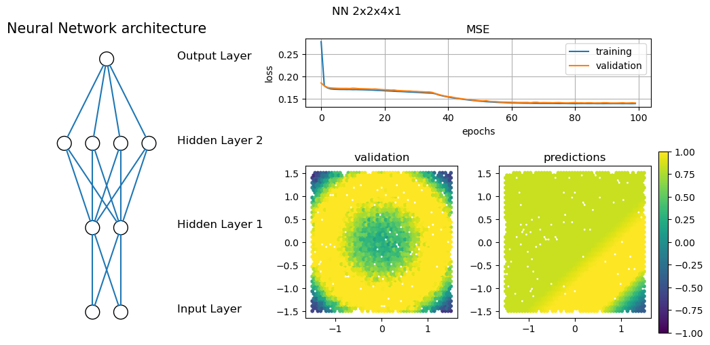
    


    

    


    

    


    

    


    

    


    

    


    

    


    
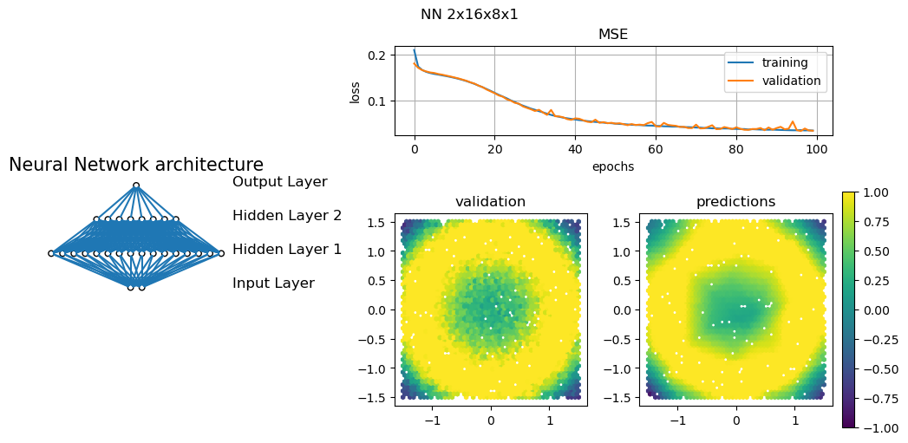
    


    
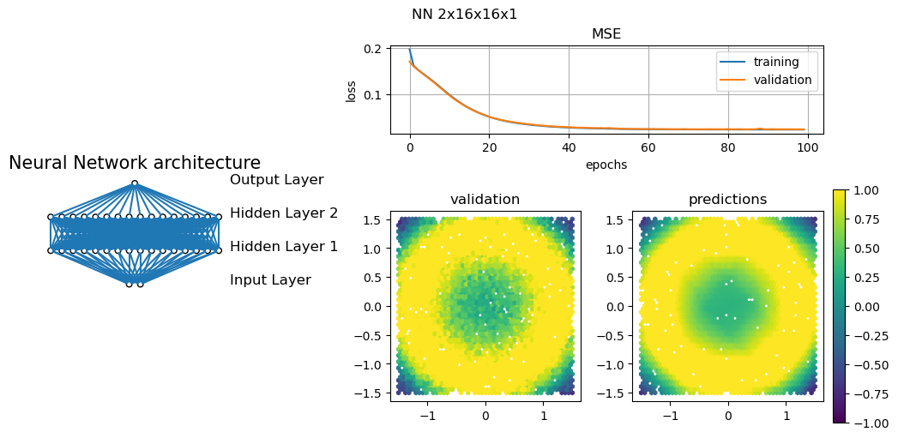
    


```python

```

### Valori per sigma = 1


```python
(x_train, y_train, z_train), (x_valid, y_valid, (z_valid, z_target)) = gen_sinxy(sigma=1)
```


```python
X, Y = np.meshgrid(np.linspace(-3./2., 3./2., 1000), np.linspace(-3./2., 3./2., 1000))

fig, ax = plt.subplots(1, 2,subplot_kw={"projection": "3d"}, figsize=(8, 3))
ax[0].plot_surface(X, Y, f(X, Y))

ax[1].scatter(x_train, y_train, z_train,  alpha= 0.3, c='C3', label = 'validation')
ax[1].scatter(x_valid, y_valid, z_valid,  alpha= 1.0, c='C2', label = 'validation')
ax[1].scatter(x_valid, y_valid, z_target, alpha= 1.0, c='C4', label = 'target')
ax[1].legend()
plt.tight_layout()
plt.show()
```


    
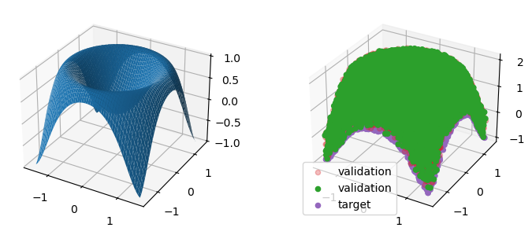
    


```python
Xtrain = np.column_stack((x_train, y_train))
Xvalid = np.column_stack((x_valid, y_valid))
```


```python

```


```python
mod2x4_s1, hist2x4_s1 = fitsin([2,4], 'sgd')
```


<pre style="white-space:pre;overflow-x:auto;line-height:normal;font-family:Menlo,'DejaVu Sans Mono',consolas,'Courier New',monospace"><span style="font-weight: bold">Model: "sequential_27"</span>
</pre>


<pre style="white-space:pre;overflow-x:auto;line-height:normal;font-family:Menlo,'DejaVu Sans Mono',consolas,'Courier New',monospace">┏━━━━━━━━━━━━━━━━━━━━━━━━━━━━━━━━━┳━━━━━━━━━━━━━━━━━━━━━━━━┳━━━━━━━━━━━━━━━┓
┃<span style="font-weight: bold"> Layer (type)                    </span>┃<span style="font-weight: bold"> Output Shape           </span>┃<span style="font-weight: bold">       Param # </span>┃
┡━━━━━━━━━━━━━━━━━━━━━━━━━━━━━━━━━╇━━━━━━━━━━━━━━━━━━━━━━━━╇━━━━━━━━━━━━━━━┩
│ dense_81 (<span style="color: #0087ff; text-decoration-color: #0087ff">Dense</span>)                │ (<span style="color: #00d7ff; text-decoration-color: #00d7ff">None</span>, <span style="color: #00af00; text-decoration-color: #00af00">2</span>)              │             <span style="color: #00af00; text-decoration-color: #00af00">6</span> │
├─────────────────────────────────┼────────────────────────┼───────────────┤
│ dense_82 (<span style="color: #0087ff; text-decoration-color: #0087ff">Dense</span>)                │ (<span style="color: #00d7ff; text-decoration-color: #00d7ff">None</span>, <span style="color: #00af00; text-decoration-color: #00af00">4</span>)              │            <span style="color: #00af00; text-decoration-color: #00af00">12</span> │
├─────────────────────────────────┼────────────────────────┼───────────────┤
│ dense_83 (<span style="color: #0087ff; text-decoration-color: #0087ff">Dense</span>)                │ (<span style="color: #00d7ff; text-decoration-color: #00d7ff">None</span>, <span style="color: #00af00; text-decoration-color: #00af00">1</span>)              │             <span style="color: #00af00; text-decoration-color: #00af00">5</span> │
└─────────────────────────────────┴────────────────────────┴───────────────┘
</pre>


<pre style="white-space:pre;overflow-x:auto;line-height:normal;font-family:Menlo,'DejaVu Sans Mono',consolas,'Courier New',monospace"><span style="font-weight: bold"> Total params: </span><span style="color: #00af00; text-decoration-color: #00af00">23</span> (92.00 B)
</pre>


<pre style="white-space:pre;overflow-x:auto;line-height:normal;font-family:Menlo,'DejaVu Sans Mono',consolas,'Courier New',monospace"><span style="font-weight: bold"> Trainable params: </span><span style="color: #00af00; text-decoration-color: #00af00">23</span> (92.00 B)
</pre>


<pre style="white-space:pre;overflow-x:auto;line-height:normal;font-family:Menlo,'DejaVu Sans Mono',consolas,'Courier New',monospace"><span style="font-weight: bold"> Non-trainable params: </span><span style="color: #00af00; text-decoration-color: #00af00">0</span> (0.00 B)
</pre>


```python
mod4x2_s1, hist4x2_s1 = fitsin([4, 2], 'sgd')
```


<pre style="white-space:pre;overflow-x:auto;line-height:normal;font-family:Menlo,'DejaVu Sans Mono',consolas,'Courier New',monospace"><span style="font-weight: bold">Model: "sequential_28"</span>
</pre>


<pre style="white-space:pre;overflow-x:auto;line-height:normal;font-family:Menlo,'DejaVu Sans Mono',consolas,'Courier New',monospace">┏━━━━━━━━━━━━━━━━━━━━━━━━━━━━━━━━━┳━━━━━━━━━━━━━━━━━━━━━━━━┳━━━━━━━━━━━━━━━┓
┃<span style="font-weight: bold"> Layer (type)                    </span>┃<span style="font-weight: bold"> Output Shape           </span>┃<span style="font-weight: bold">       Param # </span>┃
┡━━━━━━━━━━━━━━━━━━━━━━━━━━━━━━━━━╇━━━━━━━━━━━━━━━━━━━━━━━━╇━━━━━━━━━━━━━━━┩
│ dense_84 (<span style="color: #0087ff; text-decoration-color: #0087ff">Dense</span>)                │ (<span style="color: #00d7ff; text-decoration-color: #00d7ff">None</span>, <span style="color: #00af00; text-decoration-color: #00af00">4</span>)              │            <span style="color: #00af00; text-decoration-color: #00af00">12</span> │
├─────────────────────────────────┼────────────────────────┼───────────────┤
│ dense_85 (<span style="color: #0087ff; text-decoration-color: #0087ff">Dense</span>)                │ (<span style="color: #00d7ff; text-decoration-color: #00d7ff">None</span>, <span style="color: #00af00; text-decoration-color: #00af00">2</span>)              │            <span style="color: #00af00; text-decoration-color: #00af00">10</span> │
├─────────────────────────────────┼────────────────────────┼───────────────┤
│ dense_86 (<span style="color: #0087ff; text-decoration-color: #0087ff">Dense</span>)                │ (<span style="color: #00d7ff; text-decoration-color: #00d7ff">None</span>, <span style="color: #00af00; text-decoration-color: #00af00">1</span>)              │             <span style="color: #00af00; text-decoration-color: #00af00">3</span> │
└─────────────────────────────────┴────────────────────────┴───────────────┘
</pre>


<pre style="white-space:pre;overflow-x:auto;line-height:normal;font-family:Menlo,'DejaVu Sans Mono',consolas,'Courier New',monospace"><span style="font-weight: bold"> Total params: </span><span style="color: #00af00; text-decoration-color: #00af00">25</span> (100.00 B)
</pre>


<pre style="white-space:pre;overflow-x:auto;line-height:normal;font-family:Menlo,'DejaVu Sans Mono',consolas,'Courier New',monospace"><span style="font-weight: bold"> Trainable params: </span><span style="color: #00af00; text-decoration-color: #00af00">25</span> (100.00 B)
</pre>


<pre style="white-space:pre;overflow-x:auto;line-height:normal;font-family:Menlo,'DejaVu Sans Mono',consolas,'Courier New',monospace"><span style="font-weight: bold"> Non-trainable params: </span><span style="color: #00af00; text-decoration-color: #00af00">0</span> (0.00 B)
</pre>


```python
mod4x4_s1, hist4x4_s1 = fitsin([4, 4], 'sgd')
```


<pre style="white-space:pre;overflow-x:auto;line-height:normal;font-family:Menlo,'DejaVu Sans Mono',consolas,'Courier New',monospace"><span style="font-weight: bold">Model: "sequential_29"</span>
</pre>


<pre style="white-space:pre;overflow-x:auto;line-height:normal;font-family:Menlo,'DejaVu Sans Mono',consolas,'Courier New',monospace">┏━━━━━━━━━━━━━━━━━━━━━━━━━━━━━━━━━┳━━━━━━━━━━━━━━━━━━━━━━━━┳━━━━━━━━━━━━━━━┓
┃<span style="font-weight: bold"> Layer (type)                    </span>┃<span style="font-weight: bold"> Output Shape           </span>┃<span style="font-weight: bold">       Param # </span>┃
┡━━━━━━━━━━━━━━━━━━━━━━━━━━━━━━━━━╇━━━━━━━━━━━━━━━━━━━━━━━━╇━━━━━━━━━━━━━━━┩
│ dense_87 (<span style="color: #0087ff; text-decoration-color: #0087ff">Dense</span>)                │ (<span style="color: #00d7ff; text-decoration-color: #00d7ff">None</span>, <span style="color: #00af00; text-decoration-color: #00af00">4</span>)              │            <span style="color: #00af00; text-decoration-color: #00af00">12</span> │
├─────────────────────────────────┼────────────────────────┼───────────────┤
│ dense_88 (<span style="color: #0087ff; text-decoration-color: #0087ff">Dense</span>)                │ (<span style="color: #00d7ff; text-decoration-color: #00d7ff">None</span>, <span style="color: #00af00; text-decoration-color: #00af00">4</span>)              │            <span style="color: #00af00; text-decoration-color: #00af00">20</span> │
├─────────────────────────────────┼────────────────────────┼───────────────┤
│ dense_89 (<span style="color: #0087ff; text-decoration-color: #0087ff">Dense</span>)                │ (<span style="color: #00d7ff; text-decoration-color: #00d7ff">None</span>, <span style="color: #00af00; text-decoration-color: #00af00">1</span>)              │             <span style="color: #00af00; text-decoration-color: #00af00">5</span> │
└─────────────────────────────────┴────────────────────────┴───────────────┘
</pre>


<pre style="white-space:pre;overflow-x:auto;line-height:normal;font-family:Menlo,'DejaVu Sans Mono',consolas,'Courier New',monospace"><span style="font-weight: bold"> Total params: </span><span style="color: #00af00; text-decoration-color: #00af00">37</span> (148.00 B)
</pre>


<pre style="white-space:pre;overflow-x:auto;line-height:normal;font-family:Menlo,'DejaVu Sans Mono',consolas,'Courier New',monospace"><span style="font-weight: bold"> Trainable params: </span><span style="color: #00af00; text-decoration-color: #00af00">37</span> (148.00 B)
</pre>


<pre style="white-space:pre;overflow-x:auto;line-height:normal;font-family:Menlo,'DejaVu Sans Mono',consolas,'Courier New',monospace"><span style="font-weight: bold"> Non-trainable params: </span><span style="color: #00af00; text-decoration-color: #00af00">0</span> (0.00 B)
</pre>


```python
mod4x8_s1, hist4x8_s1 = fitsin([4, 8], 'sgd')
```


<pre style="white-space:pre;overflow-x:auto;line-height:normal;font-family:Menlo,'DejaVu Sans Mono',consolas,'Courier New',monospace"><span style="font-weight: bold">Model: "sequential_30"</span>
</pre>


<pre style="white-space:pre;overflow-x:auto;line-height:normal;font-family:Menlo,'DejaVu Sans Mono',consolas,'Courier New',monospace">┏━━━━━━━━━━━━━━━━━━━━━━━━━━━━━━━━━┳━━━━━━━━━━━━━━━━━━━━━━━━┳━━━━━━━━━━━━━━━┓
┃<span style="font-weight: bold"> Layer (type)                    </span>┃<span style="font-weight: bold"> Output Shape           </span>┃<span style="font-weight: bold">       Param # </span>┃
┡━━━━━━━━━━━━━━━━━━━━━━━━━━━━━━━━━╇━━━━━━━━━━━━━━━━━━━━━━━━╇━━━━━━━━━━━━━━━┩
│ dense_90 (<span style="color: #0087ff; text-decoration-color: #0087ff">Dense</span>)                │ (<span style="color: #00d7ff; text-decoration-color: #00d7ff">None</span>, <span style="color: #00af00; text-decoration-color: #00af00">4</span>)              │            <span style="color: #00af00; text-decoration-color: #00af00">12</span> │
├─────────────────────────────────┼────────────────────────┼───────────────┤
│ dense_91 (<span style="color: #0087ff; text-decoration-color: #0087ff">Dense</span>)                │ (<span style="color: #00d7ff; text-decoration-color: #00d7ff">None</span>, <span style="color: #00af00; text-decoration-color: #00af00">8</span>)              │            <span style="color: #00af00; text-decoration-color: #00af00">40</span> │
├─────────────────────────────────┼────────────────────────┼───────────────┤
│ dense_92 (<span style="color: #0087ff; text-decoration-color: #0087ff">Dense</span>)                │ (<span style="color: #00d7ff; text-decoration-color: #00d7ff">None</span>, <span style="color: #00af00; text-decoration-color: #00af00">1</span>)              │             <span style="color: #00af00; text-decoration-color: #00af00">9</span> │
└─────────────────────────────────┴────────────────────────┴───────────────┘
</pre>


<pre style="white-space:pre;overflow-x:auto;line-height:normal;font-family:Menlo,'DejaVu Sans Mono',consolas,'Courier New',monospace"><span style="font-weight: bold"> Total params: </span><span style="color: #00af00; text-decoration-color: #00af00">61</span> (244.00 B)
</pre>


<pre style="white-space:pre;overflow-x:auto;line-height:normal;font-family:Menlo,'DejaVu Sans Mono',consolas,'Courier New',monospace"><span style="font-weight: bold"> Trainable params: </span><span style="color: #00af00; text-decoration-color: #00af00">61</span> (244.00 B)
</pre>


<pre style="white-space:pre;overflow-x:auto;line-height:normal;font-family:Menlo,'DejaVu Sans Mono',consolas,'Courier New',monospace"><span style="font-weight: bold"> Non-trainable params: </span><span style="color: #00af00; text-decoration-color: #00af00">0</span> (0.00 B)
</pre>


```python
mod8x4_s1, hist8x4_s1 = fitsin([8, 4], 'sgd')
```


<pre style="white-space:pre;overflow-x:auto;line-height:normal;font-family:Menlo,'DejaVu Sans Mono',consolas,'Courier New',monospace"><span style="font-weight: bold">Model: "sequential_31"</span>
</pre>


<pre style="white-space:pre;overflow-x:auto;line-height:normal;font-family:Menlo,'DejaVu Sans Mono',consolas,'Courier New',monospace">┏━━━━━━━━━━━━━━━━━━━━━━━━━━━━━━━━━┳━━━━━━━━━━━━━━━━━━━━━━━━┳━━━━━━━━━━━━━━━┓
┃<span style="font-weight: bold"> Layer (type)                    </span>┃<span style="font-weight: bold"> Output Shape           </span>┃<span style="font-weight: bold">       Param # </span>┃
┡━━━━━━━━━━━━━━━━━━━━━━━━━━━━━━━━━╇━━━━━━━━━━━━━━━━━━━━━━━━╇━━━━━━━━━━━━━━━┩
│ dense_93 (<span style="color: #0087ff; text-decoration-color: #0087ff">Dense</span>)                │ (<span style="color: #00d7ff; text-decoration-color: #00d7ff">None</span>, <span style="color: #00af00; text-decoration-color: #00af00">8</span>)              │            <span style="color: #00af00; text-decoration-color: #00af00">24</span> │
├─────────────────────────────────┼────────────────────────┼───────────────┤
│ dense_94 (<span style="color: #0087ff; text-decoration-color: #0087ff">Dense</span>)                │ (<span style="color: #00d7ff; text-decoration-color: #00d7ff">None</span>, <span style="color: #00af00; text-decoration-color: #00af00">4</span>)              │            <span style="color: #00af00; text-decoration-color: #00af00">36</span> │
├─────────────────────────────────┼────────────────────────┼───────────────┤
│ dense_95 (<span style="color: #0087ff; text-decoration-color: #0087ff">Dense</span>)                │ (<span style="color: #00d7ff; text-decoration-color: #00d7ff">None</span>, <span style="color: #00af00; text-decoration-color: #00af00">1</span>)              │             <span style="color: #00af00; text-decoration-color: #00af00">5</span> │
└─────────────────────────────────┴────────────────────────┴───────────────┘
</pre>


<pre style="white-space:pre;overflow-x:auto;line-height:normal;font-family:Menlo,'DejaVu Sans Mono',consolas,'Courier New',monospace"><span style="font-weight: bold"> Total params: </span><span style="color: #00af00; text-decoration-color: #00af00">65</span> (260.00 B)
</pre>


<pre style="white-space:pre;overflow-x:auto;line-height:normal;font-family:Menlo,'DejaVu Sans Mono',consolas,'Courier New',monospace"><span style="font-weight: bold"> Trainable params: </span><span style="color: #00af00; text-decoration-color: #00af00">65</span> (260.00 B)
</pre>


<pre style="white-space:pre;overflow-x:auto;line-height:normal;font-family:Menlo,'DejaVu Sans Mono',consolas,'Courier New',monospace"><span style="font-weight: bold"> Non-trainable params: </span><span style="color: #00af00; text-decoration-color: #00af00">0</span> (0.00 B)
</pre>


```python
mod8x8_s1, hist8x8_s1 = fitsin([8, 8], 'sgd')
```


<pre style="white-space:pre;overflow-x:auto;line-height:normal;font-family:Menlo,'DejaVu Sans Mono',consolas,'Courier New',monospace"><span style="font-weight: bold">Model: "sequential_32"</span>
</pre>


<pre style="white-space:pre;overflow-x:auto;line-height:normal;font-family:Menlo,'DejaVu Sans Mono',consolas,'Courier New',monospace">┏━━━━━━━━━━━━━━━━━━━━━━━━━━━━━━━━━┳━━━━━━━━━━━━━━━━━━━━━━━━┳━━━━━━━━━━━━━━━┓
┃<span style="font-weight: bold"> Layer (type)                    </span>┃<span style="font-weight: bold"> Output Shape           </span>┃<span style="font-weight: bold">       Param # </span>┃
┡━━━━━━━━━━━━━━━━━━━━━━━━━━━━━━━━━╇━━━━━━━━━━━━━━━━━━━━━━━━╇━━━━━━━━━━━━━━━┩
│ dense_96 (<span style="color: #0087ff; text-decoration-color: #0087ff">Dense</span>)                │ (<span style="color: #00d7ff; text-decoration-color: #00d7ff">None</span>, <span style="color: #00af00; text-decoration-color: #00af00">8</span>)              │            <span style="color: #00af00; text-decoration-color: #00af00">24</span> │
├─────────────────────────────────┼────────────────────────┼───────────────┤
│ dense_97 (<span style="color: #0087ff; text-decoration-color: #0087ff">Dense</span>)                │ (<span style="color: #00d7ff; text-decoration-color: #00d7ff">None</span>, <span style="color: #00af00; text-decoration-color: #00af00">8</span>)              │            <span style="color: #00af00; text-decoration-color: #00af00">72</span> │
├─────────────────────────────────┼────────────────────────┼───────────────┤
│ dense_98 (<span style="color: #0087ff; text-decoration-color: #0087ff">Dense</span>)                │ (<span style="color: #00d7ff; text-decoration-color: #00d7ff">None</span>, <span style="color: #00af00; text-decoration-color: #00af00">1</span>)              │             <span style="color: #00af00; text-decoration-color: #00af00">9</span> │
└─────────────────────────────────┴────────────────────────┴───────────────┘
</pre>


<pre style="white-space:pre;overflow-x:auto;line-height:normal;font-family:Menlo,'DejaVu Sans Mono',consolas,'Courier New',monospace"><span style="font-weight: bold"> Total params: </span><span style="color: #00af00; text-decoration-color: #00af00">105</span> (420.00 B)
</pre>


<pre style="white-space:pre;overflow-x:auto;line-height:normal;font-family:Menlo,'DejaVu Sans Mono',consolas,'Courier New',monospace"><span style="font-weight: bold"> Trainable params: </span><span style="color: #00af00; text-decoration-color: #00af00">105</span> (420.00 B)
</pre>


<pre style="white-space:pre;overflow-x:auto;line-height:normal;font-family:Menlo,'DejaVu Sans Mono',consolas,'Courier New',monospace"><span style="font-weight: bold"> Non-trainable params: </span><span style="color: #00af00; text-decoration-color: #00af00">0</span> (0.00 B)
</pre>


```python
mod8x16_s1, hist8x16_s1 = fitsin([8, 16], 'sgd')
```


<pre style="white-space:pre;overflow-x:auto;line-height:normal;font-family:Menlo,'DejaVu Sans Mono',consolas,'Courier New',monospace"><span style="font-weight: bold">Model: "sequential_33"</span>
</pre>


<pre style="white-space:pre;overflow-x:auto;line-height:normal;font-family:Menlo,'DejaVu Sans Mono',consolas,'Courier New',monospace">┏━━━━━━━━━━━━━━━━━━━━━━━━━━━━━━━━━┳━━━━━━━━━━━━━━━━━━━━━━━━┳━━━━━━━━━━━━━━━┓
┃<span style="font-weight: bold"> Layer (type)                    </span>┃<span style="font-weight: bold"> Output Shape           </span>┃<span style="font-weight: bold">       Param # </span>┃
┡━━━━━━━━━━━━━━━━━━━━━━━━━━━━━━━━━╇━━━━━━━━━━━━━━━━━━━━━━━━╇━━━━━━━━━━━━━━━┩
│ dense_99 (<span style="color: #0087ff; text-decoration-color: #0087ff">Dense</span>)                │ (<span style="color: #00d7ff; text-decoration-color: #00d7ff">None</span>, <span style="color: #00af00; text-decoration-color: #00af00">8</span>)              │            <span style="color: #00af00; text-decoration-color: #00af00">24</span> │
├─────────────────────────────────┼────────────────────────┼───────────────┤
│ dense_100 (<span style="color: #0087ff; text-decoration-color: #0087ff">Dense</span>)               │ (<span style="color: #00d7ff; text-decoration-color: #00d7ff">None</span>, <span style="color: #00af00; text-decoration-color: #00af00">16</span>)             │           <span style="color: #00af00; text-decoration-color: #00af00">144</span> │
├─────────────────────────────────┼────────────────────────┼───────────────┤
│ dense_101 (<span style="color: #0087ff; text-decoration-color: #0087ff">Dense</span>)               │ (<span style="color: #00d7ff; text-decoration-color: #00d7ff">None</span>, <span style="color: #00af00; text-decoration-color: #00af00">1</span>)              │            <span style="color: #00af00; text-decoration-color: #00af00">17</span> │
└─────────────────────────────────┴────────────────────────┴───────────────┘
</pre>


<pre style="white-space:pre;overflow-x:auto;line-height:normal;font-family:Menlo,'DejaVu Sans Mono',consolas,'Courier New',monospace"><span style="font-weight: bold"> Total params: </span><span style="color: #00af00; text-decoration-color: #00af00">185</span> (740.00 B)
</pre>


<pre style="white-space:pre;overflow-x:auto;line-height:normal;font-family:Menlo,'DejaVu Sans Mono',consolas,'Courier New',monospace"><span style="font-weight: bold"> Trainable params: </span><span style="color: #00af00; text-decoration-color: #00af00">185</span> (740.00 B)
</pre>


<pre style="white-space:pre;overflow-x:auto;line-height:normal;font-family:Menlo,'DejaVu Sans Mono',consolas,'Courier New',monospace"><span style="font-weight: bold"> Non-trainable params: </span><span style="color: #00af00; text-decoration-color: #00af00">0</span> (0.00 B)
</pre>


```python
mod16x8_s1, hist16x8_s1 = fitsin([16, 8], 'sgd')
```


<pre style="white-space:pre;overflow-x:auto;line-height:normal;font-family:Menlo,'DejaVu Sans Mono',consolas,'Courier New',monospace"><span style="font-weight: bold">Model: "sequential_35"</span>
</pre>


<pre style="white-space:pre;overflow-x:auto;line-height:normal;font-family:Menlo,'DejaVu Sans Mono',consolas,'Courier New',monospace">┏━━━━━━━━━━━━━━━━━━━━━━━━━━━━━━━━━┳━━━━━━━━━━━━━━━━━━━━━━━━┳━━━━━━━━━━━━━━━┓
┃<span style="font-weight: bold"> Layer (type)                    </span>┃<span style="font-weight: bold"> Output Shape           </span>┃<span style="font-weight: bold">       Param # </span>┃
┡━━━━━━━━━━━━━━━━━━━━━━━━━━━━━━━━━╇━━━━━━━━━━━━━━━━━━━━━━━━╇━━━━━━━━━━━━━━━┩
│ dense_105 (<span style="color: #0087ff; text-decoration-color: #0087ff">Dense</span>)               │ (<span style="color: #00d7ff; text-decoration-color: #00d7ff">None</span>, <span style="color: #00af00; text-decoration-color: #00af00">16</span>)             │            <span style="color: #00af00; text-decoration-color: #00af00">48</span> │
├─────────────────────────────────┼────────────────────────┼───────────────┤
│ dense_106 (<span style="color: #0087ff; text-decoration-color: #0087ff">Dense</span>)               │ (<span style="color: #00d7ff; text-decoration-color: #00d7ff">None</span>, <span style="color: #00af00; text-decoration-color: #00af00">8</span>)              │           <span style="color: #00af00; text-decoration-color: #00af00">136</span> │
├─────────────────────────────────┼────────────────────────┼───────────────┤
│ dense_107 (<span style="color: #0087ff; text-decoration-color: #0087ff">Dense</span>)               │ (<span style="color: #00d7ff; text-decoration-color: #00d7ff">None</span>, <span style="color: #00af00; text-decoration-color: #00af00">1</span>)              │             <span style="color: #00af00; text-decoration-color: #00af00">9</span> │
└─────────────────────────────────┴────────────────────────┴───────────────┘
</pre>


<pre style="white-space:pre;overflow-x:auto;line-height:normal;font-family:Menlo,'DejaVu Sans Mono',consolas,'Courier New',monospace"><span style="font-weight: bold"> Total params: </span><span style="color: #00af00; text-decoration-color: #00af00">193</span> (772.00 B)
</pre>


<pre style="white-space:pre;overflow-x:auto;line-height:normal;font-family:Menlo,'DejaVu Sans Mono',consolas,'Courier New',monospace"><span style="font-weight: bold"> Trainable params: </span><span style="color: #00af00; text-decoration-color: #00af00">193</span> (772.00 B)
</pre>


<pre style="white-space:pre;overflow-x:auto;line-height:normal;font-family:Menlo,'DejaVu Sans Mono',consolas,'Courier New',monospace"><span style="font-weight: bold"> Non-trainable params: </span><span style="color: #00af00; text-decoration-color: #00af00">0</span> (0.00 B)
</pre>


```python
mod16x16_s1, hist16x16_s1 =fitsin([16,16], 'sgd')
```


<pre style="white-space:pre;overflow-x:auto;line-height:normal;font-family:Menlo,'DejaVu Sans Mono',consolas,'Courier New',monospace"><span style="font-weight: bold">Model: "sequential_36"</span>
</pre>


<pre style="white-space:pre;overflow-x:auto;line-height:normal;font-family:Menlo,'DejaVu Sans Mono',consolas,'Courier New',monospace">┏━━━━━━━━━━━━━━━━━━━━━━━━━━━━━━━━━┳━━━━━━━━━━━━━━━━━━━━━━━━┳━━━━━━━━━━━━━━━┓
┃<span style="font-weight: bold"> Layer (type)                    </span>┃<span style="font-weight: bold"> Output Shape           </span>┃<span style="font-weight: bold">       Param # </span>┃
┡━━━━━━━━━━━━━━━━━━━━━━━━━━━━━━━━━╇━━━━━━━━━━━━━━━━━━━━━━━━╇━━━━━━━━━━━━━━━┩
│ dense_108 (<span style="color: #0087ff; text-decoration-color: #0087ff">Dense</span>)               │ (<span style="color: #00d7ff; text-decoration-color: #00d7ff">None</span>, <span style="color: #00af00; text-decoration-color: #00af00">16</span>)             │            <span style="color: #00af00; text-decoration-color: #00af00">48</span> │
├─────────────────────────────────┼────────────────────────┼───────────────┤
│ dense_109 (<span style="color: #0087ff; text-decoration-color: #0087ff">Dense</span>)               │ (<span style="color: #00d7ff; text-decoration-color: #00d7ff">None</span>, <span style="color: #00af00; text-decoration-color: #00af00">16</span>)             │           <span style="color: #00af00; text-decoration-color: #00af00">272</span> │
├─────────────────────────────────┼────────────────────────┼───────────────┤
│ dense_110 (<span style="color: #0087ff; text-decoration-color: #0087ff">Dense</span>)               │ (<span style="color: #00d7ff; text-decoration-color: #00d7ff">None</span>, <span style="color: #00af00; text-decoration-color: #00af00">1</span>)              │            <span style="color: #00af00; text-decoration-color: #00af00">17</span> │
└─────────────────────────────────┴────────────────────────┴───────────────┘
</pre>


<pre style="white-space:pre;overflow-x:auto;line-height:normal;font-family:Menlo,'DejaVu Sans Mono',consolas,'Courier New',monospace"><span style="font-weight: bold"> Total params: </span><span style="color: #00af00; text-decoration-color: #00af00">337</span> (1.32 KB)
</pre>


<pre style="white-space:pre;overflow-x:auto;line-height:normal;font-family:Menlo,'DejaVu Sans Mono',consolas,'Courier New',monospace"><span style="font-weight: bold"> Trainable params: </span><span style="color: #00af00; text-decoration-color: #00af00">337</span> (1.32 KB)
</pre>


<pre style="white-space:pre;overflow-x:auto;line-height:normal;font-family:Menlo,'DejaVu Sans Mono',consolas,'Courier New',monospace"><span style="font-weight: bold"> Non-trainable params: </span><span style="color: #00af00; text-decoration-color: #00af00">0</span> (0.00 B)
</pre>


```python
plot_mod_perf(mod2x4_s1,   hist2x4_s1) 
plot_mod_perf(mod4x2_s1,   hist4x2_s1) 
plot_mod_perf(mod4x4_s1,   hist4x4_s1) 
plot_mod_perf(mod4x8_s1,   hist4x8_s1) 
plot_mod_perf(mod8x4_s1,   hist8x4_s1)
plot_mod_perf(mod8x8_s1,   hist8x8_s1) 
plot_mod_perf(mod8x16_s1,  hist8x16_s1) 
plot_mod_perf(mod16x8_s1,  hist8x16_s1)
plot_mod_perf(mod16x16_s1, hist16x16_s1)
```


    
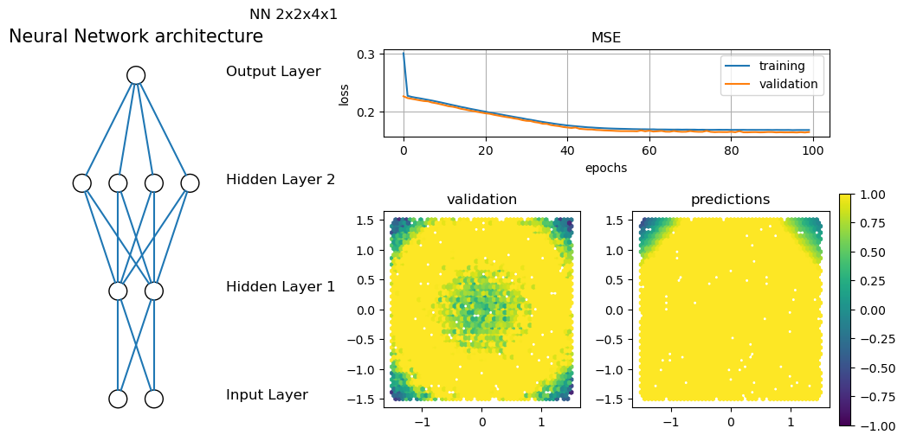
    


    

    


    
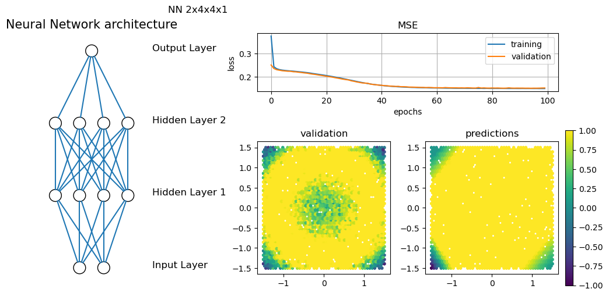
    


    
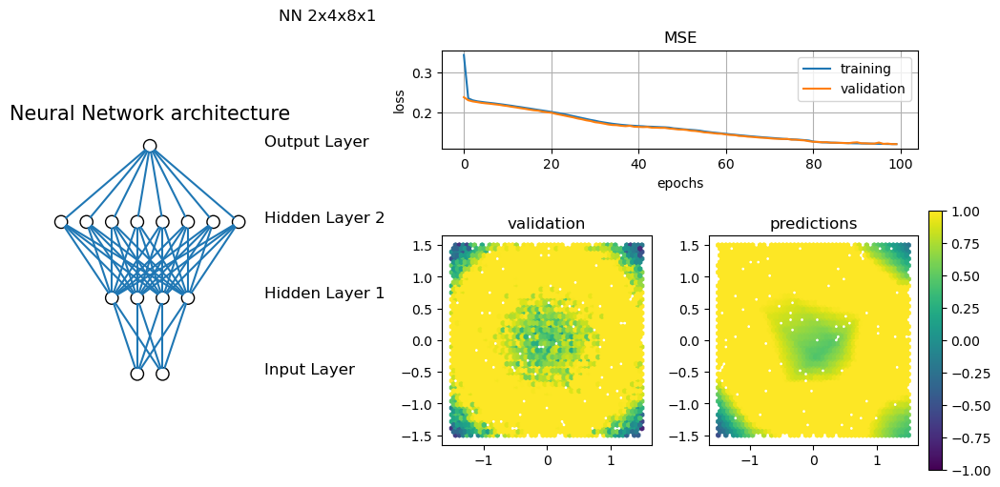
    


    

    


    

    


    
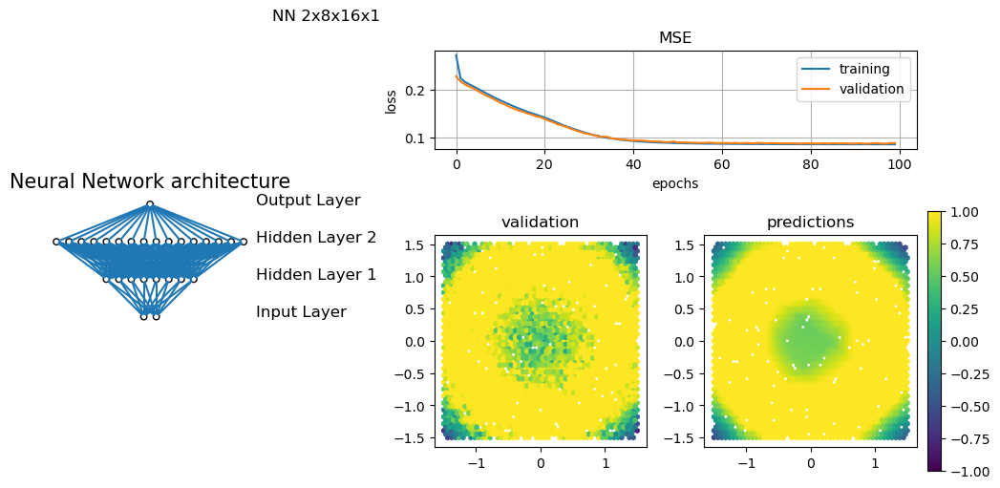
    


    
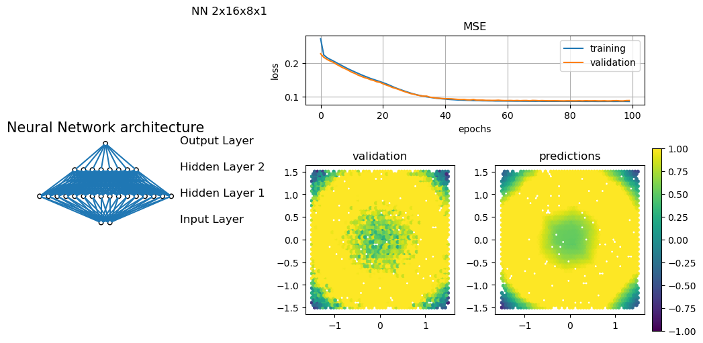
    


    
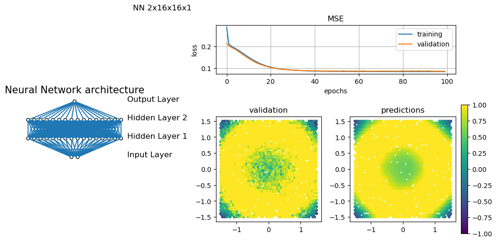
    


Mettere tutti i grafici non best in un appendice in fondo al notebook


