# Libraries


```python
#import os
#os.environ['KMP_DUPLICATE_LIB_OK']='True' #This is needed in my Anaconda+MacOsX installation; leave it commented.
import tensorflow as tf
from tensorflow import keras
import os
import numpy as np
import matplotlib.pyplot as plt
seed=0
np.random.seed(seed) # fix random seed
tf.random.set_seed(seed)
```

    2025-06-17 14:17:24.201269: I tensorflow/core/platform/cpu_feature_guard.cc:210] This TensorFlow binary is optimized to use available CPU instructions in performance-critical operations.
    To enable the following instructions: SSE4.1 SSE4.2 AVX AVX2 FMA, in other operations, rebuild TensorFlow with the appropriate compiler flags.


# import dataset


```python
from keras.datasets import mnist

# input image dimensions
img_rows, img_cols = 28, 28 # number of pixels 
# output
num_classes = 10 # 10 digits

# the data, split between train and test sets
(X_train, Y_train), (X_test, Y_test) = mnist.load_data()

print('X_train shape:', X_train.shape)
print('Y_train shape:', Y_train.shape)
```

    X_train shape: (60000, 28, 28)
    Y_train shape: (60000,)


# reshape and convert labels


```python
# reshape data, it could depend on Keras backend
X_train = X_train.reshape(X_train.shape[0], img_rows*img_cols)
X_test = X_test.reshape(X_test.shape[0], img_rows*img_cols)
print('X_train shape:', X_train.shape)
print('X_test shape:', X_test.shape)
print()

# cast to floats
X_train = X_train.astype('float32')
X_test = X_test.astype('float32')

# rescale data in interval [0,1]
X_train /= 255
X_test /= 255

# look at an example of data point
print('an example of a data point with label', Y_train[20])
# matshow: display a matrix in a new figure window
plt.matshow(X_train[20,:].reshape(28,28),cmap='binary')
plt.show()

# convert class vectors to binary class matrices, e.g. for use with categorical_crossentropy
Y_train = keras.utils.to_categorical(Y_train, num_classes)
Y_test = keras.utils.to_categorical(Y_test, num_classes)
print('... and with label', Y_train[20], 'after to_categorical')
print()
print('X_train shape:', X_train.shape)
print('Y_train shape:', Y_train.shape)
```

    X_train shape: (60000, 784)
    X_test shape: (10000, 784)
    
    an example of a data point with label 4


    
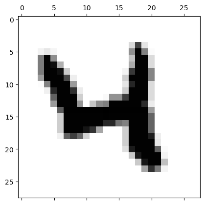
    


    ... and with label [0. 0. 0. 0. 1. 0. 0. 0. 0. 0.] after to_categorical
    
    X_train shape: (60000, 784)
    Y_train shape: (60000, 10)


# define NN 


```python
from keras.models import Sequential
from keras.layers import Dense, Dropout

def create_DNN():
    # instantiate model
    model = Sequential()
    # add a dense all-to-all relu layer
    model.add(Dense(400,input_shape=(img_rows*img_cols,), activation='relu'))
    # add a dense all-to-all relu layer
    model.add(Dense(100, activation='relu'))
    # apply dropout with rate 0.5
    model.add(Dropout(0.5))
    # soft-max layer
    model.add(Dense(num_classes, activation='softmax'))
    
    return model

print('Model architecture created successfully!')
```

    Model architecture created successfully!


## choose optimizer and cost


```python
from keras.optimizers import SGD, Adam, RMSprop, Adagrad, Adadelta, Adam, Adamax, Nadam

def compile_model(optimizer:str):
    # create the model
    model=create_DNN()
    # compile the model
    model.compile(loss=keras.losses.categorical_crossentropy,
                  optimizer=optimizer,
                  metrics=['acc'])
    return model

print('Model compiled successfully and ready to be trained.')
```

    Model compiled successfully and ready to be trained.


## train model


```python
# training parameters
batch_size = 32
epochs = 10 # da cambiare aumentando

# create the deep neural net
model_DNN = compile_model('sgd')

# train DNN and store training info in history
history = model_DNN.fit(X_train, Y_train,
          batch_size=batch_size,
          epochs=epochs,
          shuffle=True, # a good idea is to shuffle input before at each epoch
          verbose=1,
          validation_data=(X_test, Y_test))
```

    /home/td/miniconda3/envs/dl/lib/python3.12/site-packages/keras/src/layers/core/dense.py:93: UserWarning: Do not pass an `input_shape`/`input_dim` argument to a layer. When using Sequential models, prefer using an `Input(shape)` object as the first layer in the model instead.
      super().__init__(activity_regularizer=activity_regularizer, **kwargs)


    Epoch 1/10


    2025-06-17 14:17:39.243891: W external/local_xla/xla/tsl/framework/cpu_allocator_impl.cc:83] Allocation of 188160000 exceeds 10% of free system memory.


    1875/1875 ━━━━━━━━━━━━━━━━━━━━ 12s 6ms/step - acc: 0.6321 - loss: 1.1890 - val_acc: 0.9165 - val_loss: 0.3138
    Epoch 2/10
    1875/1875 ━━━━━━━━━━━━━━━━━━━━ 11s 6ms/step - acc: 0.8835 - loss: 0.4105 - val_acc: 0.9309 - val_loss: 0.2395
    Epoch 3/10
    1875/1875 ━━━━━━━━━━━━━━━━━━━━ 10s 5ms/step - acc: 0.9091 - loss: 0.3215 - val_acc: 0.9418 - val_loss: 0.2013
    Epoch 4/10
    1875/1875 ━━━━━━━━━━━━━━━━━━━━ 9s 5ms/step - acc: 0.9227 - loss: 0.2757 - val_acc: 0.9495 - val_loss: 0.1775
    Epoch 5/10
    1875/1875 ━━━━━━━━━━━━━━━━━━━━ 10s 6ms/step - acc: 0.9326 - loss: 0.2448 - val_acc: 0.9526 - val_loss: 0.1577
    Epoch 6/10
    1875/1875 ━━━━━━━━━━━━━━━━━━━━ 11s 6ms/step - acc: 0.9397 - loss: 0.2212 - val_acc: 0.9565 - val_loss: 0.1440
    Epoch 7/10
    1875/1875 ━━━━━━━━━━━━━━━━━━━━ 11s 6ms/step - acc: 0.9433 - loss: 0.2000 - val_acc: 0.9599 - val_loss: 0.1316
    Epoch 8/10
    1875/1875 ━━━━━━━━━━━━━━━━━━━━ 9s 5ms/step - acc: 0.9473 - loss: 0.1837 - val_acc: 0.9625 - val_loss: 0.1220
    Epoch 9/10
    1875/1875 ━━━━━━━━━━━━━━━━━━━━ 8s 4ms/step - acc: 0.9522 - loss: 0.1691 - val_acc: 0.9654 - val_loss: 0.1138
    Epoch 10/10
    1875/1875 ━━━━━━━━━━━━━━━━━━━━ 8s 4ms/step - acc: 0.9550 - loss: 0.1592 - val_acc: 0.9663 - val_loss: 0.1077


## evaluate performance 


```python
# evaluate model
score = model_DNN.evaluate(X_test, Y_test, verbose=1)

# print performance
print()
print('Test loss:', score[0])
print('Test accuracy:', score[1])

# look into training history

# summarize history for accuracy
plt.plot(history.history['acc'])
plt.plot(history.history['val_acc'])
plt.ylabel('model accuracy')
plt.xlabel('epoch')
plt.legend(['train', 'test'], loc='best')
plt.title('Accuracy')
plt.grid()
plt.show()

# summarize history for loss
plt.plot(history.history['loss'])
plt.plot(history.history['val_loss'])
plt.ylabel('model loss')
plt.xlabel('epoch')
plt.title('Loss')
plt.legend(['train', 'test'], loc='best')
plt.grid()
plt.show()
```

    313/313 ━━━━━━━━━━━━━━━━━━━━ 1s 2ms/step - acc: 0.9606 - loss: 0.1240 
    
    Test loss: 0.10769391804933548
    Test accuracy: 0.9663000106811523


    
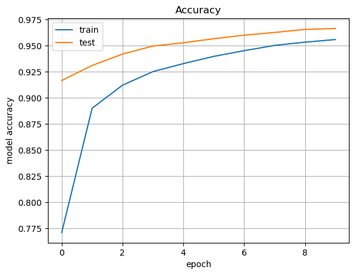
    


    
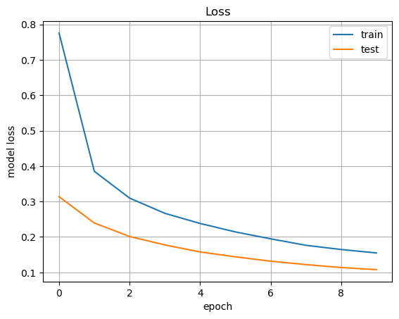
    


```python
#X_test = X_test.reshape(X_test.shape[0], img_rows*img_cols)
predictions = model_DNN.predict(X_test)

X_test = X_test.reshape(X_test.shape[0], img_rows, img_cols,1)

plt.figure(figsize=(15, 15)) 
for i in range(10):    
    ax = plt.subplot(2, 10, i + 1)    
    plt.imshow(X_test[i, :, :, 0], cmap='gray')    
    plt.title("Digit: {}\nPredicted:    {}".format(np.argmax(Y_test[i]), np.argmax(predictions[i])))    
    plt.axis('off') 
plt.show()
```

    313/313 ━━━━━━━━━━━━━━━━━━━━ 0s 1ms/step  


    
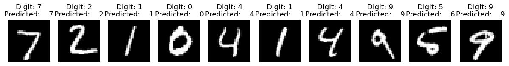
    


# Exercise 12.1
## adam


```python
print('ADAM')

model_adam=compile_model('adam')

adam_hist=model_adam.fit(X_train, Y_train,
          batch_size=32,
          epochs=30,
          shuffle=True, # a good idea is to shuffle input before at each epoch
          verbose=1,
          validation_data=(X_test, Y_test))
```

    ADAM
    Epoch 1/30
    1875/1875 ━━━━━━━━━━━━━━━━━━━━ 17s 8ms/step - acc: 0.8552 - loss: 0.4798 - val_acc: 0.9664 - val_loss: 0.1095
    Epoch 2/30
    1875/1875 ━━━━━━━━━━━━━━━━━━━━ 15s 8ms/step - acc: 0.9612 - loss: 0.1375 - val_acc: 0.9732 - val_loss: 0.0862
    Epoch 3/30
    1875/1875 ━━━━━━━━━━━━━━━━━━━━ 17s 9ms/step - acc: 0.9729 - loss: 0.0934 - val_acc: 0.9760 - val_loss: 0.0789
    Epoch 4/30
    1875/1875 ━━━━━━━━━━━━━━━━━━━━ 17s 9ms/step - acc: 0.9779 - loss: 0.0749 - val_acc: 0.9727 - val_loss: 0.0955
    Epoch 5/30
    1875/1875 ━━━━━━━━━━━━━━━━━━━━ 17s 9ms/step - acc: 0.9801 - loss: 0.0643 - val_acc: 0.9762 - val_loss: 0.0911
    Epoch 6/30
    1875/1875 ━━━━━━━━━━━━━━━━━━━━ 18s 10ms/step - acc: 0.9852 - loss: 0.0501 - val_acc: 0.9789 - val_loss: 0.0852
    Epoch 7/30
    1875/1875 ━━━━━━━━━━━━━━━━━━━━ 16s 9ms/step - acc: 0.9863 - loss: 0.0445 - val_acc: 0.9789 - val_loss: 0.0919
    Epoch 8/30
    1875/1875 ━━━━━━━━━━━━━━━━━━━━ 19s 10ms/step - acc: 0.9873 - loss: 0.0383 - val_acc: 0.9777 - val_loss: 0.0967
    Epoch 9/30
    1875/1875 ━━━━━━━━━━━━━━━━━━━━ 18s 10ms/step - acc: 0.9890 - loss: 0.0358 - val_acc: 0.9794 - val_loss: 0.1011
    Epoch 10/30
    1875/1875 ━━━━━━━━━━━━━━━━━━━━ 19s 10ms/step - acc: 0.9902 - loss: 0.0319 - val_acc: 0.9797 - val_loss: 0.1006
    Epoch 11/30
    1875/1875 ━━━━━━━━━━━━━━━━━━━━ 19s 10ms/step - acc: 0.9910 - loss: 0.0286 - val_acc: 0.9796 - val_loss: 0.1101
    Epoch 12/30
    1875/1875 ━━━━━━━━━━━━━━━━━━━━ 18s 10ms/step - acc: 0.9908 - loss: 0.0301 - val_acc: 0.9789 - val_loss: 0.1047
    Epoch 13/30
    1875/1875 ━━━━━━━━━━━━━━━━━━━━ 19s 10ms/step - acc: 0.9931 - loss: 0.0228 - val_acc: 0.9823 - val_loss: 0.1075
    Epoch 14/30
    1875/1875 ━━━━━━━━━━━━━━━━━━━━ 17s 9ms/step - acc: 0.9928 - loss: 0.0234 - val_acc: 0.9783 - val_loss: 0.1252
    Epoch 15/30
    1875/1875 ━━━━━━━━━━━━━━━━━━━━ 16s 8ms/step - acc: 0.9928 - loss: 0.0214 - val_acc: 0.9819 - val_loss: 0.1059
    Epoch 16/30
    1875/1875 ━━━━━━━━━━━━━━━━━━━━ 15s 8ms/step - acc: 0.9945 - loss: 0.0168 - val_acc: 0.9787 - val_loss: 0.1384
    Epoch 17/30
    1875/1875 ━━━━━━━━━━━━━━━━━━━━ 15s 8ms/step - acc: 0.9941 - loss: 0.0197 - val_acc: 0.9805 - val_loss: 0.1207
    Epoch 18/30
    1875/1875 ━━━━━━━━━━━━━━━━━━━━ 16s 9ms/step - acc: 0.9939 - loss: 0.0221 - val_acc: 0.9807 - val_loss: 0.1127
    Epoch 19/30
    1875/1875 ━━━━━━━━━━━━━━━━━━━━ 16s 9ms/step - acc: 0.9955 - loss: 0.0147 - val_acc: 0.9811 - val_loss: 0.1300
    Epoch 20/30
    1875/1875 ━━━━━━━━━━━━━━━━━━━━ 17s 9ms/step - acc: 0.9949 - loss: 0.0175 - val_acc: 0.9768 - val_loss: 0.1670
    Epoch 21/30
    1875/1875 ━━━━━━━━━━━━━━━━━━━━ 19s 10ms/step - acc: 0.9945 - loss: 0.0211 - val_acc: 0.9815 - val_loss: 0.1253
    Epoch 22/30
    1875/1875 ━━━━━━━━━━━━━━━━━━━━ 16s 9ms/step - acc: 0.9955 - loss: 0.0157 - val_acc: 0.9823 - val_loss: 0.1393
    Epoch 23/30
    1875/1875 ━━━━━━━━━━━━━━━━━━━━ 15s 8ms/step - acc: 0.9954 - loss: 0.0150 - val_acc: 0.9798 - val_loss: 0.1639
    Epoch 24/30
    1875/1875 ━━━━━━━━━━━━━━━━━━━━ 16s 8ms/step - acc: 0.9957 - loss: 0.0186 - val_acc: 0.9802 - val_loss: 0.1402
    Epoch 25/30
    1875/1875 ━━━━━━━━━━━━━━━━━━━━ 19s 10ms/step - acc: 0.9952 - loss: 0.0175 - val_acc: 0.9813 - val_loss: 0.1479
    Epoch 26/30
    1875/1875 ━━━━━━━━━━━━━━━━━━━━ 17s 9ms/step - acc: 0.9959 - loss: 0.0148 - val_acc: 0.9798 - val_loss: 0.1773
    Epoch 27/30
    1875/1875 ━━━━━━━━━━━━━━━━━━━━ 15s 8ms/step - acc: 0.9957 - loss: 0.0166 - val_acc: 0.9825 - val_loss: 0.1528
    Epoch 28/30
    1875/1875 ━━━━━━━━━━━━━━━━━━━━ 17s 9ms/step - acc: 0.9963 - loss: 0.0139 - val_acc: 0.9819 - val_loss: 0.1445
    Epoch 29/30
    1875/1875 ━━━━━━━━━━━━━━━━━━━━ 16s 8ms/step - acc: 0.9965 - loss: 0.0123 - val_acc: 0.9810 - val_loss: 0.1720
    Epoch 30/30
    1875/1875 ━━━━━━━━━━━━━━━━━━━━ 16s 8ms/step - acc: 0.9962 - loss: 0.0166 - val_acc: 0.9787 - val_loss: 0.1826


## RMSprop


```python
print('RMSprop')
model_rms=compile_model('rmsprop')

rms_hist=model_rms.fit(X_train, Y_train,
          batch_size=batch_size,
          epochs=20,
          shuffle=True, # a good idea is to shuffle input before at each epoch
          verbose=1,
          validation_data=(X_test, Y_test))
```

    RMSprop
    Epoch 1/20
    1875/1875 ━━━━━━━━━━━━━━━━━━━━ 11s 5ms/step - acc: 0.8609 - loss: 0.4592 - val_acc: 0.9692 - val_loss: 0.1146
    Epoch 2/20
    1875/1875 ━━━━━━━━━━━━━━━━━━━━ 9s 5ms/step - acc: 0.9604 - loss: 0.1492 - val_acc: 0.9724 - val_loss: 0.1220
    Epoch 3/20
    1875/1875 ━━━━━━━━━━━━━━━━━━━━ 10s 5ms/step - acc: 0.9690 - loss: 0.1323 - val_acc: 0.9756 - val_loss: 0.1187
    Epoch 4/20
    1875/1875 ━━━━━━━━━━━━━━━━━━━━ 10s 5ms/step - acc: 0.9722 - loss: 0.1228 - val_acc: 0.9770 - val_loss: 0.1325
    Epoch 5/20
    1875/1875 ━━━━━━━━━━━━━━━━━━━━ 9s 5ms/step - acc: 0.9740 - loss: 0.1161 - val_acc: 0.9769 - val_loss: 0.1353
    Epoch 6/20
    1875/1875 ━━━━━━━━━━━━━━━━━━━━ 10s 5ms/step - acc: 0.9763 - loss: 0.1150 - val_acc: 0.9769 - val_loss: 0.1576
    Epoch 7/20
    1875/1875 ━━━━━━━━━━━━━━━━━━━━ 11s 6ms/step - acc: 0.9763 - loss: 0.1113 - val_acc: 0.9769 - val_loss: 0.1555
    Epoch 8/20
    1875/1875 ━━━━━━━━━━━━━━━━━━━━ 10s 5ms/step - acc: 0.9787 - loss: 0.1083 - val_acc: 0.9739 - val_loss: 0.1714
    Epoch 9/20
    1875/1875 ━━━━━━━━━━━━━━━━━━━━ 10s 5ms/step - acc: 0.9777 - loss: 0.1079 - val_acc: 0.9763 - val_loss: 0.1918
    Epoch 10/20
    1875/1875 ━━━━━━━━━━━━━━━━━━━━ 10s 5ms/step - acc: 0.9774 - loss: 0.1125 - val_acc: 0.9751 - val_loss: 0.2221
    Epoch 11/20
    1875/1875 ━━━━━━━━━━━━━━━━━━━━ 10s 5ms/step - acc: 0.9780 - loss: 0.1161 - val_acc: 0.9775 - val_loss: 0.2012
    Epoch 12/20
    1875/1875 ━━━━━━━━━━━━━━━━━━━━ 9s 5ms/step - acc: 0.9783 - loss: 0.1163 - val_acc: 0.9744 - val_loss: 0.2355
    Epoch 13/20
    1875/1875 ━━━━━━━━━━━━━━━━━━━━ 9s 5ms/step - acc: 0.9794 - loss: 0.1099 - val_acc: 0.9755 - val_loss: 0.2439
    Epoch 14/20
    1875/1875 ━━━━━━━━━━━━━━━━━━━━ 10s 5ms/step - acc: 0.9792 - loss: 0.1200 - val_acc: 0.9770 - val_loss: 0.2437
    Epoch 15/20
    1875/1875 ━━━━━━━━━━━━━━━━━━━━ 10s 5ms/step - acc: 0.9800 - loss: 0.1100 - val_acc: 0.9756 - val_loss: 0.2284
    Epoch 16/20
    1875/1875 ━━━━━━━━━━━━━━━━━━━━ 10s 5ms/step - acc: 0.9799 - loss: 0.1179 - val_acc: 0.9782 - val_loss: 0.2070
    Epoch 17/20
    1875/1875 ━━━━━━━━━━━━━━━━━━━━ 10s 5ms/step - acc: 0.9820 - loss: 0.1082 - val_acc: 0.9779 - val_loss: 0.2086
    Epoch 18/20
    1875/1875 ━━━━━━━━━━━━━━━━━━━━ 10s 5ms/step - acc: 0.9810 - loss: 0.1103 - val_acc: 0.9786 - val_loss: 0.2095
    Epoch 19/20
    1875/1875 ━━━━━━━━━━━━━━━━━━━━ 10s 5ms/step - acc: 0.9822 - loss: 0.1005 - val_acc: 0.9767 - val_loss: 0.2520
    Epoch 20/20
    1875/1875 ━━━━━━━━━━━━━━━━━━━━ 10s 5ms/step - acc: 0.9823 - loss: 0.1022 - val_acc: 0.9779 - val_loss: 0.2313


```python
# evaluate model
score_adam = model_adam.evaluate(X_test, Y_test, verbose=1)
score_rms = model_rms.evaluate(X_test, Y_test, verbose=1)

# print performance
print()
print('ADAM Test loss:', score_adam[0])
print('ADAM Test accuracy:', score_adam[1])
print()
print('RMS Test loss:', score_rms[0])
print('RMS Test accuracy:', score_rms[1])

# look into training history

# summarize history for accuracy
plt.plot(adam_hist.history['acc'], label='adam acc')
plt.plot(adam_hist.history['val_acc'], label='adam val acc')
plt.plot(rms_hist.history['acc'], label='rms acc')
plt.plot(rms_hist.history['val_acc'], label='rms val acc')
plt.ylabel('model accuracy')
plt.xlabel('epoch')
plt.legend(loc='best')
plt.show()

# summarize history for loss
plt.plot(adam_hist.history['loss'], label='adam loss', marker='o')
plt.plot(adam_hist.history['val_loss'], label='adam val loss', marker='*')
plt.plot(rms_hist.history['loss'], label='rms loss', marker='o')
plt.plot(rms_hist.history['val_loss'], label='rms val loss', marker='*')
plt.ylabel('model loss')
plt.xlabel('epoch')
plt.legend( loc='best')
plt.show()
```

    313/313 ━━━━━━━━━━━━━━━━━━━━ 1s 2ms/step - acc: 0.9746 - loss: 0.2342 
    313/313 ━━━━━━━━━━━━━━━━━━━━ 1s 2ms/step - acc: 0.9738 - loss: 0.3041     
    
    ADAM Test loss: 0.18264631927013397
    ADAM Test accuracy: 0.9786999821662903
    
    RMS Test loss: 0.2312665730714798
    RMS Test accuracy: 0.9779000282287598


    
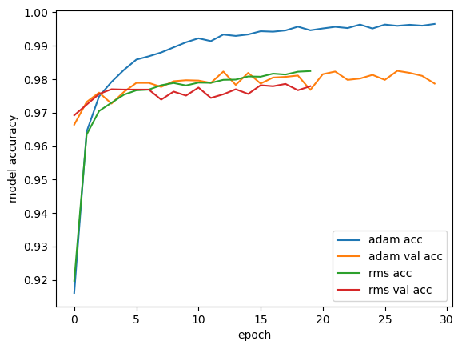
    


    
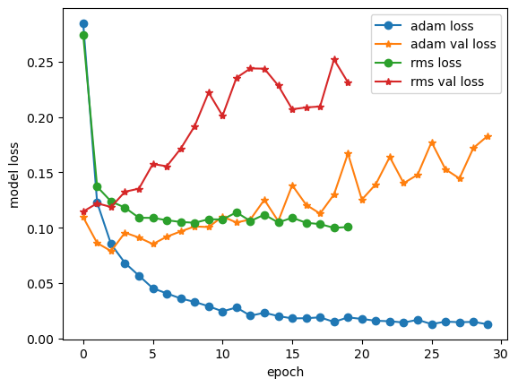
    


```python

```

## Exercise 12.2


```python
# you will need the following for Convolutional Neural Networks
from keras.layers import Flatten, Conv2D, MaxPooling2D, Input
```


```python
# reshape data, depending on Keras backend
if keras.backend.image_data_format() == 'channels_first':
    X_train = X_train.reshape(X_train.shape[0], 1, img_rows, img_cols)
    X_test = X_test.reshape(X_test.shape[0], 1, img_rows, img_cols)
    input_shape = (1, img_rows, img_cols)
else:
    X_train = X_train.reshape(X_train.shape[0], img_rows, img_cols, 1)
    X_test = X_test.reshape(X_test.shape[0], img_rows, img_cols, 1)
    input_shape = (img_rows, img_cols, 1)
    
print('X_train shape:', X_train.shape)
print('Y_train shape:', Y_train.shape)
print()
print(X_train.shape[0], 'train samples')
print(X_test.shape[0], 'test samples')
```

    X_train shape: (60000, 28, 28, 1)
    Y_train shape: (60000, 10)
    
    60000 train samples
    10000 test samples


```python
#THIS IS INCOMPLETE ... COMPLETE BEFORE EXECUTING IT

def create_CNN():
    # instantiate model
    model = Sequential()
    # add first convolutional layer with 10 filters (dimensionality of output space)
    model.add(Input(shape=(28,28,1)))
    model.add(Conv2D(10, kernel_size=(5, 5),
                     activation='relu',
                     input_shape=input_shape))
    #
    # ADD HERE SOME OTHER LAYERS AT YOUR WILL, FOR EXAMPLE SOME: Dropout, 2D pooling, 2D convolutional etc. ... 
    # remember to move towards a standard flat layer in the final part of your DNN,
    # and that we need a soft-max layer with num_classes=10 possible outputs
    #
    model.add(MaxPooling2D(
        pool_size=(2,2), strides=2
    ))

    model.add(Dropout(0.1))
    
    model.add(
        Conv2D(16, kernel_size=(5,5), strides=1, activation='relu')
    )
    model.add(MaxPooling2D(strides=2))
    model.add(Flatten())
    model.add(Dense(128, activation='relu'))
    model.add(Dense(10, activation='softmax'))
    # compile the model
    model.compile(loss=keras.losses.categorical_crossentropy,
                  optimizer='SGD',
                  metrics=['acc'])
    return model
```


```python
create_CNN().summary()
```

    /home/td/miniconda3/envs/dl/lib/python3.12/site-packages/keras/src/layers/convolutional/base_conv.py:113: UserWarning: Do not pass an `input_shape`/`input_dim` argument to a layer. When using Sequential models, prefer using an `Input(shape)` object as the first layer in the model instead.
      super().__init__(activity_regularizer=activity_regularizer, **kwargs)


<pre style="white-space:pre;overflow-x:auto;line-height:normal;font-family:Menlo,'DejaVu Sans Mono',consolas,'Courier New',monospace"><span style="font-weight: bold">Model: "sequential_19"</span>
</pre>


<pre style="white-space:pre;overflow-x:auto;line-height:normal;font-family:Menlo,'DejaVu Sans Mono',consolas,'Courier New',monospace">┏━━━━━━━━━━━━━━━━━━━━━━━━━━━━━━━━━┳━━━━━━━━━━━━━━━━━━━━━━━━┳━━━━━━━━━━━━━━━┓
┃<span style="font-weight: bold"> Layer (type)                    </span>┃<span style="font-weight: bold"> Output Shape           </span>┃<span style="font-weight: bold">       Param # </span>┃
┡━━━━━━━━━━━━━━━━━━━━━━━━━━━━━━━━━╇━━━━━━━━━━━━━━━━━━━━━━━━╇━━━━━━━━━━━━━━━┩
│ conv2d_14 (<span style="color: #0087ff; text-decoration-color: #0087ff">Conv2D</span>)              │ (<span style="color: #00d7ff; text-decoration-color: #00d7ff">None</span>, <span style="color: #00af00; text-decoration-color: #00af00">24</span>, <span style="color: #00af00; text-decoration-color: #00af00">24</span>, <span style="color: #00af00; text-decoration-color: #00af00">10</span>)     │           <span style="color: #00af00; text-decoration-color: #00af00">260</span> │
├─────────────────────────────────┼────────────────────────┼───────────────┤
│ max_pooling2d_14 (<span style="color: #0087ff; text-decoration-color: #0087ff">MaxPooling2D</span>) │ (<span style="color: #00d7ff; text-decoration-color: #00d7ff">None</span>, <span style="color: #00af00; text-decoration-color: #00af00">12</span>, <span style="color: #00af00; text-decoration-color: #00af00">12</span>, <span style="color: #00af00; text-decoration-color: #00af00">10</span>)     │             <span style="color: #00af00; text-decoration-color: #00af00">0</span> │
├─────────────────────────────────┼────────────────────────┼───────────────┤
│ dropout_11 (<span style="color: #0087ff; text-decoration-color: #0087ff">Dropout</span>)            │ (<span style="color: #00d7ff; text-decoration-color: #00d7ff">None</span>, <span style="color: #00af00; text-decoration-color: #00af00">12</span>, <span style="color: #00af00; text-decoration-color: #00af00">12</span>, <span style="color: #00af00; text-decoration-color: #00af00">10</span>)     │             <span style="color: #00af00; text-decoration-color: #00af00">0</span> │
├─────────────────────────────────┼────────────────────────┼───────────────┤
│ conv2d_15 (<span style="color: #0087ff; text-decoration-color: #0087ff">Conv2D</span>)              │ (<span style="color: #00d7ff; text-decoration-color: #00d7ff">None</span>, <span style="color: #00af00; text-decoration-color: #00af00">8</span>, <span style="color: #00af00; text-decoration-color: #00af00">8</span>, <span style="color: #00af00; text-decoration-color: #00af00">16</span>)       │         <span style="color: #00af00; text-decoration-color: #00af00">4,016</span> │
├─────────────────────────────────┼────────────────────────┼───────────────┤
│ max_pooling2d_15 (<span style="color: #0087ff; text-decoration-color: #0087ff">MaxPooling2D</span>) │ (<span style="color: #00d7ff; text-decoration-color: #00d7ff">None</span>, <span style="color: #00af00; text-decoration-color: #00af00">4</span>, <span style="color: #00af00; text-decoration-color: #00af00">4</span>, <span style="color: #00af00; text-decoration-color: #00af00">16</span>)       │             <span style="color: #00af00; text-decoration-color: #00af00">0</span> │
├─────────────────────────────────┼────────────────────────┼───────────────┤
│ flatten_6 (<span style="color: #0087ff; text-decoration-color: #0087ff">Flatten</span>)             │ (<span style="color: #00d7ff; text-decoration-color: #00d7ff">None</span>, <span style="color: #00af00; text-decoration-color: #00af00">256</span>)            │             <span style="color: #00af00; text-decoration-color: #00af00">0</span> │
├─────────────────────────────────┼────────────────────────┼───────────────┤
│ dense_37 (<span style="color: #0087ff; text-decoration-color: #0087ff">Dense</span>)                │ (<span style="color: #00d7ff; text-decoration-color: #00d7ff">None</span>, <span style="color: #00af00; text-decoration-color: #00af00">128</span>)            │        <span style="color: #00af00; text-decoration-color: #00af00">32,896</span> │
├─────────────────────────────────┼────────────────────────┼───────────────┤
│ dense_38 (<span style="color: #0087ff; text-decoration-color: #0087ff">Dense</span>)                │ (<span style="color: #00d7ff; text-decoration-color: #00d7ff">None</span>, <span style="color: #00af00; text-decoration-color: #00af00">10</span>)             │         <span style="color: #00af00; text-decoration-color: #00af00">1,290</span> │
└─────────────────────────────────┴────────────────────────┴───────────────┘
</pre>


<pre style="white-space:pre;overflow-x:auto;line-height:normal;font-family:Menlo,'DejaVu Sans Mono',consolas,'Courier New',monospace"><span style="font-weight: bold"> Total params: </span><span style="color: #00af00; text-decoration-color: #00af00">38,462</span> (150.24 KB)
</pre>


<pre style="white-space:pre;overflow-x:auto;line-height:normal;font-family:Menlo,'DejaVu Sans Mono',consolas,'Courier New',monospace"><span style="font-weight: bold"> Trainable params: </span><span style="color: #00af00; text-decoration-color: #00af00">38,462</span> (150.24 KB)
</pre>


<pre style="white-space:pre;overflow-x:auto;line-height:normal;font-family:Menlo,'DejaVu Sans Mono',consolas,'Courier New',monospace"><span style="font-weight: bold"> Non-trainable params: </span><span style="color: #00af00; text-decoration-color: #00af00">0</span> (0.00 B)
</pre>


```python
# training parameters
batch_size = 32
epochs = 10# INSERT HERE AN ADEQUATE NUMBER OF EPOCHS!

# create the deep conv net
model_CNN=create_CNN()

# train CNN
cnn_history=model_CNN.fit(X_train, Y_train,
          batch_size=batch_size,
          shuffle=True,
          epochs=epochs,
          verbose=1,
          validation_data=(X_test, Y_test))

# evaliate model
score = model_CNN.evaluate(X_test, Y_test, verbose=1)

# print performance
print()
print('Test loss:', score[0])
print('Test accuracy:', score[1])
```

    Epoch 1/10
    1875/1875 ━━━━━━━━━━━━━━━━━━━━ 13s 7ms/step - acc: 0.6663 - loss: 1.0386 - val_acc: 0.9508 - val_loss: 0.1679
    Epoch 2/10
    1875/1875 ━━━━━━━━━━━━━━━━━━━━ 14s 7ms/step - acc: 0.9433 - loss: 0.1877 - val_acc: 0.9685 - val_loss: 0.1020
    Epoch 3/10
    1875/1875 ━━━━━━━━━━━━━━━━━━━━ 14s 7ms/step - acc: 0.9612 - loss: 0.1267 - val_acc: 0.9751 - val_loss: 0.0823
    Epoch 4/10
    1875/1875 ━━━━━━━━━━━━━━━━━━━━ 14s 7ms/step - acc: 0.9682 - loss: 0.1025 - val_acc: 0.9768 - val_loss: 0.0708
    Epoch 5/10
    1875/1875 ━━━━━━━━━━━━━━━━━━━━ 14s 7ms/step - acc: 0.9732 - loss: 0.0879 - val_acc: 0.9800 - val_loss: 0.0642
    Epoch 6/10
    1875/1875 ━━━━━━━━━━━━━━━━━━━━ 13s 7ms/step - acc: 0.9775 - loss: 0.0747 - val_acc: 0.9821 - val_loss: 0.0552
    Epoch 7/10
    1875/1875 ━━━━━━━━━━━━━━━━━━━━ 13s 7ms/step - acc: 0.9791 - loss: 0.0673 - val_acc: 0.9831 - val_loss: 0.0515
    Epoch 8/10
    1875/1875 ━━━━━━━━━━━━━━━━━━━━ 13s 7ms/step - acc: 0.9814 - loss: 0.0617 - val_acc: 0.9842 - val_loss: 0.0461
    Epoch 9/10
    1875/1875 ━━━━━━━━━━━━━━━━━━━━ 13s 7ms/step - acc: 0.9829 - loss: 0.0566 - val_acc: 0.9853 - val_loss: 0.0434
    Epoch 10/10
    1875/1875 ━━━━━━━━━━━━━━━━━━━━ 13s 7ms/step - acc: 0.9848 - loss: 0.0517 - val_acc: 0.9847 - val_loss: 0.0460
    313/313 ━━━━━━━━━━━━━━━━━━━━ 1s 3ms/step - acc: 0.9821 - loss: 0.0554 
    
    Test loss: 0.04595089331269264
    Test accuracy: 0.9847000241279602


```python
#X_test = X_test.reshape(X_test.shape[0], img_rows*img_cols)
predictions = model_CNN.predict(X_test)

X_test = X_test.reshape(X_test.shape[0], img_rows, img_cols,1)

plt.figure(figsize=(15, 15)) 
for i in range(10):    
    ax = plt.subplot(2, 10, i + 1)    
    plt.imshow(X_test[i, :, :, 0], cmap='gray')    
    plt.title("Digit: {}\nPredicted:    {}".format(np.argmax(Y_test[i]), np.argmax(predictions[i])))    
    plt.axis('off') 
plt.show()
```

    313/313 ━━━━━━━━━━━━━━━━━━━━ 1s 2ms/step  


    

    


```python
figure=plt.figure()
plt.plot(cnn_history.epoch , cnn_history.history['acc'], label='train')
plt.plot(cnn_history.epoch ,cnn_history.history['val_acc'], label='validation', marker='*')
plt.grid()
plt.xlabel('epochs')
plt.ylabel('accuracy')
plt.legend()
plt.show()
```


    
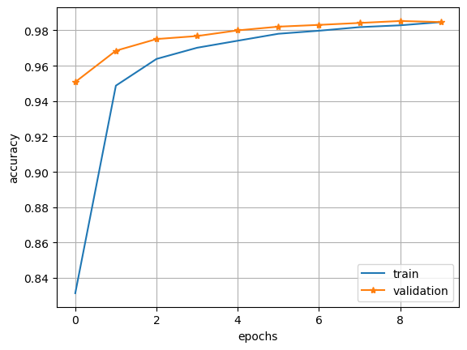
    


```python
from PIL import Image
import os
```


```python
digit_filename = "./images/sei.png"
digit_in = Image.open(digit_filename).convert('L')
#digit_in = Image.open("8b.png").convert('L') #ON GOOGLE COLAB INSERT THE NAME OF THE UPLOADED FILE

ydim, xdim = digit_in.size
print("Image size: "+str(xdim)+"x"+str(ydim))
pix=digit_in.load();
data = np.zeros((xdim, ydim))
for j in range(ydim):
    for i in range(xdim):
        data[i,j]=pix[j,i]

data /= 255

plt.figure(figsize=(5,5))
plt.imshow(data, cmap='gray')
plt.show()

print(data.shape)
```

    Image size: 28x28


    
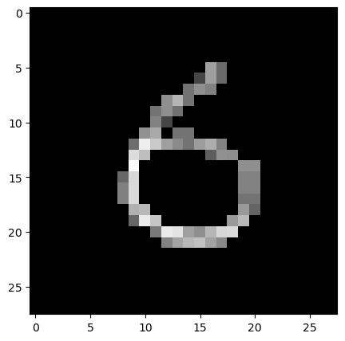
    


    (28, 28)


```python
print(data.shape)
data = data.reshape(1,xdim*ydim)
print(data.shape)
pred_0 = model_DNN.predict(data)

data = data.reshape(xdim,ydim)

plt.figure(figsize=(5, 5))  
plt.imshow(data, cmap='gray')    
plt.title("Digit predicted:    {}".format(np.argmax(pred_0)))
plt.axis('off') 
plt.show()
```

    (28, 28)
    (1, 784)
    1/1 ━━━━━━━━━━━━━━━━━━━━ 0s 39ms/step


    
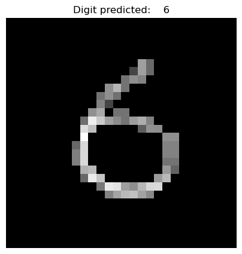
    


```python
layer_index=0
for layer in model_CNN.layers:
    print(layer_index, layer.name)
    layer_index+=1
```

    0 conv2d_8
    1 max_pooling2d_8
    2 conv2d_9
    3 max_pooling2d_9
    4 flatten_3
    5 dense_31
    6 dense_32


```python
# layer_index should be the index of a convolutional layer
layer_index=0
# retrieve weights from the convolutional hidden layer
filters, biases = model_CNN.layers[layer_index].get_weights()
# normalize filter values to 0-1 so we can visualize them
f_min, f_max = filters.min(), filters.max()
filters = (filters - f_min) / (f_max - f_min)
print(filters.shape)

# plot filters
n_filters, ix = filters.shape[3], 1
for i in range(n_filters):
    # get the filter
    f = filters[:, :, :, i]
    # specify subplot and turn of axis
    ax = plt.subplot(1,n_filters, ix)
    ax.set_xticks([])
    ax.set_yticks([])
    # plot filter channel in grayscale
    plt.imshow(f[:, :, 0], cmap='gray')
    ix += 1
# show the figure
plt.show()
```

    (5, 5, 1, 10)


    
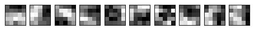
    


```python
model_CNN.input
```


    ---------------------------------------------------------------------------

    AttributeError                            Traceback (most recent call last)

    Cell In[50], line 1
    ----> 1 model_CNN.input


    File ~/miniconda3/envs/dl/lib/python3.12/site-packages/keras/src/ops/operation.py:276, in Operation.input(self)
        266 @property
        267 def input(self):
        268     """Retrieves the input tensor(s) of a symbolic operation.
        269 
        270     Only returns the tensor(s) corresponding to the *first time*
       (...)    274         Input tensor or list of input tensors.
        275     """
    --> 276     return self._get_node_attribute_at_index(0, "input_tensors", "input")


    File ~/miniconda3/envs/dl/lib/python3.12/site-packages/keras/src/ops/operation.py:307, in Operation._get_node_attribute_at_index(self, node_index, attr, attr_name)
        291 """Private utility to retrieves an attribute (e.g. inputs) from a node.
        292 
        293 This is used to implement the properties:
       (...)    304     The operation's attribute `attr` at the node of index `node_index`.
        305 """
        306 if not self._inbound_nodes:
    --> 307     raise AttributeError(
        308         f"The layer {self.name} has never been called "
        309         f"and thus has no defined {attr_name}."
        310     )
        311 if not len(self._inbound_nodes) > node_index:
        312     raise ValueError(
        313         f"Asked to get {attr_name} at node "
        314         f"{node_index}, but the operation has only "
        315         f"{len(self._inbound_nodes)} inbound nodes."
        316     )


    AttributeError: The layer sequential_14 has never been called and thus has no defined input.


```python
test_index = 0

from keras.models import Model
layer_outputs = [layer.output for layer in model_CNN.layers]
activation_model = Model(inputs=model_CNN.input, outputs=layer_outputs)
activations = activation_model.predict(X_test[test_index].reshape(1,28,28,1))
 
def display_activation(activations, col_size, row_size, layer_index): 
    activation = activations[layer_index]
    activation_index=0
    fig, ax = plt.subplots(row_size, col_size, figsize=(row_size*3,col_size*3))
    for row in range(0,row_size):
        for col in range(0,col_size):
            ax[row][col].imshow(activation[0, :, :, activation_index], cmap='gray')
            activation_index += 1
```


    ---------------------------------------------------------------------------

    AttributeError                            Traceback (most recent call last)

    Cell In[48], line 5
          3 from keras.models import Model
          4 layer_outputs = [layer.output for layer in model_CNN.layers]
    ----> 5 activation_model = Model(inputs=model_CNN.input, outputs=layer_outputs)
          6 activations = activation_model.predict(X_test[test_index].reshape(1,28,28,1))
          8 def display_activation(activations, col_size, row_size, layer_index): 


    File ~/miniconda3/envs/dl/lib/python3.12/site-packages/keras/src/ops/operation.py:276, in Operation.input(self)
        266 @property
        267 def input(self):
        268     """Retrieves the input tensor(s) of a symbolic operation.
        269 
        270     Only returns the tensor(s) corresponding to the *first time*
       (...)    274         Input tensor or list of input tensors.
        275     """
    --> 276     return self._get_node_attribute_at_index(0, "input_tensors", "input")


    File ~/miniconda3/envs/dl/lib/python3.12/site-packages/keras/src/ops/operation.py:307, in Operation._get_node_attribute_at_index(self, node_index, attr, attr_name)
        291 """Private utility to retrieves an attribute (e.g. inputs) from a node.
        292 
        293 This is used to implement the properties:
       (...)    304     The operation's attribute `attr` at the node of index `node_index`.
        305 """
        306 if not self._inbound_nodes:
    --> 307     raise AttributeError(
        308         f"The layer {self.name} has never been called "
        309         f"and thus has no defined {attr_name}."
        310     )
        311 if not len(self._inbound_nodes) > node_index:
        312     raise ValueError(
        313         f"Asked to get {attr_name} at node "
        314         f"{node_index}, but the operation has only "
        315         f"{len(self._inbound_nodes)} inbound nodes."
        316     )


    AttributeError: The layer sequential_14 has never been called and thus has no defined input.


```python
%matplotlib inline
plt.imshow(X_test[test_index][:,:,0], cmap='gray')
# def display_activation(activations, col_size, row_size, layer number)
display_activation(activations, 4, 2, 0)
# col_size x row_size must be <= Number of filters for the convolutional layer
```


    ---------------------------------------------------------------------------

    NameError                                 Traceback (most recent call last)

    Cell In[47], line 4
          2 plt.imshow(X_test[test_index][:,:,0], cmap='gray')
          3 # def display_activation(activations, col_size, row_size, layer number)
    ----> 4 display_activation(activations, 4, 2, 0)


    NameError: name 'display_activation' is not defined


```python

```


```python

```

# proviamo su dati più complicati


```python
labels=os.listdir('/home/td/Pyproj/neuralnet/cv/archive/test/')
labels
```


    ['gpu',
     'microphone',
     'headset',
     'cpu',
     'monitor',
     'motherboard',
     'mouse',
     'webcam',
     'hdd',
     'cables',
     'ram',
     'keyboard',
     'speakers',
     'case']


```python
path='/home/td/Pyproj/neuralnet/cv/archive/'
```


```python
from tensorflow.keras.utils import image_dataset_from_directory

batch_size = 32
img_height = 180
img_width = 180

train_ds = image_dataset_from_directory(
  path+'train/',
  validation_split=0.2,
  subset="training",
  seed=123,
  image_size=(img_height, img_width),
  batch_size=batch_size)
val_ds = image_dataset_from_directory(
  path+'train/',
  validation_split=0.2,
  subset="validation",
  seed=123,
  image_size=(img_height, img_width),
  batch_size=batch_size)

test_ds=image_dataset_from_directory(
    path+'test',
    seed=123,
    image_size=(img_height, img_width),
    batch_size=batch_size    
)

```

    Found 2623 files belonging to 14 classes.
    Using 2099 files for training.
    Found 2623 files belonging to 14 classes.
    Using 524 files for validation.
    Found 656 files belonging to 14 classes.


```python
import matplotlib.pyplot as plt

plt.figure(figsize=(10, 10))
for images, labels in train_ds.take(1):
  for i in range(14):
    ax = plt.subplot(4, 4, i + 1)
    plt.imshow(images[i].numpy().astype("uint8"))
    plt.title(val_ds.class_names[labels[i]])
    plt.axis("off")
plt.show()
```

    2025-06-17 15:58:06.788930: I tensorflow/core/framework/local_rendezvous.cc:405] Local rendezvous is aborting with status: OUT_OF_RANGE: End of sequence


    

    


```python
vis=Sequential()

vis.add(Input(shape=(180,180,3)))

vis.add(Conv2D(14, kernel_size=(8,8), activation='relu'))

vis.add(MaxPooling2D(strides=2))

vis.add(Dropout(0.3))

vis.add(Conv2D(20, kernel_size=(8,8), strides=2, activation='relu'))

vis.add(MaxPooling2D())


vis.add(Flatten())

vis.add(Dense(260, activation='relu'))

vis.add(Dense(128, activation='relu'))


vis.add(Dense(14, activation='softmax'))
```


```python
vis.summary()
```


<pre style="white-space:pre;overflow-x:auto;line-height:normal;font-family:Menlo,'DejaVu Sans Mono',consolas,'Courier New',monospace"><span style="font-weight: bold">Model: "sequential_27"</span>
</pre>


<pre style="white-space:pre;overflow-x:auto;line-height:normal;font-family:Menlo,'DejaVu Sans Mono',consolas,'Courier New',monospace">┏━━━━━━━━━━━━━━━━━━━━━━━━━━━━━━━━━┳━━━━━━━━━━━━━━━━━━━━━━━━┳━━━━━━━━━━━━━━━┓
┃<span style="font-weight: bold"> Layer (type)                    </span>┃<span style="font-weight: bold"> Output Shape           </span>┃<span style="font-weight: bold">       Param # </span>┃
┡━━━━━━━━━━━━━━━━━━━━━━━━━━━━━━━━━╇━━━━━━━━━━━━━━━━━━━━━━━━╇━━━━━━━━━━━━━━━┩
│ conv2d_30 (<span style="color: #0087ff; text-decoration-color: #0087ff">Conv2D</span>)              │ (<span style="color: #00d7ff; text-decoration-color: #00d7ff">None</span>, <span style="color: #00af00; text-decoration-color: #00af00">173</span>, <span style="color: #00af00; text-decoration-color: #00af00">173</span>, <span style="color: #00af00; text-decoration-color: #00af00">14</span>)   │         <span style="color: #00af00; text-decoration-color: #00af00">2,702</span> │
├─────────────────────────────────┼────────────────────────┼───────────────┤
│ max_pooling2d_30 (<span style="color: #0087ff; text-decoration-color: #0087ff">MaxPooling2D</span>) │ (<span style="color: #00d7ff; text-decoration-color: #00d7ff">None</span>, <span style="color: #00af00; text-decoration-color: #00af00">86</span>, <span style="color: #00af00; text-decoration-color: #00af00">86</span>, <span style="color: #00af00; text-decoration-color: #00af00">14</span>)     │             <span style="color: #00af00; text-decoration-color: #00af00">0</span> │
├─────────────────────────────────┼────────────────────────┼───────────────┤
│ dropout_18 (<span style="color: #0087ff; text-decoration-color: #0087ff">Dropout</span>)            │ (<span style="color: #00d7ff; text-decoration-color: #00d7ff">None</span>, <span style="color: #00af00; text-decoration-color: #00af00">86</span>, <span style="color: #00af00; text-decoration-color: #00af00">86</span>, <span style="color: #00af00; text-decoration-color: #00af00">14</span>)     │             <span style="color: #00af00; text-decoration-color: #00af00">0</span> │
├─────────────────────────────────┼────────────────────────┼───────────────┤
│ conv2d_31 (<span style="color: #0087ff; text-decoration-color: #0087ff">Conv2D</span>)              │ (<span style="color: #00d7ff; text-decoration-color: #00d7ff">None</span>, <span style="color: #00af00; text-decoration-color: #00af00">40</span>, <span style="color: #00af00; text-decoration-color: #00af00">40</span>, <span style="color: #00af00; text-decoration-color: #00af00">20</span>)     │        <span style="color: #00af00; text-decoration-color: #00af00">17,940</span> │
├─────────────────────────────────┼────────────────────────┼───────────────┤
│ max_pooling2d_31 (<span style="color: #0087ff; text-decoration-color: #0087ff">MaxPooling2D</span>) │ (<span style="color: #00d7ff; text-decoration-color: #00d7ff">None</span>, <span style="color: #00af00; text-decoration-color: #00af00">20</span>, <span style="color: #00af00; text-decoration-color: #00af00">20</span>, <span style="color: #00af00; text-decoration-color: #00af00">20</span>)     │             <span style="color: #00af00; text-decoration-color: #00af00">0</span> │
├─────────────────────────────────┼────────────────────────┼───────────────┤
│ flatten_12 (<span style="color: #0087ff; text-decoration-color: #0087ff">Flatten</span>)            │ (<span style="color: #00d7ff; text-decoration-color: #00d7ff">None</span>, <span style="color: #00af00; text-decoration-color: #00af00">8000</span>)           │             <span style="color: #00af00; text-decoration-color: #00af00">0</span> │
├─────────────────────────────────┼────────────────────────┼───────────────┤
│ dense_46 (<span style="color: #0087ff; text-decoration-color: #0087ff">Dense</span>)                │ (<span style="color: #00d7ff; text-decoration-color: #00d7ff">None</span>, <span style="color: #00af00; text-decoration-color: #00af00">260</span>)            │     <span style="color: #00af00; text-decoration-color: #00af00">2,080,260</span> │
├─────────────────────────────────┼────────────────────────┼───────────────┤
│ dense_47 (<span style="color: #0087ff; text-decoration-color: #0087ff">Dense</span>)                │ (<span style="color: #00d7ff; text-decoration-color: #00d7ff">None</span>, <span style="color: #00af00; text-decoration-color: #00af00">128</span>)            │        <span style="color: #00af00; text-decoration-color: #00af00">33,408</span> │
├─────────────────────────────────┼────────────────────────┼───────────────┤
│ dense_48 (<span style="color: #0087ff; text-decoration-color: #0087ff">Dense</span>)                │ (<span style="color: #00d7ff; text-decoration-color: #00d7ff">None</span>, <span style="color: #00af00; text-decoration-color: #00af00">14</span>)             │         <span style="color: #00af00; text-decoration-color: #00af00">1,806</span> │
└─────────────────────────────────┴────────────────────────┴───────────────┘
</pre>


<pre style="white-space:pre;overflow-x:auto;line-height:normal;font-family:Menlo,'DejaVu Sans Mono',consolas,'Courier New',monospace"><span style="font-weight: bold"> Total params: </span><span style="color: #00af00; text-decoration-color: #00af00">2,136,116</span> (8.15 MB)
</pre>


<pre style="white-space:pre;overflow-x:auto;line-height:normal;font-family:Menlo,'DejaVu Sans Mono',consolas,'Courier New',monospace"><span style="font-weight: bold"> Trainable params: </span><span style="color: #00af00; text-decoration-color: #00af00">2,136,116</span> (8.15 MB)
</pre>


<pre style="white-space:pre;overflow-x:auto;line-height:normal;font-family:Menlo,'DejaVu Sans Mono',consolas,'Courier New',monospace"><span style="font-weight: bold"> Non-trainable params: </span><span style="color: #00af00; text-decoration-color: #00af00">0</span> (0.00 B)
</pre>


```python

```


```python
vis.compile(
    optimizer='adam',
    loss=keras.losses.SparseCategoricalCrossentropy(from_logits=True),
    metrics=['accuracy']
)
```


```python
history=vis.fit(train_ds, epochs=10,
                 validation_data=val_ds
                 )
```

    Epoch 1/10
    66/66 ━━━━━━━━━━━━━━━━━━━━ 53s 767ms/step - accuracy: 0.0857 - loss: nan - val_accuracy: 0.0897 - val_loss: nan
    Epoch 2/10
    66/66 ━━━━━━━━━━━━━━━━━━━━ 49s 748ms/step - accuracy: 0.0816 - loss: nan - val_accuracy: 0.0897 - val_loss: nan
    Epoch 3/10
    66/66 ━━━━━━━━━━━━━━━━━━━━ 50s 758ms/step - accuracy: 0.0869 - loss: nan - val_accuracy: 0.0897 - val_loss: nan
    Epoch 4/10
    66/66 ━━━━━━━━━━━━━━━━━━━━ 50s 761ms/step - accuracy: 0.0855 - loss: nan - val_accuracy: 0.0897 - val_loss: nan
    Epoch 5/10
    66/66 ━━━━━━━━━━━━━━━━━━━━ 50s 749ms/step - accuracy: 0.0858 - loss: nan - val_accuracy: 0.0897 - val_loss: nan
    Epoch 6/10
    66/66 ━━━━━━━━━━━━━━━━━━━━ 50s 750ms/step - accuracy: 0.0858 - loss: nan - val_accuracy: 0.0897 - val_loss: nan
    Epoch 7/10
    66/66 ━━━━━━━━━━━━━━━━━━━━ 50s 759ms/step - accuracy: 0.0873 - loss: nan - val_accuracy: 0.0897 - val_loss: nan
    Epoch 8/10
    66/66 ━━━━━━━━━━━━━━━━━━━━ 50s 753ms/step - accuracy: 0.0838 - loss: nan - val_accuracy: 0.0897 - val_loss: nan
    Epoch 9/10
    66/66 ━━━━━━━━━━━━━━━━━━━━ 50s 756ms/step - accuracy: 0.0863 - loss: nan - val_accuracy: 0.0897 - val_loss: nan
    Epoch 10/10
    66/66 ━━━━━━━━━━━━━━━━━━━━ 50s 749ms/step - accuracy: 0.0882 - loss: nan - val_accuracy: 0.0897 - val_loss: nan


```python
plt.plot(history.history['loss'])
plt.show()
```


    
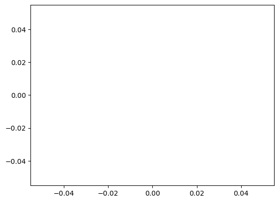
    


```python

```
