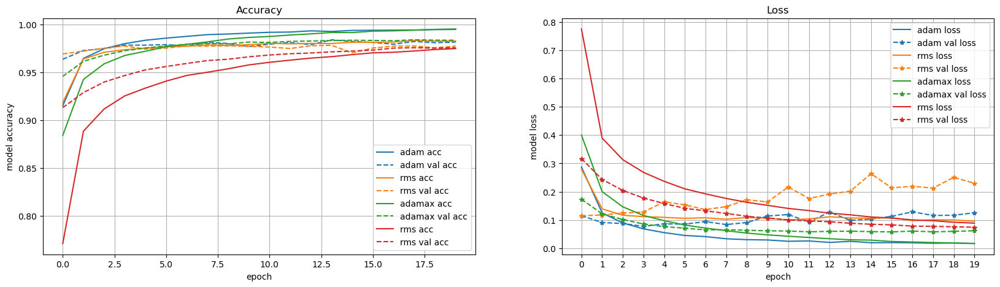
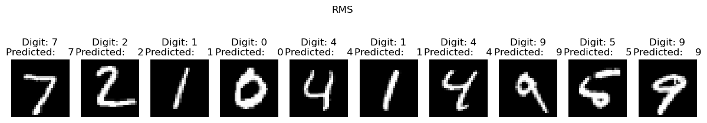
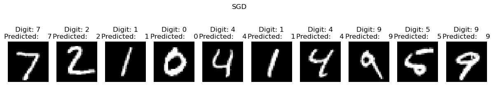
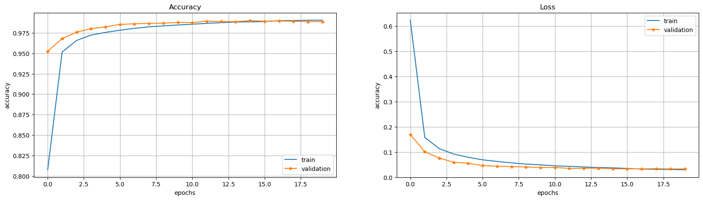
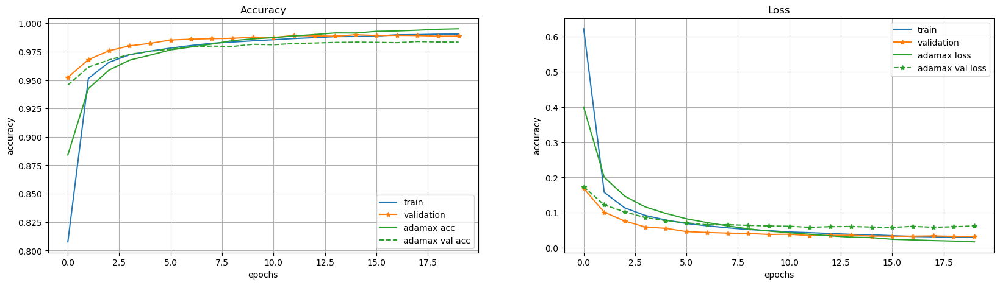
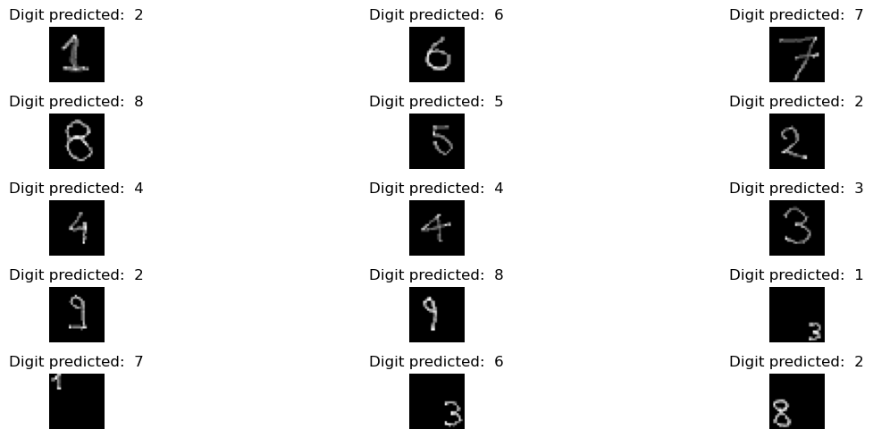
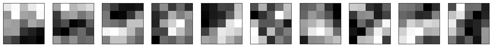

# Libraries


```python
import tensorflow as tf
from tensorflow import keras
import os
import numpy as np
import matplotlib.pyplot as plt
seed=0
np.random.seed(seed) # fix random seed
tf.random.set_seed(seed)
```

    2025-11-27 09:54:12.185653: I tensorflow/core/platform/cpu_feature_guard.cc:210] This TensorFlow binary is optimized to use available CPU instructions in performance-critical operations.
    To enable the following instructions: SSE4.1 SSE4.2 AVX AVX2 FMA, in other operations, rebuild TensorFlow with the appropriate compiler flags.


### Load and process the data


```python
from keras.datasets import mnist
def load_data():
    # input image dimensions
    img_rows, img_cols = 28, 28 # number of pixels 
    # output
    num_classes = 10 # 10 digits

    # the data, split between train and test sets
    (X_train, Y_train), (X_test, Y_test) = mnist.load_data()

    print('X_train shape:', X_train.shape)
    print('Y_train shape:', Y_train.shape)

    ### Example: to_categorical
    # Consider an array of 5 labels out of a set of 3 classes {0, 1, 2}:
    labels = np.array([0, 2, 1, 2, 0])
    # `to_categorical` converts this into a matrix with as many columns as there are classes.
    # The number of rows stays the same.
    keras.utils.to_categorical(labels)

    ### reshape and convert labels to be used with categorical entropy

    # reshape data, it could depend on Keras backend
    X_train = X_train.reshape(X_train.shape[0], img_rows*img_cols)
    X_test = X_test.reshape(X_test.shape[0], img_rows*img_cols)
    print('X_train shape:', X_train.shape)
    print('X_test shape:', X_test.shape)
    print()

    # cast to floats
    X_train = X_train.astype('float32')
    X_test = X_test.astype('float32')

    # rescale data in interval [0,1]
    X_train /= 255
    X_test /= 255

    # convert class vectors to binary class matrices, e.g. for use with categorical_crossentropy
    Y_train = keras.utils.to_categorical(Y_train, num_classes)
    Y_test = keras.utils.to_categorical(Y_test, num_classes)

    print('X_train shape:', X_train.shape)
    print('Y_train shape:', Y_train.shape)

    return (X_train, Y_train), (X_test, Y_test)

```


```python
(X_train, Y_train), (X_test, Y_test)=load_data()

```

    X_train shape: (60000, 28, 28)
    Y_train shape: (60000,)
    X_train shape: (60000, 784)
    X_test shape: (10000, 784)
    
    X_train shape: (60000, 784)
    Y_train shape: (60000, 10)


### Define NN and it's architecture 


```python
from keras.models import Sequential
from keras.layers import Dense, Dropout

def create_DNN():
    # instantiate model
    model = Sequential()
    # add a dense all-to-all relu layer
    model.add(Dense(400,input_shape=(img_rows*img_cols,), activation='relu'))
    # add a dense all-to-all relu layer
    model.add(Dense(100, activation='relu'))
    # apply dropout with rate 0.5
    model.add(Dropout(0.5))
    # soft-max layer
    model.add(Dense(num_classes, activation='softmax'))
    
    return model

print('Model architecture created successfully!')
```

    Model architecture created successfully!


### choose optimizer and cost function


```python
from keras.optimizers import SGD, Adam, RMSprop, Adagrad, Adadelta, Adam, Adamax, Nadam

def compile_model(optimizer:str):
    # create the model
    model=create_DNN()
    # compile the model
    model.compile(loss=keras.losses.categorical_crossentropy,
                  optimizer=optimizer,
                  metrics=['acc'])
    return model

print('Model compiled successfully and ready to be trained.')
```

    Model compiled successfully and ready to be trained.


### Step 5: evaluate performance on unseen data 

# Exercise 12.1


```python
nepochs=20
batch_size = 32
```

## SGD


```python
model_sgd = compile_model('sgd')

# train DNN and store training info in history
sgd_hist = model_sgd.fit(X_train, Y_train,
          batch_size=batch_size,
          epochs=nepochs,
          shuffle=True, # a good idea is to shuffle input before at each epoch
          verbose=0,
          validation_data=(X_test, Y_test))
```

    /home/td/miniconda3/envs/dl/lib/python3.12/site-packages/keras/src/layers/core/dense.py:93: UserWarning: Do not pass an `input_shape`/`input_dim` argument to a layer. When using Sequential models, prefer using an `Input(shape)` object as the first layer in the model instead.
      super().__init__(activity_regularizer=activity_regularizer, **kwargs)


## adam


```python
print('ADAM')

model_adam=compile_model('adam')

adam_hist=model_adam.fit(X_train, Y_train,
          batch_size=32,
          epochs=nepochs,
          shuffle=True, # a good idea is to shuffle input before at each epoch
          verbose=0,
          validation_data=(X_test, Y_test))
```

    ADAM


    /home/td/miniconda3/envs/dl/lib/python3.12/site-packages/keras/src/layers/core/dense.py:93: UserWarning: Do not pass an `input_shape`/`input_dim` argument to a layer. When using Sequential models, prefer using an `Input(shape)` object as the first layer in the model instead.
      super().__init__(activity_regularizer=activity_regularizer, **kwargs)


## RMSprop


```python
print('RMSprop')
model_rms=compile_model('rmsprop')

rms_hist=model_rms.fit(X_train, Y_train,
          batch_size=batch_size,
          epochs=nepochs,
          shuffle=True, # a good idea is to shuffle input before at each epoch
          verbose=0,
          validation_data=(X_test, Y_test))
```

    RMSprop


    /home/td/miniconda3/envs/dl/lib/python3.12/site-packages/keras/src/layers/core/dense.py:93: UserWarning: Do not pass an `input_shape`/`input_dim` argument to a layer. When using Sequential models, prefer using an `Input(shape)` object as the first layer in the model instead.
      super().__init__(activity_regularizer=activity_regularizer, **kwargs)


# ADAMAX


```python
print('adamax')
model_admx=compile_model('adamax')

admx_hist=model_admx.fit(X_train, Y_train,
          batch_size=batch_size,
          epochs=nepochs,
          shuffle=True, # a good idea is to shuffle input before at each epoch
          verbose=0,
          validation_data=(X_test, Y_test))
```

    adamax


    /home/td/miniconda3/envs/dl/lib/python3.12/site-packages/keras/src/layers/core/dense.py:93: UserWarning: Do not pass an `input_shape`/`input_dim` argument to a layer. When using Sequential models, prefer using an `Input(shape)` object as the first layer in the model instead.
      super().__init__(activity_regularizer=activity_regularizer, **kwargs)


```python
def evaluate_model(model, X_test, Y_test):
    score = model.evaluate(X_test, Y_test, verbose=1)
    print()
    print('\tTest loss:', score[0])
    print('\tTest accuracy:', score[1])

    return score
```


```python
# evaluate model
print('SGD')
evaluate_model(model_sgd, X_test=X_test, Y_test=Y_test)
print('Adam')
evaluate_model(model_adam, X_test=X_test, Y_test=Y_test)
print('RMS')
evaluate_model(model_rms, X_test=X_test, Y_test=Y_test)
print('Adamax')
evaluate_model(model_admx, X_test=X_test, Y_test=Y_test)

# look into training history

fig, ax = plt.subplots(1,2,figsize=(20,5))

# summarize history for accuracy
ax[0].set_title('Accuracy')
ax[0].plot(adam_hist.history['acc'], label='adam acc',c='C0')
ax[0].plot(adam_hist.history['val_acc'], label='adam val acc', ls='--',c='C0')

ax[0].plot(rms_hist.history['acc'], label='rms acc',c='C1')
ax[0].plot(rms_hist.history['val_acc'], label='rms val acc', ls='--',c='C1')

ax[0].plot(admx_hist.history['acc'], label='adamax acc',c='C2')
ax[0].plot(admx_hist.history['val_acc'], label='adamax val acc', ls='--',c='C2')

ax[0].plot(sgd_hist.history['acc'], label='rms acc',c='C3')
ax[0].plot(sgd_hist.history['val_acc'], label='rms val acc', ls='--',c='C3')

ax[0].set_xlabel('epoch')
ax[0].set_ylabel('model accuracy')
ax[0].grid()
ax[0].legend(loc='best')

# summarize history for loss
ax[1].set_title('Loss')
ax[1].plot(adam_hist.history['loss'], label='adam loss',c='C0')
ax[1].plot(adam_hist.history['val_loss'], label='adam val loss', marker='*', ls='--',c='C0')

ax[1].plot(rms_hist.history['loss'], label='rms loss',c='C1')
ax[1].plot(rms_hist.history['val_loss'], label='rms val loss', marker='*', ls='--',c='C1')

ax[1].plot(admx_hist.history['loss'], label='adamax loss',c='C2')
ax[1].plot(admx_hist.history['val_loss'], label='adamax val loss', marker='*', ls='--',c='C2')

ax[1].plot(sgd_hist.history['loss'], label='rms loss',c='C3')
ax[1].plot(sgd_hist.history['val_loss'], label='rms val loss', marker='*', ls='--',c='C3')

ax[1].set_ylabel('model loss')
ax[1].set_xlabel('epoch')
ax[1].set_xticks(adam_hist.epoch)
ax[1].grid()
ax[1].legend( loc='best')
plt.show()
```

    SGD
    313/313 ━━━━━━━━━━━━━━━━━━━━ 1s 2ms/step - acc: 0.9715 - loss: 0.0884
    
    	Test loss: 0.07467494159936905
    	Test accuracy: 0.975600004196167
    Adam
    313/313 ━━━━━━━━━━━━━━━━━━━━ 1s 2ms/step - acc: 0.9787 - loss: 0.1592
    
    	Test loss: 0.1257559061050415
    	Test accuracy: 0.9815000295639038
    RMS
    313/313 ━━━━━━━━━━━━━━━━━━━━ 1s 2ms/step - acc: 0.9737 - loss: 0.2797
    
    	Test loss: 0.22997719049453735
    	Test accuracy: 0.9772999882698059
    Adamax
    313/313 ━━━━━━━━━━━━━━━━━━━━ 1s 2ms/step - acc: 0.9799 - loss: 0.0747
    
    	Test loss: 0.06233464181423187
    	Test accuracy: 0.9833999872207642


    

    


```python
def test_predictions(model, X_test,Y_test, title=''):
    predictions = model.predict(X_test)

    X_test = X_test.reshape(X_test.shape[0], img_rows, img_cols,1)

    fig=plt.figure(figsize=(15, 15))
    fig.suptitle(title, y=0.8) 
    for i in range(10):    
        ax = plt.subplot(2, 10, i + 1)    
        plt.imshow(X_test[i, :, :, 0], cmap='gray')    
        plt.title("Digit: {}\nPredicted:    {}".format(np.argmax(Y_test[i]), np.argmax(predictions[i])))    
        plt.axis('off') 
    plt.show()
```


```python
test_predictions(model=model_adam, X_test=X_test,Y_test=Y_test, title='Adam')
test_predictions(model=model_rms, X_test=X_test,Y_test=Y_test, title='RMS')
test_predictions(model=model_admx, X_test=X_test,Y_test=Y_test, title='Adamax')
test_predictions(model=model_sgd, X_test=X_test,Y_test=Y_test, title='SGD')

```

    313/313 ━━━━━━━━━━━━━━━━━━━━ 0s 1ms/step


    

    


    313/313 ━━━━━━━━━━━━━━━━━━━━ 1s 2ms/step


    

    


    313/313 ━━━━━━━━━━━━━━━━━━━━ 1s 2ms/step


    

    


    313/313 ━━━━━━━━━━━━━━━━━━━━ 1s 2ms/step


    

    


## Exercise 12.2


```python
# you will need the following for Convolutional Neural Networks
from keras.layers import Flatten, Conv2D, MaxPooling2D, Input
```


```python
(X_train, Y_train), (X_test, Y_test)=load_data()

```

    X_train shape: (60000, 28, 28)
    Y_train shape: (60000,)
    X_train shape: (60000, 784)
    X_test shape: (10000, 784)
    
    X_train shape: (60000, 784)
    Y_train shape: (60000, 10)


```python
# reshape data, depending on Keras backend
if keras.backend.image_data_format() == 'channels_first':
    X_train = X_train.reshape(X_train.shape[0], 1, img_rows, img_cols)
    X_test = X_test.reshape(X_test.shape[0], 1, img_rows, img_cols)
    input_shape = (1, img_rows, img_cols)
else:
    X_train = X_train.reshape(X_train.shape[0], img_rows, img_cols, 1)
    X_test = X_test.reshape(X_test.shape[0], img_rows, img_cols, 1)
    input_shape = (img_rows, img_cols, 1)
    
print('X_train shape:', X_train.shape)
print('Y_train shape:', Y_train.shape)
print()
print(X_train.shape[0], 'train samples')
print(X_test.shape[0], 'test samples')
```

    X_train shape: (60000, 28, 28, 1)
    Y_train shape: (60000, 10)
    
    60000 train samples
    10000 test samples


```python
#THIS IS INCOMPLETE ... COMPLETE BEFORE EXECUTING IT

def create_CNN():
    # instantiate model
    model = Sequential()
    # add first convolutional layer with 10 filters (dimensionality of output space)
    model.add(Input(shape=(28,28,1)))
    model.add(Conv2D(10, kernel_size=(5, 5),
                     activation='relu',
                     input_shape=input_shape))
    #
    # ADD HERE SOME OTHER LAYERS AT YOUR WILL, FOR EXAMPLE SOME: Dropout, 2D pooling, 2D convolutional etc. ... 
    # remember to move towards a standard flat layer in the final part of your DNN,
    # and that we need a soft-max layer with num_classes=10 possible outputs
    #
    model.add(MaxPooling2D(
        pool_size=(2,2), strides=2
    ))

    model.add(Dropout(0.1))
    
    model.add(
        Conv2D(16, kernel_size=(5,5), strides=1, activation='relu')
    )
    model.add(MaxPooling2D(strides=2))
    model.add(Flatten())
    model.add(Dense(128, activation='relu'))
    model.add(Dense(10, activation='softmax'))
    # compile the model
    model.compile(loss=keras.losses.categorical_crossentropy,
                  optimizer='SGD',
                  metrics=['acc'])
    return model
```


```python
# training parameters
batch_size = 32
epochs = 20

# create the deep conv net
model_CNN=create_CNN()
model_CNN.summary()
# train CNN
cnn_history=model_CNN.fit(X_train, Y_train,
          batch_size=batch_size,
          shuffle=True,
          epochs=epochs,
          verbose=1,
          validation_data=(X_test, Y_test))

# evaliate model
score = model_CNN.evaluate(X_test, Y_test, verbose=1)

# print performance
print()
print('Test loss:', score[0])
print('Test accuracy:', score[1])
```


<pre style="white-space:pre;overflow-x:auto;line-height:normal;font-family:Menlo,'DejaVu Sans Mono',consolas,'Courier New',monospace"><span style="font-weight: bold">Model: "sequential_13"</span>
</pre>


<pre style="white-space:pre;overflow-x:auto;line-height:normal;font-family:Menlo,'DejaVu Sans Mono',consolas,'Courier New',monospace">┏━━━━━━━━━━━━━━━━━━━━━━━━━━━━━━━━━┳━━━━━━━━━━━━━━━━━━━━━━━━┳━━━━━━━━━━━━━━━┓
┃<span style="font-weight: bold"> Layer (type)                    </span>┃<span style="font-weight: bold"> Output Shape           </span>┃<span style="font-weight: bold">       Param # </span>┃
┡━━━━━━━━━━━━━━━━━━━━━━━━━━━━━━━━━╇━━━━━━━━━━━━━━━━━━━━━━━━╇━━━━━━━━━━━━━━━┩
│ conv2d_4 (<span style="color: #0087ff; text-decoration-color: #0087ff">Conv2D</span>)               │ (<span style="color: #00d7ff; text-decoration-color: #00d7ff">None</span>, <span style="color: #00af00; text-decoration-color: #00af00">24</span>, <span style="color: #00af00; text-decoration-color: #00af00">24</span>, <span style="color: #00af00; text-decoration-color: #00af00">10</span>)     │           <span style="color: #00af00; text-decoration-color: #00af00">260</span> │
├─────────────────────────────────┼────────────────────────┼───────────────┤
│ max_pooling2d_4 (<span style="color: #0087ff; text-decoration-color: #0087ff">MaxPooling2D</span>)  │ (<span style="color: #00d7ff; text-decoration-color: #00d7ff">None</span>, <span style="color: #00af00; text-decoration-color: #00af00">12</span>, <span style="color: #00af00; text-decoration-color: #00af00">12</span>, <span style="color: #00af00; text-decoration-color: #00af00">10</span>)     │             <span style="color: #00af00; text-decoration-color: #00af00">0</span> │
├─────────────────────────────────┼────────────────────────┼───────────────┤
│ dropout_13 (<span style="color: #0087ff; text-decoration-color: #0087ff">Dropout</span>)            │ (<span style="color: #00d7ff; text-decoration-color: #00d7ff">None</span>, <span style="color: #00af00; text-decoration-color: #00af00">12</span>, <span style="color: #00af00; text-decoration-color: #00af00">12</span>, <span style="color: #00af00; text-decoration-color: #00af00">10</span>)     │             <span style="color: #00af00; text-decoration-color: #00af00">0</span> │
├─────────────────────────────────┼────────────────────────┼───────────────┤
│ conv2d_5 (<span style="color: #0087ff; text-decoration-color: #0087ff">Conv2D</span>)               │ (<span style="color: #00d7ff; text-decoration-color: #00d7ff">None</span>, <span style="color: #00af00; text-decoration-color: #00af00">8</span>, <span style="color: #00af00; text-decoration-color: #00af00">8</span>, <span style="color: #00af00; text-decoration-color: #00af00">16</span>)       │         <span style="color: #00af00; text-decoration-color: #00af00">4,016</span> │
├─────────────────────────────────┼────────────────────────┼───────────────┤
│ max_pooling2d_5 (<span style="color: #0087ff; text-decoration-color: #0087ff">MaxPooling2D</span>)  │ (<span style="color: #00d7ff; text-decoration-color: #00d7ff">None</span>, <span style="color: #00af00; text-decoration-color: #00af00">4</span>, <span style="color: #00af00; text-decoration-color: #00af00">4</span>, <span style="color: #00af00; text-decoration-color: #00af00">16</span>)       │             <span style="color: #00af00; text-decoration-color: #00af00">0</span> │
├─────────────────────────────────┼────────────────────────┼───────────────┤
│ flatten_2 (<span style="color: #0087ff; text-decoration-color: #0087ff">Flatten</span>)             │ (<span style="color: #00d7ff; text-decoration-color: #00d7ff">None</span>, <span style="color: #00af00; text-decoration-color: #00af00">256</span>)            │             <span style="color: #00af00; text-decoration-color: #00af00">0</span> │
├─────────────────────────────────┼────────────────────────┼───────────────┤
│ dense_37 (<span style="color: #0087ff; text-decoration-color: #0087ff">Dense</span>)                │ (<span style="color: #00d7ff; text-decoration-color: #00d7ff">None</span>, <span style="color: #00af00; text-decoration-color: #00af00">128</span>)            │        <span style="color: #00af00; text-decoration-color: #00af00">32,896</span> │
├─────────────────────────────────┼────────────────────────┼───────────────┤
│ dense_38 (<span style="color: #0087ff; text-decoration-color: #0087ff">Dense</span>)                │ (<span style="color: #00d7ff; text-decoration-color: #00d7ff">None</span>, <span style="color: #00af00; text-decoration-color: #00af00">10</span>)             │         <span style="color: #00af00; text-decoration-color: #00af00">1,290</span> │
└─────────────────────────────────┴────────────────────────┴───────────────┘
</pre>


<pre style="white-space:pre;overflow-x:auto;line-height:normal;font-family:Menlo,'DejaVu Sans Mono',consolas,'Courier New',monospace"><span style="font-weight: bold"> Total params: </span><span style="color: #00af00; text-decoration-color: #00af00">38,462</span> (150.24 KB)
</pre>


<pre style="white-space:pre;overflow-x:auto;line-height:normal;font-family:Menlo,'DejaVu Sans Mono',consolas,'Courier New',monospace"><span style="font-weight: bold"> Trainable params: </span><span style="color: #00af00; text-decoration-color: #00af00">38,462</span> (150.24 KB)
</pre>


<pre style="white-space:pre;overflow-x:auto;line-height:normal;font-family:Menlo,'DejaVu Sans Mono',consolas,'Courier New',monospace"><span style="font-weight: bold"> Non-trainable params: </span><span style="color: #00af00; text-decoration-color: #00af00">0</span> (0.00 B)
</pre>


    Epoch 1/20
    1875/1875 ━━━━━━━━━━━━━━━━━━━━ 17s 9ms/step - acc: 0.6104 - loss: 1.2207 - val_acc: 0.9524 - val_loss: 0.1689
    Epoch 2/20
    1875/1875 ━━━━━━━━━━━━━━━━━━━━ 16s 8ms/step - acc: 0.9462 - loss: 0.1780 - val_acc: 0.9680 - val_loss: 0.1012
    Epoch 3/20
    1875/1875 ━━━━━━━━━━━━━━━━━━━━ 14s 8ms/step - acc: 0.9638 - loss: 0.1234 - val_acc: 0.9758 - val_loss: 0.0760
    Epoch 4/20
    1875/1875 ━━━━━━━━━━━━━━━━━━━━ 15s 8ms/step - acc: 0.9705 - loss: 0.0988 - val_acc: 0.9801 - val_loss: 0.0592
    Epoch 5/20
    1875/1875 ━━━━━━━━━━━━━━━━━━━━ 15s 8ms/step - acc: 0.9742 - loss: 0.0843 - val_acc: 0.9823 - val_loss: 0.0554
    Epoch 6/20
    1875/1875 ━━━━━━━━━━━━━━━━━━━━ 15s 8ms/step - acc: 0.9773 - loss: 0.0723 - val_acc: 0.9853 - val_loss: 0.0461
    Epoch 7/20
    1875/1875 ━━━━━━━━━━━━━━━━━━━━ 15s 8ms/step - acc: 0.9793 - loss: 0.0663 - val_acc: 0.9860 - val_loss: 0.0437
    Epoch 8/20
    1875/1875 ━━━━━━━━━━━━━━━━━━━━ 15s 8ms/step - acc: 0.9819 - loss: 0.0592 - val_acc: 0.9865 - val_loss: 0.0419
    Epoch 9/20
    1875/1875 ━━━━━━━━━━━━━━━━━━━━ 15s 8ms/step - acc: 0.9825 - loss: 0.0547 - val_acc: 0.9868 - val_loss: 0.0409
    Epoch 10/20
    1875/1875 ━━━━━━━━━━━━━━━━━━━━ 15s 8ms/step - acc: 0.9834 - loss: 0.0517 - val_acc: 0.9877 - val_loss: 0.0381
    Epoch 11/20
    1875/1875 ━━━━━━━━━━━━━━━━━━━━ 15s 8ms/step - acc: 0.9857 - loss: 0.0457 - val_acc: 0.9875 - val_loss: 0.0387
    Epoch 12/20
    1875/1875 ━━━━━━━━━━━━━━━━━━━━ 15s 8ms/step - acc: 0.9865 - loss: 0.0448 - val_acc: 0.9892 - val_loss: 0.0348
    Epoch 13/20
    1875/1875 ━━━━━━━━━━━━━━━━━━━━ 15s 8ms/step - acc: 0.9871 - loss: 0.0419 - val_acc: 0.9889 - val_loss: 0.0357
    Epoch 14/20
    1875/1875 ━━━━━━━━━━━━━━━━━━━━ 15s 8ms/step - acc: 0.9875 - loss: 0.0393 - val_acc: 0.9886 - val_loss: 0.0357
    Epoch 15/20
    1875/1875 ━━━━━━━━━━━━━━━━━━━━ 15s 8ms/step - acc: 0.9884 - loss: 0.0380 - val_acc: 0.9899 - val_loss: 0.0336
    Epoch 16/20
    1875/1875 ━━━━━━━━━━━━━━━━━━━━ 15s 8ms/step - acc: 0.9886 - loss: 0.0360 - val_acc: 0.9892 - val_loss: 0.0331
    Epoch 17/20
    1875/1875 ━━━━━━━━━━━━━━━━━━━━ 15s 8ms/step - acc: 0.9899 - loss: 0.0331 - val_acc: 0.9894 - val_loss: 0.0331
    Epoch 18/20
    1875/1875 ━━━━━━━━━━━━━━━━━━━━ 15s 8ms/step - acc: 0.9899 - loss: 0.0323 - val_acc: 0.9892 - val_loss: 0.0339
    Epoch 19/20
    1875/1875 ━━━━━━━━━━━━━━━━━━━━ 15s 8ms/step - acc: 0.9906 - loss: 0.0313 - val_acc: 0.9886 - val_loss: 0.0327
    Epoch 20/20
    1875/1875 ━━━━━━━━━━━━━━━━━━━━ 15s 8ms/step - acc: 0.9903 - loss: 0.0306 - val_acc: 0.9887 - val_loss: 0.0328
    313/313 ━━━━━━━━━━━━━━━━━━━━ 1s 3ms/step - acc: 0.9858 - loss: 0.0406
    
    Test loss: 0.03282332420349121
    Test accuracy: 0.9886999726295471


```python
#X_test = X_test.reshape(X_test.shape[0], img_rows*img_cols)
predictions = model_CNN.predict(X_test)

X_test = X_test.reshape(X_test.shape[0], img_rows, img_cols,1)

plt.figure(figsize=(15, 15)) 
for i in range(10):    
    ax = plt.subplot(2, 10, i + 1)    
    plt.imshow(X_test[i, :, :, 0], cmap='gray')    
    plt.title("Digit: {}\nPredicted:    {}".format(np.argmax(Y_test[i]), np.argmax(predictions[i])))    
    plt.axis('off') 
plt.show()
```

    313/313 ━━━━━━━━━━━━━━━━━━━━ 1s 3ms/step


    

    


```python
fig, ax = plt.subplots(1,2,figsize=(20,5))

ax[0].set_title('Accuracy')
ax[0].plot(cnn_history.epoch , cnn_history.history['acc'], label='train')
ax[0].plot(cnn_history.epoch ,cnn_history.history['val_acc'], label='validation', marker='*')
ax[0].grid()
ax[0].set_xlabel('epochs')
ax[0].set_ylabel('accuracy')
ax[0].legend()

ax[1].set_title('Loss')
ax[1].plot(cnn_history.epoch , cnn_history.history['loss'], label='train')
ax[1].plot(cnn_history.epoch ,cnn_history.history['val_loss'], label='validation', marker='*')
ax[1].grid()
ax[1].set_xlabel('epochs')
ax[1].set_ylabel('accuracy')
ax[1].legend()
plt.show()
```


    

    


```python
fig, ax = plt.subplots(1,2,figsize=(20,5))

ax[0].set_title('Accuracy')
ax[0].plot(cnn_history.epoch , cnn_history.history['acc'], label='train')
ax[0].plot(cnn_history.epoch ,cnn_history.history['val_acc'], label='validation', marker='*')
ax[0].plot(admx_hist.history['acc'], label='adamax acc',c='C2')
ax[0].plot(admx_hist.history['val_acc'], label='adamax val acc', ls='--',c='C2')


ax[0].grid()
ax[0].set_xlabel('epochs')
ax[0].set_ylabel('accuracy')
ax[0].legend()

ax[1].set_title('Loss')
ax[1].plot(cnn_history.epoch , cnn_history.history['loss'], label='train')
ax[1].plot(cnn_history.epoch ,cnn_history.history['val_loss'], label='validation', marker='*')
ax[1].plot(admx_hist.history['loss'], label='adamax loss',c='C2')
ax[1].plot(admx_hist.history['val_loss'], label='adamax val loss', marker='*', ls='--',c='C2')

ax[1].grid()
ax[1].set_xlabel('epochs')
ax[1].set_ylabel('accuracy')
ax[1].legend()
plt.show()
```


    

    


```python
model_CNN.save('CNN.keras')
```

### Exercise 12.3


```python
from PIL import Image
import os
```


```python
from keras.models import load_model

modelloaded=load_model('CNN.keras')

modelloaded.summary()
```


<pre style="white-space:pre;overflow-x:auto;line-height:normal;font-family:Menlo,'DejaVu Sans Mono',consolas,'Courier New',monospace"><span style="font-weight: bold">Model: "sequential_5"</span>
</pre>


<pre style="white-space:pre;overflow-x:auto;line-height:normal;font-family:Menlo,'DejaVu Sans Mono',consolas,'Courier New',monospace">┏━━━━━━━━━━━━━━━━━━━━━━━━━━━━━━━━━┳━━━━━━━━━━━━━━━━━━━━━━━━┳━━━━━━━━━━━━━━━┓
┃<span style="font-weight: bold"> Layer (type)                    </span>┃<span style="font-weight: bold"> Output Shape           </span>┃<span style="font-weight: bold">       Param # </span>┃
┡━━━━━━━━━━━━━━━━━━━━━━━━━━━━━━━━━╇━━━━━━━━━━━━━━━━━━━━━━━━╇━━━━━━━━━━━━━━━┩
│ conv2d_10 (<span style="color: #0087ff; text-decoration-color: #0087ff">Conv2D</span>)              │ (<span style="color: #00d7ff; text-decoration-color: #00d7ff">None</span>, <span style="color: #00af00; text-decoration-color: #00af00">24</span>, <span style="color: #00af00; text-decoration-color: #00af00">24</span>, <span style="color: #00af00; text-decoration-color: #00af00">10</span>)     │           <span style="color: #00af00; text-decoration-color: #00af00">260</span> │
├─────────────────────────────────┼────────────────────────┼───────────────┤
│ max_pooling2d_10 (<span style="color: #0087ff; text-decoration-color: #0087ff">MaxPooling2D</span>) │ (<span style="color: #00d7ff; text-decoration-color: #00d7ff">None</span>, <span style="color: #00af00; text-decoration-color: #00af00">12</span>, <span style="color: #00af00; text-decoration-color: #00af00">12</span>, <span style="color: #00af00; text-decoration-color: #00af00">10</span>)     │             <span style="color: #00af00; text-decoration-color: #00af00">0</span> │
├─────────────────────────────────┼────────────────────────┼───────────────┤
│ dropout_5 (<span style="color: #0087ff; text-decoration-color: #0087ff">Dropout</span>)             │ (<span style="color: #00d7ff; text-decoration-color: #00d7ff">None</span>, <span style="color: #00af00; text-decoration-color: #00af00">12</span>, <span style="color: #00af00; text-decoration-color: #00af00">12</span>, <span style="color: #00af00; text-decoration-color: #00af00">10</span>)     │             <span style="color: #00af00; text-decoration-color: #00af00">0</span> │
├─────────────────────────────────┼────────────────────────┼───────────────┤
│ conv2d_11 (<span style="color: #0087ff; text-decoration-color: #0087ff">Conv2D</span>)              │ (<span style="color: #00d7ff; text-decoration-color: #00d7ff">None</span>, <span style="color: #00af00; text-decoration-color: #00af00">8</span>, <span style="color: #00af00; text-decoration-color: #00af00">8</span>, <span style="color: #00af00; text-decoration-color: #00af00">16</span>)       │         <span style="color: #00af00; text-decoration-color: #00af00">4,016</span> │
├─────────────────────────────────┼────────────────────────┼───────────────┤
│ max_pooling2d_11 (<span style="color: #0087ff; text-decoration-color: #0087ff">MaxPooling2D</span>) │ (<span style="color: #00d7ff; text-decoration-color: #00d7ff">None</span>, <span style="color: #00af00; text-decoration-color: #00af00">4</span>, <span style="color: #00af00; text-decoration-color: #00af00">4</span>, <span style="color: #00af00; text-decoration-color: #00af00">16</span>)       │             <span style="color: #00af00; text-decoration-color: #00af00">0</span> │
├─────────────────────────────────┼────────────────────────┼───────────────┤
│ flatten_5 (<span style="color: #0087ff; text-decoration-color: #0087ff">Flatten</span>)             │ (<span style="color: #00d7ff; text-decoration-color: #00d7ff">None</span>, <span style="color: #00af00; text-decoration-color: #00af00">256</span>)            │             <span style="color: #00af00; text-decoration-color: #00af00">0</span> │
├─────────────────────────────────┼────────────────────────┼───────────────┤
│ dense_10 (<span style="color: #0087ff; text-decoration-color: #0087ff">Dense</span>)                │ (<span style="color: #00d7ff; text-decoration-color: #00d7ff">None</span>, <span style="color: #00af00; text-decoration-color: #00af00">128</span>)            │        <span style="color: #00af00; text-decoration-color: #00af00">32,896</span> │
├─────────────────────────────────┼────────────────────────┼───────────────┤
│ dense_11 (<span style="color: #0087ff; text-decoration-color: #0087ff">Dense</span>)                │ (<span style="color: #00d7ff; text-decoration-color: #00d7ff">None</span>, <span style="color: #00af00; text-decoration-color: #00af00">10</span>)             │         <span style="color: #00af00; text-decoration-color: #00af00">1,290</span> │
└─────────────────────────────────┴────────────────────────┴───────────────┘
</pre>


<pre style="white-space:pre;overflow-x:auto;line-height:normal;font-family:Menlo,'DejaVu Sans Mono',consolas,'Courier New',monospace"><span style="font-weight: bold"> Total params: </span><span style="color: #00af00; text-decoration-color: #00af00">38,464</span> (150.25 KB)
</pre>


<pre style="white-space:pre;overflow-x:auto;line-height:normal;font-family:Menlo,'DejaVu Sans Mono',consolas,'Courier New',monospace"><span style="font-weight: bold"> Trainable params: </span><span style="color: #00af00; text-decoration-color: #00af00">38,462</span> (150.24 KB)
</pre>


<pre style="white-space:pre;overflow-x:auto;line-height:normal;font-family:Menlo,'DejaVu Sans Mono',consolas,'Courier New',monospace"><span style="font-weight: bold"> Non-trainable params: </span><span style="color: #00af00; text-decoration-color: #00af00">0</span> (0.00 B)
</pre>


<pre style="white-space:pre;overflow-x:auto;line-height:normal;font-family:Menlo,'DejaVu Sans Mono',consolas,'Courier New',monospace"><span style="font-weight: bold"> Optimizer params: </span><span style="color: #00af00; text-decoration-color: #00af00">2</span> (12.00 B)
</pre>


```python
modelloaded.summary()
```


<pre style="white-space:pre;overflow-x:auto;line-height:normal;font-family:Menlo,'DejaVu Sans Mono',consolas,'Courier New',monospace"><span style="font-weight: bold">Model: "sequential_5"</span>
</pre>


<pre style="white-space:pre;overflow-x:auto;line-height:normal;font-family:Menlo,'DejaVu Sans Mono',consolas,'Courier New',monospace">┏━━━━━━━━━━━━━━━━━━━━━━━━━━━━━━━━━┳━━━━━━━━━━━━━━━━━━━━━━━━┳━━━━━━━━━━━━━━━┓
┃<span style="font-weight: bold"> Layer (type)                    </span>┃<span style="font-weight: bold"> Output Shape           </span>┃<span style="font-weight: bold">       Param # </span>┃
┡━━━━━━━━━━━━━━━━━━━━━━━━━━━━━━━━━╇━━━━━━━━━━━━━━━━━━━━━━━━╇━━━━━━━━━━━━━━━┩
│ conv2d_10 (<span style="color: #0087ff; text-decoration-color: #0087ff">Conv2D</span>)              │ (<span style="color: #00d7ff; text-decoration-color: #00d7ff">None</span>, <span style="color: #00af00; text-decoration-color: #00af00">24</span>, <span style="color: #00af00; text-decoration-color: #00af00">24</span>, <span style="color: #00af00; text-decoration-color: #00af00">10</span>)     │           <span style="color: #00af00; text-decoration-color: #00af00">260</span> │
├─────────────────────────────────┼────────────────────────┼───────────────┤
│ max_pooling2d_10 (<span style="color: #0087ff; text-decoration-color: #0087ff">MaxPooling2D</span>) │ (<span style="color: #00d7ff; text-decoration-color: #00d7ff">None</span>, <span style="color: #00af00; text-decoration-color: #00af00">12</span>, <span style="color: #00af00; text-decoration-color: #00af00">12</span>, <span style="color: #00af00; text-decoration-color: #00af00">10</span>)     │             <span style="color: #00af00; text-decoration-color: #00af00">0</span> │
├─────────────────────────────────┼────────────────────────┼───────────────┤
│ dropout_5 (<span style="color: #0087ff; text-decoration-color: #0087ff">Dropout</span>)             │ (<span style="color: #00d7ff; text-decoration-color: #00d7ff">None</span>, <span style="color: #00af00; text-decoration-color: #00af00">12</span>, <span style="color: #00af00; text-decoration-color: #00af00">12</span>, <span style="color: #00af00; text-decoration-color: #00af00">10</span>)     │             <span style="color: #00af00; text-decoration-color: #00af00">0</span> │
├─────────────────────────────────┼────────────────────────┼───────────────┤
│ conv2d_11 (<span style="color: #0087ff; text-decoration-color: #0087ff">Conv2D</span>)              │ (<span style="color: #00d7ff; text-decoration-color: #00d7ff">None</span>, <span style="color: #00af00; text-decoration-color: #00af00">8</span>, <span style="color: #00af00; text-decoration-color: #00af00">8</span>, <span style="color: #00af00; text-decoration-color: #00af00">16</span>)       │         <span style="color: #00af00; text-decoration-color: #00af00">4,016</span> │
├─────────────────────────────────┼────────────────────────┼───────────────┤
│ max_pooling2d_11 (<span style="color: #0087ff; text-decoration-color: #0087ff">MaxPooling2D</span>) │ (<span style="color: #00d7ff; text-decoration-color: #00d7ff">None</span>, <span style="color: #00af00; text-decoration-color: #00af00">4</span>, <span style="color: #00af00; text-decoration-color: #00af00">4</span>, <span style="color: #00af00; text-decoration-color: #00af00">16</span>)       │             <span style="color: #00af00; text-decoration-color: #00af00">0</span> │
├─────────────────────────────────┼────────────────────────┼───────────────┤
│ flatten_5 (<span style="color: #0087ff; text-decoration-color: #0087ff">Flatten</span>)             │ (<span style="color: #00d7ff; text-decoration-color: #00d7ff">None</span>, <span style="color: #00af00; text-decoration-color: #00af00">256</span>)            │             <span style="color: #00af00; text-decoration-color: #00af00">0</span> │
├─────────────────────────────────┼────────────────────────┼───────────────┤
│ dense_10 (<span style="color: #0087ff; text-decoration-color: #0087ff">Dense</span>)                │ (<span style="color: #00d7ff; text-decoration-color: #00d7ff">None</span>, <span style="color: #00af00; text-decoration-color: #00af00">128</span>)            │        <span style="color: #00af00; text-decoration-color: #00af00">32,896</span> │
├─────────────────────────────────┼────────────────────────┼───────────────┤
│ dense_11 (<span style="color: #0087ff; text-decoration-color: #0087ff">Dense</span>)                │ (<span style="color: #00d7ff; text-decoration-color: #00d7ff">None</span>, <span style="color: #00af00; text-decoration-color: #00af00">10</span>)             │         <span style="color: #00af00; text-decoration-color: #00af00">1,290</span> │
└─────────────────────────────────┴────────────────────────┴───────────────┘
</pre>


<pre style="white-space:pre;overflow-x:auto;line-height:normal;font-family:Menlo,'DejaVu Sans Mono',consolas,'Courier New',monospace"><span style="font-weight: bold"> Total params: </span><span style="color: #00af00; text-decoration-color: #00af00">38,464</span> (150.25 KB)
</pre>


<pre style="white-space:pre;overflow-x:auto;line-height:normal;font-family:Menlo,'DejaVu Sans Mono',consolas,'Courier New',monospace"><span style="font-weight: bold"> Trainable params: </span><span style="color: #00af00; text-decoration-color: #00af00">38,462</span> (150.24 KB)
</pre>


<pre style="white-space:pre;overflow-x:auto;line-height:normal;font-family:Menlo,'DejaVu Sans Mono',consolas,'Courier New',monospace"><span style="font-weight: bold"> Non-trainable params: </span><span style="color: #00af00; text-decoration-color: #00af00">0</span> (0.00 B)
</pre>


<pre style="white-space:pre;overflow-x:auto;line-height:normal;font-family:Menlo,'DejaVu Sans Mono',consolas,'Courier New',monospace"><span style="font-weight: bold"> Optimizer params: </span><span style="color: #00af00; text-decoration-color: #00af00">2</span> (12.00 B)
</pre>


```python
#X_test = X_test.reshape(X_test.shape[0], img_rows*img_cols)
predictions = modelloaded.predict(X_test)

X_test = X_test.reshape(X_test.shape[0], img_rows, img_cols,1)

plt.figure(figsize=(15, 15)) 
for i in range(10):    
    ax = plt.subplot(2, 10, i + 1)    
    plt.imshow(X_test[i, :, :, 0], cmap='gray')    
    plt.title("Digit: {}\nPredicted:    {}".format(np.argmax(Y_test[i]), np.argmax(predictions[i])))    
    plt.axis('off') 
plt.show()
```

     19/313 ━━━━━━━━━━━━━━━━━━━━ 0s 3ms/step   

    2025-11-26 19:10:45.159559: W external/local_xla/xla/tsl/framework/cpu_allocator_impl.cc:83] Allocation of 31360000 exceeds 10% of free system memory.


    313/313 ━━━━━━━━━━━━━━━━━━━━ 1s 2ms/step


    

    


```python
files=os.listdir('images/')
print(len(files))
print(files)
fig, ax =plt.subplots((len(files)+2)//3, 3, figsize=(15, 5))  

for n,file in enumerate(files):
    print(file)
    digit_filename = "./images/"+file
    digit_in = Image.open(digit_filename).convert('L')
    #digit_in = Image.open("8b.png").convert('L') #ON GOOGLE COLAB INSERT THE NAME OF THE UPLOADED FILE

    ydim, xdim = digit_in.size
    print("Image size: "+str(xdim)+"x"+str(ydim))
    pix=digit_in.load();
    data = np.zeros((xdim, ydim))
    for j in range(ydim):
        for i in range(xdim):
            data[i,j]=pix[j,i]

    data /= 255
    # print(data.shape)
    # data = data.reshape(1,xdim*ydim)
    data1=data
    data1 = data1.reshape(1, xdim,ydim)
    # print(data1.shape)
    pred_0 = modelloaded.predict([data1])

    print(n//3, n%3)
    ax[n//3, n%3].imshow(data, cmap='gray')    
    ax[n//3, n%3].set_title("Digit predicted:  {}".format(np.argmax(pred_0)))
    ax[n//3, n%3].axis('off') 
plt.tight_layout()
plt.show()
```

    15
    ['uno.png', 'sei.png', 'sette.png', 'otto.png', 'cinque.png', 'due.png', 'quattro_eur.png', 'quattro_usa.png', 'tre.png', 'nove1.png', 'nove2.png', 'tremoved.png', 'unomoved.png', 'tremv.png', 'ottomvd.png']
    uno.png
    Image size: 28x28
    1/1 ━━━━━━━━━━━━━━━━━━━━ 0s 56ms/step
    0 0
    sei.png
    Image size: 28x28
    1/1 ━━━━━━━━━━━━━━━━━━━━ 0s 23ms/step
    0 1
    sette.png
    Image size: 28x28
    1/1 ━━━━━━━━━━━━━━━━━━━━ 0s 24ms/step
    0 2
    otto.png
    Image size: 28x28
    1/1 ━━━━━━━━━━━━━━━━━━━━ 0s 23ms/step


    /home/td/miniconda3/envs/dl/lib/python3.12/site-packages/keras/src/models/functional.py:241: UserWarning: The structure of `inputs` doesn't match the expected structure.
    Expected: input_layer_5
    Received: inputs=('Tensor(shape=(1, 28, 28))',)
      warnings.warn(msg)


    1 0
    cinque.png
    Image size: 28x28
    1/1 ━━━━━━━━━━━━━━━━━━━━ 0s 26ms/step
    1 1
    due.png
    Image size: 28x28
    1/1 ━━━━━━━━━━━━━━━━━━━━ 0s 21ms/step
    1 2
    quattro_eur.png
    Image size: 28x28
    1/1 ━━━━━━━━━━━━━━━━━━━━ 0s 24ms/step
    2 0
    quattro_usa.png
    Image size: 28x28
    1/1 ━━━━━━━━━━━━━━━━━━━━ 0s 21ms/step
    2 1
    tre.png
    Image size: 28x28
    1/1 ━━━━━━━━━━━━━━━━━━━━ 0s 21ms/step
    2 2
    nove1.png
    Image size: 28x28
    1/1 ━━━━━━━━━━━━━━━━━━━━ 0s 21ms/step
    3 0
    nove2.png
    Image size: 28x28
    1/1 ━━━━━━━━━━━━━━━━━━━━ 0s 22ms/step
    3 1
    tremoved.png
    Image size: 28x28
    1/1 ━━━━━━━━━━━━━━━━━━━━ 0s 21ms/step
    3 2
    unomoved.png
    Image size: 28x28
    1/1 ━━━━━━━━━━━━━━━━━━━━ 0s 22ms/step
    4 0
    tremv.png
    Image size: 28x28
    1/1 ━━━━━━━━━━━━━━━━━━━━ 0s 21ms/step
    4 1
    ottomvd.png
    Image size: 28x28
    1/1 ━━━━━━━━━━━━━━━━━━━━ 0s 22ms/step
    4 2


    

    


```python
layer_index=0
for layer in modelloaded.layers:
    print(layer_index, layer.name)
    layer_index+=1
```

    0 conv2d_10
    1 max_pooling2d_10
    2 dropout_5
    3 conv2d_11
    4 max_pooling2d_11
    5 flatten_5
    6 dense_10
    7 dense_11


```python
# layer_index should be the index of a convolutional layer
layer_index=0
# retrieve weights from the convolutional hidden layer
filters, biases = modelloaded.layers[layer_index].get_weights()
# normalize filter values to 0-1 so we can visualize them
f_min, f_max = filters.min(), filters.max()
filters = (filters - f_min) / (f_max - f_min)
print(filters.shape)

# plot filters
n_filters, ix = filters.shape[3], 1
plt.figure(figsize=(20, 3))
for i in range(n_filters):
    # get the filter
    f = filters[:, :, :, i]
    # specify subplot and turn of axis
    ax = plt.subplot(1,n_filters, ix)
    ax.set_xticks([])
    ax.set_yticks([])
    # plot filter channel in grayscale
    plt.imshow(f[:, :, 0], cmap='gray')
    ix += 1
# show the figure
plt.show()
```

    (5, 5, 1, 10)


    

    

